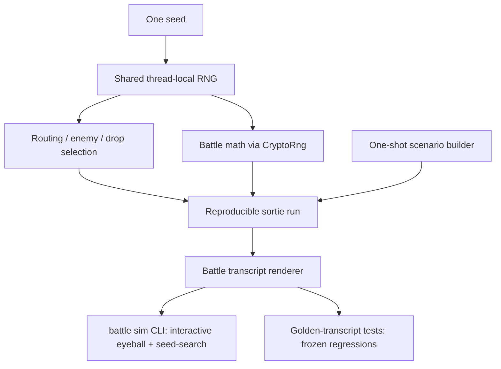

# Deterministic Battle/Sortie Test Harness

## Summary

Build a deterministic sortie/battle harness for emukc: one seed makes a whole
sortie reproducible end-to-end (routing, enemy selection, battle math), a
human-readable battle transcript renderer, and a one-shot scenario builder that
puts a profile into any target state. The capability is exposed two ways — a
`battle sim` CLI for fast interactive eyeballing, and golden-transcript tests
that freeze verified runs as regressions.

## Problem Frame

Trait-level integration coverage is already decent: `tests/gameplay_tests/`
drives the full `start_sortie → sortie_battle → sortie_battle_result →
next_sortie` chain over an in-memory DB without HTTP, and `map/unlock.rs` even
loops sorties until a boss clears. The pure-simulation crate `emukc_battle`
already has a seeded RNG (`SeededRng`) and frozen golden-vector tests for
damage formulas.

Despite that, verifying **battle detail** still falls back to a manual
10-to-tens-of-minutes loop: create account → build ships → PvP for exp →
sortie → eyeball battle + map unlock → repair/resupply → repeat. The loop
persists because battle detail is hard to assert, and that difficulty has four
compounding root causes, all of them live:

- **RNG nondeterminism** — the same sortie produces different damage, hits, and
  routing each run, so there is nothing stable to `assert_eq` against.
- **Rare-branch reachability** — night battle, special attacks (cut-ins,
  touch), and specific routes trigger randomly, so reaching the case under test
  means sortie-ing repeatedly until it appears.
- **No oracle** — knowing whether a number or branch is "correct" requires
  comparing against real KanColle, with no ready expected-value source to
  assert against.
- **Observability** — the battle response is a large, complex JSON; even when
  an assertion is possible, constructing or diffing the expected state by hand
  is so tedious that eyeballing wins.

The keystone insight is that all four collapse once a sortie is reproducible:
nondeterminism disappears under a seed, rare branches become reachable by
searching seeds, the oracle cost is paid once per scenario and then frozen, and
observability is solved by rendering the deterministic run to readable text.

## Key Decisions

- **Determinism comes from seeding the shared RNG surface, not from refactoring
  the battle engine.** The battle simulation's production RNG (`CryptoRng` in
  `crates/emukc_gameplay/src/game/battle/rng.rs`) routes every draw through the
  thread-local free functions in `crates/emukc_crypto/src/rng.rs`, and the
  gameplay-side routing/enemy/drop selection (`sortie/mod.rs`, `map_route.rs`,
  `sortie_result.rs`) uses the same thread-local generator. Seeding that one
  thread-local generator therefore determinizes the whole sortie — the
  hardcoded `CryptoRng` in `orchestrate.rs` becomes deterministic with no
  change. The alternative (thread a seeded `GameRng` through `HasContext` /
  scenario state) is more robust but a far wider refactor; it is deferred
  unless the thread-local route proves insufficient.

- **Rare branches are reached by seed-search, not by forcing knobs in the
  engine.** Given determinism, iterating seeds until a branch predicate matches
  is cheap and leaves the battle math untouched. A targeted forcing knob is a
  fallback only if a branch turns out too rare to hit by search.

- **The oracle is verify-once-then-freeze.** A transcript is verified by eye a
  single time (in the CLI), then frozen as a golden artifact following the
  repo's existing convention (the `roll_scratch_damage_golden_vector` pattern
  in `crates/emukc_battle/src/random.rs`). We accept a one-time human check per
  scenario rather than deriving expected numbers from a reference.

- **One keystone, two thin consumers, delivered in stages.** The expensive
  parts — the seed entry point, the transcript renderer, and the scenario
  builder — are written once. The transcript is the shared oracle artifact:
  verify it interactively in the CLI, then freeze the same text as a golden
  test. Build the keystone first, validate it through the CLI, then freeze
  goldens.

- **Mechanics-only.** This harness verifies battle/sortie mechanics from
  observable battle data. Browser/client rendering and resource-loading
  behavior are explicitly out (ruled out as not the pain).

## Requirements

**Determinism (keystone)**

- R1. A single seed makes a full sortie reproducible end-to-end: next-cell
  routing, enemy fleet/formation selection, and all battle math (day
  shelling/torpedo/aerial, night battle, cut-ins, ASW, scratch damage). The
  same scenario + seed yields an identical battle outcome on every run.
- R2. Determinism is achieved through a single seed entry point on the shared
  RNG surface, not by changing how the battle engine receives its RNG. Both the
  battle simulation and the gameplay-side routing/enemy/drop selection must
  become deterministic from that one seed.
- R3. Seeding is opt-in and scoped to a harness run. The live server keeps its
  entropy-seeded behavior unless a seed is explicitly set.

**Battle transcript (observability)**

- R4. A renderer turns a battle outcome into a human-readable, line-oriented
  play-by-play: route node, engagement form, formations, per-phase attacks
  (attacker → target, damage, crit / cut-in type), per-ship HP before/after,
  MVP, and result rank.
- R5. The renderer is pure formatting over existing battle data structures — it
  adds no game logic and does not alter battle results.
- R6. Transcript text is diff-stable: identical scenario + seed produce
  byte-identical transcript output.

**Scenario / one-shot state seeding**

- R7. A scenario builder puts a fresh profile into a declared target state in
  one shot: a fleet of ships at given master-IDs and levels, materials at
  chosen amounts, specified maps unlocked/cleared, and ships at chosen
  HP/ammo/fuel (e.g., damaged or freshly resupplied) — composing existing
  gameplay trait methods.
- R8. The builder sets the target state directly, skipping manual progression:
  no PvP exp-farming, no real sortie-to-unlock, no repair waiting.
- R9. Reusable presets exist for common setups (e.g., "fresh fleet able to
  sortie 1-1", "fleet leveled for a mid-map boss"), so a run names a preset
  instead of re-declaring full state.

**Interactive CLI consumer**

- R10. A `battle sim` CLI loads the codex, applies a scenario (preset or file),
  seeds RNG via `--seed`, runs the sortie/battle chain, and prints the
  transcript.
- R11. The CLI supports seed-search: given a branch predicate (e.g., night
  battle occurred, a named cut-in fired, boss cell reached), it iterates seeds
  until the predicate matches and reports the matching seed, making a rare
  branch instantly reproducible.

**Golden-test consumer**

- R12. Gameplay tests can apply a scenario, seed RNG, run the sortie/battle,
  render the transcript, and assert it against a checked-in golden file.
- R13. Golden transcripts follow the repo's existing regeneration convention:
  an intentional behavior change regenerates the golden and is noted in the
  commit; an unintentional drift fails CI.

## Key Flows

- F1. Keystone-first staged delivery
  - **Trigger:** Work begins on the harness.
  - **Steps:** Build the seed entry point and confirm a seeded sortie is
    reproducible → build the transcript renderer → build the scenario builder →
    wire the `battle sim` CLI → freeze verified transcripts as golden tests.
  - **Outcome:** Interactive speed available early; regression safety follows
    once goldens are frozen.
  - **Covered by:** R1, R2, R4, R7, R10, R12

- F2. Reach and freeze a rare branch
  - **Trigger:** A developer needs to test a rare battle branch (e.g., a night
    cut-in).
  - **Steps:** Pick/declare a scenario → run `battle sim` with seed-search on
    the branch predicate → harness reports a matching seed → developer eyeballs
    the transcript once and confirms it correct → the transcript is frozen as a
    golden test keyed to that seed.
  - **Outcome:** A previously-unreachable case becomes a deterministic
    regression test; the 10-minute manual loop for that case disappears.
  - **Covered by:** R1, R6, R11, R12, R13

## Acceptance Examples

- AE1. Determinism across runs
  - **Covers R1, R6.**
  - **Given** a scenario and seed `N`.
  - **When** the sortie/battle is run twice.
  - **Then** both runs produce identical battle outcomes and byte-identical
    transcripts.

- AE2. Seed-search hits a rare branch
  - **Covers R11.**
  - **Given** a scenario where night battle is possible but uncommon.
  - **When** `battle sim` runs seed-search with a "night battle occurred"
    predicate.
  - **Then** it reports a seed for which the transcript contains the night
    phase, and re-running that seed reproduces it.

- AE3. Golden drift is caught
  - **Covers R13.**
  - **Given** a frozen golden transcript for a scenario + seed.
  - **When** a code change alters battle results for that run.
  - **Then** the golden test fails, surfacing the diff rather than passing
    silently.

- AE4. One-shot state seeding
  - **Covers R7, R8.**
  - **Given** a request for a fleet leveled for a mid-map boss with a
    half-damaged flagship and full materials.
  - **When** the scenario builder runs against a fresh profile.
  - **Then** the profile reaches that exact state with no PvP, real sortie, or
    repair steps performed.

## Scope Boundaries

**Deferred for later**

- Explicit engine forcing knobs (force-night, force-specific-cut-in) — revisit
  only if a branch is too rare for seed-search to hit cheaply.
- Threading a seeded `GameRng` through `HasContext`/scenario state as the
  robust determinism path — only if the thread-local seed route proves
  insufficient (e.g., a multi-threaded runtime in the loop).
- Practice/PvP battle transcript and determinism as a first-class target —
  practice shares the same RNG surface so it benefits for free, but is not a
  focus since one-shot state seeding removes the need to PvP for exp.

**Outside this harness's identity**

- Browser/client behavior: rendering, animation, and resource-loading
  verification. This harness judges mechanics from battle data, not the client.

## Dependencies / Assumptions

- **`fastrand` v2 thread-local seeding.** Determinism via a single seed assumes
  the thread-local generator can be seeded (a small addition to the
  `crates/emukc_crypto/src/rng.rs` facade forwarding to fastrand's thread-local
  seed). Verify the exact API in planning.
- **Current-thread test runtime.** All `#[tokio::test]` in the repo are
  current-thread (verified; the only multi-thread runtime is the production app
  in `crates/emukc_app`). Seed stability within a run relies on this.
- **Thread-local seed persists per thread.** Each scenario run must re-seed at
  its start; a known caveat is that a seeded test can shift the RNG stream a
  later non-seeding test sees on the same OS thread.
- **`CryptoRng` routes through the thread-local facade** (verified) — so
  seeding the thread-local determinizes battle math without swapping in
  `SeededRng` at `orchestrate.rs`.
- **Codex must be bootstrapped** (`.data/codex`) for both consumers, matching
  the existing `gameplay_tests` and CLI dependency.

## Outstanding Questions

**Deferred to planning**

- Exact shape of the seed entry point in `crates/emukc_crypto/src/rng.rs` and
  confirmation of fastrand's thread-local seed API.
- Whether to adopt a snapshot crate (e.g., `insta`) or hand-roll golden files
  in the existing `roll_scratch_damage_golden_vector` style.
- Whether map clear/unlock state can be set via an existing gameplay method or
  needs a small direct setter for the scenario builder.
- Transcript text layout and the seed-search predicate vocabulary/API.

## Sources / Research

- `crates/emukc_battle/src/random.rs` — `BattleRng` trait, `SeededRng`, and the
  golden-vector regeneration convention to mirror.
- `crates/emukc_battle/src/test_utils.rs` — ship/slotitem builders reusable by
  the scenario builder.
- `crates/emukc_crypto/src/rng.rs` — RNG facade: seedable `GameRng` plus the
  thread-local free functions that the seed entry point would target.
- `crates/emukc_gameplay/src/game/battle/rng.rs` — `CryptoRng`, which routes
  through the thread-local facade.
- `crates/emukc_gameplay/src/game/battle/sortie/orchestrate.rs` — hardcoded
  `CryptoRng`; `simulate_day(codex, context, &mut rng)` injection point.
- `crates/emukc_gameplay/src/game/sortie/mod.rs`, `map_route.rs`,
  `sortie_result.rs` — thread-local RNG callers for routing/enemy/drop.
- `tests/gameplay_tests.rs` — `TestContext` harness; `map/unlock.rs`,
  `map/sortie_battle.rs` — existing scripted sortie tests.
- `src/bin/cli/battle.rs` — existing `battle validate` / `analyze-incident`
  CLI to extend with `sim`.
- `src/bin/cli/auto/mod.rs`, `src/bin/cli/dev/` — existing state-seeding pieces
  the scenario builder can consolidate.
