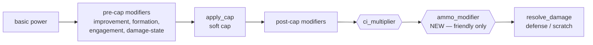

# feat: Ammunition damage modifier (S9) + damage-formula reference refresh

## Summary

Implement the remaining genuinely-open "affects all battles" foundation gap from
the damage-formula reference: the **ammunition modifier** (S9). When a friendly
ship's remaining ammo drops below 50%, its shelling/torpedo/night damage is
reduced post-cap, reaching 0 (scratch-only) near empty. Enemy attackers are
unaffected. Alongside the code, refresh `docs/battle/damage-formula-reference.md`,
which is badly stale — it lists S1–S6 and S10 as unimplemented when they are in
fact done, and its §3.8 ammo formula contradicts both its own table and the
canonical KanColle formula.

This is the only survivor of the originally-requested "Phase-1 foundation fixes"
batch: defense randomization (S5), damage-state modifier (S4), and the scratch
trigger (S10) are already implemented and wired.

---

## Problem Frame

Damage in `crates/emukc_battle/src/damage.rs` flows through a fixed pipeline
(basic power → pre-cap modifiers → soft cap → post-cap modifiers → defense /
scratch resolution). The post-cap stage already supports a cut-in multiplier
(`ci_multiplier`) but applies **no ammunition penalty**. A grep for
`ammo` / `api_bull` across non-test battle code returns zero hits.

Consequence: a player who sorties deep into a map and runs low on ammo deals
full damage regardless, diverging from real KanColle, where low ammo sharply
reduces damage. This affects every shelling/torpedo/night attack a low-ammo
friendly ship makes.

The originating reference doc (`docs/battle/damage-formula-reference.md`) is the
spec for this work but is itself stale and internally inconsistent on this exact
formula, so refreshing it is part of the deliverable — otherwise the next "what
is next" decision is misled the same way this one initially was.

---

## Requirements

- **R1** — Friendly shelling/torpedo/night damage is reduced by a post-cap
  ammo multiplier when remaining ammo < 50%, scaling to ~0 near empty; ammo ≥ 50%
  yields no penalty (×1.0).
- **R2** — Enemy (abyssal) attackers are never penalized (always ×1.0); they do
  not track ammo and their `api_bull` is not meaningful.
- **R3** — Ammo % is derived from the attacker's current `api_bull` and the
  master `api_bull_max`, not assumed full. A battle must not silently use stale
  or always-full ammo for friendly ships.
- **R4** — A seed-fixed regression test pins the ammo-modifier output and its
  insertion into the damage pipeline, so future formula drift fails CI (mirrors
  the scratch-damage golden-vector pattern in `crates/emukc_battle/src/random.rs`).
- **R5** — `docs/battle/damage-formula-reference.md` is refreshed: implemented
  gaps (S1–S6, S10) re-marked, the §3.8 ammo formula corrected to the canonical
  KanColle form, and the priority gap summary updated to reflect what genuinely
  remains (e.g. S8 critical hit, contact modifier, night damage-state).

---

## Key Technical Decisions

- **KTD-1 — Compute ammo % inside the damage functions from data already
  present; do not add a field to `BattleShipInput` / `BattleRuntimeShip`.**
  `BattleRuntimeShip.ship` is a `KcApiShip` which already carries `api_bull`
  (current ammo); `ApiMstShip.api_bull_max` is in the `Codex` that every
  `calculate_*_damage` function already receives. So the modifier is a pure
  helper `ammo_modifier(codex, attacker) -> f64` — no change to the
  gameplay→battle construction seam. Rationale: smallest surface, no new
  plumbing, follows the existing `codex.find::<ApiMstShip>(...)` lookup pattern
  (see `bomber_plane_count`).

- **KTD-2 — Apply the modifier post-cap, in the same slot as `ci_multiplier`,
  before `resolve_damage`.** Reference §3.8 specifies a post-cap multiplier, and
  the pipeline already multiplies `capped_power` by `ci_multiplier` at that point
  (`calculate_shelling_damage` line ~130). Ammo multiplies there too. Rationale:
  matches KanColle's documented pipeline and reuses the existing insertion point.

- **KTD-3 — Friendly-only.** `BattleRuntimeShip.is_friendly` gates the penalty;
  enemy attackers short-circuit to ×1.0. Rationale: abyssals have no ammo
  economy; penalizing them would be wrong and would read a meaningless `api_bull`.

- **KTD-4 — Implement the canonical KanColle formula, not the reference doc's
  current text.** Target: `mult = ammo% >= 50 ? 1.0 : (ammo% × 2) / 100`,
  clamped to `[0.0, 1.0]`, where `ammo% = floor(100 × api_bull / api_bull_max)`.
  The doc's §3.8 prose formula (`floor(remaining_ammo / 50) / 100`) is arithmetically
  wrong (yields 0 for 40%), and its stepped 0.2-increment table is a non-canonical
  approximation (real KC is continuous: 49% → ×0.98, not ×0.8). Confirm exact
  integer/rounding behavior against KanColle wikiwiki / the decoded client at
  implementation. Both the doc prose and table are corrected in U4. Open detail
  deferred to implementation: precise rounding (floor vs round) of the final
  multiplier and whether `api_bull_max` missing (`None`) should fall back to the
  ship's current as max (→ no penalty) or be treated as an error.

---

## High-Level Technical Design

Where the ammo modifier inserts into the existing shelling/torpedo/night damage
pipeline (new step highlighted):

The new `ammo_modifier` factor is the only change to the pipeline shape; all
other stages already exist. ASW and airstrike phases are evaluated for
applicability in U2 but are not assumed in-scope (KanColle applies the ammo
penalty to gunfire/torpedo phases; ASW is to be confirmed against the client).

---

## Implementation Units

### U1. Ammo modifier formula helper

**Goal** — Add a pure `ammo_modifier(codex, attacker) -> f64` helper computing
the post-cap multiplier from existing ship/codex data.

**Requirements** — R1, R2, R3, KTD-1, KTD-3, KTD-4

**Dependencies** — none

**Files**
- `crates/emukc_battle/src/damage.rs` (add helper + unit tests in the existing `mod tests`)

**Approach**
- Signature mirrors the existing `improvement_bonus_day(codex, ship)` helpers.
- Return `1.0` immediately when `!attacker.is_friendly` (KTD-3).
- Look up `api_bull_max` via `codex.find::<ApiMstShip>(&attacker.ship.api_ship_id)`;
  compute `ammo% = floor(100 × api_bull / api_bull_max)`.
- Apply KTD-4 formula, clamp `[0.0, 1.0]`.
- Decide the `api_bull_max` = `None`/`0` fallback (see KTD-4 open detail) and
  document the chosen behavior in a doc comment.

**Patterns to follow** — `improvement_bonus_day` / `bomber_plane_count` in
`damage.rs` for the `codex.find::<ApiMstShip>` lookup and `is_friendly` gating
seen on `BattleRuntimeShip`.

**Test scenarios**
- ammo ≥ 50% (e.g. 100%, 50%) → ×1.0 (happy path).
- ammo 40% → ×0.8; 25% → ×0.5; 10% → ×0.2 (canonical continuous values, not the
  stale stepped table).
- ammo 0% → ×0.0.
- Enemy attacker at any ammo → ×1.0 (R2).
- `api_bull_max` missing/`None` → chosen fallback behavior (edge case).
- `api_bull` > `api_bull_max` (over-supplied) → clamped to ×1.0 (edge case).

**Verification** — Unit tests pass; helper is pure and side-effect free.

---

### U2. Wire ammo modifier into the post-cap pipeline

**Goal** — Multiply `capped_power` by `ammo_modifier` post-cap in the
shelling, torpedo, and night damage functions; confirm/deny ASW applicability.

**Requirements** — R1, R3, KTD-2

**Dependencies** — U1

**Files**
- `crates/emukc_battle/src/damage.rs` (`calculate_shelling_damage`,
  `calculate_torpedo_damage`, `calculate_night_damage`; assess `calculate_asw_damage`)

**Approach**
- Apply `capped_power *= ammo_modifier(codex, attacker)` at the existing post-cap
  point — same location `ci_multiplier` is applied — and before `resolve_damage`.
- Order relative to `ci_multiplier`: both are post-cap multipliers; document the
  order and confirm it matches the client (commutative for pure multiplication,
  but state it explicitly).
- ASW: determine whether KanColle applies the ammo penalty to ASW; if not, leave
  `calculate_asw_damage` unchanged and note it in the doc refresh (U4).

**Patterns to follow** — the existing `if let Some(m) = ci_multiplier { capped_power *= m; }`
block in `calculate_shelling_damage`.

**Test scenarios**
- A low-ammo (e.g. 20%) friendly attacker deals strictly less shelling damage than
  the same attacker at full ammo, same seed (integration, behavioral).
- A low-ammo friendly torpedo attack is likewise reduced (integration).
- Night battle low-ammo reduction (integration).
- Enemy attacker damage is identical at low vs full ammo (R2 regression).
- Interaction: low ammo + a cut-in multiplier compose correctly (both applied).
- Below-defense after ammo penalty still routes through scratch, not negative
  (edge case — ammo penalty must not break the scratch path).

**Verification** — Battle pipeline tests pass; low-ammo friendly damage is
measurably lower; enemy damage unchanged.

---

### U3. Verify ammo state reaches battle correctly

**Goal** — Confirm the friendly ships entering battle carry their real current
`api_bull` (reflecting sortie consumption), not a full/stale value.

**Requirements** — R3

**Dependencies** — U1 (helper exists to make the behavior observable)

**Files**
- `crates/emukc_gameplay/src/game/battle/sortie/orchestrate.rs` (battle-input build site, read/trace)
- `tests/gameplay_tests/` (add a sortie→battle test asserting ammo reaches battle) — path finalized at implementation

**Approach**
- Trace how `context.friend_ships` are built into `BattleShipInput` at
  `orchestrate.rs:117`; confirm `api_bull` there is the profile ship's current
  ammo after any prior consumption, not a reset/full value.
- If correct: add a regression test pinning that a low-ammo fleet ship arrives at
  the battle simulation with reduced ammo (verification-only unit).
- If incorrect (ammo not threaded): small fix to carry current ammo into the
  battle input. **Execution note:** start with a failing test asserting the
  battle-input ammo matches the profile ship before deciding whether a fix is
  needed.

**Patterns to follow** — existing sortie→battle integration tests in
`tests/gameplay_tests/`.

**Test scenarios**
- A fleet ship with reduced ammo sorties; the constructed battle input reports the
  reduced ammo (integration — proves the cross-layer seam).
- Full-ammo ship → battle input reports full ammo (happy path).

**Verification** — Test proves friendly battle inputs reflect real ammo; if a fix
was needed it is covered by the failing-then-passing test.

---

### U4. Refresh the damage-formula reference

**Goal** — Bring `docs/battle/damage-formula-reference.md` back in sync with the
code and fix its internal inconsistencies.

**Requirements** — R5

**Dependencies** — U1, U2 (so "S9 implemented" is true when written)

**Files**
- `docs/battle/damage-formula-reference.md`

**Approach**
- Re-audit each S-gap against `damage.rs`; re-mark S1 (improvement bonus),
  S2 (CV special), S3 (CL fit gun), S4 (damage-state), S5 (defense randomization),
  S6 (artillery spotting), S10 (scratch trigger) as **implemented**, citing the
  function names.
- Mark S9 (ammo) implemented; correct §3.8: replace the wrong prose formula and
  the non-canonical stepped table with the canonical continuous formula used in U1.
- Rebuild the "Gap Summary by Priority" to reflect genuine remaining gaps:
  S8 critical hit (api_cl hardcoded to 1, no crit roll), contact modifier
  (airstrike), night-battle damage-state, AP-shell post-cap damage modifier,
  ASW armor penetration — with current accurate status.
- Note the ASW ammo-applicability decision from U2.

**Patterns to follow** — the doc's existing section/table structure; keep the
update factual and code-cited.

**Test expectation: none** — documentation-only unit; correctness is verified by
the re-audit matching the code state established in U1–U3.

**Verification** — Every S-gap status in the doc matches the actual code; §3.8
formula matches U1's implementation; no remaining claim contradicts `damage.rs`.

---

## Scope Boundaries

**In scope** — Ammo modifier (S9) for friendly shelling/torpedo/night; the
cross-layer ammo-state verification; the reference-doc refresh.

### Deferred to Follow-Up Work
- **S8 critical hit** — random crit roll, post-cap 1.5×, real `api_cl` 1/2 flag.
  The other genuinely-open all-battles gap; meatier; its own plan.
- **Contact modifier** (airstrike pre-cap), **night-battle damage-state**,
  **AP-shell post-cap modifier**, **ASW armor penetration** — separate gaps
  surfaced during the U4 re-audit; track in the refreshed doc, implement later.
- ASW ammo applicability — if U2 finds KanColle penalizes ASW too, that extension
  is a small follow-up, not part of this plan unless trivially confirmed.

**Not a goal** — Changing the soft-cap, defense, or scratch formulas (already
implemented and correct); altering ammo *consumption* mechanics in sortie/map
(this plan only *reads* ammo for the damage penalty).

---

## Risks & Dependencies

- **Gameplay-numeric change.** This reduces damage for every low-ammo friendly
  attack. Although the formula lives in `emukc_battle` (not a `codex` `Default`
  impl, so the repo's Balance Defaults Policy does not formally bind), treat it
  with the same care: land it as a focused commit and ship the R4 seed-fixed
  regression test so accidental future drift fails CI.
- **Formula-source ambiguity.** The repo's own reference is wrong twice over
  (KTD-4). Mitigation: implement the canonical wikiwiki formula and confirm exact
  rounding against the decoded client at implementation; do not copy the doc's
  current numbers.
- **Cross-layer assumption (U3).** KTD-1's simplicity depends on `api_bull`
  reaching the battle reflecting consumed ammo. If it does not, U3 absorbs a small
  plumbing fix; the failing-test-first execution note de-risks this.
- **Enemy `api_bull` values.** Abyssal ships may carry 0 or arbitrary `api_bull`;
  KTD-3's friendly-only gate makes their ammo irrelevant — verify the gate covers
  every call path in U2.

---

## Sources & Research

- `docs/battle/damage-formula-reference.md` §3.8 (ammo), §4 Gap Summary — origin
  doc; stale and internally inconsistent (corrected in U4).
- `crates/emukc_battle/src/damage.rs` — existing pipeline; `apply_cap`,
  `resolve_damage`, `calculate_*_damage`, `improvement_bonus_*`,
  `calculate_defense_power`, `damage_state_modifier` (all confirmed implemented).
- `crates/emukc_battle/src/types/runtime.rs` — `BattleShipInput`,
  `BattleRuntimeShip` (carries `KcApiShip` + `is_friendly`; no new field needed).
- `crates/emukc_model/src/kc2/api/mod.rs` — `KcApiShip.api_bull` confirmed.
- `crates/emukc_model/src/kc2/start2.rs:302` — `ApiMstShip.api_bull_max` confirmed.
- `crates/emukc_battle/src/random.rs` — scratch-damage golden-vector tests
  (committed `9a70126`); the pattern R4 mirrors.
- External: KanColle wikiwiki 弾薬量補正 — canonical ammo formula to confirm at
  implementation. (No external research agent run; the formula is repo-documented
  and the local damage pipeline patterns are strong.)
