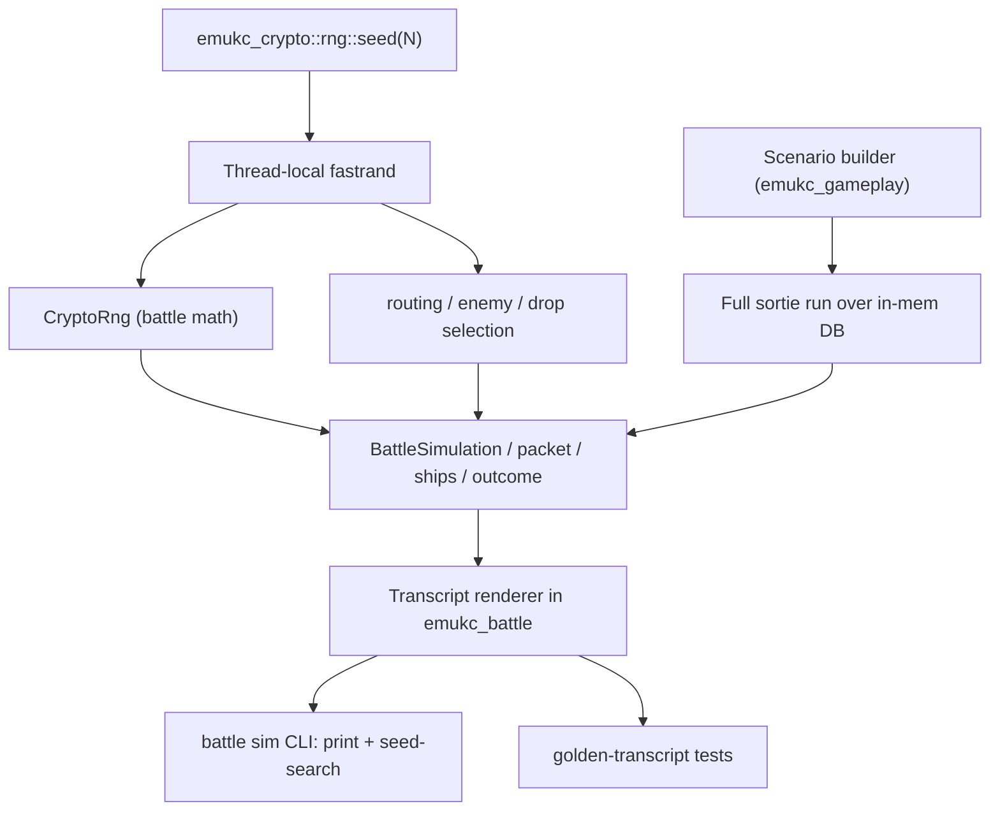
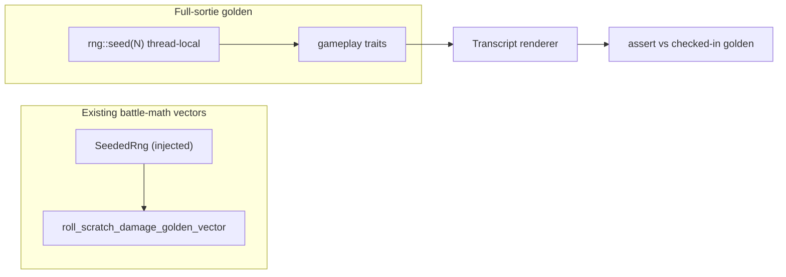

# feat: Deterministic Battle/Sortie Test Harness

## Summary

Build a deterministic sortie/battle harness for emukc so battle-detail testing
stops requiring the manual 10-minute loop. One seed reproduces a whole sortie
(routing, enemy selection, battle math), a transcript renderer turns the battle
into readable text, and a one-shot scenario builder puts a profile into any
target state. The capability is exposed through a `battle sim` CLI for fast
interactive eyeballing (with seed-search for rare branches) and
golden-transcript tests that freeze verified runs as regressions.

---

## Problem Frame

Trait-level coverage is already decent — `tests/gameplay_tests/` drives the
full `start_sortie → sortie_battle → sortie_battle_result → next_sortie` chain
over an in-memory DB without HTTP, and `emukc_battle` already has a seeded RNG
(`SeededRng`) with frozen golden-vector tests for damage formulas. Despite
that, verifying **battle detail** still falls back to a manual loop (create
account → build ships → PvP for exp → sortie → eyeball battle + map unlock →
repair/resupply → repeat) because battle detail is hard to assert. Four root
causes compound (see origin: `docs/brainstorms/2026-06-09-deterministic-battle-test-harness-requirements.md`):
RNG nondeterminism, rare-branch reachability, no oracle, and a large hard-to-read
response.

Research confirmed the keystone is cheaper than first thought. Both RNG
surfaces a sortie uses — the battle math via `CryptoRng`
(`crates/emukc_gameplay/src/game/battle/rng.rs`) and the routing/enemy/drop
selection (`crates/emukc_gameplay/src/game/sortie/mod.rs`,
`crates/emukc_gameplay/src/game/map_route.rs`,
`crates/emukc_gameplay/src/game/sortie_result.rs`) — route through the same
thread-local
generator in `crates/emukc_crypto/src/rng.rs` (backed by `fastrand` v2). Seeding
that one thread-local generator therefore determinizes the whole sortie with no
change to `orchestrate.rs` or the battle engine. All `#[tokio::test]` in the repo
are current-thread, so within a seeded run the stream is stable.

---

## Requirements Traceability

Carried from the origin requirements doc. R-IDs below map to plan units.

- R1, R2, R3 (determinism) → U1
- R4, R5, R6 (transcript) → U2
- R7, R8, R9 (scenario seeding) → U3
- R10 (CLI sim) → U4
- R11 (seed-search) → U5
- R12, R13 (golden tests) → U6

---

## Key Technical Decisions

- **KTD-1. Determinism via a single thread-local seed, not an engine refactor.**
  Add a `#[cfg(any(test, feature = "test-harness"))]`-gated `seed(u64)` to the
  `crates/emukc_crypto/src/rng.rs` facade, forwarding to `fastrand`'s
  thread-local seed. Because `CryptoRng` and the gameplay-side
  routing/enemy/drop selection both draw from that thread-local generator, one
  call determinizes the entire sortie. The hardcoded `CryptoRng` in
  `orchestrate.rs` is left untouched (see origin: Key Decisions). The robust
  alternative — threading a seeded `GameRng` through `HasContext` — is deferred;
  it is a far wider refactor and current-thread tests make the thread-local
  route safe. The thread-local seed only holds on a current-thread executor, so
  the `battle sim` CLI (U4) must drive the sortie chain on its own
  `new_current_thread` runtime, not the app's `new_multi_thread` runtime —
  otherwise task migration at an `.await` would move post-seed RNG draws onto an
  unseeded worker thread.

- **KTD-2. Full-sortie golden; existing vectors cover battle math.** The harness
  pins battle behavior at the **full-sortie** altitude (drive the gameplay traits
  over an in-memory DB with the thread-local seed), which pins routing + unlock +
  battle together (R12, R13). Battle-math isolation is already covered by
  `emukc_battle`'s existing `#[cfg(test)] SeededRng` golden vectors (the
  `roll_scratch_damage_golden_vector` convention), so the harness references that
  coverage rather than adding a second, unrequired golden altitude in a different
  crate with a different seed mechanism.

- **KTD-3. Transcript renderer is pure formatting in `emukc_battle`.** It
  operates on `emukc_battle` output types (`BattleSimulation`,
  `NightBattleSimulation`, `BattlePacket`, `BattleRuntimeShip`, `BattleOutcome`)
  so it stays DB-free and golden-testable in isolation, and both consumers feed
  it from session data they already hold. It adds no game logic and does not
  mutate battle results (R5).

- **KTD-4. Scenario builder lives in a shared library module, not the binary.**
  Place it in `emukc_gameplay` (re-exported via `emukc_internal::prelude`) so the
  `battle sim` CLI and the `tests/gameplay_tests/` integration tests use one
  builder. A binary-only helper would force the integration tests to duplicate
  the seeding logic. It composes existing trait methods (`add_ship`,
  `update_ship`, `MaterialOps`, `FleetOps`) already exercised by
  `src/bin/cli/dev/nuke.rs`.

- **KTD-5. Direct map clear/unlock helper.** No public trait method marks a map
  cleared without grinding (`sortie_result.rs::is_cleared` reads the state;
  clearing happens through gauge logic on real sorties). The scenario builder
  adds a small direct setter writing `map_record` state so target maps can be
  opened in one shot (R8). This is a touch in gameplay code, not test-only.
  Setting `cleared` alone is insufficient: `start_sortie`
  (`crates/emukc_gameplay/src/game/sortie/mod.rs:286`) gates on the dependent
  map's `unlocked` flag, not `cleared`. The setter therefore writes only the
  sortie-gating state: `unlocked` on the target and its dependents (flip
  `unlocked = true` from `catalog.dependents_of`, or reuse
  `check_and_unlock_dependencies_impl` in
  `crates/emukc_gameplay/src/game/map.rs`), plus `cleared` only when the scenario
  explicitly asks. For a deep target map, call `ensure_map_records_impl` first so
  the dependent records exist for the cascade to flip. It deliberately does NOT
  write the gauge-clear field bundle (`current_hp`, `event_state`, `gauge_index`,
  `stage_id`): those are written only on the HP-gauge branch of the real path
  (`sortie_result.rs:424-428`, gated on `definition.max_hp`), while a regular map
  like 1-1 clears through the simpler `:453-457` path, so writing them
  universally would stamp spurious event state onto non-event maps.

- **KTD-6. Seed-search over engine forcing knobs for rare branches.** Iterate
  seeds and test a predicate against the run, rather than adding force-night /
  force-cutin knobs to the simulation (see origin: Key Decisions). A targeted
  forcing knob remains a deferred fallback if a branch proves too rare to hit.

---

## High-Level Technical Design

One seed reaches the whole sortie because both RNG surfaces share the
thread-local generator; the transcript renderer is the shared oracle artifact
feeding both consumers.

The full-sortie golden altitude, alongside existing battle-math vectors:

---

## Implementation Units

Phased: U1–U3 are the independent keystone pieces; U4–U6 are the consumers.

### U1. RNG seed entry point

- **Goal:** A single function makes the thread-local RNG deterministic, the
  foundation for full-sortie reproducibility.
- **Requirements:** R1, R2, R3
- **Dependencies:** none
- **Files:**
  - `crates/emukc_crypto/src/rng.rs` (add `seed`)
  - `crates/emukc_crypto/src/rng.rs` tests (inline `#[cfg(test)] mod tests`)
- **Approach:** Add `seed(s: u64)` to the thread-local free-function group,
  gated behind `#[cfg(any(test, feature = "test-harness"))]` (a new default-off
  `test-harness` feature on `emukc_crypto`), forwarding to `fastrand`'s
  thread-local seed. The cfg gate turns the opt-in into a compile-time guarantee:
  production builds cannot call it, so server behavior stays entropy-seeded (R3)
  — the same thread-local backs live construction-drop handlers (`createship.rs`,
  `createitem.rs`), so a stray production seed would otherwise make drops
  predictable. The `battle sim` CLI (U4) enables the `test-harness` feature to
  reach it. Document that the seed is per-thread and persists, so each harness run
  re-seeds at its start.
- **Patterns to follow:** the existing thread-local free functions in the same
  file (`i64`, `usize`, `f64_range`); the `GameRng::seeded` doc style.
- **Test scenarios:**
  - Happy path: after `seed(N)`, a fixed sequence of `rng::usize`/`rng::i64`/
    `rng::f64` draws is reproducible across two seed-and-draw cycles.
  - Happy path: `CryptoRng` (battle RNG) becomes deterministic after `seed(N)` —
    two seeded runs of a small `roll_range` sequence through `CryptoRng` match.
  - Edge: seeding with the same value mid-stream resets the sequence to the same
    starting point.
- **Verification:** the seeded-sequence tests pass; the cfg gate makes a
  production call site a compile error (the default build excludes `seed`).

### U2. Battle transcript renderer

- **Goal:** Turn a battle simulation into deterministic, diff-stable,
  human-readable text.
- **Requirements:** R4, R5, R6
- **Dependencies:** none (pure formatting over existing types)
- **Files:**
  - `crates/emukc_battle/src/transcript.rs` (new; renderer is `pub`, exported
    from `lib.rs`)
  - `crates/emukc_battle/src/lib.rs` (module export)
  - renderer golden tests as an inline `#[cfg(test)] mod tests` inside
    `transcript.rs` (so `SeededRng` and `test_utils::sample_ship`, both
    `#[cfg(test)]` / `pub(crate)`, are in scope). An external
    `crates/emukc_battle/tests/` file links `emukc_battle` as a normal dependency
    and cannot see those items, so do not put fixtures there unless the test
    builds its inputs purely through public API.
- **Approach:** A renderer over `BattleSimulation` / `NightBattleSimulation`
  (which carry `BattlePacket`, friendly/enemy `BattleRuntimeShip`, `BattleOutcome`).
  Emit a line-oriented play-by-play: formation + engagement, per-phase attacks
  (aerial/kouku, opening torpedo, shelling 1/2/3, night) with attacker → target,
  damage, crit/cut-in type; per-ship HP before/after; MVP and result rank.
  Stable ordering and no floats-as-display-noise so identical input yields
  byte-identical output (R6). No mutation of inputs (R5).
- **Technical design (directional, not spec):** input is the `emukc_battle`
  simulation struct; output is a `String`. Render phases in fixed battle order,
  skipping absent phases (e.g., `kouku: None`). Ships referenced by fleet index
  + master id for readability.
- **Patterns to follow:** field shapes in
  `crates/emukc_battle/src/types/runtime.rs` (`BattleSimulation`, `BattlePacket`,
  `BattleOutcome`) and `outcome.rs` (`calculate_mvp`, `calculate_win_rank`).
- **Test scenarios:**
  - Covers AE1. Determinism: rendering the same simulation twice yields identical
    text.
  - Happy path: a day battle with shelling + torpedo renders each phase with
    attacker/target/damage lines and final HP/rank.
  - Edge: a battle with no aerial phase (`kouku: None`) omits that section
    cleanly without a blank/garbage line.
  - Edge: a night battle (`NightBattleSimulation`) renders the midnight phase and
    cut-in markers.
  - Golden: a fixed `BattleSimulation` fixture renders to a frozen golden string;
    regenerate intentionally per the existing `roll_scratch_damage_golden_vector`
    convention.
- **Verification:** renderer golden tests pass; output is stable across runs.

### U3. Scenario / one-shot state builder

- **Goal:** Put a fresh profile into a declared target state in one shot,
  skipping the manual progression.
- **Requirements:** R7, R8, R9
- **Dependencies:** none (composes existing gameplay traits)
- **Files:**
  - `crates/emukc_gameplay/src/scenario/mod.rs` (new module)
  - `crates/emukc_gameplay/src/lib.rs` or `prelude` (export)
  - `crates/emukc_gameplay/src/game/map_progress.rs` or a new
    `map_record`-writing helper (KTD-5 direct clear/unlock setter)
- **Approach:** A declarative scenario (fleet ships as `(mst_id, level)`,
  material amounts, maps to unlock/clear, per-ship HP/ammo/fuel overrides)
  applied over any `HasContext`. Reuse `add_ship` + `update_ship` for levels and
  damaged/resupplied state, `MaterialOps`/`IncentiveOps` for materials,
  `FleetOps`/`update_fleet_ships` for fleet assignment — the same calls
  `src/bin/cli/dev/nuke.rs` already makes. Add the direct map clear/unlock helper
  (KTD-5) so target maps open without grinding (R8). Ship a small set of named
  presets (R9): e.g., `fresh_1_1` (fleet able to sortie 1-1) and
  `leveled_for_mid_boss`.
- **Patterns to follow:** `src/bin/cli/dev/nuke.rs` (`init_game_stuffs`,
  `add_ship_quietly`), `tests/gameplay_tests/map/sortie_battle.rs`
  (`setup_fleet`), `tests/gameplay_tests/sortie_ammo_reaches_battle.rs`
  (ammo override via `update_ship`).
- **Test scenarios:**
  - Covers AE4. Builder produces an exact state: fleet at requested levels, full
    materials, a damaged flagship — no PvP, real sortie, or repair performed.
  - Happy path: a preset yields a profile that can immediately `start_sortie` to
    the intended map.
  - Edge: clearing a prerequisite map flips its dependents' `unlocked` flag so a
    previously locked downstream map becomes sortie-able — assert via
    `start_sortie` to the downstream map (not just `get_map_infos`), since
    `start_sortie` gates on `unlocked`, not `cleared`.
  - Edge: per-ship HP override below max persists through `find_ship` (mirrors
    the ammo-survival guard).
  - Integration: the `leveled_for_mid_boss` preset reaches its target through the
    full prerequisite chain, then `start_sortie` to the mid-boss map succeeds
    end-to-end over a real in-memory DB.
- **Verification:** scenario tests pass; presets reach a sortie-ready state.

### U4. `battle sim` CLI subcommand

- **Goal:** Run a seeded, scenario-driven sortie/battle and print the transcript.
- **Requirements:** R10
- **Dependencies:** U1, U2, U3
- **Files:**
  - `src/bin/cli/battle.rs` (add `Sim` variant to the `Command` enum + handler)
- **Approach:** Add `Sim(SimArgs)` alongside `Validate`/`AnalyzeIncident`. Load
  the codex (existing `load_codex`), build a minimal in-memory context (codex +
  in-mem DB + sortie/practice stores, the same shape `TestContext` uses), apply a
  scenario (named preset or a JSON/TOML file via `--scenario`), then on a
  dedicated `new_current_thread` runtime (`block_on`) call `rng::seed(--seed)`
  and drive `start_sortie → sortie_battle [→ night] → sortie_battle_result →
  next_sortie`, printing the transcript (U2) for each battle. The current-thread
  runtime is required: the thread-local seed would not survive task migration on
  the app's default `new_multi_thread` runtime. Keep the existing battle-CLI
  ergonomics (`--json` for structured output).
- **Patterns to follow:** the existing `Command` enum and `exec` dispatch in
  `src/bin/cli/battle.rs`; context construction in `tests/gameplay_tests.rs`
  (`TestContext`); driving sequence in `tests/gameplay_tests/map/unlock.rs`.
- **Test scenarios:**
  - Happy path: `battle sim --scenario fresh_1_1 --seed N` runs 1-1 and prints a
    transcript ending in a result rank.
  - Edge: a scenario whose route reaches a dead-end non-boss cell still prints a
    coherent transcript and exits cleanly.
  - Error: an unknown preset / missing scenario file fails with a clear message,
    not a panic.
  - Determinism: within one process, seeding and driving the same `--scenario` +
    `--seed` twice yields byte-identical transcripts. Assert in-process — two
    separate CLI invocations each build a fresh runtime and would not catch
    thread-migration nondeterminism.
- **Verification:** `cargo run -- battle sim --scenario fresh_1_1 --seed 1`
  prints a readable transcript; repeat runs match.

### U5. Seed-search in the CLI

- **Goal:** Find a seed that reaches a named rare branch and report it.
- **Requirements:** R11
- **Dependencies:** U4
- **Files:**
  - `src/bin/cli/battle.rs` (extend `SimArgs` with a `--find` predicate option +
    search loop)
- **Approach:** Given a branch predicate (`--find night|cutin|boss` or a small
  enumerated set), iterate seeds from a start value, run the scenario, evaluate
  the predicate against the run (e.g., a midnight phase occurred, a cut-in flag
  is set in the packet, the boss cell was reached), and report the first matching
  seed (with a bounded attempt cap to avoid an unbounded loop). Re-running that
  seed reproduces the branch.
- **Technical design (directional):** predicate inspects the
  `SortieBattleSession` / packet the run already exposes — e.g., `midnight_flag`
  / night session presence for `night`, hougeki cut-in markers for `cutin`,
  `cell_no == boss_cell_no` for `boss`.
- **Patterns to follow:** packet fields in `orchestrate.rs`
  (`BattlePacket.hougeki*`, `midnight_flag`) and `outcome` shape.
- **Test scenarios:**
  - Covers AE2. Seed-search with the `night` predicate on a night-capable
    scenario returns a seed whose re-run contains the night phase.
  - Edge: search hits the attempt cap on an impossible predicate and reports "not
    found within N seeds" rather than hanging.
  - Determinism: a reported seed reproduces the branch on a plain `--seed` run.
- **Verification:** seed-search reports a seed; re-running it reproduces the
  branch; the cap path is graceful.

### U6. Golden-transcript tests

- **Goal:** Freeze verified runs as regressions at the full-sortie altitude (KTD-2).
- **Requirements:** R12, R13
- **Dependencies:** U1, U2, U3
- **Files:**
  - `tests/gameplay_tests/battle_golden.rs` (new) + registration in
    `tests/gameplay_tests.rs` — full-sortie altitude (drives the public gameplay
    traits, which `tests/` can reach via `emukc_internal::prelude`)
  - golden fixtures under `tests/fixtures/` (or alongside the test)
- **Approach:** Full-sortie altitude: in a `gameplay_tests` module, apply a
  scenario (U3), `rng::seed(N)`, drive the sortie/battle chain, render the
  transcript (U2), and assert it against a checked-in golden file. It follows the
  repo's regenerate-intentionally convention so an intended change updates the
  golden (noted in the commit) and an unintended drift fails CI (R13). Battle-math
  isolation is left to `emukc_battle`'s existing `SeededRng` golden vectors (see
  KTD-2), not a second altitude here.
- **Execution note:** capture each golden only after eyeballing the transcript
  once in the `battle sim` CLI (the verify-once oracle from the origin doc).
- **Patterns to follow:** `roll_scratch_damage_golden_vector` in
  `crates/emukc_battle/src/random.rs` (regen convention); `TestContext` setup in
  `tests/gameplay_tests.rs`.
- **Test scenarios:**
  - Covers AE1. Determinism: the full-sortie run for a fixed scenario + seed
    produces a transcript identical to the golden.
  - Covers AE3. Drift: a deliberately altered expected golden fails the test,
    proving the guard bites.
- **Verification:** `cargo test --test gameplay_tests battle_golden` passes;
  changing battle output without regenerating the golden fails.

---

## Acceptance Examples

Carried from origin; mapped to units above.

- AE1. Determinism across runs (R1, R6) → U2, U6 test scenarios.
- AE2. Seed-search hits a rare branch (R11) → U5 test scenario.
- AE3. Golden drift is caught (R13) → U6 test scenario.
- AE4. One-shot state seeding (R7, R8) → U3 test scenario.

---

## Scope Boundaries

**Deferred for later** (carried from origin)

- Explicit engine forcing knobs (force-night, force-specific-cut-in) — revisit
  only if a branch is too rare for seed-search (U5) to hit cheaply.
- Threading a seeded `GameRng` through `HasContext` as the robust determinism
  path — only if the thread-local route proves insufficient (e.g., a
  multi-threaded runtime in the loop).
- First-class practice/PvP transcript + determinism — practice shares the same
  RNG surface so it benefits for free, but is not a focus since one-shot state
  seeding removes the need to PvP for exp.

**Outside this harness's identity** (carried from origin)

- Browser/client behavior: rendering, animation, and resource-loading
  verification. This harness judges mechanics from battle data, not the client.

**Deferred to Follow-Up Work** (plan-local)

- A snapshot crate (e.g., `insta`) instead of hand-rolled golden files — start
  with the existing in-repo convention; adopt a crate later only if golden
  management becomes painful.

---

## Risks & Dependencies

- **`fastrand` thread-local seed API.** U1 assumes `fastrand` v2 exposes
  thread-local seeding. Verify the exact call when implementing; if absent, fall
  back to threading a `GameRng` (the deferred robust route) for the full-sortie
  path.
- **Thread-local seed pollution across tests.** A seeded test can shift the RNG
  stream a later non-seeding test sees on the same OS thread. Mitigation: each
  scenario/golden run seeds at its start; current-thread `#[tokio::test]` keeps
  within-run streams stable.
- **Transcript stability.** Any unstable ordering or float formatting in U2
  breaks diff-stability (R6) and makes goldens flaky. Mitigation: fixed phase
  order, integer/threshold formatting, golden tests in U2 itself.
- **Codex dependency.** Both consumers require a bootstrapped `.data/codex`
  (existing `gameplay_tests` / CLI constraint) — not new, but a prerequisite for
  running the harness.
- **Multi-thread executor defeats the seed.** The thread-local seed only holds
  on a current-thread executor. The `battle sim` CLI (U4/U5) must run the sortie
  chain on its own `new_current_thread` runtime, not the app's `new_multi_thread`
  runtime, or task migration at an `.await` lands post-seed RNG draws on an
  unseeded worker. Mitigation: U4 drives on a dedicated current-thread runtime and
  asserts in-process same-seed determinism.
- **Map clear/unlock helper correctness.** The KTD-5 setter writes only
  unlock-gating state (`unlocked`, optional `cleared`), not the full gauge-clear
  bundle, so it cannot stamp spurious event state on non-event maps. Mitigation:
  U3 edge test asserts downstream sortie-ability via `start_sortie`.

---

## Sources & Research

- `crates/emukc_crypto/src/rng.rs` — RNG facade; thread-local free functions are
  the U1 seed target; `GameRng::seeded` is the deferred-route building block.
- `crates/emukc_gameplay/src/game/battle/rng.rs` — `CryptoRng`, routes through
  the thread-local facade (why one seed suffices).
- `crates/emukc_gameplay/src/game/battle/sortie/orchestrate.rs` — `run_day_battle`
  / `run_night_battle` / `run_sp_midnight_battle`; `simulate_day`/`simulate_night`
  call sites; `BattlePacket` shape for the seed-search predicate.
- `crates/emukc_battle/src/types/runtime.rs`, `outcome.rs` — `BattleSimulation`,
  `BattlePacket`, `BattleOutcome`, `calculate_mvp`/`calculate_win_rank` for U2.
- `crates/emukc_battle/src/random.rs` — `BattleRng`, `SeededRng`, and the
  `roll_scratch_damage_golden_vector` regeneration convention U6 mirrors.
- `crates/emukc_battle/src/test_utils.rs` — `sample_ship` and slotitem builders
  for the U2 renderer golden fixtures.
- `src/bin/cli/battle.rs` — `Command` enum + `exec` dispatch to extend with `Sim`.
- `src/bin/cli/dev/nuke.rs`, `src/bin/cli/auto/mod.rs` — existing state-seeding
  patterns the U3 builder consolidates.
- `tests/gameplay_tests.rs` (`TestContext`), `tests/gameplay_tests/map/unlock.rs`,
  `map/sortie_battle.rs`, `sortie_ammo_reaches_battle.rs` — harness setup and the
  sortie-driving sequence.
- `crates/emukc_gameplay/src/game/sortie_result.rs` (`is_cleared`),
  `map_progress.rs` (`map_record`) — map clear/unlock state for KTD-5.
