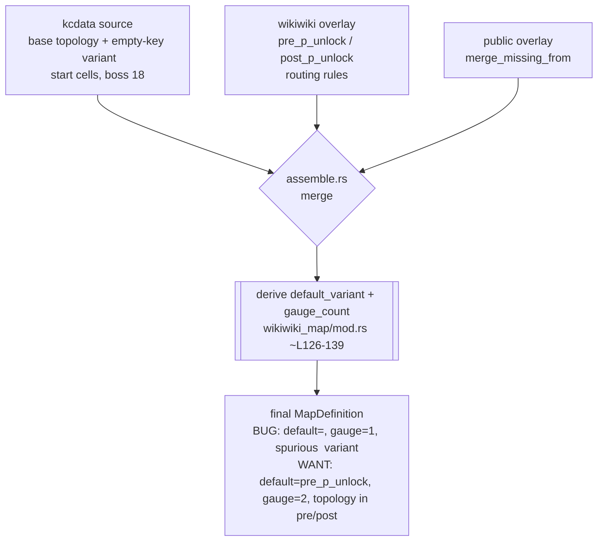

# fix: P-unlock map variant/default/gauge derivation (map 73 / 7-3)

## Summary

Map 73 (7-3, ペナン島沖) is a 2-gauge **P-unlock** map: a sub-gauge gate ("P進撃"
unlock) splits its route into a `pre_p_unlock` phase and a `post_p_unlock` phase.
After a fresh bootstrap, the assembled catalog gives map 73:

- `default_variant: ""` (should be `pre_p_unlock`)
- `gauge_count: 1` (should be `2`)
- a spurious empty-key `""` variant (26 cells, boss 18) retained **alongside**
  `pre_p_unlock` (9 cells, boss 5) and `post_p_unlock` (26 cells, boss 5)

The `pre_p_unlock` / `post_p_unlock` variants ARE produced by the wikiwiki parser,
but the kcdata base `""` variant survives the merge and becomes the default, and
`gauge_count` (derived as `variants.len()`) is wrong. Two sortie integration tests
fail as a result. This plan fixes the **general** P-unlock variant/default/gauge
derivation in catalog assembly (not a 7-3 hardcode), validated against 7-3.

Confirmed this session: refreshing `.data` recovered the Group B verify tests but
did **not** fix 7-3 — so this is a code bug in catalog assembly, not data staleness.

---

## Problem Frame

The final `MapCatalog` is assembled from three sources (`map_pipeline/assemble.rs`):
kcdata (base topology + an empty-key `""` variant), the wikiwiki overlay (route
variants incl. `pre_p_unlock`/`post_p_unlock` and the `default_variant` /
`gauge_count` derivation), and a public overlay (`merge_missing_from`).

For a P-unlock map the wikiwiki parser produces `pre_p_unlock` and `post_p_unlock`
variants (`route/route_table.rs::route_section_variant_key`). But:

- `default_variant` is taken straight from the wikiwiki definition
  (`parser/wikiwiki_map/mod.rs` ~L126) and for 7-3 resolves to `""`.
- `gauge_count = (variants.len() > 1).then_some(variants.len())` (~L139) — counts
  every variant including the spurious `""`, so 3 variants would give 3, yet the
  observed final value is 1, indicating the count is taken from the kcdata side of
  the merge, not the p_unlock variant set.
- The kcdata `""` variant carries the real start-cell topology; `pre_p_unlock`
  (9 cells) does not, so `start_sortie` on the pre-unlock variant raises
  `EntryNotFound("start source cell not found for map 73")`.

Net: the assembly does not recognise that, for a P-unlock map, the `pre_p_unlock` /
`post_p_unlock` variants are the canonical variant set (with `pre_p_unlock` as the
default and the kcdata topology folded in), and that the base `""` variant should
not survive as an independent default.

Exact origin of `default_variant == ""` and the surviving `""` variant is an
execution-time discovery (trace the live merged data); see Characterization Findings.

---

## Characterization Findings (U1 — completed)

U1 instrumented `assemble_final_map_catalog` stage-by-stage and ran the failing
sortie test. Map 73's wrong shape has **two independent layers** — the second is
bigger than this plan originally framed.

**Stage trace:**
- `after kcdata+wikiwiki`: `default="" gauge=Some(1) variants=[""]` (kcdata supplies
  only the base `""` variant, already with `gauge_count=Some(1)`).
- `after public_overlay`: `default="" gauge=Some(1) variants=["", post_p_unlock,
  pre_p_unlock]` — the public overlay **adds** the p_unlock variants but does not fix
  default/gauge.

**Layer 1 — derivation (resolves OQ1).** `merge::merge_definition`
(`crates/emukc_model/src/codex/map/merge.rs`) merges the public-overlay map 73 into
the kcdata base but:
- `default_variant`: adopted from `other` only when the base is empty — both kcdata
  and the overlay supply `""`, so it stays `""`.
- `gauge_count`: adopted from `other` only when the base `is_none()` — the kcdata base
  is `Some(1)`, so the overlay's value can never win.
- The base `""` variant is never dropped when p_unlock variants arrive.

**Layer 2 — topology, the harder one (resolves OQ2).** The public overlay's
`pre_p_unlock` variant is a **topology-less skeleton**: 9 cells (0–8), boss 5, but
`cell 0` has `next_cells = []` and there are **no routing rules**. The real route
graph lives only in the kcdata `""` variant (26 cells, `cell 0 → [1]`, label "Start",
full routing). The merge order — kcdata `""` (topology) → wikiwiki routing (lands only
on the existing `""`) → public overlay adds skeleton pre/post — means the p_unlock
variants **never receive a routable topology**. This is the direct cause of
`EntryNotFound("start source cell not found for map 73")`.

**Consequence for the fix.** Fixing only Layer 1 (default/gauge) makes the first
gameplay test pass but leaves the second failing for lack of a start cell. Layer 2
requires **folding the kcdata `""` topology into the p_unlock variants**, which
carries a **domain-modeling decision**: `pre_p_unlock` is a *subset* of the cell graph
(post-unlock cells are unreachable before unlocking), so the fold cannot be a blind
full-graph copy — it needs the per-phase reachable-cell set for 7-3 (and P-unlock maps
generally). This exceeds the original "derivation tweak" framing; execution paused
here to re-scope rather than hack the topology fold under time pressure.

---

## High-Level Technical Design

Where variant set, default, gauge, and topology are decided during assembly
(the fix targets the highlighted derivation/merge, not the parsers):

The `pre_p_unlock` / `post_p_unlock` keys and the routing come from wikiwiki; the
start-cell topology comes from kcdata. The fix must reconcile the two so the
P-unlock variants are canonical AND topologically complete.

---

## Requirements

- **R1** — A P-unlock map's assembled variant set is its p_unlock variants
  (`pre_p_unlock`, `post_p_unlock`); no spurious empty-key `""` variant is retained
  alongside them.
- **R2** — `default_variant` for a P-unlock map is the pre-unlock variant
  (`pre_p_unlock`), not `""`.
- **R3** — `gauge_count` reflects the real gauge count (2 for 7-3), derived
  consistently with the canonical variant set.
- **R4** — The `pre_p_unlock` variant carries a usable start-cell topology: a sortie
  on it resolves a start source cell (no `EntryNotFound`). kcdata topology is
  preserved into the p_unlock variants.
- **R5** — The two failing gameplay tests pass:
  `first_gauge_clear_switches_map_variant_without_finishing_map` and
  `start_sortie_returns_post_p_unlock_layout_after_first_gauge_clear` (the
  baked-codex one after a `.data` re-bootstrap — see U3).
- **R6** — No regression: non-P-unlock maps keep their existing variant/default/gauge,
  and the bootstrap parser/verify suite plus other map tests stay green. The general
  derivation change is validated against 7-3 (the only tested P-unlock map) but must
  not narrow to it.

---

## Key Technical Decisions

- **KTD-1 — Fix the general derivation/merge, not a 7-3 hardcode.** (User-confirmed.)
  The defect is in generic P-unlock handling in catalog assembly; hardcoding map 73
  via overlay would leave every other P-unlock map wrong. Validate against 7-3 only.
- **KTD-2 — Characterization-first.** The two failing gameplay tests, plus a new
  focused catalog-assembly unit test, are the spec. They encode real 7-3 structure
  (gauge 2, default `pre_p_unlock`, `clear_to post_p_unlock`, `required_defeat_count
  3`). Make the code satisfy them; do not weaken assertions.
- **KTD-3 — Preserve kcdata topology into the p_unlock variants (merge, don't drop).**
  The `start source cell not found` failure shows `pre_p_unlock` needs the kcdata
  cells/start. Dropping the `""` variant without folding its topology in would leave
  `pre_p_unlock` unroutable. The exact mechanism — drop / rename / topology-merge the
  `""` variant — is execution-discovery, resolved by tracing the live assembled data
  (Open Questions).
- **KTD-4 — Keep the fix inside catalog assembly / wikiwiki derivation.** Do not push
  P-unlock logic into the gameplay/sortie layer; sortie consumes a correct catalog.

---

## Implementation Units

### U1. Characterize map 73 assembly and pin the "" / default / gauge origin

**Goal** — Lock the current (wrong) and expected assembled structure of a P-unlock
map in a focused bootstrap-side test, and trace where the empty-key `""` variant,
`default_variant == ""`, and `gauge_count == 1` come from in the merge/derivation.

**Requirements** — R1, R2, R3 (characterization)

**Dependencies** — none

**Files**
- `crates/emukc_bootstrap/src/map_pipeline/` (add a focused assembly test; mirror the
  existing `map_pipeline::verify` / assemble tests) — exact module finalized at implementation
- `crates/emukc_bootstrap/src/parser/wikiwiki_map/mod.rs` (read: default/gauge derivation)
- `crates/emukc_bootstrap/src/map_pipeline/assemble.rs` (read: kcdata↔wikiwiki↔public merge)

**Approach**
- Build the catalog for map 73 from repo assets (as `start_sortie_returns_post_p_unlock_layout_after_first_gauge_clear`
  does) and assert its variant keys / default_variant / gauge_count — capturing the
  current wrong values, then flipping to the expected once U2 lands.
- Trace which source supplies the `""` variant (kcdata) and where `default_variant`
  becomes `""` (the wikiwiki `default_variant` derivation vs the merge). Resolve
  Open Question OQ1 here before changing behavior in U2.

**Execution note** — Characterization-first: capture existing behavior (the failing
gameplay tests + this new assertion) before changing the derivation.

**Patterns to follow** — existing `map_pipeline::verify` tests that build the catalog
from repo assets and assert per-map structure.

**Test scenarios**
- Map 73 assembled from repo assets: variant keys are exactly `{pre_p_unlock,
  post_p_unlock}` (after U2); `default_variant == "pre_p_unlock"`; `gauge_count == 2`.
- `pre_p_unlock` variant has a resolvable start source cell (cell 0 with outgoing
  routing, or a root) — the topology-preservation guard for R4.
- A non-P-unlock map (e.g. a plain single-gauge map) is unchanged: its variant set,
  `default_variant`, and `gauge_count` match pre-fix values (regression guard for R6).

**Verification** — The new test encodes the expected map-73 structure and a
non-P-unlock control; it fails before U2 and passes after.

---

### U2. Fix P-unlock variant/default/gauge derivation in catalog assembly

**Goal** — Make catalog assembly treat `pre_p_unlock`/`post_p_unlock` as the
canonical variant set for a P-unlock map: drop/fold the base `""` variant, set
`default_variant = pre_p_unlock`, derive `gauge_count` from the canonical set, and
preserve kcdata topology into the p_unlock variants.

**Requirements** — R1, R2, R3, R4, R6

**Dependencies** — U1

**Files** (per U1's trace; not the wikiwiki parser as originally guessed)
- `crates/emukc_model/src/codex/map/merge.rs` (`merge_definition` — the default/gauge
  merge rules that keep the kcdata base; the `""`-variant survival)
- `crates/emukc_model/src/codex/map.rs` (`merge_missing_from` / a post-merge
  normalization pass for p_unlock maps)
- `crates/emukc_bootstrap/src/map_overlay/merge.rs` (public-overlay capture builder —
  whether p_unlock map defs should carry `default_variant`/`gauge_count`, and the
  topology fold from the kcdata `""` graph)
- `crates/emukc_bootstrap/src/map_pipeline/assemble.rs` (where to invoke the fold;
  it has both the kcdata base and the overlay)

**Approach** — two layers (see Characterization Findings):
- **Layer 1 (derivation).** When p_unlock variants are present, set
  `default_variant = pre_p_unlock`, derive `gauge_count` from the canonical p_unlock
  set (2, excluding the base `""`), and drop the standalone `""` variant. Do this where
  both sources are visible (post-merge normalization in `merge_missing_from`, or in
  `assemble.rs`), since `merge_definition`'s "base wins" rules block the overlay from
  setting gauge_count.
- **Layer 2 (topology — gated on OQ4).** Fold the kcdata `""` route graph into each
  p_unlock variant restricted to that phase's reachable cells, so `pre_p_unlock` has a
  start cell and routing. The exact reachable-cell derivation is the open domain
  decision (OQ4).
- Keep the change generic to "map has p_unlock variants", not keyed on map id 73.

**Execution note** — Implement against U1's characterization; verify the new assembly
test and the two gameplay tests, not just a local unit.

**Patterns to follow** — the existing variant-merge logic in `assemble.rs`
(`merge_label_overlay_catalog`, `merge_missing_from`) and the derivation in
`wikiwiki_map/mod.rs`.

**Test scenarios**
- Covers R1–R4 via U1's map-73 assertions now passing.
- Topology: a sortie built on the fixed `pre_p_unlock` variant resolves a start cell.
- Regression: the `map_pipeline::verify` suite and a non-P-unlock control map are
  unaffected (no variant/default/gauge drift on ordinary maps).
- Edge: a map whose wikiwiki side has p_unlock variants but whose kcdata side lacks a
  matching topology — degrade safely (warn, keep best-effort) rather than panic.

**Verification** — U1's assembly test passes; no `map_pipeline::verify` regression.

---

### U3. Re-bootstrap and verify the 7-3 gameplay tests

**Goal** — Refresh `.data` with the fixed assembly and confirm both 7-3 sortie tests
pass, with no bootstrap-suite or map-test regression.

**Requirements** — R5, R6

**Dependencies** — U1, U2

**Files**
- (no production code) — measurement + re-bootstrap

**Approach**
- `first_gauge_clear_switches_map_variant_without_finishing_map` reads the **baked**
  `.data/codex`, so re-run `cargo run -- bootstrap --overwrite --skip-web-assets` to
  rebuild the catalog with the fix before running it.
  `start_sortie_returns_post_p_unlock_layout_after_first_gauge_clear` rebuilds from
  `.data/temp` with current code, so it reflects the fix without re-baking — but the
  re-bootstrap keeps both paths consistent.
- Run the two gameplay tests, the full `cargo test -p emukc_bootstrap` (expect the two
  Group B verify tests green from the earlier refresh; the network/parallel make_list
  flakiness is environmental, not a regression), and the `parser::wikiwiki_map` module.

**Execution note** — Verification unit. If fresh 7-3 data diverges from a test's
finer assertion (exact cells/defeat counts) for reasons unrelated to the variant fix,
capture it as a follow-up rather than weakening the assertion.

**Test expectation: none** — measurement/verification only.

**Verification** — Both 7-3 gameplay tests pass after re-bootstrap; no net-new
failures in the bootstrap suite attributable to this change.

---

## Open Questions

- **OQ1 — RESOLVED (U1).** `default_variant == ""` and `gauge_count == 1` come from the
  kcdata/merge side, not the wikiwiki derivation: `merge::merge_definition` keeps the
  base's empty `default_variant` and `Some(1)` `gauge_count` because the public overlay
  supplies `""` / `None`. See Characterization Findings.
- **OQ2 — RESOLVED (U1), but bigger than assumed.** The kcdata `""` base variant must
  not survive as the default; the p_unlock variants must become canonical. The hard
  part is **topology**: the overlay's p_unlock variants are routing-less skeletons, so
  the kcdata `""` topology must be folded into them — see OQ4.
- **OQ3** — Whether `required_defeat_count` and `clear_to_variant_key` (test 1 asserts
  `Some(3)` / `Some("post_p_unlock")`) are already correct in the fresh data or also
  need derivation fixes. Confirm once Layer 2 lands.
- **OQ4 — OPEN (domain decision; the blocker for U2's topology layer).** How to derive
  each p_unlock variant's reachable-cell subset + routing from the kcdata `""` graph:
  `pre_p_unlock` is a strict subgraph (post-unlock cells unreachable before unlocking),
  so the fold cannot be a full-graph copy. Needs the per-phase cell membership for 7-3
  (and a general rule). Candidate inputs: the overlay's per-variant cell list (which
  cells belong to each phase) intersected with the kcdata routing graph.

---

## Scope Boundaries

**In scope** — General P-unlock variant/default/gauge derivation + topology merge in
catalog assembly, validated against 7-3; re-bootstrap + verification of the two 7-3
gameplay tests.

### Deferred to Follow-Up Work
- The environmental `make_list` test flakiness (parallel DB `DatabaseAlreadyOpen` +
  network `FailedOnAllCdn`) — unrelated to this change; a separate test-hygiene item.
- Any finer 7-3 assertion drift surfaced by fresh data unrelated to the variant fix
  (OQ3 residue).

**Not a goal** — Hardcoding map 73 via overlay; changing the kcdata/wikiwiki parsers
beyond the p_unlock derivation; touching the sortie/gameplay layer (it consumes a
correct catalog).

---

## Risks & Dependencies

- **3-source merge complexity.** The bug lives at the kcdata + wikiwiki + public
  overlay seam; a derivation change can have catalog-wide reach. R6 + the non-P-unlock
  control test guard against collateral drift; characterization-first (U1) de-risks
  changing logic before the live behavior is understood.
- **Topology vs variant coupling (KTD-3).** Making `pre_p_unlock` canonical without
  folding kcdata topology re-creates the `start source cell not found` failure; R4 and
  the start-cell scenario are the guard.
- **Baked-vs-rebuilt data split.** One gameplay test reads baked `.data/codex`, the
  other rebuilds from `.data/temp`; U3's re-bootstrap reconciles them. Forgetting the
  re-bake would leave test 1 red on otherwise-correct code.
- **Fresh-data divergence.** 7-3's current structure may differ in minor ways from when
  the tests were written; OQ3 / U3's execution note handle that without weakening specs.

---

## Sources & Research

- This session's verification: `.data` refresh recovered Group B verify tests but not
  the two 7-3 gameplay tests → catalog-assembly code bug, not data staleness.
- Fresh assembled map 73: `default_variant ""`, `gauge_count 1`, variants
  `["", post_p_unlock, pre_p_unlock]` (pre 9 cells/boss 5, post 26/boss 5, "" 26/boss 18).
- Derivation: `parser/wikiwiki_map/mod.rs` (`default_variant` ~L126, `gauge_count`
  ~L139, `default_variant` derivation ~L461); variant keys in
  `parser/wikiwiki_map/route/route_table.rs::route_section_variant_key`.
- Assembly/merge: `crates/emukc_bootstrap/src/map_pipeline/assemble.rs`
  (`merge_label_overlay_catalog`, `merge_missing_from`).
- Start-cell failure surface: `select_start_source_cell` / `start_source_cells` in
  `crates/emukc_gameplay/src/game/sortie/mod.rs`.
- Failing tests (the spec): `first_gauge_clear_switches_map_variant_without_finishing_map`
  and `start_sortie_returns_post_p_unlock_layout_after_first_gauge_clear` in
  `crates/emukc_gameplay/src/game/sortie_tests.rs`.
