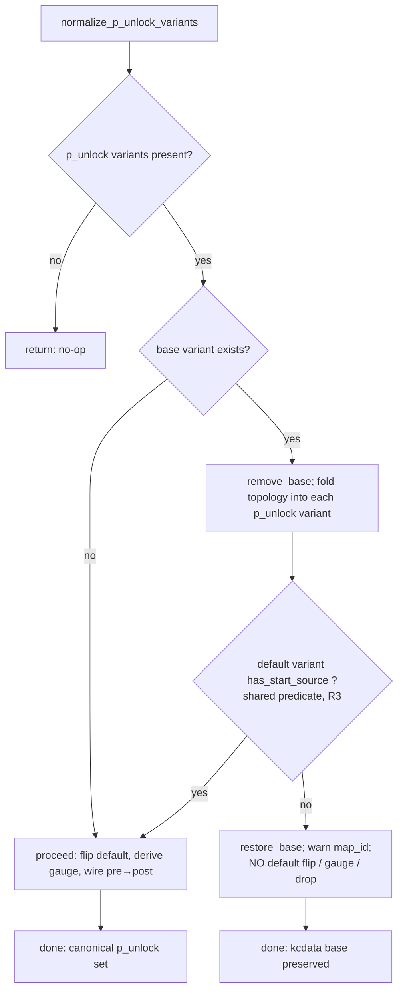

# fix: P-unlock topology-fold routability guard

## Summary

The P-unlock normalization shipped in `082697d` (plan `2026-06-09-003`) makes
`pre_p_unlock` / `post_p_unlock` canonical by folding the kcdata `""` topology into
each variant, flipping the default, deriving `gauge_count`, and **dropping the `""`
variant**. The fold joins variant↔base strictly by in-game `cell_no`, which is correct
for 7-3 (the only tested P-unlock map, where the numbering aligns). Code review
(run `20260609-152335`, finding **#5**, corroborated by correctness + adversarial)
showed the destructive steps run **unconditionally** even when the fold copied nothing:
a future P-unlock map whose capture numbering diverges from kcdata would have its only
routable variant (`""`) deleted and the default flipped to a topology-less
`pre_p_unlock` — reintroducing the exact `EntryNotFound("start source cell not found")`
this work originally fixed, with its working fallback destroyed.

This plan adds a **routability guard**: if the fold cannot give the would-be default
variant a resolvable start cell, normalization is skipped for that map — the kcdata base
(`""` default, kcdata `gauge_count`) is preserved and a bootstrap warning is emitted. The
guard reuses the *same* start-cell predicate the sortie layer uses (extracted into
`emukc_model`) so the guard can never drift out of agreement with the real consumer.

7-3 and all currently-passing behavior are unaffected — the guard only changes outcomes
for a map the fold cannot reconstruct, which does not exist in tested data today.

---

## Problem Frame

`MapDefinition::normalize_p_unlock_variants` (`crates/emukc_model/src/codex/map.rs`) runs
once per map in `assemble_final_map_catalog`
(`crates/emukc_bootstrap/src/map_pipeline/assemble.rs`). For a P-unlock map it:

1. removes the `""` base variant and folds its `next_cells` / routing into each p_unlock
   variant, **restricted to that variant's own `cell_no` set**;
2. sets `default_variant = pre_p_unlock`, derives `gauge_count` from the pre+post pair;
3. wires `pre → post` progression;
4. leaves the `""` variant dropped.

Steps 2–4 are **destructive and unconditional**. The fold in step 1 is a `cell_no` join:
when a variant's captured cell numbers do not match the kcdata `""` numbering, the join
matches nothing, every `next_cells` stays empty, and the variant has no start cell. The
post-merge `validate()` pass is warn-only and *exempts* cell 0
(`crates/emukc_model/src/codex/map.rs`, `MapValidationWarning::Unreachable`), so an orphaned
start is never surfaced. The net failure for such a map: `default_stage_id()` returns
`pre_p_unlock`, the sortie layer's `start_source_cells` returns `[]`, and `start_sortie`
raises `EntryNotFound` — the original 7-3 bug, with the `""` fallback already deleted.

The start-cell resolution the guard must mirror lives in the gameplay crate today:
`start_source_cells` (`crates/emukc_gameplay/src/game/sortie/mod.rs`) and its helper
`cell_has_routing_outgoing` (`crates/emukc_gameplay/src/game/map_route.rs`). Re-implementing
that logic inside the guard would risk the guard and the runtime disagreeing — the guard
passing while the sortie layer still fails. The fix shares one predicate instead.

---

## Requirements

- **R1** — When the topology fold cannot give the would-be default variant
  (`pre_p_unlock`) a resolvable start cell, `normalize_p_unlock_variants` makes **no
  destructive change**: the `""` base variant is retained, `default_variant` and
  `gauge_count` keep their kcdata values, and the map stays playable as the unsplit base.
- **R2** — The skip emits an operator-visible bootstrap warning identifying the map id, so
  a misaligned P-unlock map is diagnosable rather than silently degraded.
- **R3** — The guard's "has a start cell" check is the **same predicate** the sortie layer
  uses to resolve a start — shared via a single implementation, not a re-derivation — so
  the guard cannot pass while the runtime fails (or vice versa).
- **R4** — 7-3 (aligned data) is unchanged: it still normalizes to `pre_p_unlock` /
  `post_p_unlock` canonical with folded topology, `default_variant = pre_p_unlock`,
  `gauge_count = 2`; both `sortie_tests` P-unlock tests stay green.
- **R5** — No regression in the sortie start-cell resolution or routing behavior after the
  predicate is moved (the existing `map_route` / `sortie` start tests stay green), and the
  existing `normalize_p_unlock_*` model tests stay green.

---

## High-Level Technical Design

The guard gates only the destructive tail of normalization on a routability check that
reuses the extracted predicate:

The `has_start_source` check is the boolean form of the sortie layer's
`start_source_cells`, moved to `MapVariantDefinition` so both the guard (assembly time) and
`select_start_source_cell` (sortie time) call one implementation.

---

## Key Technical Decisions

- **KTD-1 — Skip-and-warn, not destroy-and-warn (user-confirmed).** When the fold can't
  reconstruct a routable default, abort normalization for that map and keep the kcdata base
  (`""` default + kcdata gauge); emit a warning. This is the smallest behavior surface: the
  map stays playable as the unsplit base, and the p_unlock split is deferred until the data
  aligns. Rejected alternatives: *keep `""` as a fallback alongside a flipped p_unlock
  default* (larger surface; downstream must tolerate `""` beside p_unlock and a default with
  no topology), and *warn-only with no behavior change* (surfaces the problem but still ships
  an unroutable map).
- **KTD-2 — Share the start-cell predicate, don't re-derive it (R3).** Move
  `start_source_cells` + `cell_has_routing_outgoing` onto `MapVariantDefinition` in
  `emukc_model`; the guard calls `has_start_source()`, and the gameplay callers delegate to
  the moved methods via thin shims so their call sites and tests stay put. A second,
  independent start-check would be a latent drift bug — the guard could pass on a graph the
  sortie layer rejects.
- **KTD-3 — Warn from the model layer via `tracing`.** `emukc_model` already depends on
  `tracing` (workspace dep). The skip is a one-shot bootstrap diagnostic, so a
  `tracing::warn!(map_id, …)` inline keeps the `assemble.rs` call site unchanged and the
  guard's *decision* remains unit-testable through observable state (the `""` variant and
  `default_variant` are unchanged on skip) rather than log capture.
- **KTD-4 — Guard scope is "base existed AND fold failed".** When there is no `""` base at
  all (only p_unlock skeletons), there is nothing to fall back to, so the existing
  degrade-safe behavior (flip to `pre_p_unlock`) is kept — the guard does not change it.
  The rollback path only triggers when a base was removed and the fold left the default
  unroutable.
- **KTD-5 — Characterization-first on the extraction (U1).** Moving the start predicate must
  be behavior-preserving; the existing `map_route` / `sortie` start tests are the
  characterization that pins it before and after the move.

---

## Implementation Units

### U1. Extract start-source-cell resolution into `emukc_model`

**Goal** — Make the start-cell predicate a single shared implementation on
`MapVariantDefinition` so both the sortie runtime and the new guard use the same logic.

**Requirements** — R3, R5

**Dependencies** — none

**Files**
- `crates/emukc_model/src/codex/map.rs` (add `impl MapVariantDefinition` methods:
  `cell_has_routing_outgoing(&self, cell_no)`, `start_source_cells(&self)`,
  `has_start_source(&self)`; add unit tests mirroring the moved gameplay tests)
- `crates/emukc_gameplay/src/game/map_route.rs` (turn `cell_has_routing_outgoing` into a
  thin `pub(crate)` shim delegating to the model method; keep its existing tests passing)
- `crates/emukc_gameplay/src/game/sortie/mod.rs` (replace the local `start_source_cells`
  body/usage with `stage.start_source_cells()`; `select_start_source_cell` keeps the
  RNG-based pick among the returned sources)

**Approach**
- Move the bodies of `cell_has_routing_outgoing` (next_cells non-empty OR a routing rule
  exists) and `start_source_cells` (roots = cells with no incoming edge that have outgoing
  routing; fallback to cell 0 with outgoing) onto `MapVariantDefinition`. Add
  `has_start_source(&self) -> bool` = `!self.start_source_cells().is_empty()`.
- Leave thin delegating shims at the existing gameplay call sites so the ~6 `sortie/mod.rs`
  callers and the 5 `map_route.rs` test asserts do not have to change shape. `MapStageDefinition`
  is a type alias of `MapVariantDefinition`, so the methods are directly callable on `stage`.
- `select_start_source_cell` (RNG pick) stays in gameplay — only the *enumeration* of start
  sources moves.

**Execution note** — Characterization-first: the move is behavior-preserving; run the
existing `map_route` and `sortie` start tests before and after to confirm no drift.

**Patterns to follow** — the existing `impl MapVariantDefinition` block in
`crates/emukc_model/src/codex/map.rs` (e.g. `first_progress_cell_no`, `cell`); the existing
`start_source_cells` / `cell_has_routing_outgoing` logic verbatim.

**Test scenarios**
- Model `has_start_source` / `start_source_cells`: a variant with `cell 0 → [1]` resolves a
  start (cell 0); a variant whose cells all have empty `next_cells` and no routing resolves
  **no** start; a variant with a non-zero labeled root that has outgoing routing resolves
  that root (mirror `start_source_cells_include_nonzero_route_cell_roots`).
- `cell_has_routing_outgoing` model method: true for next_cells-only, true for
  routing-rules-only, true for both, false for neither, false for a missing cell (mirror the
  five existing `map_route` asserts).
- Gameplay delegation: the existing `sortie` / `map_route` start tests still pass unchanged
  (regression guard for R5).

**Verification** — `cargo test -p emukc_model` and the `map_route` / `sortie` start tests
pass; no call site outside the moved bodies changed behavior.

---

### U2. Add the routability guard to `normalize_p_unlock_variants`

**Goal** — Gate the destructive tail of normalization (default flip, gauge derive, drop
`""`) on the folded default variant having a resolvable start; otherwise restore the base
and warn.

**Requirements** — R1, R2, R4

**Dependencies** — U1

**Files**
- `crates/emukc_model/src/codex/map.rs` (`normalize_p_unlock_variants`)

**Approach** (directional, not implementation spec)
- Take ownership of the base via `remove("")` (already the case after `082697d`'s self-review
  refactor). After folding `&base` into each present p_unlock variant, check
  `self.variants.get(present[0]).is_some_and(|v| v.has_start_source())`.
- If routable → proceed with the existing default/gauge/`pre→post` wiring (no `""` to
  re-insert; it was removed).
- If **not** routable → `self.variants.insert(String::new(), base)` to restore the kcdata
  base exactly, `tracing::warn!(map_id = self.map_id, …)`, and `return` **before** any
  default flip / gauge change. `default_variant` and `gauge_count` keep their kcdata values.
- The no-base path (`remove("")` returned `None`) is unchanged — there is nothing to fall
  back to, so existing degrade-safe behavior stands (KTD-4).
- Partial-fold note: the fold only *fills empty* `next_cells` with in-set edges, so on a
  skip the p_unlock variants are at worst unchanged skeletons or carry a few valid interior
  edges — harmless, since they are not the default and `""` is the routable default.

**Execution note** — Implement against U3's new misalignment characterization (write the
skip-path test first so the guard's trigger condition is pinned before the guard exists).

**Patterns to follow** — the current `normalize_p_unlock_variants` structure post-`082697d`
(the `if let Some(base) = self.variants.remove("")` fold block and the `present.len() >= 2`
derivation block).

**Test scenarios** — covered by U3 (kept in one place since they exercise this unit end to
end): the misaligned-numbering skip path, the idempotency of a skipped map, and the
unaffected 7-3 happy path.

**Verification** — the new U3 assertions pass; the existing `normalize_p_unlock_*` tests and
both `sortie_tests` P-unlock tests stay green.

---

### U3. Coverage: skip path, idempotency, and assembly invocation

**Goal** — Prove the guard skips destructively-unsafe folds, preserves the base, and leaves
the aligned 7-3 path untouched — at both the unit and assembly levels.

**Requirements** — R1, R2, R4, R5

**Dependencies** — U1, U2

**Files**
- `crates/emukc_model/src/codex/map.rs` (extend the `normalize_p_unlock_*` test module)
- `crates/emukc_bootstrap/src/map_pipeline/assemble.rs` (add an assembly-level test in its
  existing `mod tests` using the local `make_catalog` / `make_variant` helpers)

**Approach**
- Reuse / extend the existing `p_unlock_definition()` fixture. Add a *misaligned* fixture
  where the p_unlock skeleton cells use numbers absent from the base `""` (e.g. base uses
  `0..3`, the skeletons use `100..103`), so the `cell_no` fold join matches nothing.
- Assembly-level test: build a small `MapCatalog` with one P-unlock-shaped map and assert the
  post-assembly outcome (aligned → canonical pre/post, `""` gone; the invocation loop in
  `assemble_final_map_catalog` runs). This closes the gap that the assemble invocation is
  currently only covered indirectly through the disk-dependent `sortie_tests`.

**Test scenarios**
- **Skip path (R1):** misaligned fixture → after normalize, `""` is still present,
  `default_variant` is unchanged (not `pre_p_unlock`), `gauge_count` keeps its fixture value,
  and the base `""` variant still resolves a start (`has_start_source()` true).
- **Idempotency of skip (R1):** calling normalize twice on the misaligned fixture yields the
  same state as once (still skipped, `""` retained, no accumulation).
- **Happy path unchanged (R4):** the aligned `p_unlock_definition()` fixture still produces
  `default_variant = pre_p_unlock`, `gauge_count = Some(2)`, `""` removed, `pre` `cell 0 → [1]`.
- **Assembly invocation (R5):** an aligned P-unlock map routed through
  `assemble_final_map_catalog` exits with `pre_p_unlock` default and no `""` variant; a
  control non-P-unlock map is unchanged.
- **Warning emitted (R2):** asserting the log line is out of scope for unit tests (KTD-3); the
  skip is verified by state. Note the warning's presence is exercised manually / via the
  bootstrap run, not asserted in unit tests.

**Verification** — `cargo test -p emukc_model` and `cargo test -p emukc_bootstrap`
(map_pipeline + parser) pass; both `sortie_tests` P-unlock tests pass. A `cargo run --
bootstrap --overwrite --skip-web-assets` still bakes 7-3 as `pre_p_unlock` default / gauge 2
(no behavior change for aligned data).

---

## Scope Boundaries

**In scope** — A routability guard on `normalize_p_unlock_variants` (skip-and-warn,
preserving the kcdata base) that reuses the sortie layer's start-cell predicate via a single
shared implementation; the test coverage proving the skip path, idempotency, the unchanged
7-3 path, and the assembly invocation.

### Deferred to Follow-Up Work
- **Capture the P-unlock pipeline conventions in `docs/solutions/`** (review
  learnings-researcher recommendation: the `""`-is-a-kcdata-artifact rule, the `cell_no`-join
  fold, gauge re-derivation, `pre`-is-default synthesis, the closed `P_UNLOCK_VARIANT_KEYS`
  set). Best done via `/ce-compound` once the approach is validated against a **second**
  P-unlock map, so the captured pattern reflects real generalization rather than a single
  case.
- **Verify the post-unlock gauge's `required_defeat_count`** (review finding #7): `pre`
  inherits the map-level value (3) and `gauge_count` is forced to 2; whether the post phase
  truly needs 3 defeats is a game-data question to confirm against captured data, not a code
  defect today.

**Not a goal** — Generalizing beyond the `pre_p_unlock` / `post_p_unlock` key pair to other
multi-phase schemes; converting `fold_base_topology_into_variant` from a free fn to a method
(review #6, a declined taste call); any change to 7-3's behavior or the baked catalog shape
for aligned data; auto-repairing a misaligned map's topology (the guard defers the split, it
does not reconstruct the graph).

---

## Risks & Dependencies

- **Predicate-move drift (R3/R5).** The U1 extraction must be behavior-preserving across ~6
  sortie call sites and 5 `map_route` test asserts. Mitigation: thin delegating shims keep
  call sites stable; the existing start tests are the characterization (KTD-5).
- **Guard too strict / too loose.** Because the guard reuses the *exact* sortie predicate
  (`has_start_source`), it triggers precisely when the runtime would fail to find a start —
  no more, no less. A re-implemented check would be the real risk; KTD-2 removes it.
- **Untestable warning.** The skip's warning is `tracing`-only and not asserted in unit tests
  (KTD-3); the skip *decision* is asserted via observable state. Accepted: the warning is a
  diagnostic, and state assertions fully pin the behavior.
- **Latent-only finding.** This hardens against a map that does not exist in tested data
  today (only aligned 7-3). The value is preventing a silent hard failure when a second
  P-unlock map (or a 7-3 renumber) lands — at near-zero cost to current behavior.

---

## Sources & Research

- Code review run `20260609-152335` (artifacts under
  `/tmp/compound-engineering/ce-code-review/20260609-152335-9b8ce017/`): finding **#5**
  (destructive fold on misaligned cell numbers, P2, corroborated by correctness +
  adversarial), plus residuals #6 (declined) and #7 (deferred) and the learnings-researcher
  capture recommendation (deferred).
- Prior work: `082697d` (the normalization being hardened) and plan
  `docs/plans/2026-06-09-003-fix-punlock-variant-derivation-plan.md` (status: completed).
- Predicate to share: `start_source_cells` / `select_start_source_cell`
  (`crates/emukc_gameplay/src/game/sortie/mod.rs`), `cell_has_routing_outgoing`
  (`crates/emukc_gameplay/src/game/map_route.rs`); `MapStageDefinition` alias of
  `MapVariantDefinition` (`crates/emukc_model/src/codex/map/types.rs`).
- `emukc_model` already depends on `tracing` (`crates/emukc_model/Cargo.toml`), enabling the
  model-layer warning (KTD-3).
- No applicable prior `docs/solutions/` entries (confirmed by the review's
  learnings-researcher: only clippy-triage and remodel-fields docs exist).
