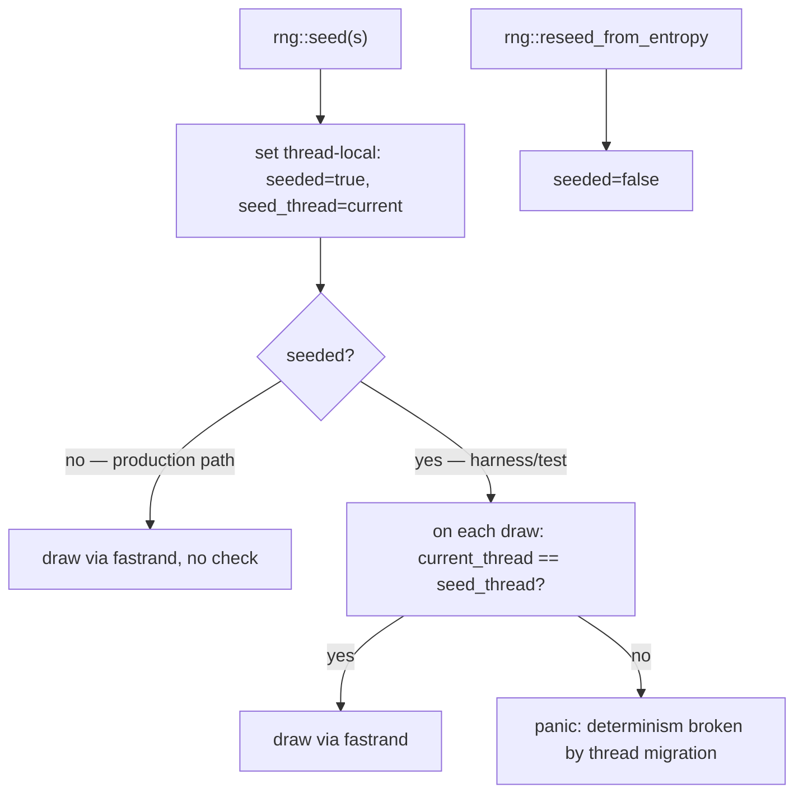

# fix: Battle Sim Harness Hardening

## Summary

Harden the shipped deterministic battle/sortie harness (origin: deterministic-battle-test-harness) by adding runtime enforcement to the thread-local seed and widening the test surface the harness was meant to provide. The harness works; this plan closes its silent-failure gaps and the audit-found coverage holes — it does not rebuild the harness.

## Problem Frame

The harness (U1-U6 of the origin plan, marked completed) delivers deterministic sorties via a thread-local `fastrand` seed. A post-ship audit found two classes of gap, neither of which the origin requirements named because they only surface after the keystone is built:

- **Determinism holds by convention, not by enforcement.** The thread-local seed stays valid only while every RNG draw lands on the seed's OS thread. That invariant rests on three unstated rules (current-thread runtime; no `spawn_blocking`/off-thread RNG use; no RNG bypassing the `emukc_crypto::rng` facade). Nothing detects a violation — a future change that migrates a task across threads would let transcript drift pass silently. `seed_search`'s comment is the only guard, and it lives far from the RNG consumption sites.
- **The test surface is thinner than the harness promises.** The CLI's real-world path is cross-process, but determinism is only asserted in-process (`sim_transcript_is_deterministic_in_process` says so in a comment). The golden transcript covers a single scenario/seed (`fresh_1_1`). The `cutin` seed-search predicate has no test, so its `saw_cutin` detection could regress uncaught. `seed_search` restores a per-ship baseline across attempts on the assumption that `update_ship` covers every field the battle mutates — an assumption never auto-checked.

The keystone (seed → thread-local RNG → all draws co-located) is correct; this plan adds the missing teeth and the missing coverage.

## Requirements

**Determinism enforcement**

- R1. Seeded RNG consumption that crosses OS threads (task migration, `spawn_blocking`, any off-thread draw) fails loud at the consumption point, not as silent transcript drift.
- R2. `seed_search` iterations cannot silently accumulate profile-state drift; any baseline field the battle mutates but the restore misses surfaces as a test failure, not an irreproducible found seed.

**Test-surface coverage**

- R3. Cross-process determinism — two independent CLI invocations with the same seed — is verified, closing the in-process-only gap.
- R4. A frozen golden transcript exists for the `leveled_for_mid_boss` preset (6-ship fleet, multi-node sortie into the 2-1 area), not only `fresh_1_1`.
- R5. The `cutin` seed-search predicate is covered by a find-and-reproduce test, pinning the `saw_cutin` detection logic.

**Portability**

- R6. Codex-dependent tests skip cleanly (not fail) when `.data/codex` is absent, printing the bootstrap prerequisite.

## Key Technical Decisions

- **KTD1. Probe at the RNG facade by thread identity, not by tokio runtime flavor.** Checking that the consuming thread equals the seed thread is strictly stronger than checking the runtime is `current_thread`: it catches any off-thread draw, including a `spawn_blocking` inside an otherwise-correct runtime. The fragile invariant is "draws stay on one thread," not "the runtime has one worker."
- **KTD2. The probe is gated by a seeded flag with zero production cost.** The live server never calls `rng::seed`, so a thread-local `seeded: bool` defaults to off and the facade short-circuits the check in production. The hot path pays nothing.
- **KTD3. Baseline self-check snapshots full profile state (ships across fields + materials).** The audit could not fully confirm whether ship fuel/ammo are mutated on the battle path and whether `update_ship` covers them. Snapshotting the whole state and asserting stability turns the unverified assumption into an automatic regression.
- **KTD4. Cross-process and codex-dependent tests skip, not fail, without codex.** `.data/codex` is gitignored and the project has no CI, so a missing codex is a normal dev state. Failing would punish contributors who have not bootstrapped; skipping with a clear message preserves the test's value where it can run.
- **KTD5. The second-preset golden seed is chosen at implementation time.** Which seed walks a 2-1 first battle to a stable transcript is only knowable by running it; the plan does not pretend to know. The chosen seed and any map-data surprise it surfaces are recorded in the commit.

## High-Level Technical Design

The probe lives at the one chokepoint every draw already passes through (the `emukc_crypto::rng` free functions). It reads a thread-local seeded marker set by `rng::seed` and cleared by `rng::reseed_from_entropy`; when set, it asserts the consuming thread matches the seed thread. No other call site needs changing.

## Implementation Units

### U1. Determinism runtime probe

- **Goal:** Make a cross-thread RNG draw in seeded mode fail loud at the draw, before it can corrupt a transcript.
- **Requirements:** R1.
- **Dependencies:** none.
- **Files:**
  - `crates/emukc_crypto/src/rng.rs` — add the thread-local seeded marker, the thread-identity check in the free-function draws, and inline tests.
  - `src/bin/cli/battle.rs` — no logic change expected; confirm `seed_search` stays on its dedicated current-thread runtime (the probe enforces what the comment currently asserts).
- **Approach:** A thread-local holds `(seeded: bool, seed_thread: ThreadId)`. `rng::seed` sets `seeded=true` and records the current thread. Each free-function draw (`i64`, `usize`, `f64`, …) checks, only when `seeded`, that `std::thread::current().id()` equals `seed_thread`; mismatch panics with a message naming both threads and pointing at the current-thread-runtime requirement. `rng::reseed_from_entropy` clears `seeded` so the entropy path stops checking. Production never seeds, so the marker stays false and the check is a single boolean read.
- **Patterns to follow:** the existing `seeded_sequence_is_reproducible` / `reseed_from_entropy_breaks_determinism` tests in `crates/emukc_crypto/src/rng.rs` — same harness, same entropy-restore discipline.
- **Test scenarios:**
  - **Happy:** seed on a thread, draw on the same thread — no panic, draws match a fresh seeded RNG's sequence.
  - **Error:** seed on thread A, spawn thread B, draw on B — panic whose message names the migration and the current-thread-runtime fix.
  - **Edge:** after `reseed_from_entropy`, a cross-thread draw does not panic (the marker is cleared).
  - **Integration:** the existing golden and sim tests (`battle_golden.rs`, `cli/battle.rs` inlined) still pass — the probe does not false-positive on the real current-thread path.
- **Verification:** the probe tests pass; `cargo test -p emukc_crypto` and `cargo test --test gameplay_tests` stay green; production RNG path is unchanged (seeded marker never set in the serve path).

### U2. seed-search baseline integrity self-check

- **Goal:** Turn the "baseline restore covers every mutated field" assumption into an automatic failure if it ever stops holding.
- **Requirements:** R2.
- **Dependencies:** none (parallelizable with U1).
- **Files:**
  - `src/bin/cli/battle.rs` — extend `seed_search`'s per-attempt loop.
  - `crates/emukc_gameplay/src/scenario/mod.rs` or `crates/emukc_gameplay/src/game/` — a small profile-snapshot helper over existing `get_ships`/`get_materials` if a reusable one does not already exist (reuse rather than add if one does).
- **Approach:** After the first attempt completes (baseline restore + one full battle + result), snapshot the full profile state — every ship field returned by `get_ships` plus materials. On each subsequent attempt, after the baseline restore and before the run, assert the state equals the snapshot; on mismatch, panic with a field-level diff (which ship, which field, expected vs actual). This catches fuel/ammo/HP drift the manual baseline might miss. The snapshot is dev-tool overhead, acceptable in `seed_search`.
- **Patterns to follow:** the existing baseline snapshot at `src/bin/cli/battle.rs` (`let baseline = ctx.get_ships(...)`) — extend the same shape to a full-state comparison.
- **Test scenarios:**
  - **Happy:** `fresh_1_1` across N attempts (cap small) — state stable, no panic, search completes.
  - **Error:** inject a drift (e.g., a scenario whose battle mutates a field the restore misses, or a test-only restore stub) — self-check panics naming the drifted field. If no natural drift is constructible, assert the check itself runs by observing the snapshot is taken each attempt.
  - **Integration:** `seed_search_finds_night_and_reproduces` still passes with the self-check active, and the found seed still reproduces on a plain run.
- **Verification:** existing seed-search tests pass with the self-check in place; a deliberately-incomplete restore now fails instead of producing an irreproducible seed.

### U3. Cross-process determinism integration test

- **Goal:** Verify the real CLI path — two separate processes, same seed — is byte-identical, closing the gap the in-process test disclaims.
- **Requirements:** R3, R6.
- **Dependencies:** U1 recommended (the probe makes a cross-process drift diagnosable rather than mysterious), but not blocking.
- **Files:**
  - `tests/battle_sim_cross_process_determinism.rs` — new test file.
- **Approach:** Build the `emukc` binary, then run `battle sim --scenario fresh_1_1 --seed 7` twice via `std::process::Command`, capturing stdout. Assert the two outputs are byte-identical and that each contains a result-rank line. Add a sanity case: a different seed produces different output. Gate on codex presence — if `.data/codex` is missing, skip with a message naming `cargo run -- bootstrap` (R6/KTD4), do not fail.
- **Patterns to follow:** `sim_transcript_is_deterministic_in_process` in `src/bin/cli/battle.rs` — the in-process counterpart this test exists to complement.
- **Test scenarios:**
  - **Happy:** two invocations, same seed → byte-identical stdout, each ending in a result rank.
  - **Edge:** `.data/codex` absent → test skips with a message naming the bootstrap step.
  - **Sanity:** two invocations, different seeds → outputs differ (guards against a vacuous always-equal assertion).
- **Verification:** the test passes when codex is bootstrapped; skips cleanly otherwise; the in-process and cross-process assertions agree.

### U4. leveled_for_mid_boss golden transcript

- **Goal:** Freeze a second golden covering the 6-ship, multi-node path the single `fresh_1_1` golden does not.
- **Requirements:** R4.
- **Dependencies:** none.
- **Files:**
  - `tests/gameplay_tests/battle_golden.rs` — add a second `GOLDEN` constant, a render helper for the mid-boss preset, a match test, and a drift guard.
- **Approach:** At implementation time, run `battle sim` (or the in-process helper) over `leveled_for_mid_boss` and search/try seeds until one walks the 2-1 first battle to a stable transcript; freeze that transcript. Mirror the existing `full_sortie_transcript_matches_golden` + `golden_guard_catches_drift` pair. Record the chosen seed and any map-data quirk in the commit (KTD5).
- **Patterns to follow:** the `GOLDEN` constant and the match/drift-guard test pair already in `tests/gameplay_tests/battle_golden.rs`, and the regenerate-and-note convention from `crates/emukc_battle/src/random.rs`.
- **Test scenarios:**
  - **Happy:** `leveled_for_mid_boss` + chosen seed → equals the frozen golden.
  - **Edge:** an altered golden (e.g., rank S → A) → does not match, proving the guard bites.
- **Verification:** the new golden test passes; it fails (with a clear diff) if battle logic for the 2-1 path changes.

### U5. Cutin predicate seed-search test

- **Goal:** Cover the `cutin` predicate and pin the `saw_cutin` detection so a regression in either is caught.
- **Requirements:** R5.
- **Dependencies:** none.
- **Files:**
  - `src/bin/cli/battle.rs` — inline test alongside `seed_search_finds_night_and_reproduces`.
- **Approach:** Construct or seed-search a scenario+seed that triggers a day-shelling cut-in (`api_at_type != 0` in `hougeki1/2/3`). Assert `seed_search` with the `Cutin` predicate finds a seed within a bounded cap, and that re-running the reported seed reproduces `saw_cutin == true`. This also exercises the `saw_cutin` detection field-by-field.
- **Patterns to follow:** `seed_search_finds_night_and_reproduces` — identical shape, different predicate.
- **Test scenarios:**
  - **Happy:** `Cutin` predicate finds a seed within the cap; reported seed reproduces `saw_cutin == true`.
  - **Edge:** the always-false cap behavior is already covered by `seed_search_reports_not_found_at_cap`; confirm the cutin path does not regress it.
- **Verification:** the cutin test passes; a change that breaks `saw_cutin` detection or the `Cutin` predicate match fails it.

## Acceptance Examples

Origin AE1-AE4 remain covered by the shipped tests; this plan deepens their guarantees rather than restating them.

- AE5. Cross-process determinism
  - **Covers R3.**
  - **Given** `fresh_1_1` and seed `7`.
  - **When** the `battle sim` CLI runs twice as separate processes.
  - **Then** both produce byte-identical stdout.
- AE6. Second-preset golden
  - **Covers R4.**
  - **Given** `leveled_for_mid_boss` and the chosen frozen seed.
  - **When** the sortie is rendered.
  - **Then** the transcript equals the checked-in golden, and an altered golden fails to match.
- AE7. Cutin predicate reach and reproduce
  - **Covers R5.**
  - **Given** a day-CI-capable scenario.
  - **When** `seed_search` runs with the `Cutin` predicate.
  - **Then** it reports a seed whose run has `saw_cutin == true`, and re-running that seed reproduces it.

## Scope Boundaries

### Deferred to Follow-Up Work

- P1 behavior tests: `--json` output schema, `--area`/`--map` override, `--formation` variation, `AnalyzeIncident` handler coverage. Real value, not blind-spot-critical.
- The `--find` predicate trait/registry refactor (audit F6). Hardcoded `Night`/`Cutin` suffices for now.
- `sim_exec` blocking the async runtime worker (audit F3). The CLI is short-lived; record, do not change.
- Extending `saw_cutin` to night/CI sub-types beyond day shelling (audit F5). A clarifying note may land with U5; the detection scope itself is not widened here.

### Outside this plan's identity

- The origin's deferred `GameRng`-threading refactor ("only if the thread-local route proves insufficient"). This plan takes the probe route because the thread-local path works; the refactor stays deferred unless the probe exposes a live insufficiency.
- Browser/client rendering and resource-loading (carried from origin).
- CI setup for the project — out of scope for a harness-hardening plan.

## Risks & Dependencies

- **Probe in the RNG hot path.** Every draw reads the seeded marker. Mitigation: a single boolean read when unseeded (production), full check only when seeded; confirm no regression with a micro-check that the serve path never sets the marker.
- **Baseline self-check cost.** Snapshotting full profile state each attempt is dev-tool overhead. Acceptable in `seed_search`; not on any hot runtime path.
- **Codex dependency blocks portability.** New tests need `.data/codex`. Mitigation: R6/KTD4 skip-with-message; document the bootstrap prerequisite in the test.
- **Second-preset seed may surface map-data instability.** A 2-1 seed that does not stabilize could hint at enemy-composition nondeterminism. Defer to implementation; record the finding.

## Sources / Research

- Audit findings F1-F6 and P0-P3 from the session battle-sim review (the origin of this plan).
- Origin requirements: `docs/brainstorms/2026-06-09-deterministic-battle-test-harness-requirements.md` (R1-R13, AE1-AE4).
- `crates/emukc_crypto/src/rng.rs` — `seed`/`reseed_from_entropy`/fastrand facade; the probe's chokepoint.
- `crates/emukc_gameplay/src/game/battle/rng.rs` — `CryptoRng` keystone proving draws route through the facade.
- `src/bin/cli/battle.rs` — `sim_exec`, `seed_search`, the baseline restore, `RunOutcome`/`FindPredicate`.
- `crates/emukc_gameplay/src/game/sortie/mod.rs` — `sortie_battle_impl` and the post-`.await` RNG consumption site (`select_random_enemy_composition`).
- `tests/gameplay_tests/battle_golden.rs` — golden + drift-guard pattern to mirror.
- `crates/emukc_battle/src/random.rs` — regenerate-and-note golden-vector convention.
