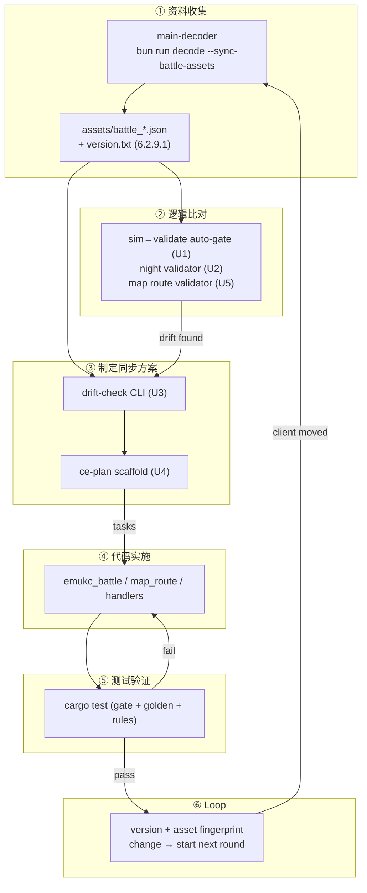
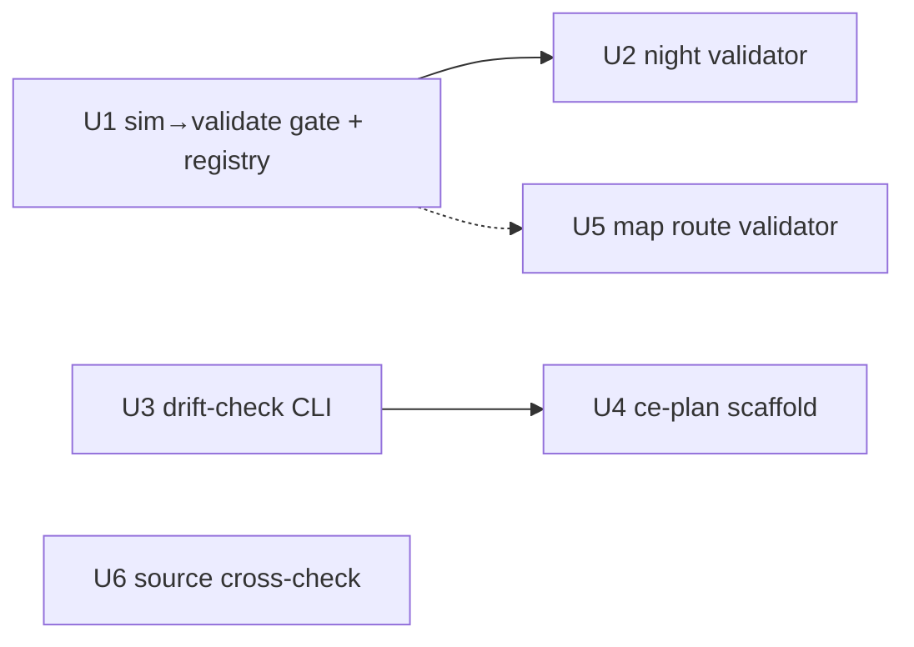

# feat: Battle/Map Client-Sync Loop

## Summary

Establish a closed, repeatable workflow that keeps EmuKC's own battle simulation (`emukc_battle`) and map routing logic **protocol-conformant** with the real client decoded from `main.js`. The six stages — **资料收集 → 逻辑比对 → 制定同步方案 → 代码实施 → 测试验证 → Loop** — already exist as strong individual pieces; this plan closes the gaps that prevent them from operating as a loop. It is a workflow/infrastructure plan, not a re-implementation of the simulation engine.

**Scope-honesty note (from doc review).** The validators this plan wires up check *protocol conformance* — that battle/route payloads have the right fields, shapes, lengths, flag consistency, valid enemy/resource ids, and routing invariants. They do **not** check *behavioral equivalence* (numerical damage/correctness, attack-type trigger correctness, semantic routing thresholds). A sim that is numerically wrong but structurally well-formed passes these gates. Closing the behavioral-equivalence gap (e.g. cross-checking `api_damage` against the sim's own damage crate, or golden transcripts against real captures) is **out of scope** and belongs to a follow-up plan. This plan narrows its claim accordingly: it catches *protocol/structural drift*, not *semantic drift*.

## Problem Frame

EmuKC computes battles and routes itself: a KCSAPI handler calls `state.sortie_battle()`, which flows through `emukc_gameplay` orchestration into `emukc_battle::simulate_day`/`simulate_night`, and routing flows through `map_route::evaluate_route_destination`. The client-side truth lives in `main.js`, which `main-decoder/` (Bun + TypeScript) decodes into tracked battle/route assets under `crates/emukc_bootstrap/assets/`.

A post-evaluation audit found the pieces present but **not closed into a loop**:

- **② Logic comparison never runs automatically.** `validate_day_battle_response` exists in `crates/emukc_bootstrap/src/battle_rules.rs` (1563 lines) but is invoked only from the `battle validate` / `analyze-incident` CLI and one integration test (`crates/emukc_gameplay/tests/sortie_battle.rs:709`) plus its own unit tests. It is **never** in the runtime simulation path, and there is no test that gates *every* scenario's simulation output against the client-derived rules. A protocol-level sim↔client drift (missing field, wrong shape, invalid enemy id) therefore passes silently until a human thinks to run the CLI.
- **Night/midnight battles have no validator.** Only `validate_day_battle_response` / `analyze_day_battle_incident` exist; `api_req_battle_midnight` payloads are unchecked.
- **Map routing has no client-rule comparison.** `map_route.rs` (2197 lines) implements sophisticated routing (LoS formulas, weighted random, topology filtering) over `RouteRule`/`RoutePredicate` types parsed from the wikiwiki catalog, but nothing verifies its selections are consistent with the decoded route-rule topology.
- **No Loop trigger.** `main-decoder/out/version.txt` (currently `6.2.9.1`, produced by `main-decoder/src/pipeline.ts:58`) is **never read by Rust**, and the synced assets carry only a `script_version: String` field (no content fingerprint). Nothing detects that the client moved, so the loop has no entry condition.
- **③ Sync-plan has no structured artifact.** When a drift is found, there is no machine-checkable bridge into the repo's plan governance — drift→decision is ad hoc.
- **① Source robustness is single-threaded.** The client-derived knowledge comes solely from `main.js`; the wikiwiki catalog is the only map source. A single asset parse failure has no second reference to flag it.

The keystone insight: the simulator and router are correct *by construction*; this plan adds the missing teeth (auto-gates, the missing validators, the trigger, and the bridge to governance) so drift becomes a caught, traceable event instead of silent regression.

## Requirements

**Determinism/coverage auto-gates (②→⑤)**

- **R1.** Every scenario preset's `simulate_day`/`simulate_night` output passes `validate_*_battle_response` across a bounded seed set; any `error`-severity finding fails a test, not a human-run CLI. The seed set exercises different *RNG outcomes within the preset's attack-type path*; exercising distinct attack-type variants (cut-in/double-attack/carrier-CI) is equipment-dependent and is called out as a registry-growth task, not a property of seed variation.
- **R2.** A night/midnight battle validator (`validate_night_battle_response`) checks night protocol fields and resource rules, mirroring the day validator's structure.

**Loop trigger (⑥)**

- **R3.** A `drift-check` CLI subcommand detects change in the decoded client — by reading `main-decoder/out/version.txt` into Rust for the first time and by fingerprinting the synced battle/route asset files — and emits a structured report describing what moved since the last known-good state.

**Sync-plan artifact (③)**

- **R4.** The drift report can scaffold a ce-plan plan (`docs/plans/<date>-<verb>-<subject>-plan.md`) so a detected drift becomes a traceable, archivable governance artifact rather than an ad hoc decision.

**Map-route comparison (② for routing)**

- **R5.** Map route selections made by `evaluate_route_destination` are validated for *structural/topological consistency* against the decoded `RouteRule`/`RoutePredicate` types across a fleet-config matrix: reachable cells exist in the decoded topology, and live decisions do not silently fall through on `Unknown`/`SourceUnknown` predicates. This catches **structural corruption**, not **semantic routing drift** (a predicate that is present but has a wrong threshold — e.g. `FleetSize >= 4` vs `>= 5`); semantic drift requires decoding the client's routing logic from `main.js`, which is deferred.

**Source robustness (①)**

- **R6.** A second reference path cross-checks the parsed wikiwiki map catalog against `real_map_start_data` and flags source-level divergence in the comparable surface — cell-number sets and boss-cell identity. (The `real_map_start_data` files carry only `api_id`/`api_no`/`api_color_no`/`api_passed` plus sparse start-cell encounters; they lack routing edges and per-cell enemy fleets, so the cross-check is bounded to what both sources share.) This hardens ① against a single-asset-parse failure.

**Portability**

- **R7.** Codex-gated integration tests follow the repo's existing fail-loud convention (`LazyLock<Codex>` + `.expect("...bootstrap...")`); a missing `.data/codex` emits the bootstrap prerequisite, consistent with `tests/gameplay_tests.rs`.

## Key Technical Decisions

- **KTD1. Comparison is a test-suite gate, not a production runtime check — but a `debug_assert` middle ground stays on the table.** Putting `validate_*` on the release simulation hot path would tax production for no gain. The primary closure of ②→⑤ is a test that runs the sim across presets and asserts the output passes the client-derived rules (matching the seam at `crates/emukc_gameplay/tests/sortie_battle.rs:709`). However, a test gate only covers the *bounded* preset×seed matrix; production inputs outside that set are unvalidated. A lightweight `debug_assert!` at the sim's finalize step (zero cost in release, fires in dev/tests) that re-runs the protocol validator's cheap field-presence checks is a viable extension to cover every battle — left as an explicit follow-up option in Scope Boundaries rather than silently dismissed. Note throughout: these checks are *protocol conformance*, not *behavioral equivalence* (see Summary scope-honesty note).
- **KTD2. The Loop trigger is an on-demand CLI subcommand, not a git hook.** The repo has no CI and a CLI-centric dev culture; the `battle` CLI (`Validate`/`AnalyzeIncident`/`Sim`) is the established extension point. A `DriftCheck` subcommand is opt-in, fits the pattern, and can be invoked by the decoder's `--sync-battle-assets` flow. No per-developer hook setup. (User-confirmed fork.)
- **KTD3. Drift is detected by version + content fingerprint, not version alone.** `version.txt` moving is a strong signal, but a same-version asset content change must also trip the check — and such changes are *expected to be true drift* (a decoder bug fix, an asset correction), not false positives. The check reads `version.txt` into Rust (first consumption) **and** hashes the synced asset files. Two implementation facts shape this: (a) `main-decoder/out/version.txt` is **gitignored** (only `out/battle/*.json` is tracked), so it exists only after `bun run decode` — the check must treat its absence as "run decode first," not as baseline; (b) the last-known-good manifest must be **tracked** (at `crates/emukc_bootstrap/assets/.sync-fingerprint.json`), committed by the `--sync-battle-assets` flow, so drift is detectable across fresh clones — an untracked `.data/` manifest would make every clone see "baseline recorded" instead of real drift. Canonicalization (parse + re-serialize JSON with sorted keys) mitigates decoder-output formatting churn, which is the only false-positive source.
- **KTD4. The night validator reuses the day validator's helpers, not its own machinery.** `push_missing_field` / `read_i64_field` / `check_array_flag_payload` / resource-path builders are field-table-driven. Night is a different field table and different hougeki sources (`api_hougeki3`, `api_night_`) over the same shape — extend, don't fork.
- **KTD5. The map validator catches *structural corruption*, not *semantic routing drift*.** Routing legitimately involves weighted-random and client-chosen branching; a deterministic "expected next cell" assertion would be wrong. The validator asserts invariants the route rules *declare*: every reachable battle cell is in the decoded topology; predicates referenced by rules are all supported (no `RoutePredicate::Unknown`/`SourceUnknown` slipping into a live decision unflagged); fleet-config inputs that a rule's predicate should match do match. This catches missing cells and unsupported predicates, but it is **blind to semantic drift** — a predicate that is present but has a wrong threshold (e.g. `FleetSize >= 4` vs the client's `>= 5`) passes, because the threshold comes from the same wikiwiki source being validated (circular). Semantic routing drift requires decoding the client's routing logic from `main.js`, which is explicitly deferred.
- **KTD6. The sync-plan artifact routes through ce-plan, the repo's existing governance.** CLAUDE.md mandates a `docs/plans/` plan for cross-crate/spec changes. Generating a ce-plan scaffold from the drift report reuses that flow (Summary/Requirements/Implementation Units, captured as a tracked plan file) rather than inventing a parallel tracking system.
- **KTD7. Codex-gated tests fail loud, matching the repo convention — and this is a known divergence from the sibling 001 plan, not a hidden one.** The repo has no skip-with-message pattern; `tests/gameplay_tests.rs` uses `LazyLock<Codex>.expect("...bootstrap first")`, and `crates/emukc_gameplay/tests/sortie_battle.rs` uses `Codex::load_without_cache_source("../../.data/codex")` (note the `../../` prefix — crate-root-relative). This plan's in-process sim tests (which live in `crates/emukc_gameplay/tests/`) follow that fail-loud convention and use the `../../.data/codex` path. The sibling `2026-06-15-001` hardening plan's U3 (cross-process determinism) instead specifies skip-with-message because it requires a *built binary* plus bootstrapped codex — a heavier bar. This is a **real divergence contributors will notice** (`cargo test` panics in one file, skips in another), justified by the binary-build cost of the cross-process test. KTD7 records this openly rather than papering over it; a future shared codex-gating helper could unify both, but that refactor is out of scope here.
- **KTD8. Scenario presets gain an explicit registry.** Today presets are associated functions on `Scenario` plus a hard-coded `match` in `resolve_scenario` (`src/bin/cli/battle.rs`); there is no enumerable list. R1 needs to iterate all presets, so a small registry (name → constructor + map coords) is added and both the CLI and the gate test consume it, keeping the two in sync by construction.

## High-Level Technical Design

The loop has two feedback paths: a **drift path** (② finds a divergence → ③ scaffolds a change → ④ fixes → ⑤ re-validates) and a **trigger path** (⑤ passes → ⑥ checks for a new client version → if moved, restart ①). U1 is the load-bearing first unit: it is the one change that converts the existing pieces from "manual CLI" to "automatic gate."

U1 and U3 are independent and parallelizable; U2 extends U1's test harness; U4 consumes U3's report; U5 reuses U1's registry/matrix shape; U6 is independent and lowest-priority.

---

## Implementation Units

### U1. Scenario registry + sim→validate auto-gate

- **Goal:** Make "does our simulation's output match what the client expects?" an automatic, per-preset test instead of a manual CLI. This is the single change that closes ②→⑤ and makes the loop real.
- **Requirements:** R1, R7.
- **Dependencies:** none.
- **Files:**
  - `crates/emukc_gameplay/src/scenario/mod.rs` — add an enumerable preset registry (name, constructor, map coords) alongside the existing `Scenario::fresh_1_1()` / `leveled_for_mid_boss()` associated functions.
  - `src/bin/cli/battle.rs` — refactor `resolve_scenario` to read from the registry so the CLI and tests share one source of truth.
  - `crates/emukc_gameplay/tests/sim_validation_gate.rs` — new integration test; the gate itself.
- **Approach:** Introduce a `PRESETS` registry (e.g. `&[(&str, fn() -> Scenario, i64, i64)]` or a small `struct Preset { name, build, maparea, mapinfo }`) so both the CLI and the gate iterate the same list. The gate test, for each preset, applies the scenario, runs `sortie_battle` over a small bounded seed set (seeds vary RNG outcomes — hit/miss/damage rolls — *within* the preset's attack-type path; they do **not** change which attack-type variant triggers, since that is equipment-dependent and both current presets use ship 951 with default loadout), serializes each `SortieBattleResponse` to a `serde_json::Value`, and calls `validate_day_battle_response(&codex.manifest, &payload, &assets)`. The test fails on any `error`-severity finding and prints the finding detail (field, kind, message) so the failure is diagnosable. Codex loads via the crate-root convention `Codex::load_without_cache_source("../../.data/codex").expect("...bootstrap first...")` (matching `crates/emukc_gameplay/tests/sortie_battle.rs`, since the test lives in that `tests/` dir — **not** the workspace-root `.data/codex` path used by `tests/gameplay_tests.rs`). Night-battle paths are exercised once U2 lands; until then the gate covers day battles.
- **Execution note:** Add the registry first (CLI + tests consume one list), then the gate test. Mirror the existing seam at `crates/emukc_gameplay/tests/sortie_battle.rs:709`.
- **Patterns to follow:** the sim→validate seam at `crates/emukc_gameplay/tests/sortie_battle.rs:709-726` (`sortie_battle` → `serde_json::Value` → `validate_day_battle_response`); the codex-load + `HasContext` minimal impl in `tests/gameplay_tests.rs` / `src/bin/cli/battle.rs::SimContext`; the deterministic-seed discipline in `tests/gameplay_tests/battle_golden.rs` (`rng::seed` → gameplay → `rng::reseed_from_entropy`).
- **Test scenarios:**
  - **Happy:** each registered preset, day battle, seed in the bounded set → `validate_day_battle_response` returns a report with zero `error` findings; test passes.
  - **Error (gate bites):** inject a deliberately-invalid payload (e.g. mutate `api_ship_ke`/`api_eSlot` post-sim, as `sortie_battle_validation_reports_invalid_enemy_ids` does) → the gate fails with a finding detail naming the field and kind. Proves the gate is not vacuously green.
  - **Edge:** a preset whose battle triggers an enemy-composition random pick → across the seed set the selections differ but every variant still validates (no invalid enemy id leaks).
  - **Integration:** adding a new preset to the registry is automatically picked up by both the CLI (`battle sim`) and the gate test without touching either (registry is the single enumeration).
- **Verification:** `cargo test -p emukc_gameplay --test sim_validation_gate` passes for all registered presets; a deliberately-broken sim (temporary field mutation) turns it red with a clear finding; the CLI's `resolve_scenario` still resolves every registry name.

### U2. Night/midnight battle validator

- **Goal:** Close the night-battle coverage hole — `api_req_battle_midnight` payloads are currently unchecked.
- **Requirements:** R2.
- **Dependencies:** U1 (the gate harness; night paths plug into the same per-preset loop).
- **Files:**
  - `crates/emukc_bootstrap/src/battle_rules.rs` — add `validate_night_battle_response` (+ a night field table and night hougeki sources), reusing the existing helpers; add an `analyze_night_battle_incident` if the resource-path logic diverges for night banners (otherwise reuse).
  - `crates/emukc_bootstrap/src/lib.rs` — re-export the night validator from the prelude.
  - `crates/emukc_gameplay/tests/sim_validation_gate.rs` — extend the gate to cover night battles (run day → night for presets where night is reachable).
- **Approach:** The day validator is field-table-driven over shared helpers (`push_missing_field`, `read_i64_field`, `read_i64_array`, `check_array_flag_payload`, `check_scalar_flag_payload`, `build_ship_resource_path`, `build_slotitem_resource_path`). Night is a different field set (`api_hougeki3`, `api_night_*`, `api_hougeki*.api_si_list`/`api_cl_list` for night cut-ins) and different slot-resource consumers, but the same shape. Extract the shared payload-validation core if the duplication crosses a threshold; otherwise parameterize the existing functions with a night field table. Resource-path building for night battle is verified against `battle_resource_rules.json` / `battle_slot_resource_triggers.json` (already decoded for night modules like `RawNightBattleData`).
- **Patterns to follow:** the day validator's own unit tests (`validate_day_battle_response_*` in `crates/emukc_bootstrap/src/battle_rules.rs`) — same harness, night field table; the incident test `analyze_day_battle_incident_flags_missing_btxt_flat_as_protocol_suspicion`.
- **Test scenarios:**
  - **Happy:** a valid night-battle payload (hand-built or captured) → `validate_night_battle_response` returns zero errors.
  - **Error:** a night payload missing `api_hougeki3.api_at_list`, or with mismatched `api_damage`/`api_df_list` lengths → reports the specific field/shape finding.
  - **Error (resource):** a night cut-in referencing a slot id whose `btxt_*` resource is absent → flagged as a missing-resource finding (mirrors the day `btxt_flat` incident test).
  - **Integration:** the U1 gate's night path runs day→night for a reachable preset and the night packet validates.
- **Verification:** `cargo test -p emukc_bootstrap battle_rules` green including new night cases; `cargo test -p emukc_gameplay --test sim_validation_gate` green on the night path; the night validator catches a deliberately-malformed night payload.

### U3. drift-check CLI subcommand (Loop trigger)

- **Goal:** Give the loop an entry condition — detect that the decoded client moved and report what changed, so a round can start without a human remembering to look.
- **Requirements:** R3, R7.
- **Dependencies:** none (parallelizable with U1/U2).
- **Files:**
  - `src/bin/cli/battle.rs` — add a `DriftCheck` variant to the `Command` enum and an `exec` arm.
  - `src/bin/cli/drift_check.rs` — new module: reads `main-decoder/out/version.txt`, fingerprints the synced battle/route asset files under `crates/emukc_bootstrap/assets/`, loads the persisted last-known-good manifest, diffs, and emits a structured report (markdown to stdout + a JSON artifact).
  - a persisted **tracked** last-known-good fingerprint manifest at `crates/emukc_bootstrap/assets/.sync-fingerprint.json`, updated by the `--sync-battle-assets` flow (see KTD3 — must be tracked so drift is detectable across fresh clones; an untracked `.data/` location would make every clone see "baseline recorded" instead of real drift).
- **Approach:** This is the first Rust consumption of `version.txt` (today produced by `main-decoder/src/pipeline.ts:58`, never read on the Rust side; also note `version.txt` is **gitignored** — only `out/battle/*.json` is tracked — so it exists only after `bun run decode`). The check computes a content hash over the tracked battle/route assets (`battle_protocol_fields.json`, `battle_resource_rules.json`, `battle_module_index.json`, `battle_slot_resource_triggers.json`, `wikiwiki_map_catalog.json`, `public_map_catalog_overlays.json`) plus the `version.txt` value, compares to the persisted tracked manifest, and reports: version changed (old→new), which asset hashes changed, and counts of added/removed/changed protocol fields/resource rules where feasible (reusing `BattleKnowledgeAssets` summaries). Same-version asset content changes are treated as **true drift** (decoder bug fixes / asset corrections), not false positives; JSON is canonicalized (parse + re-serialize with sorted keys) before hashing to suppress decoder-output formatting churn, the only legitimate false-positive source. Exit code reflects drift (non-zero on drift) so it composes with scripts. The subcommand loads codex via the existing `load_codex` helper only if needed for summary enrichment; the fingerprint itself does not require codex.
- **Patterns to follow:** the existing `Command`/`exec` dispatch and `load_codex` in `src/bin/cli/battle.rs`; the asset-loading entry `load_repo_battle_knowledge_assets` (`crates/emukc_bootstrap/src/battle_rules.rs:320`).
- **Test scenarios:**
  - **Happy (no drift):** persisted manifest matches current version + hashes → exit 0, report says "no drift."
  - **Happy (version drift):** bump `version.txt` content → report names old→new version, exit non-zero.
  - **Happy (content drift):** same version but a mutated asset hash → report names the changed asset, exit non-zero.
  - **Edge (first run):** no persisted manifest → treats current state as baseline, reports "baseline recorded," exit 0 (or a distinct code), does not false-alarm.
  - **Edge (missing version.txt):** `main-decoder/out/version.txt` absent → report names the prerequisite (`bun run decode`), does not panic.
- **Verification:** `cargo run -- battle drift-check` reports no-drift on a clean tree; mutating `version.txt` or an asset turns it red with a named change; the persisted manifest round-trips.

### U4. Drift report → ce-plan scaffold

- **Goal:** Make ③ a structured, traceable artifact — a detected drift becomes a ce-plan plan, not a sticky note.
- **Requirements:** R4.
- **Dependencies:** U3 (consumes the drift report).
- **Files:**
  - `src/bin/cli/drift_check.rs` — extend to optionally emit a ce-plan scaffold when drift is found (gated by a `--scaffold` flag so plain `drift-check` stays a pure check).
  - generated artifact lands under `docs/plans/<date>-<verb>-<subject>-plan.md` (e.g. `docs/plans/<date>-sync-battle-protocol-<version>-plan.md`) following the repo's plan convention; a single plan file with Summary/Problem Frame/Requirements/Key Technical Decisions/Implementation Units skeletons.
- **Approach:** Mirror the layout of an existing plan (e.g. `docs/plans/2026-06-15-001-fix-battle-sim-harness-hardening-plan.md`) — Summary with Why/What Changes, Requirements, Key Technical Decisions, Implementation Units chunked against the DB→Model→Gameplay→KCSAPI dev flow. The scaffold's Summary is auto-populated from the drift report (version old→new, changed assets, field/rule deltas); Implementation Units is a templated starting list (update validator field table if protocol fields changed; re-freeze goldens if sim output shifts; etc.). The human reviews/edits the plan before implementing. This is generation of a starting point, not a finished plan.
- **Patterns to follow:** the structure of `docs/plans/2026-06-15-001-*.md` and the ce-plan flow documented in CLAUDE.md (draft a `docs/plans/` plan → implement against its Implementation Units → capture lessons with ce-compound → verify with ce-code-review).
- **Test scenarios:**
  - **Happy:** `drift-check --scaffold` on a drifted tree writes a valid `docs/plans/<date>-sync-battle-protocol-<version>-plan.md` with Summary populated from the report and non-empty Implementation Units; the slug is derived from the drift.
  - **Edge (no drift):** `--scaffold` with no drift → no plan written, reports "nothing to scaffold," exit 0.
  - **Edge (slug collision):** target plan path already exists → appends/does not clobber; reports the collision.
- **Verification:** generated plan is valid markdown a reviewer can open to begin implementation without re-deriving the drift.

### U5. Map route validator

- **Goal:** Bring ② to routing — verify `evaluate_route_destination`'s selections are structurally/topologically consistent with the decoded `RouteRule`/`RoutePredicate` types, catching structural corruption the way U1 catches battle protocol drift. (Per KTD5, this is structural, not semantic, validation.)
- **Requirements:** R5.
- **Dependencies:** none blocking (reuses the *pattern* of U1's enumerable registry for fleet configs, not U1's battle-preset data — U5 defines its own small fleet-config matrix).
- **Files:**
  - `crates/emukc_bootstrap/src/map_route_rules.rs` — new module (mirrors `battle_rules.rs`): loads the decoded map structures, exposes a `validate_route_selection` / invariant-check API over the **public** `RouteRule`/`RoutePredicate` types from `emukc_model`.
  - `crates/emukc_bootstrap/src/lib.rs` — re-export.
  - `crates/emukc_gameplay/src/game/map_route.rs` — add an in-crate `#[cfg(test)] mod map_route_rules_tests` (NOT a `tests/` integration test — see visibility note below).
- **Approach (visibility-aware):** The routing internals this validator must exercise — `evaluate_route_destination`, `route_predicate_matches`, `FleetRouteContext`, `RoutePredicateEval` — are all `pub(crate)` in `map_route.rs`. Integration tests under `tests/` are external to the crate and **cannot** call `pub(crate)` items; only an in-crate `#[cfg(test)]` module can. So the validator's driving test lives inside `src/game/map_route.rs`. Two sub-approaches, picked at implementation:
  - **(A) Trace variant (preferred):** add an `evaluate_route_destination_with_trace(...)` returning a small `RouteEvaluationTrace { selected_cell, rule_evals: Vec<(i64, RoutePredicateEval)>, saw_source_unknown, saw_unsupported }`, since the plain return (`Result<i64, _>` discards the `SourceUnknown`/`Unsupported` information the invariants need. The test drives the trace variant over the fleet-config matrix.
  - **(B) Independent re-evaluation:** the validator in `map_route_rules.rs` re-evaluates predicates itself against the public `RoutePredicate` types (independent of `map_route.rs`'s private matcher) and compares the resulting reachable set to the topology. Avoids touching `map_route.rs` but duplicates predicate-eval logic.
  Per KTD5, the validator asserts topology/predicate invariants: (a) every cell `evaluate_route_destination` can return is present in the decoded stage's `routing_rules`/`next_cells`; (b) no live routing decision silently fell through on `RoutePredicate::Unknown`/`SourceUnknown` without the test being explicitly marked to tolerate it (flag, not fail, where the wiki source is known-incomplete); (c) for fleet configs that a rule's predicate *should* match, evaluation returns `Matched`/`NotMatched` — never `Unsupported` for a predicate the decoded data declares supported. It does **not** assert a single deterministic next-cell, and it does **not** detect semantic threshold drift (KTD5).
- **Patterns to follow:** the existing in-crate routing tests already in `crates/emukc_gameplay/src/game/map_route.rs` (`rules_filtered_by_topology_*`, `select_route_target_*`) — same visibility, same module; `battle_rules.rs`'s validator/summary/finding structure for the `map_route_rules.rs` side.
- **Test scenarios:**
  - **Happy:** for each map stage in a bounded set and each fleet config in the matrix, every reachable return value of `evaluate_route_destination` (or its trace variant) is a valid cell in the decoded topology; no invariant violation.
  - **Error (topology):** synthesize a stage whose `routing_rules` point at a cell absent from `next_cells` → validator flags the topology inconsistency.
  - **Error (unknown predicate):** a live decision that fell through on `SourceUnknown` → flagged (unless the test explicitly tolerates known-incomplete wiki source for that map). Requires the trace variant (sub-approach A) to be observable.
  - **Edge:** weighted-random / `FleetSizeWeightedRandom` nodes → over the seed set, returned cells stay within the declared candidate set.
- **Verification:** `cargo test -p emukc_gameplay map_route` green (in-crate module) and `cargo test -p emukc_bootstrap map_route_rules` green; a deliberately-corrupted route rule turns the test red with a named invariant. The `tests/`-integration path is explicitly NOT used because of the `pub(crate)` visibility constraint.

### U6. Source cross-check (① robustness)

- **Goal:** Harden ① against single-source failure — cross-reference the parsed wikiwiki map catalog against `real_map_start_data` over the surface they actually share, so a source-level divergence is flagged, not silently trusted.
- **Requirements:** R6.
- **Dependencies:** none (parallelizable); lowest priority.
- **Files:**
  - `crates/emukc_bootstrap/src/source_crosscheck.rs` — new module: compares wikiwiki-parsed maps against `real_map_start_data`, emitting a divergence report bounded to the comparable surface.
  - `crates/emukc_bootstrap/src/lib.rs` — re-export.
  - `crates/emukc_bootstrap/src/source_crosscheck.rs` — inline unit tests.
- **Approach (scope-honest):** The wikiwiki catalog carries full routing rules, enemy fleets, and cells. The `real_map_start_data` files carry only `api_id`/`api_no`/`api_color_no`/`api_passed` plus sparse start-cell encounter ids — **no routing edges, no per-cell enemy fleets**. So the cross-check is bounded to what both sources share: **cell-number sets** and **boss-cell identity** per map (and, where present, start-cell encounter ship-id overlap). It reports cells/boss-cell present in one source but not the other. This is a consistency linter over a thin shared surface, not a full structural cross-check — deeper comparison (routing edges, per-cell enemy fleets) would require a second source that carries that data (e.g. decoded `main.js` map structures), which is deferred. v1 covers cell-set + boss-cell consistency for a bounded map set.
- **Patterns to follow:** the `map_pipeline` assembly (`crates/emukc_bootstrap/src/map_pipeline/assemble.rs`) and the wikiwiki parser (`crates/emukc_bootstrap/src/parser/wikiwiki_map/`) — read the same structures, compare rather than rebuild; `crates/emukc_bootstrap/src/real_map_start_asset.rs` for the real-data loader.
- **Test scenarios:**
  - **Happy:** a map where wikiwiki catalog and real start data agree on cell sets and boss cell → zero divergences.
  - **Error:** a map where the wikiwiki catalog declares a cell absent from the real start data (or vice versa) → divergence report names the map and the cell-number delta.
  - **Edge:** a map present in one source but not the other → reported as a source-gap, not a failure.
- **Verification:** `cargo test -p emukc_bootstrap source_crosscheck` green; an injected cell-set gap turns it red with a named divergence.

---

## Acceptance Examples

- **AE1. Auto-gate catches battle *protocol* drift.**
  - **Covers R1.**
  - **Given** any registered scenario preset and a bounded seed.
  - **When** `simulate_day` runs and its serialized output is passed to `validate_day_battle_response`.
  - **Then** zero `error` findings on the real sim; a deliberately-broken payload (missing field / bad shape / invalid enemy id) fails the gate with a named finding. (Protocol conformance only — does not assert numerical correctness; see Summary scope-honesty note.)
- **AE2. Night battle is validated.**
  - **Covers R2.**
  - **Given** a night/midnight battle packet.
  - **When** `validate_night_battle_response` runs.
  - **Then** valid packets pass; malformed night packets are flagged at the specific field/resource.
- **AE3. Drift-check detects client movement.**
  - **Covers R3.**
  - **Given** a changed `version.txt` or a changed synced asset.
  - **When** `battle drift-check` runs.
  - **Then** it reports the change (version old→new and/or changed asset) and exits non-zero on drift.
- **AE4. Drift becomes a ce-plan plan.**
  - **Covers R4.**
  - **Given** a drift report from U3.
  - **When** `drift-check --scaffold` runs.
  - **Then** a populated `docs/plans/<date>-<slug>-plan.md` is written, ready for review.
- **AE5. Map routing *structural* drift is caught.**
  - **Covers R5.**
  - **Given** a map stage and a fleet config.
  - **When** `evaluate_route_destination` runs and its output (or trace) is checked against the decoded route-rule topology.
  - **Then** a topology or supported-predicate invariant violation is flagged. (Structural corruption only — does not detect semantic threshold drift; see KTD5.)
- **AE6. Source divergence is visible.**
  - **Covers R6.**
  - **Given** a wikiwiki-parsed map and the real map start data.
  - **When** the source cross-check runs.
  - **Then** a cell-number-set or boss-cell divergence is reported (the surface both sources share).

## Scope Boundaries

### Deferred to Follow-Up Work

- Decoding the client's routing logic directly from `main.js` (not just the wikiwiki catalog). v1 validates against the parsed catalog; a main.js route-logic decoder is a larger decoder extension and is out of scope here. (This is also why U5/KTD5 catches only structural, not semantic, routing drift.)
- **Behavioral-equivalence validation** — checking that the sim's *numerical* output (damage, hit/miss, engagement modifiers, attack-type trigger correctness) matches the client, not just that the payload *shape* conforms. The validators wired up here are protocol-conformance checks; behavioral equivalence (cross-checking `api_damage` against the sim's own damage crate, or golden transcripts against real captures) is a separate, larger plan.
- **`debug_assert` coverage in the simulation finalize step.** KTD1 notes this as a viable extension to cover every battle (not just the bounded test matrix); left out of v1 to keep U1 focused on the test gate, recorded here as a deliberate follow-up.
- Extending the cross-process determinism test and the second golden (`leveled_for_mid_boss`) — those belong to the sibling `2026-06-15-001` hardening plan; this plan references them but does not duplicate them.
- A unified codex-gating helper shared across all test layers (KTD7 records the fail-loud-vs-skip divergence with the sibling plan; extraction is a later refactor, not this plan).
- Deeper `saw_cutin` / night-CI sub-type detection widening and the `--find` predicate registry refactor (carried from the 001 and harness plans).
- Full predicate-parity comparison in the map validator (v1 covers topology + supported-predicate invariants; full parity is deferred).

### Outside this plan's identity

- Rewriting `emukc_battle` or `map_route.rs`. Both are correct by construction; this plan adds gates around them.
- Rebuilding `main-decoder`. It already extracts the needed assets; this plan consumes them (and, for the first time, reads `version.txt`).
- Browser/client rendering and resource-loading (carried from origin/harness plans).
- CI setup for the project — out of scope; the loop trigger is a CLI subcommand precisely because there is no CI.

## Risks & Dependencies

- **Auto-gate false-positives could block development.** A validator that flags valid sim output as an error would make the gate a nuisance. Mitigation: the gate ships green against the current sim (verified by U1's happy path); error-severity findings are the only failures, warnings are reported but non-blocking; the bounded seed set is curated, not exhaustive.
- **Night validator field-table accuracy.** The night field table must match what `main.js` actually emits; a wrong table produces spurious findings or misses real ones. Mitigation: derive the table from `battle_protocol_fields.json` (decoded from `RawNightBattleData`) rather than hand-transcription; the decoder already tags night modules.
- **drift-check fingerprint fragility.** Same-version asset content changes are *true drift* (decoder bug fixes / asset corrections), not false positives; the only false-positive source is decoder-output formatting churn (key ordering, whitespace). Mitigation: canonicalize JSON (parse + re-serialize with sorted keys) before hashing, and document that canonicalization. Note `version.txt` is gitignored, so a fresh clone without `bun run decode` cannot run the check — it reports the prerequisite rather than false-positiving.
- **Map validator over-asserting / under-detecting.** Asserting deterministic routes where the game uses weighted random would be wrong; conversely, the validator is blind to semantic threshold drift. Mitigation: KTD5 — assert topology/predicate invariants, not single outcomes and not thresholds; weighted-random nodes are checked against their declared candidate set; the semantic-drift blind spot is documented, not hidden.
- **Codex dependency blocks portability.** U1/U5 tests need `.data/codex`. Mitigation: R7/KTD7 — fail loud with the bootstrap hint, matching the repo convention; do not silently skip.
- **Scaffold quality.** An auto-generated Implementation Units section could mislead if the drift interpretation is wrong. Mitigation: the scaffold is a starting point for a human reviewer, explicitly framed as such; the plan is reviewed before implementation.
- **Sibling-plan coordination.** This plan's KTD7 (fail-loud) and the 001 plan's R6 (skip-with-message for the cross-process test) differ by intent, not contradiction. Implementers should keep both consistent as described in KTD7.

## Sources / Research

- Session evaluation: "KanColle Battle/Map 系统研究与工作流评估" (2026-06-15) — mapped the six stages to code and identified gaps G1–G6 (this plan's R1–R7).
- `crates/emukc_bootstrap/src/battle_rules.rs` — `validate_day_battle_response` / `analyze_day_battle_incident` (day-only, CLI-only, never on the runtime path); the helper layer U2 reuses.
- `crates/emukc_gameplay/tests/sortie_battle.rs:709-726` — the existing sim→validate seam U1 generalizes.
- `crates/emukc_gameplay/src/scenario/mod.rs` — preset constructors; the missing registry U1 adds.
- `src/bin/cli/battle.rs` — `Command`/`exec` dispatch, `resolve_scenario`, `SimContext`, `load_codex`; the extension point for U3.
- `main-decoder/src/pipeline.ts:58` — `version.txt` production (first Rust consumption in U3).
- `crates/emukc_model/src/codex/map/types.rs:247-261` — `RouteRule` / `RoutePredicate` types U5 validates against.
- `crates/emukc_gameplay/src/game/map_route.rs:150-280` — `evaluate_route_destination`, the router U5 exercises.
- `crates/emukc_bootstrap/src/map_pipeline/` and `parser/wikiwiki_map/` — the map data flow U6 cross-checks.
- `docs/plans/2026-06-15-001-fix-battle-sim-harness-hardening-plan.md` — the plan-layout template U4 scaffolds into (ce-plan governance: draft a plan → implement → capture → review).
- `docs/plans/2026-06-15-001-fix-battle-sim-harness-hardening-plan.md` — sibling plan; KTD7 coordinates their codex-gating conventions.
