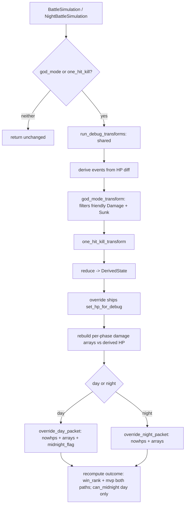

# fix: Resolve plan-010 debug-overlay audit findings

## Summary

A code-review audit of the plan-010 "event-sourced battle" commits (`74e6628..bb8c33d`) surfaced two validated debug-correctness defects plus a cluster of consistency, dead-code, and coverage gaps in the post-simulation debug overlay (`crates/emukc_battle/src/debug_overlay.rs`). This plan fixes all of them: it makes `god_mode` actually revive a friendly that sank in simulation, makes `one_hit_kill` leave a consistent battle outcome (no phantom night battle), rebuilds the per-phase packet damage arrays so the client animation matches the overridden HP, removes the event infrastructure shipped ahead of its (deferred) owned-pass consumer, de-duplicates the day/night overlay, and closes the night-path and end-to-end test gaps. The non-debug simulation path and the golden transcript are untouched throughout. Capturing the bridge-vs-owned-pass decision into `docs/solutions/` via `/ce-compound` is sequenced as the final step, after all code fixes are landed and verified.

---

## Problem Frame

The plan-010 implementation reimplemented `god_mode` / `one_hit_kill` as a post-simulation "bridge" (`debug_overlay.rs`): after the normal `&mut` simulation runs, it derives a coarse event log from per-ship HP diffs (`entry_hp - hp()`), applies the event transforms, reduces to a derived HP set, then overrides the packet's `nowhps` and the outcome's `win_rank`/`mvp`. Because the derivation is coarse and the override is partial, three correctness/consistency holes exist, and the surrounding event scaffolding (built for the deferred owned-pass rewrite) is currently dead.

Validated defects (independent validators confirmed both):

- **god_mode does not revive a sunk friendly.** `derive_events_from_ships` emits both `Damage{Friendly}` and `Sunk{Friendly}` for a friendly with `is_sunk()`. `god_mode_transform` filters only `Damage`/`ProportionalDamage`, so the `Sunk{Friendly}` survives into the reducer and forces HP=0. Reachable: practice battles disable sinking protection entirely (`is_sortie=false`), and a sortie non-flagship ship that entered the node at taiha (`entry_hp*4 <= maxhp`) is unprotected — both can sink (`crates/emukc_battle/src/types/runtime.rs:85-123`).
- **one_hit_kill leaves stale midnight state.** `override_outcome` recomputes `win_rank`/`mvp` only; `override_day_packet` rewrites `nowhps` only. After all enemies are force-sunk, `outcome.can_midnight` and `packet.midnight_flag` stay at their pre-transform values, so the night-battle gate at `crates/emukc_gameplay/src/game/sortie/mod.rs:758` (`if !pending.outcome.can_midnight`) passes and a night battle is offered/entered against an already-cleared enemy fleet.

Consistency / hygiene gaps:

- **Per-phase damage arrays diverge from the overridden HP.** The overlay rewrites only `friendly_nowhps`/`enemy_nowhps`; the per-attack damage arrays (`kouku`, `opening_*`, `hougeki1-3`, `raigeki`, night `hougeki`) keep their real-simulation values. The client reconstructs HP as *initial HP minus cumulative per-phase damage* (`docs/solutions/architecture-patterns/battle-damage-foundation.md`), so the animated HP contradicts the final `nowhps`.
- **Dead event infrastructure.** The bridge only ever emits `Damage` + `Sunk`. The `AirCombat`/`TorpedoSalvo`/`ShellingExchange`/`Targeted`/`PhaseStart`/`PhaseEnd` variants, the `targeted_enemy_indices` helper, and the reducer's `Targeted` arm + `DerivedState.damage_dealt` (which `or_insert(0)` and never accumulates) have no non-test producer or consumer. `calculate_mvp` reads `BattleRuntimeShip.damage_dealt`, not `DerivedState.damage_dealt`.
- **Duplication + coverage gaps.** `apply_day_debug` and `apply_night_debug` are near-identical. `apply_night_debug` has zero direct tests; there are no end-to-end gameplay tests with debug flags active.

---

## Requirements

| R-ID | Requirement | Units |
|------|-------------|-------|
| R1 | `god_mode` restores any friendly that sank during simulation to its entry HP (no friendly loss under god_mode), in sortie and practice. | U1 |
| R2 | After `one_hit_kill`, `outcome.can_midnight` and `packet.midnight_flag` reflect the post-transform fleet state; no night battle is offered against an all-dead enemy fleet. | U3 |
| R3 | The packet's per-phase damage arrays are consistent with the overridden `nowhps` under each debug flag (client animation lands on the same final HP), for day and night. | U4, U5 |
| R4 | Event types, helpers, and reducer state that have no producer/consumer in the bridge are removed (re-added when the owned-pass rewrite — origin plan-010 U5/U6 — lands). | U6 |
| R5 | The derive → transform → reduce → rebuild → override pipeline exists in one place, shared by day and night. | U2 |
| R6 | `apply_night_debug` and the end-to-end gameplay debug paths have test coverage, including `win_rank`/`can_midnight` assertions. | U7 |
| R7 | The bridge-vs-owned-pass decision and these fixes are captured into `docs/solutions/`; plan-010 status reconciled. | U8 |
| R8 | The non-debug path stays byte-identical — the golden transcript and all existing `emukc_battle` tests remain green. | All (constraint) |

Origin acceptance examples carried forward (see origin: `docs/plans/2026-06-22-010-refactor-event-sourced-battle-plan.md`): god_mode → friendly HP unchanged; one_hit_kill → all enemies dead; both disabled → golden transcript match.

---

## Key Technical Decisions

### KTD-1: Keep the bridge; do not start the owned-pass rewrite

The user confirmed owned-pass (origin U5/U6: `FleetState`, phase-emitted events, `packet_builder.rs`) is not on the near-term roadmap. All fixes target the existing bridge. The dead event scaffolding is therefore deleted now (KTD-4), not preserved.

### KTD-2: `can_midnight` recompute by conjunction, not re-derivation

The overlay has no `battle_type` (it is not on `BattleSimulation`), but the original `can_midnight` already encodes the `matches!(battle_type, Normal | AirBattle)` gate (`crates/emukc_battle/src/state.rs:179`). Debug transforms can only *reduce* the alive set on the gating side (one_hit_kill kills enemies; god_mode only revives friendlies). So the correct, overlay-local fix is conjunction:

```
new_can_midnight = sim.outcome.can_midnight
    && any_alive(&sim.friendly)   // crate::targeting::any_alive (pub)
    && any_alive(&sim.enemy);
```

then write both `outcome.can_midnight` and `packet.midnight_flag = i64::from(new_can_midnight)`. Day-only — `NightBattlePacket` has no `midnight_flag` and `finalize_night` already sets `can_midnight=false`.

### KTD-3: god_mode rebuilds arrays by zeroing friendly-targeted damage; one_hit_kill is the harder case

For **god_mode**, friendly cumulative damage must be 0, so every "friendly takes damage" field is zeroed in place across all arrays: `kouku.api_stage3.api_fdam`; `opening_attack.api_fdam`; `opening_taisen`/`hougeki1-3` `api_damage[i]` where `api_at_eflag[i]==1` (enemy attacking → friendly defender); `raigeki.api_fdam`; night `hougeki.api_damage[i]` where `api_at_eflag[i]==1`. This preserves the real attack animation while making friendly cumulative damage zero — fully consistent and high-fidelity.

For **one_hit_kill**, every enemy must reach 0. Enemies that were hit have cumulative damage `< entry_hp`; untargeted enemies (synthesized `Sunk`) have no array entry at all. The recommended approach is a **synthesized finishing volley**: keep the real `hougeki1`/`hougeki2` animation, and populate `hougeki3` (which `finalize_day` leaves `None` for single-fleet day battles) with one finishing attack per still-alive enemy dealing exactly its remaining HP. This keeps earlier phases truthful and lands every enemy at 0. The exact mechanism (synthetic `hougeki3` vs. amplifying the last existing enemy-directed attack, and the night equivalent which has only `hougeki`) is an execution-time decision validated against client behavior — see U5.

### KTD-4: Delete dead event infrastructure now, document re-introduction in owned-pass

Remove `DerivedState.damage_dealt` + the reducer `Targeted` arm, the `Targeted`/`PhaseStart`/`PhaseEnd`/`AirCombat`/`TorpedoSalvo`/`ShellingExchange` variants, and `targeted_enemy_indices`. Grep for references first. The owned-pass plan (origin U5) should re-introduce the vocabulary it actually consumes; note that explicitly in the captured learning (U8).

### KTD-5: Sequence learning capture last

Per the user's directive, `/ce-compound` (U8) runs only after U1-U7 are implemented and verified, so the captured solution reflects the final shape.

---

## High-Level Technical Design

The debug overlay after this plan — one shared pipeline, day/night differing only in the packet-rewrite adapter. Authoritative for the target structure; prose governs on any disagreement.



Changes vs. today: god_mode_transform now also drops `Sunk{Friendly}` (U1); a single `run_debug_transforms` replaces the duplicated bodies (U2); array rebuild (E) is new (U4/U5); `can_midnight` enters the outcome recompute (U3).

---

## Implementation Units

### U1. Fix god_mode failing to revive a sunk friendly

**Goal:** `god_mode` restores friendlies that sank during simulation to full (entry) HP.

**Requirements:** R1, R8

**Dependencies:** none

**Files:**

- `crates/emukc_battle/src/transforms.rs` — extend `god_mode_transform` filter
- `crates/emukc_battle/src/transforms.rs` — unit tests (in-file `#[cfg(test)]`)
- `crates/emukc_battle/src/debug_overlay.rs` — integration test for the revive path

**Approach:** Add a `BattleEvent::Sunk { target: ShipRef(Side::Friendly, _) }` arm to `god_mode_transform`'s filter so friendly `Sunk` events are dropped alongside friendly `Damage`/`ProportionalDamage`. With no friendly events surviving, the reducer keeps the friendly at its `InitialState` HP (= `entry_hp`), and `override_ships` writes that back; `is_sunk()` (derived from `current_hp`) then reports alive. Enemy `Sunk` events are untouched.

**Patterns to follow:** existing filter shape in `god_mode_transform` (transforms.rs:21-37).

**Test scenarios:**

- god_mode filters a `Sunk{Friendly}` event while preserving `Sunk{Enemy}` (transform-level).
- Covers AE (god_mode → friendly HP unchanged). `apply_day_debug` with a practice friendly that sank in simulation (`hp=0`, `entry_hp=30`, `is_sortie=false`) + god_mode → `friendly[0].hp()==30`, `packet.friendly_nowhps[0]==30`.
- `apply_day_debug` with a sortie non-flagship taiha-at-entry friendly that sank + god_mode → revived to entry HP.
- god_mode OFF + sunk friendly → stays sunk (no behavior change).
- one_hit_kill composed with god_mode still sinks all enemies while reviving the sunk friendly.

**Verification:** `cargo test -p emukc_battle transforms` and the new overlay test green; a sunk friendly is revived under god_mode.

---

### U2. Extract the shared debug-transform pipeline

**Goal:** Collapse the duplicated `apply_day_debug`/`apply_night_debug` bodies into one shared function so the U3/U4/U5 fixes are written once and apply to both the day and night paths automatically — that single-source-of-fix payoff is why this two-consumer abstraction earns its keep.

**Requirements:** R5, R8

**Dependencies:** none (independent of U1; both precede U3/U4/U5)

**Files:**

- `crates/emukc_battle/src/debug_overlay.rs` — add `run_debug_transforms(...)`, rewrite both entry points as thin wrappers

**Approach:** Extract `fn run_debug_transforms(friendly: &[BattleRuntimeShip], enemy: &[BattleRuntimeShip], god_mode: bool, one_hit_kill: bool) -> (InitialState, DerivedState)` covering the shared derive → (god_mode) → (one_hit_kill) → reduce sequence. `apply_day_debug`/`apply_night_debug` keep their early return when both flags are false, call the shared function, then dispatch to their packet-specific override (`override_day_packet` vs `override_night_packet`), `override_ships`, and `override_outcome`. No behavior change in this unit — pure refactor.

**Patterns to follow:** existing `apply_day_debug` body (debug_overlay.rs:88-115).

**Test scenarios:**

- Existing `debug_overlay` day tests still pass unchanged (no behavioral delta).
- Test expectation: behavior-preserving refactor — coverage comes from the existing day tests plus U7's new night tests.

**Verification:** `cargo test -p emukc_battle` green; `apply_day_debug`/`apply_night_debug` bodies share one pipeline.

---

### U3. Recompute can_midnight / midnight_flag after debug transforms

**Goal:** one_hit_kill (or any transform that clears the enemy fleet) leaves a consistent midnight state; no phantom night battle.

**Requirements:** R2, R8

**Dependencies:** U2

**Files:**

- `crates/emukc_battle/src/debug_overlay.rs` — extend `override_outcome` (or the day override path) and `override_day_packet`
- `crates/emukc_battle/src/debug_overlay.rs` — unit tests

**Approach:** Apply KTD-2 in the day overlay only: `new_can_midnight = sim.outcome.can_midnight && any_alive(&sim.friendly) && any_alive(&sim.enemy)`, then set `sim.outcome.can_midnight = new_can_midnight` and `sim.packet.midnight_flag = i64::from(new_can_midnight)`. Use `crate::targeting::any_alive`. Leave the night path unchanged (no `midnight_flag`; `finalize_night` already sets `can_midnight=false`).

**Patterns to follow:** `finalize_day` can_midnight derivation (state.rs:179, 194, 212).

**Test scenarios:**

- one_hit_kill on a Normal day battle that originally had `can_midnight=true`/`midnight_flag=1` → both become `false`/`0`.
- god_mode-only (enemies still alive) → `can_midnight`/`midnight_flag` unchanged.
- Neither flag set → unchanged (early return).
- Regression guard: a one_hit_kill day session fed to the gameplay night gate (`sortie/mod.rs:758`) is rejected — covered end-to-end in U7.

**Verification:** `cargo test -p emukc_battle` green; midnight state matches the post-transform fleet.

---

### U4. Rebuild god_mode packet damage arrays

**Goal:** Under god_mode, the client's per-phase HP animation lands on the overridden full HP (friendly cumulative damage = 0), day and night.

**Requirements:** R3, R8

**Dependencies:** U2

**Files:**

- `crates/emukc_battle/src/debug_overlay.rs` — array-rewrite step in the shared pipeline + day/night packet adapters
- `crates/emukc_battle/src/debug_overlay.rs` — unit tests

**Approach:** When god_mode is active, zero every friendly-directed damage field (KTD-3): `kouku.api_stage3.api_fdam`; `opening_attack.api_fdam`; `raigeki.api_fdam`; for each `BattleHougeki` in `opening_taisen`/`hougeki1`/`hougeki2`/`hougeki3` and the night `BattleNightHougeki`, zero the `api_damage[i]` entry where `api_at_eflag[i]==1` (enemy attacking → friendly defender). Note `api_damage[i]` is itself a `Vec<i64>` (per-hit damages for that attack, e.g. a 2-hit night cut-in), so zero it elementwise / replace with a same-length zero vec to preserve the parallel-array length invariant against `api_df_list[i]`. Operate on `Option` fields defensively (skip `None`). Keep enemy-directed damage intact. Run after `override_day_packet`/`override_night_packet` set `nowhps`.

**Patterns to follow:** packet field shapes in `crates/emukc_battle/src/types/packet.rs` (`api_at_eflag`/`api_df_list`/`api_damage` parallel arrays; `api_fdam`/`api_edam`); the cumulative-damage invariant in `docs/solutions/architecture-patterns/battle-damage-foundation.md`.

**Test scenarios:**

- god_mode day battle where a friendly took shelling + torpedo damage → all friendly-directed `api_damage`/`api_fdam` entries are 0, and `sum(friendly damage)==0` matches `friendly_nowhps==entry_hp`.
- Enemy-directed damage entries (`api_edam`, friendly-attacking `api_damage[i]` with `api_at_eflag[i]==0`) are unchanged.
- god_mode night battle (`apply_night_debug`) → night `hougeki` friendly-directed `api_damage` zeroed.
- `None` phase arrays (e.g., no kouku) are skipped without panic.

**Verification:** `cargo test -p emukc_battle` green; for a god_mode packet, initial-HP minus cumulative per-phase friendly damage equals `friendly_nowhps`.

---

### U5. Rebuild one_hit_kill packet damage arrays

**Goal:** Under one_hit_kill, the client animation drives every enemy to 0 HP consistently with the overridden `enemy_nowhps`, including enemies never targeted in simulation.

**Requirements:** R3, R8

**Dependencies:** U2 (U4 and U5 rewrite independent sides of the packet — friendly-zeroing vs enemy-finishing — so they share no helper and parallelize after U2; U5 does not consume U4)

**Files:**

- `crates/emukc_battle/src/debug_overlay.rs` — finishing-volley synthesis for day and night + tests

**Approach:** Apply KTD-3's one_hit_kill half. For each enemy still alive after the real phases, ensure cumulative enemy-directed damage reaches its remaining HP. Recommended default: synthesize a finishing shelling round — populate day `hougeki3` (left `None` by `finalize_day`) and the night `hougeki` tail with one attack per still-alive enemy dealing exactly its remaining HP, maintaining the parallel-array invariants of `BattleHougeki`/`BattleNightHougeki` (`api_at_eflag`/`api_at_list`/`api_df_list`/`api_si_list`/`api_cl_list`/`api_damage` same length). Attacker attribution (a synthesized attack needs a live `api_at_list` index and that ship's `api_si_list` display IDs): attribute every finishing attack to the first still-alive friendly — flagship/index 0, which sinking protection keeps alive in a sortie; for practice or the all-friendlies-sank edge, define the fallback explicitly (attribute to the last alive friendly, or skip the finishing round and accept `enemy_nowhps==0` without a matching animation). The synthesize-vs-amplify choice is an execution-time decision, but note the asymmetry: **untargeted enemies have no existing attack to amplify, so the synthesized-row mechanism is mandatory for them — the "amplify last attack" fallback covers only already-hit enemies.**

**Execution note:** Validate the chosen array shape against an actual KC client battle render before finalizing; this is the highest-risk unit for client-compat. Check whether a synthesized `hougeki3` also requires flipping `hourai_flag[2]=1` (and the night equivalent) for the client to render the injected round — `finalize_day` derives `hourai_flag` independently of the synthetic round.

**Test scenarios:**

- one_hit_kill where some enemies were hit and some never targeted → every enemy's cumulative enemy-directed damage ≥ its entry HP, final `enemy_nowhps` all 0.
- Parallel-array lengths stay consistent in any synthesized/amended `BattleHougeki`/`BattleNightHougeki` (no index-out-of-range on the client contract).
- one_hit_kill night battle drives all enemies to 0 via the night `hougeki`.
- one_hit_kill composed with god_mode: friendly arrays zeroed (U4) and enemy arrays lethal in the same packet.
- Covers AE (one_hit_kill → all enemies dead): packet `enemy_nowhps` all 0 and arrays consistent.

**Verification:** `cargo test -p emukc_battle` green; initial enemy HP minus cumulative enemy damage equals 0 for every enemy; manual client render sanity-checked.

---

### U6. Delete dead reducer state and unused event vocabulary

**Goal:** Remove event infrastructure with no producer/consumer in the bridge.

**Requirements:** R4, R8

**Dependencies:** none

**Files:**

- `crates/emukc_battle/src/reducer.rs` — delete `DerivedState.damage_dealt` field, its construction, and the `Targeted` match arm
- `crates/emukc_battle/src/event.rs` — delete `Targeted`, `PhaseStart`, `PhaseEnd`, `AirCombat`, `TorpedoSalvo`, `ShellingExchange` variants and `targeted_enemy_indices` (+ their tests)
- `crates/emukc_battle/src/lib.rs` — drop any now-unused re-exports

**Approach:** Grep the workspace for each symbol before deletion to confirm no non-test producer/consumer (`rg "damage_dealt|Targeted|PhaseStart|AirCombat|TorpedoSalvo|ShellingExchange|targeted_enemy_indices"`). Treat a grep that returns only test-file hits as dead — delete the symbol and those tests too. (`targeted_enemy_indices` is illustrative: its doc-comment claims it is "used by the one_hit_kill transform," but `one_hit_kill_transform` inlines its own `BTreeSet` and never calls it, so only its two event.rs tests reference it.) Confirm `calculate_mvp` (outcome.rs:9) reads `BattleRuntimeShip.damage_dealt`, not `DerivedState.damage_dealt`. Remove the variants; the transforms' catch-all `_ => result.push(event)` and the reducer's `_ => {}` keep compiling. Keep `Damage`, `ProportionalDamage`, `Sunk`, `ShipRef`, `Side`, `Phase`, `EventLog`.

**Execution note:** Characterization-light — rely on the compiler to surface any missed reference; a clean `cargo build` plus the grep is the safety net.

**Test scenarios:**

- Test expectation: deletion only — `cargo build -p emukc_battle` compiles, `cargo clippy --workspace -- -W warnings` clean (no unused-item or dead-code regressions), existing reducer tests for `Damage`/`ProportionalDamage`/`Sunk` still pass.

**Verification:** crate builds and clippy is clean with the symbols removed; no behavioral test references them.

---

### U7. Add night-path and end-to-end debug test coverage

**Goal:** Cover the previously untested `apply_night_debug` path and the gameplay-level debug flows, with outcome assertions.

**Requirements:** R6, R8

**Dependencies:** U1, U3, U4, U5

**Files:**

- `crates/emukc_battle/src/debug_overlay.rs` — `apply_night_debug` direct tests + `win_rank` assertions
- `crates/emukc_gameplay/src/game/sortie_tests.rs` — end-to-end sortie debug tests
- `crates/emukc_gameplay/src/game/battle/sortie/orchestrate.rs` (test module) or the gameplay integration test path — night-gate rejection after one_hit_kill

**Approach:** Build a `NightBattleSimulation` fixture (mirroring the existing day `BattleSimulation` test helper) and add god_mode / one_hit_kill night assertions. Add `win_rank` assertions to the existing day tests (`one_hit_kill_sinks_all_enemies` → S; `both_flags_compose` → recomputed from overridden HP). Add gameplay-level tests driving a sortie with `codex.game_cfg.god_mode` / `one_hit_kill` set, asserting the plan-010 U7 scenarios end to end, including that a one_hit_kill day session is rejected by the night gate (`sortie/mod.rs:758`).

**Patterns to follow:** existing `debug_overlay` day tests (debug_overlay.rs:183-349); gameplay test setup in `crates/emukc_gameplay/src/game/sortie_tests.rs`.

**Test scenarios:**

- `apply_night_debug` god_mode → friendly `nowhps` restored; one_hit_kill → enemy `nowhps` all 0.
- `win_rank` recomputed correctly after god_mode (no friendly loss → not downgraded) and one_hit_kill (all enemies sunk, no friendly loss → S).
- End-to-end sortie with god_mode → friendly HP unchanged in the API response.
- End-to-end sortie with one_hit_kill → all enemies dead AND the subsequent night-battle request is rejected (can_midnight gate at `sortie/mod.rs:758`).
- End-to-end practice with one_hit_kill → the practice night gate (`practice/orchestrate.rs:193`, also reading `can_midnight`) likewise rejects the night request, since the same `apply_day_debug` fix feeds both gates.
- Both flags disabled → golden transcript still matches (determinism guard).

**Verification:** `cargo test -p emukc_battle` and `cargo test -p emukc_gameplay` green; night path and end-to-end debug flows are covered.

---

### U8. Capture learnings and reconcile plan-010

**Goal:** Record the bridge-vs-owned-pass decision and these fixes as institutional knowledge; reconcile plan-010 status. **Runs only after U1-U7 are implemented and verified.**

**Requirements:** R7

**Dependencies:** U1, U2, U3, U4, U5, U6, U7 (all code units complete and green)

**Files:**

- `docs/solutions/architecture-patterns/` — new solution doc (e.g., `debug-overlay-bridge.md`) via `/ce-compound`
- `docs/plans/2026-06-22-010-refactor-event-sourced-battle-plan.md` — status reconciliation note

**Approach:** Run `/ce-compound` to capture: why the bridge was chosen over owned-pass, the god_mode/`Sunk` interaction, the `can_midnight` conjunction rule (KTD-2), the array-rebuild consistency requirement and its tie to `battle-damage-foundation.md`, and the fact that the rich event vocabulary was deleted and should be re-introduced by the owned-pass rewrite (origin plan-010 U5/U6) when it actually consumes it. Update plan-010's status to reflect that its owned-pass units (origin plan-010 U2: `FleetState`, U5: phase event emitters, U6: packet builder) remain deferred and the debug behavior was delivered via the bridge.

**Test scenarios:** Test expectation: none — documentation/process unit.

**Verification:** A solution doc exists under `docs/solutions/architecture-patterns/`; plan-010 status note added.

---

## Scope Boundaries

### In scope

- All eight audit findings against the plan-010 debug overlay (god_mode revive, midnight consistency, packet-array rebuild for both flags, dead-code removal, overlay dedup, night/e2e tests, learning capture).

### Deferred for later (owned-pass, origin-defined)

- The owned-pass `FleetState` rewrite (origin U2/U5/U6: phase-emitted events, `packet_builder.rs`). Stays deferred per KTD-1; the deleted event vocabulary (U6) is re-introduced there when consumed.

### Deferred to Follow-Up Work

- `derive_events_from_ships` tagging every `Damage` with `Phase::Shelling1` (lossy phase attribution) — harmless today; revisit only if a future transform branches on phase.
- `reducer.rs` `Vec<Vec<i64>>`-by-side-index style cleanup — cosmetic.

### Out of scope

- Any change to the non-debug simulation path, RNG draw order, or the golden transcript.
- A `battle sim --god-mode/--one-hit-kill` CLI toggle and event-log dump (agent-native ergonomics gap noted in the audit) — separate enhancement, not a correctness fix.

---

## Risks & Dependencies

| Risk | Likelihood | Impact | Mitigation |
|------|-----------|--------|------------|
| one_hit_kill array rebuild (U5) produces a client-incompatible packet shape (synthetic `hougeki3`) | Medium | Medium | U5 execution note: validate against a real client render; fallback to amplifying the last enemy-directed attack |
| A fix accidentally perturbs the non-debug path / golden transcript | Low | Critical | Overlay early-returns when both flags are false; run `cargo test -p emukc_battle` incl. `golden_transcript.rs` after each unit (R8) |
| U6 deletion removes a symbol with a missed consumer | Low | Low | Grep before deleting; rely on the compiler + clippy `-W warnings` |
| Combined-fleet index assumptions | Low | Low | Battle crate is single-fleet only (confirmed in audit); not exercised |

Dependency ordering: U1, U2, and U6 are independent; U2 precedes U3/U4/U5; U4 and U5 rewrite independent sides of the packet (friendly vs enemy) and parallelize after U2 (no shared helper); U7 depends on U1/U3/U4/U5; U8 depends on all code units and runs last.

---

## Sources & Research

- Audit run artifacts: `/tmp/compound-engineering/ce-code-review/20260623-192455-battle/` (findings.json, per-reviewer JSON) — origin of R1-R7.
- `docs/solutions/architecture-patterns/battle-damage-foundation.md` — client reconstructs HP from cumulative per-phase damage; the invariant U4/U5 must satisfy.
- `docs/solutions/architecture-patterns/sortie.md`, `night-battle-sinking-protection.md`, `rng-facade.md` — effective-damage reporting, sinking-protection reachability, determinism contract.
- `crates/emukc_battle/src/types/runtime.rs:85-123` (sinking protection / reachability of R1), `crates/emukc_battle/src/state.rs:176-213` (can_midnight derivation for KTD-2), `crates/emukc_battle/src/outcome.rs` (win_rank/mvp source for KTD-4), `crates/emukc_battle/src/types/packet.rs` (array shapes for U4/U5).
