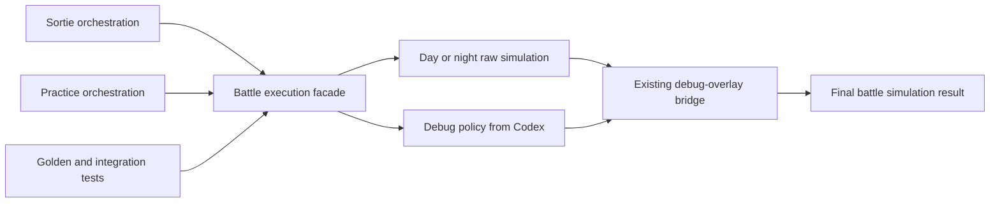
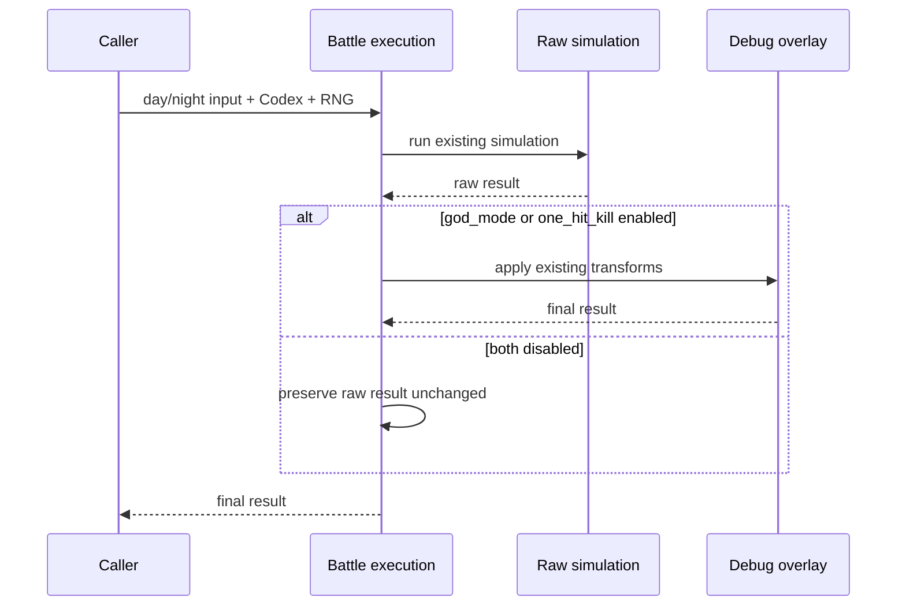
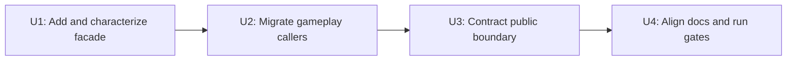

# Deepen Battle Execution Module - Plan

## Goal Capsule

- **Objective:** 让 `emukc_battle` 通过一个日战入口和一个夜战入口返回已经应用调试策略的最终结果，使调用方不再编排原始模拟与调试覆盖层。
- **Authority order:** 本计划的 R-ID 与 KTD-ID；`docs/solutions/architecture-patterns/debug-overlay-bridge.md` 的既有桥接决策；现有 golden、玩法测试和协议校验；当前实现。
- **Execution profile:** 先做行为刻画，再增加执行门面、迁移调用方、收紧旧接口，最后更新架构知识。
- **Stop conditions:** 如果实现需要改变战斗数值、随机数抽取顺序、响应字段，或重启 owned-pass/event-sourced 改写，应停止执行并回到规划。
- **Tail ownership:** U4 负责文档一致性和全套质量门，任何 golden 重录或无关测试豁免都不属于完成条件。

## Product Contract

### Summary

本计划将战斗执行收拢到 `emukc_battle` 的小型公开门面。门面拥有“原始模拟 → 根据 `Codex` 调试配置应用现有覆盖层 → 返回最终结果”的完整顺序；出击、演习和测试调用方只选择日战或夜战并消费最终结果。

### Problem Frame

`emukc_battle` 当前分别公开 `simulate_day`、`simulate_night`、`apply_day_debug` 和 `apply_night_debug`。出击与演习的五处生产组合点重复知道三项内部知识：先运行哪种模拟、从哪里读取调试开关、覆盖层必须在模拟后运行。

这种接口允许新调用方跳过覆盖层或颠倒顺序，并迫使 gameplay 层随桥接实现演化。调试覆盖层本身已经过验证，本计划只深化边界，不替换它。

### Requirements

#### Execution boundary

- R1. `emukc_battle` 必须为日战和夜战各提供一个公开执行入口，并返回完整的最终模拟结果。
- R2. 执行入口必须在 crate 内部读取 `Codex` 的 `god_mode` 与 `one_hit_kill` 配置，并以当前固定顺序应用调试覆盖层。
- R3. 出击日战、出击夜战、出击夜战起始、演习日战和演习夜战不得再自行组合原始模拟与调试覆盖层。
- R4. 原始日/夜模拟、调试覆盖函数及其 event/reducer/transform 支撑模块不得继续构成跨 crate 的公开执行接口。

#### Behavioral preservation

- R5. 两个调试开关均关闭时，执行入口的结果和 RNG 后继状态必须与当前原始模拟完全一致。
- R6. `god_mode`、`one_hit_kill` 及两者组合的 HP、动画伤害数组、胜负结果和夜战资格语义必须保持不变。
- R7. 现有日/夜 golden、完整出击 golden 和客户端协议校验必须保持通过，且不得通过重录 golden 隐藏漂移。

#### Documentation

- R8. battle crate 的公开 API 文档和架构知识必须将统一执行入口记录为跨 crate 边界，同时继续把 debug-overlay bridge 记录为内部实现。

### Key Decisions

- KD1. 本计划只交付统一战斗执行边界，其余三项架构候选转为独立后续工作。 `(session-settled: user-approved — chosen over one phased plan covering all four findings: keeping battle, gameplay lifecycle, and map assembly on separate risk surfaces)` Governs R1-R8.

### Key Flows

- F1. 出击或演习发起日战，构造 `BattleContext`，调用日战执行入口，接收最终 `BattleSimulation`，再完成响应与会话持久化。 Covers R1-R3, R6.
- F2. 出击或演习发起夜战，构造 `NightBattleInput`，调用夜战执行入口，接收最终 `NightBattleSimulation`，再更新会话与响应。 Covers R1-R3, R6.
- F3. 执行入口先消费现有 RNG 完成原始模拟，再读取调试配置并运行无 RNG 的覆盖层；关闭调试时直接返回原始结果。 Covers R2, R5-R7.
- F4. crate 内部测试可直接验证原始模拟与执行门面的等价性；跨 crate 调用方只能依赖执行门面。 Covers R4-R5.

### Acceptance Examples

- AE1. 给定相同 `Codex`、战斗输入和 seed，关闭两个调试开关后，旧原始模拟与新执行入口产生相同结果，且随后一次 RNG 读取也相同。 Covers R5.
- AE2. 开启 `god_mode` 的出击日战通过新入口后，友军最终 HP 与客户端动画伤害字段仍符合现有调试覆盖层断言。 Covers R2, R6.
- AE3. 开启 `one_hit_kill` 的出击或演习日战通过新入口后，敌军全部沉没且夜战入口继续被拒绝。 Covers R2, R6.
- AE4. 夜战起始路径通过统一夜战入口后，响应结构继续通过夜战协议校验。 Covers R1-R3, R7.
- AE5. 跨 crate 搜索不再发现对原始模拟或 `apply_*_debug` 的调用。 Covers R3-R4.

### Success Criteria

- gameplay 层的五处生产组合点全部依赖新执行门面。
- `emukc_battle` 的外部 API 不再暴露可被错误组合的模拟/覆盖层接缝。
- 现有行为证据保持稳定，没有 battle golden 资产变化。

### Scope Boundaries

#### In Scope

- `emukc_battle` 的日/夜执行门面和公开导出边界。
- 出击、演习和直接模拟测试调用方迁移。
- 与该边界直接相关的测试和 `docs/solutions/` 知识更新。

#### Out of Scope

- 改变战斗阶段、攻击结算、目标选择、伤害公式或随机数算法。
- 将 debug-overlay bridge 替换为 owned-pass 或 event-sourced 模拟。
- 改变 sortie/practice 会话存储生命周期。
- 改变地图目录装配或数据权威顺序。

#### Deferred to Follow-Up Work

- 集中攻击结算，减少各阶段重复的选敌、护卫、伤害、显示和 packet 装配。
- 由单一 gameplay 模块拥有完整出击/演习战斗生命周期。
- 收拢地图目录的来源策略、覆盖顺序、校验和 provenance。

### Dependencies

- 不引入新 crate 或外部服务。
- 保留 `NightBattleInput` 作为夜战参数对象，避免重新展开参数列表。
- 保留 `BattleSimulation`、`NightBattleSimulation`、transcript renderer 和 `BattleRng` 等仍被外部消费的类型与工具。

## Planning Contract

### Key Technical Decisions

- KTD1. 新公开门面使用 `execute_day` 与 `execute_night`，并直接从已经传入的 `Codex` 读取调试开关。这样不增加新的公开配置对象，也不把调试策略翻译留给 gameplay。 Governs R1-R3.
- KTD2. 原始模拟和 debug-overlay bridge 保持两个内部步骤；执行门面只拥有它们的顺序，不把桥接逻辑并入战斗阶段。这样遵守 `docs/solutions/architecture-patterns/debug-overlay-bridge.md` 的 no-go 决策。 Governs R2, R4, R6.
- KTD3. 先并存新旧入口完成调用方迁移，再将原始模拟、覆盖函数及 event/reducer/transform 模块收紧为 crate 内部实现。这样每一步都可编译验证，并避免一次性破坏所有消费者。 Governs R3-R4.
- KTD4. 行为不变以两层证据证明：crate 内比较 raw 与 executed 结果及 RNG 后继状态；跨 crate 使用既有出击、演习、golden 和协议测试。协议校验只证明响应结构，数值行为仍由 golden 和玩法断言负责。 Governs R5-R7.
- KTD5. Golden 与其他直接调用执行门面的测试必须显式关闭 `Codex` 调试开关，不依赖开发者本地 `game_config.json`，也不继续保留公开 raw 入口只为测试。 Governs R4-R5, R7.

### High-Level Technical Design

以下图示表达边界与顺序，不规定具体 Rust 签名。

#### Component boundary

只有 execution facade 是跨 crate 的执行入口。Raw simulation 与 debug-overlay bridge 仍可在 `emukc_battle` 内分别测试，但不再允许外部调用方自由组合。

#### Execution sequence

### Implementation Constraints

- 不修改 battle 数值默认值，因此不触发 Balance Defaults Policy。
- 不手工修改 battle knowledge JSON 或 `tests/gameplay_tests/battle_golden.rs`。
- 不使用 `EMUKC_BLESS_GOLDEN` 完成此重构。
- 新公开函数必须满足 battle crate 的 rustdoc 和 `missing_docs` 约束。
- 保留当前工作树中与本计划无关的 staged/unstaged 文件；实施只触碰各 U-ID 列出的路径。

### Sequencing

## Implementation Units

### U1. 增加并刻画统一执行门面

- **Goal:** 在不移除旧入口的前提下，为日战和夜战建立拥有调试策略与后处理顺序的新门面。
- **Requirements:** R1-R2, R5-R6.
- **Dependencies:** None.
- **Files:**
  - `crates/emukc_battle/src/execution.rs` — 新的执行编排模块和局部契约测试。
  - `crates/emukc_battle/src/lib.rs` — 导出新门面。
  - `crates/emukc_battle/src/simulation/mod.rs` — 保持 raw 模拟可供 crate 内门面调用。
  - `crates/emukc_battle/src/debug_overlay.rs` — 保持覆盖层为门面内部的后处理步骤。
- **Approach:** 先为 flags-off 等价性和 flags-on 路由增加刻画测试，再添加日/夜执行入口。入口复用当前模拟和覆盖函数，不复制 transform/reducer 逻辑。遵循 KTD1、KTD2 和 KTD4。
- **Execution note:** 先写等价性断言；旧公开入口暂时保留，供迁移阶段进行差分验证。
- **Test scenarios:**
  1. 日战关闭两个开关时，新入口与 raw 模拟在相同 seed 下返回完全相同的结果，下一次 RNG 读取也相同。
  2. 夜战关闭两个开关时执行相同的结果与 RNG 后继状态比较。
  3. 日战分别开启 `god_mode`、`one_hit_kill` 和两者组合时，新入口结果与直接应用现有覆盖函数一致。
  4. 夜战分别开启两个调试策略时，新入口结果与直接应用现有覆盖函数一致。
  5. 无战斗阶段或已经全灭的边界输入继续沿用当前覆盖层结果，不新增 panic 或错误分支。
- **Verification:** `emukc_battle` 的 execution、debug-overlay 和 deterministic simulation 测试通过；现有 golden 文件无变化。

### U2. 迁移出击与演习调用方

- **Goal:** 让所有生产战斗路径只调用统一执行门面。
- **Requirements:** R1-R3, R6.
- **Dependencies:** U1.
- **Files:**
  - `crates/emukc_gameplay/src/game/battle/sortie/orchestrate.rs` — 迁移出击日战、日后夜战与夜战起始。
  - `crates/emukc_gameplay/src/game/battle/practice/orchestrate.rs` — 迁移演习日战与夜战。
  - `crates/emukc_gameplay/src/game/sortie_tests.rs` — 保持出击调试策略端到端覆盖。
  - `crates/emukc_gameplay/src/game/battle/practice/mod.rs` — 保持演习调试策略与夜战门禁覆盖。
- **Approach:** 用新门面替换五处显式组合，删除 gameplay 对 `apply_*_debug` 和 raw `simulate_*` 的导入；响应装配、session 更新和 repository 调用保持原位。遵循 KTD3。
- **Execution note:** 每迁移一类调用方就运行对应 crate 测试，避免把执行边界重构与生命周期变更混在一起。
- **Test scenarios:**
  1. 普通出击日战在关闭调试时仍创建相同 session，并可被结果流程取走。
  2. 出击 `god_mode` 保持友军最终 HP 与 packet HP 为入场值。
  3. 出击 `one_hit_kill` 保持敌军全灭、`can_midnight=false`，夜战请求继续被拒绝。
  4. 出击日后夜战和夜战起始都通过新夜战入口更新 session 与 packet。
  5. 演习普通日战继续生成相同响应与经验快照。
  6. 演习 `one_hit_kill` 保持敌军全灭、夜战门禁关闭，并保留待结算 session。
- **Verification:** `emukc_gameplay` 的 sortie/practice 单元与集成测试通过，gameplay 源码不再调用旧组合函数。

### U3. 收紧公开 API 并迁移直接测试消费者

- **Goal:** 在所有生产调用方迁移后，移除可被外部错误组合的旧执行接缝。
- **Requirements:** R4-R7.
- **Dependencies:** U2.
- **Files:**
  - `crates/emukc_battle/src/lib.rs` — 仅保留新执行门面作为公开战斗执行入口，并收紧内部模块可见性。
  - `crates/emukc_battle/src/simulation/mod.rs` — 将 raw 日/夜模拟限制为 crate 内使用。
  - `crates/emukc_battle/src/debug_overlay.rs` — 将 apply 函数限制为 crate 内使用。
  - `crates/emukc_battle/src/event.rs` — 收紧未被外部消费的桥接支撑 API。
  - `crates/emukc_battle/src/reducer.rs` — 收紧未被外部消费的桥接支撑 API。
  - `crates/emukc_battle/src/transforms.rs` — 收紧未被外部消费的桥接支撑 API。
  - `crates/emukc_battle/tests/golden_transcript.rs` — 改用统一门面，并显式关闭调试开关。
  - `crates/emukc_gameplay/src/game/battle/sortie/mod.rs` — 将直接 raw 模拟测试迁移到统一门面。
- **Approach:** 先迁移外部测试，再移除旧 re-export 和 public module visibility。Golden 与 sortie session 测试在调用新门面前都显式关闭两个调试开关。保留仍有跨 crate 消费者的 result/input 类型、RNG trait 和 transcript renderer。遵循 KTD3 和 KTD5。
- **Execution note:** 收紧可见性是本单元最后一步；编译错误应被视为遗漏消费者的清单，不通过重新公开旧接缝规避。
- **Test scenarios:**
  1. 20 个日战 seed 通过新门面产生与冻结文件一致的 packet，且同 seed 重放仍字节一致。
  2. 20 个夜战 seed 执行相同的 golden 与重复性断言。
  3. Golden 装载过程显式关闭两个调试开关，本地配置开启时也不改变测试结果。
  4. gameplay 的 sortie session 测试显式关闭本地调试配置后，通过公开门面构造 simulation。
  5. 仓库中 `emukc_battle` 外部不再引用 raw 模拟、apply 函数或桥接支撑模块。
- **Verification:** battle 与 gameplay crate 编译通过；日/夜 golden 和完整出击 golden 保持原文件不变。

### U4. 对齐架构知识并执行完整验证

- **Goal:** 让文档、公开 API 和验证证据共同描述新的深模块边界。
- **Requirements:** R7-R8.
- **Dependencies:** U3.
- **Files:**
  - `docs/solutions/architecture-patterns/debug-overlay-bridge.md` — 记录桥接由 execution facade 内部拥有。
  - `docs/solutions/architecture-patterns/battle-sim-params.md` — 将夜战参数对象约束更新到新公开入口。
  - `docs/solutions/architecture-patterns/battle-crate-docs.md` — 更新公开函数文档与 RNG 连续性责任。
- **Approach:** 原地更新现有知识所有者，不新增重复的 architecture decision 文档。明确协议校验与 golden/玩法测试的证据边界。随后执行 Verification Contract。
- **Test scenarios:** Test expectation: none — documentation and verification ownership only.
- **Verification:** 文档链接和函数名与当前代码一致；全部质量门通过；没有修改生成资产或冻结 golden。

## Verification Contract

### Targeted behavior

- `cargo test -p emukc_battle`
- `cargo test -p emukc_gameplay`
- `cargo test -p emukc_gameplay --test sim_validation_gate`
- `cargo test --test gameplay_tests`

`emukc_battle` golden 证明 seed 可重复性与 packet 数值未漂移；gameplay 测试证明调试配置从 `Codex` 到最终 session/response 的集成；`sim_validation_gate` 只证明客户端协议结构，不替代行为证据。

### Workspace gates

- `cargo fmt --all --check`
- `cargo clippy --workspace -- -W warnings`
- `cargo test`

完整测试若在实施前已失败，执行者必须先记录可复现基线并确认是否需要独立修复；不得静默跳过、扩大本重构范围或把失败声明为通过。

### Artifact invariants

- `crates/emukc_battle/tests/golden/` 中的日/夜快照保持字节不变。
- `tests/gameplay_tests/battle_golden.rs` 保持冻结，不手工修改或重新录制。
- `crates/emukc_bootstrap/assets/*.json` 与 `main-decoder/out/battle/*.json` 不因本计划变化。

## Definition of Done

- R1-R8 均由至少一个完成的 U-ID 和对应验证证据覆盖。
- U1 的 raw-vs-executed 测试证明 flags-off 结果和 RNG 后继状态完全等价。
- U2 的五处生产组合点全部迁移，gameplay 不再知道调试覆盖层顺序。
- U3 收紧旧 API 后，仓库内没有跨 crate 的 raw 模拟或 apply 调用。
- U4 更新三个现有架构知识所有者，没有并行重复文档。
- 日/夜 battle golden、完整 sortie golden、玩法测试与协议 gate 全部通过且未重录。
- fmt、clippy 和完整 workspace 测试满足仓库硬门。
- 实施 diff 只包含本计划文件范围；任何试验性或放弃方案代码均已移除。
