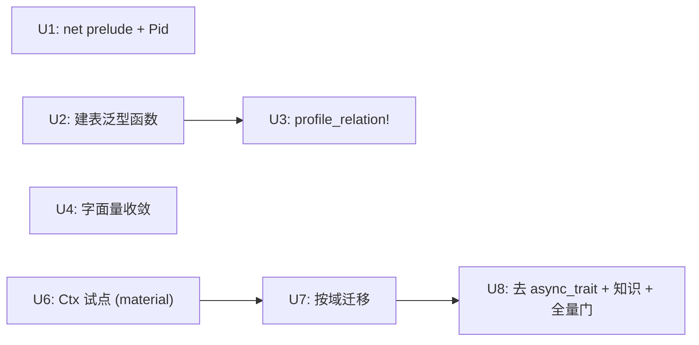

# Eliminate Structural Boilerplate - Plan

## Goal Capsule

- **Objective:** 移除仓库内三类结构性重复：handler 层的仪式代码、db 层逐字复制的实体样板、以及 gameplay 层一个没有第二实现的 trait 抽象层。行为、API 响应和数值全部保持不变。
- **Authority order:** 本计划的 R-ID 与 KTD-ID；`CLAUDE.md` 的分层与审查规则；现有 gameplay 测试、battle golden 与协议校验；当前实现。
- **Execution profile:** 先做零争议的机械去重（Phase A，U1-U4），每个单元独立提交；再以单域试点验证抽象层拆除可行性（U6），成立后按域推进（U7-U8）。
- **Stop conditions:** 若 U6 试点显示方法调用行无法保持不变、方法解析出现歧义、或 rust-analyzer 跳转显著劣化，停止 Phase B 并回到规划；若任一单元需要改动战斗数值、API 响应字段或生成资产，停止执行。
- **Tail ownership:** U8 负责 `async_trait` 移除、知识沉淀与全套质量门；Phase A 的任一单元不得把 Phase B 的改动提前混入。

## Product Contract

### Summary

本计划削减约 3000 行没有信息量的重复代码，且不改变任何外部可观察行为。其中约 500 行由 Phase A 的四个机械单元消除，约 2600 行由 Phase B 拆除 `XxxOps` trait 层消除（trait 定义约 1450 行与 blanket impl 约 3600 行合并为一份）。

### Problem Frame

三处重复的成因不同，因此解法也不同：

1. **handler 仪式代码。** `src/bin/net/` 下 119 个 handler 分布在 115 个文件，逐字重复同一组共享 import 与 `Extension<GameSession>` 签名。其中 106 个的唯一用途就是随后那行 `let pid = session.profile.id;`，7 个以 `_session` 接收后完全不用，其余（`social/`、`game.rs`、`kcsapi/mod.rs`）用到 token 或整个 session 的克隆。另有 5 个文件里 14 处单元测试直接以 `Extension(context.session.clone())` 调用 handler。这是缺少 prelude 与 extractor 造成的，不是抽象问题。
2. **db 实体样板。** 26 个只有一条指向 `profile::Entity` 的 `belongs_to` 的实体逐字重复同一个 `Relation` 枚举、`Related` 实现与空 `ActiveModelBehavior`（全仓没有任何 `before_save`/`after_save` 钩子）；12 个文件里 36 处重复同一段三行建表调用。这些块必须保留：`find_related` 全仓零调用，但 SeaORM 1.1.20 的 `Schema::create_table_from_entity` 依据 `Relation` 生成外键约束（`sea-orm/src/schema/entity.rs`），而 `crates/emukc_gameplay/src/game/compose/remodel.rs` 中显式的 `PRAGMA foreign_keys = OFF` 证明约束确实生效。
3. **单实现抽象层。** `crates/emukc_gameplay/src/` 下 27 个 `XxxOps` trait（25 个在 `game/`，`AccountOps`、`ProfileOps` 在 `user/`）共 144 个方法，外加 `GameOps` 与 `Gameplay` 两个纯组合 trait；每个 trait 只有一个 blanket impl，全仓没有任何 `dyn Gameplay` / `dyn *Ops`。gameplay crate 内部 `self.<op>()` 互调为 0 次，唯一的内部 trait 调用是 `scenario/mod.rs` 的 `apply_scenario<C: HasContext>` 通过 `ctx.` 调 4 个方法（`add_material`、`add_ship`、`update_ship`、`update_fleet_ships`）。`HasContext` 有四个实现者：`State`、`TestContext`、`SimContext` 以及 `gameplay.rs` 里给元组 `(DbConn, Codex)` 的实现，后者被 gameplay crate 自己的测试用作上下文（约 286 处调用）。这层抽象提供的唯一价值是约 500 个外部调用点的 `state.foo(...)` 方法语法，代价是每个方法签名写两遍、大多数 impl 方法体是纯转发、50 处 `#[async_trait]` 为不存在的多态支付 `Box::pin` 分配。

### Requirements

#### Phase A: 机械去重

- R1. kcsapi handler 不得再逐个文件重复共享 import 集合。
- R2. 需要 profile id 的 handler 必须通过 extractor 获取，不得在函数体内重复从 session 解包。
- R3. 建表调用不得在每个实体处重复 schema 构造与 `db.execute` 两步。
- R4. 单一 profile 外键关系的实体不得逐字重复 `Relation` 枚举、`Related` 实现与 `ActiveModelBehavior`；外键约束与生成的表结构必须逐字节保持不变。
- R5. （已撤回，见 KD6：路由清单由编译器校验，宏收敛没有收益。）
- R6. 测试与构造用的重复结构字面量必须收敛到具名构造点。

#### Phase B: 拆除单实现抽象层

- R7. gameplay 的 144 个操作必须只保留一份签名与一份方法体。
- R8. Phase B 不得改变 gameplay crate 之外约 500 处 `state.foo(...)` 方法调用行的书写形式；显式 `use ...XxxOps` 导入、以 trait 为 bound 的泛型签名、以及构造上下文的代码允许改动。
- R9. `_impl` 函数的事务复用能力（`C: ConnectionTrait`）必须保持不变。
- R10. 迁移完成后 gameplay crate 不再依赖 `async_trait`。

#### 全局

- R11. 任何单元不得改变 API 响应结构、战斗数值、随机数抽取顺序或数据库表结构。
- R12. 不引入新的第三方依赖。

### Key Decisions

- KD1. 抽象层用"删除"而非"宏生成"解决。宏方案能把 2600 行压到约 600 行宏调用，但保留了三份签名的认知负担、`async_trait` 开销和 rustdoc/跳转损失，并且因为 blanket impl 只能有一个，宏必须同时支持 55 个手写方法与 89 个生成方法共存——复杂度高于它消除的重复。 Governs R7-R10。
- KD2. db 实体样板用 `macro_rules!` 解决而非删除。证据见 Problem Frame 第 2 点：外键约束真实生效。 Governs R4。
- KD3. 不引入 proc macro 框架（含 zyn），不引入字段映射 derive（含 o2o）。本计划范围内没有需要 proc macro 的场景。 Governs R12。
- KD4. `From<Model>` / `From<X> for ActiveModel` 共 102 个 impl、1473 行不在本计划范围内：其中只有 15 个是纯字段搬运，其余含真实逻辑，统一处理需要引入新依赖。
- KD5. db `Model` ↔ `emukc_model::profile` ↔ `KcApi*` 三层模型不在本计划范围内：删除中间层会把 db schema 泄漏进 gameplay 与 API 层，耦合代价高于收益。
- KD6. 不做 kcsapi 路由声明收敛。111 条路由中路径与模块名不一致的为 0，宏可行，但"加模块忘注册路由"并不沉默：未被引用的 `handler` 触发 `dead_code`，`cargo clippy --workspace -- -W warnings` 门直接失败。用宏生成 `mod xxx;` 会让 21 个 `router()` 文件在 rust-analyzer 与 rustfmt 下劣化，换来的是删掉一份本来就被编译器校验的清单。 撤回 R5。

### Acceptance Examples

- AE1. 任取一个改造后的 kcsapi handler，其文件内不再出现共享 import 块与 `let pid = session.profile.id;`，HTTP 响应体与改造前逐字节一致。 Covers R1-R2, R11。
- AE2. 对同一个空工作区分别用改造前后的代码执行 bootstrap，`sqlite_master` 中全部表的 SQL 定义（含外键子句）逐字节一致。 Covers R3-R4, R11。
- AE4. `material` 域迁移到固有方法后，`state.get_materials(pid)` 等全部方法调用行一行未改，gameplay 测试（含 gameplay crate 自身以元组为上下文的测试）全绿。 Covers R7-R8。
- AE5. 迁移完成后全仓搜索不再出现 `#[async_trait]` 于 gameplay crate，且 `cargo test` 与 battle golden 全部通过。 Covers R10-R11。

### Success Criteria

- Phase A 完成后，handler 与实体两处的重复块不再存在，且生成的数据库结构与 HTTP 行为无差异。
- Phase B 完成后，gameplay 的每个操作只存在一份签名与一份实现，方法调用行书写形式不变。
- 全部质量门通过，无生成资产与冻结 golden 变动。

### Scope Boundaries

#### In Scope

- `src/bin/net/` 的 prelude 与 extractor。
- `crates/emukc_db/src/entity/` 的建表与关系样板。
- `crates/emukc_gameplay/src/` 的 trait 层、上下文类型与 `scenario` 模块的上下文参数；`crates/emukc_gameplay/tests/` 的上下文构造。
- 因上述改动而必须同步的 `docs/solutions/architecture-patterns/` 知识、`CLAUDE.md` 与 `PROJECT_MEMORY.md`。

#### Out of Scope

- `From` 转换实现（KD4）与三层模型结构（KD5）。
- 任何 gameplay 数值、`Default` 实现与平衡性参数（不触发 Balance Defaults Policy）。
- 战斗阶段、伤害公式、RNG 算法。
- `main-decoder/` 与生成资产。

## Planning Contract

### Key Technical Decisions

- KTD1. 上下文用具体类型 `Ctx { db: Arc<DbConn>, codex: Arc<Codex>, sortie_store: Arc<SortieStore>, practice_store: Arc<PracticeStore> }`，ops 成为 `Ctx` 的固有 `async fn`。store 必须按上下文持有：`State` 已持 `Arc<SortieStore>`，`TestContext` 与 `SimContext` 每次 `SortieStore::new()` 以隔离测试，`sortie_store.rs` 的全局量只是元组 impl 的兜底，`Ctx` 不引用它；元组 impl 删除后全局量是否保留取决于 `game/sortie_tests.rs` 里直接引用它的 5 处测试，本计划不动这些测试。`Codex` 现有三种持有方式（`Arc`、`&'static`、按值），统一为 `Arc<Codex>`：`tests/gameplay_tests.rs` 的 `static CODEX` 改为 `LazyLock<Arc<Codex>>`，`SimContext` 加载后包一层 `Arc`。固有方法的 `Send` 由编译器推断，无需 `async_trait`，也避免 AFIT 在公开 trait 上的 `Send` bound 处理。 Governs R7, R10。
- KTD2. 调用点保持不变的机制：`State`、`TestContext`、`SimContext` 内嵌 `Ctx` 并实现 `Deref<Target = Ctx>`；handler 侧 `AppState = Extension<Arc<State>>` 到 `Ctx` 是四级 deref，autoderef 可走通。Rust 方法解析在每个候选接收者类型上先找固有方法再找 trait 方法，`&State` 一步先于 `&Ctx`，因此某个 trait 尚存时它优先命中，删除该 trait 的同一次提交里 `Ctx` 的固有方法接手，中间状态始终可编译。元组 `(DbConn, Codex)` 是外部类型，既不能加固有方法也不能 `Deref` 到 `Ctx`，其上下文用法在 U6 一并换成 `Ctx`。 Governs R8。
- KTD3. 迁移以域为单位：一个域一次提交，顺序为 `material`（试点）→ 其余 28 个 trait。`_impl` 函数完全不动，固有方法直接承接原 blanket impl 的方法体。 Governs R7, R9。
- KTD4. `profile_relation!` 是 `macro_rules!`，放在 `crates/emukc_db/src/entity/` 内部，不使用 `emukc_macros`（本计划无 proc macro 需求）。宏必须透传 doc 注释以满足 `missing_docs` warning。 Governs R4, R12。
- KTD5. 建表去重用泛型函数而非宏：`async fn create_table<E: EntityTrait>(db: &DbConn, e: E)`，因为 `create_table_from_entity` 本身就是泛型的。 Governs R3, KD3。
- KTD6. 表结构等价性以 `sqlite_master` 快照对比证明，不以"测试通过"代替。仓库里没有现成工具：执行者在 scratchpad 写一次性脚本或临时测试，用 `new_mem_db()` 建库后 `SELECT name, sql FROM sqlite_master ORDER BY name` 导出，改造前后各跑一次做 diff；不落成永久夹具。 Governs R4, R11。

### Implementation Constraints

- 每个 U-ID 单独提交，使用 Conventional Commits，无 AI attribution。
- 不手工修改 `crates/emukc_bootstrap/assets/*.json`、`main-decoder/out/battle/*.json`、`tests/gameplay_tests/battle_golden.rs`、`Cargo.lock`。
- 不做计划外的顺手重构、格式化或删除既有死代码（发现即记录，不处理）。
- 保留工作树中与本计划无关的改动；实施只触碰各 U-ID 列出的路径。

### Sequencing

U1、U2→U3、U4、U6 四条线互不依赖，可任意顺序或并行提交；Phase B 不依赖 Phase A。

## Implementation Units

### U1. handler prelude 与 profile id extractor

- **Goal:** 让 kcsapi handler 只保留自身逻辑。
- **Requirements:** R1-R2, R11。
- **Dependencies:** None.
- **Files:**
  - `src/bin/net/mod.rs` — 新增 `prelude` 模块，导出 `AppState`、`GameSession`、`KcApiResponse`、`KcApiResult` 及 `emukc_internal::prelude::*`。
  - `src/bin/net/auth.rs` — 新增 `Pid(i64)` extractor，实现 `FromRequestParts`，从请求扩展中的 `GameSession` 取 `profile.id`；沿用同文件 `AuthAccount` 的既有实现方式。
  - `src/bin/net/router/**/*.rs` — 115 个文件改用 prelude；其中 106 个只用 pid 的 handler 改用 `Pid` extractor，7 个以 `_session` 接收却不用的只去掉多余提取，其余用到 token 或整个 session 的保留 `Extension<GameSession>`。
  - `src/bin/net/router/kcsapi/api_get_member/mapinfo.rs`、`api_req_map/mod.rs`、`api_req_sortie/mod.rs`、`api_req_battle_midnight/mod.rs`、`api_dmm_payment/mod.rs` — 14 处直接以 `Extension(context.session.clone())` 调用 handler 的单元测试，随签名改为传 `Pid(..)`。
- **Approach:** 先建 prelude 与 extractor 并让两者与旧写法共存，再分批替换 handler。替换是纯文本级别，不改动任何 handler 逻辑分支。
- **Execution note:** 若某 handler 同时需要 `GameSession` 的 token 字段，保留 `Extension<GameSession>`，不强行改成 `Pid`。
- **Test scenarios:**
  1. 一个只读 handler（`api_get_member/material`）改造后响应体与改造前逐字节一致。
  2. 一个带 `Form<Params>` 的写 handler（`api_req_kousyou/destroyship`）改造后响应体与副作用不变。
  3. 未登录或 session 缺失时 `Pid` extractor 的拒绝行为与原 `Extension<GameSession>` 一致。
- **Verification:** `cargo test`；改造前后对同一请求的响应体对比无差异。

### U2. 建表调用收敛为泛型函数

- **Goal:** 每个实体的建表从三行降到一行，且生成的 SQL 不变。
- **Requirements:** R3, R11。
- **Dependencies:** None.
- **Files:**
  - `crates/emukc_db/src/entity/mod.rs` — 新增 `pub(crate) async fn create_table<E: EntityTrait>`。
  - `crates/emukc_db/src/entity/profile/mod.rs` 及 11 个同级 `bootstrap` 所在文件 — 36 处调用改写。
- **Approach:** 泛型函数内部保持 `Schema::new(db.get_database_backend()).create_table_from_entity(e).if_not_exists()` 的相同顺序与参数。
- **Test scenarios:**
  1. 空工作区 bootstrap 后 `sqlite_master` 的全部表定义与改造前快照逐字节一致。
  2. 重复 bootstrap 仍然幂等（`if_not_exists` 行为不变）。
- **Verification:** `cargo test -p emukc_db`；`sqlite_master` 快照对比（KTD6）。

### U3. profile 关系样板收敛为声明宏

- **Goal:** 26 个单关系实体共用一份关系声明，外键约束不变。
- **Requirements:** R4, R11-R12。
- **Dependencies:** U2（同一批 db 改动，避免两次触碰相同文件）。
- **Files:**
  - `crates/emukc_db/src/entity/mod.rs` — 新增 `macro_rules! profile_relation`。
  - `crates/emukc_db/src/entity/profile/` 下 26 个只有一条指向 `profile::Entity` 的 `belongs_to` 的实体 — 替换为宏调用。
- **Approach:** 宏生成 `Relation` 枚举（含 `belongs_to`/`from`/`to` 属性）、`Related<profile::Entity>` 实现与空 `ActiveModelBehavior`，并透传 doc 注释。本单元不动的实体：双 `belongs_to` 的 `ship/sp_effect_item.rs`、`practice/detail.rs`、`practice/rival_ship.rs`，带 `has_many` 的 `ship/mod.rs`、`practice/rival.rs`，以及外键指向 account 的 `profile/mod.rs`、`user/token.rs` 与无外键的 `user/account.rs`。
- **Execution note:** `material.rs` 使用 `super::Entity`、`preset/preset_dev_item.rs` 使用 `super::super::Entity` 而非绝对路径，替换时统一到宏内的绝对路径，需单独确认其生成 SQL 未变。
- **Test scenarios:**
  1. 26 个实体改造后 `sqlite_master` 中对应表的外键子句逐字节不变。
  2. `remodel` 路径（依赖 `PRAGMA foreign_keys = OFF`）行为不变。
  3. `cargo doc` 下改造后的实体不产生 `missing_docs` warning。
- **Verification:** `cargo test -p emukc_db`；`cargo test --test gameplay_tests`；`sqlite_master` 快照对比。

### U4. 重复结构字面量收敛

- **Goal:** 消除测试与构造路径上重复的结构字面量。
- **Requirements:** R6, R11。
- **Dependencies:** None.
- **Files:**
  - `crates/emukc_battle/src/simulation/`（20 处，其中 `mod.rs` 17 处）与 `crates/emukc_battle/tests/golden_transcript.rs`（2 处）— `BattleContext { ... }` 字面量收敛到一个测试构造函数；`crates/emukc_gameplay/src/game/sortie_tests.rs` 等 gameplay 侧另有 9 处，若能复用同一构造函数则一并收敛，否则不动。
  - `crates/emukc_bootstrap/src/map_overlay.rs`、`crates/emukc_model/src/codex/map/merge.rs` — 重复的空初始化字面量收敛到 `Default`；具体处数由执行者清点后写入提交正文。
- **Approach:** 构造函数与 `Default` 必须产生与现有字面量完全相同的字段值；不顺手调整任何默认值（否则触发 Balance Defaults Policy）。
- **Test scenarios:**
  1. battle 单元测试与 golden 在收敛后结果不变。
  2. map overlay 解析结果与 warning 列表不变。
- **Verification:** `cargo test -p emukc_battle`；`cargo test -p emukc_bootstrap`；golden 文件无变化。

### U5. （已撤回）

见 KD6。编号保留以免 R-ID 与 U-ID 交叉引用错位。

### U6. Ctx 类型与 material 域试点

- **Goal:** 在最小域上证明"固有方法 + Deref"能在不改调用点的前提下取代 trait。
- **Requirements:** R7-R9, R11。
- **Dependencies:** None.
- **Files:**
  - `crates/emukc_gameplay/src/gameplay.rs` — 新增 `Ctx` 具体类型（字段见 KTD1）；`HasContext` 暂时保留，删除 `impl HasContext for (DbConn, Codex)` 及其对全局 store 的引用。
  - `crates/emukc_gameplay/src/scenario/mod.rs` — `apply_scenario<C: HasContext>` 的 `ctx` 参数改为 `&Ctx`（它通过 `ctx.` 调用 4 个 trait 方法，material 一迁移泛型 `C` 上就没有 `add_material`）。调用方传 `&TestContext` 等靠 deref coercion 不需改动。
  - `crates/emukc_gameplay/tests/all_in_one.rs`、`tests/sim_validation_gate.rs`、`src/user/account.rs` 的测试模块 — `mock_context`/`new_mock` 改为返回 `Ctx`，`&(DbConn, Codex)` 参数类型改为 `&Ctx`；其中的方法调用行不改。
  - `crates/emukc_gameplay/src/game/material.rs` — `MaterialOps` 的 4 个方法改为 `impl Ctx` 固有方法，删除 trait 与 blanket impl；`_impl` 函数完全不动。
  - `src/bin/state/mod.rs`、`tests/gameplay_tests.rs`、`src/bin/cli/battle.rs` — 三个上下文类型内嵌 `Ctx` 并实现 `Deref`；`tests/gameplay_tests.rs` 的 `static CODEX` 改为 `LazyLock<Arc<Codex>>`。
- **Approach:** 先加 `Ctx` 与 `Deref` 并保持全部 trait 不变（此时应当零行为变化、零调用点变化），确认编译与测试通过；再在同一单元内迁移 `material` 一域。
- **Execution note:** 本单元是 Phase B 的决策点。若方法调用行需要改动、出现方法解析歧义、或 rust-analyzer 跳转显著劣化，按 Stop conditions 停止并回到规划。上面列出的导入、泛型签名与上下文构造改动是预期内的，不触发停止条件。
- **Test scenarios:**
  1. `material` 相关的全部 gameplay 测试通过，`.get_materials(`/`.add_material(` 等方法调用行的 diff 为空。
  2. `src/bin` 中 `state.get_materials(...)` 等写法未变更。
  3. CLI battle 模拟、集成测试上下文与 gameplay crate 自身测试同样无需改写方法调用行。
- **Verification:** `cargo test -p emukc_gameplay`；`cargo test --test gameplay_tests`；`git diff -U0 | grep -E '^[-+].*\.(get_materials|add_material|update_material|get_material)\(' ` 为空。

### U7. 按域迁移剩余 trait

- **Goal:** 26 个剩余 `XxxOps` 全部转为 `Ctx` 固有方法。
- **Requirements:** R7-R9, R11。
- **Dependencies:** U6。
- **Files:**
  - `crates/emukc_gameplay/src/game/**` — 按域逐个迁移。
  - `crates/emukc_gameplay/src/user/` — `AccountOps`、`ProfileOps` 同样处理。
  - `crates/emukc_gameplay/src/lib.rs` 的 `prelude` 模块 — 同步移除已删除 trait 的 re-export（`emukc_internal` 只是转发 `gameplay::prelude::*`，不需单独改）。
  - 显式导入 trait 的 12 个文件 — 删除随 trait 消失而变成未使用的 `use`（`src/bin/net/router/gadgets.rs`、`social/confirm_payment.rs`、`kcsapi/api_req_battle_midnight/mod.rs`、`api_req_map/mod.rs`、`api_req_sortie/mod.rs`、`api_req_kaisou/can_preset_slot_select.rs`、`api_req_kousyou/preset_dev_items_{expand,update_name,delete}.rs`、`api_req_member/set_friendly_request.rs`、`src/bin/cli/dev/new_session.rs`、`src/bin/cli/dev/add_quest.rs`），否则 clippy 门失败。
  - `src/bin/net/router/kcsapi/api_get_member/require_info.rs` 与 `api_port/port.rs` — `build_*_response<T: GameOps + ...>` 泛型签名改为 `&Ctx`，调用方 `state.0.as_ref()` 与 `&context` 靠 deref coercion 不改。
- **Approach:** 一个域一次提交，顺序按依赖从少到多。每次迁移只搬运方法体，不改写内部逻辑、不合并方法、不调整签名。
- **Execution note:** 编译错误是"还有谁在依赖这个 trait"的清单，不通过重新导出旧 trait 规避。
- **Test scenarios:**
  1. 每个域迁移后该域的单元与集成测试通过。
  2. 全部域迁移后 `Gameplay` 组合 trait 与 `HasContext` 不再有消费者。
  3. battle golden 与完整出击流程不变。
- **Verification:** 每次提交跑 `cargo test -p emukc_gameplay` 与 `cargo test --test gameplay_tests`；最后一次跑 `cargo test`。

### U8. 移除 async_trait、沉淀知识并执行全量门

- **Goal:** 收尾抽象层拆除，并让文档与代码一致。
- **Requirements:** R10-R11。
- **Dependencies:** U7。
- **Files:**
  - `crates/emukc_gameplay/Cargo.toml` — 移除 `async-trait` 依赖。
  - `crates/emukc_gameplay/src/gameplay.rs` — 删除 `Gameplay`、`HasContext` 及其 blanket impl。
  - `docs/solutions/architecture-patterns/` — 新增或更新一份记录：为什么 gameplay 用具体 `Ctx` 而非 trait，以及 `_impl` + `C: ConnectionTrait` 的事务复用约定为何保留；同时修正点名了 trait 的六份既有文档：`quest.md`、`fleet.md`、`sortie.md`、`user-lifecycle.md`、`material.md`、`useitem-response.md`。
  - `CLAUDE.md` — 更新 "Gameplay trait system" 段落与 "Adding a New Game API" 第 3 步。
  - `PROJECT_MEMORY.md` — 按回写约定更新。
- **Approach:** 只更新既有知识所有者，不新增重复文档。`Cargo.lock` 因依赖移除而变化属预期，由 cargo 生成。
- **Test scenarios:** Test expectation: none — 依赖清理、文档与验证归属。
- **Verification:** 全部 Workspace gates 通过；文档中的类型名与代码一致。

## Verification Contract

### Targeted behavior

- `cargo test -p emukc_db`
- `cargo test -p emukc_gameplay`
- `cargo test -p emukc_battle`
- `cargo test -p emukc_bootstrap`
- `cargo test --test gameplay_tests`

数据库结构等价性由 `sqlite_master` 快照对比证明（U2、U3），HTTP 行为等价性由请求响应对比证明（U1），gameplay 行为等价性由现有集成测试与 battle golden 证明（U6-U8）。当前仓库无 `#[ignore]` 测试，`.data/codex` 已就位，基线可直接运行。

### Workspace gates

- `cargo fmt --all --check`
- `cargo clippy --workspace -- -W warnings`
- `cargo test`

实施前若完整测试已有失败，执行者必须先记录可复现基线并确认是否需要独立修复；不得静默跳过或把失败声明为通过。

### Artifact invariants

- `crates/emukc_bootstrap/assets/*.json` 与 `main-decoder/out/battle/*.json` 不因本计划变化。
- `tests/gameplay_tests/battle_golden.rs` 保持冻结。
- `Cargo.lock` 仅因 U8 移除 `async-trait` 而变化，且由 cargo 生成。
- 数据库表结构（含外键子句）逐字节不变。

## Definition of Done

- R1-R4、R6-R12 均由至少一个完成的 U-ID 与对应验证证据覆盖（R5 已撤回）。
- Phase A 的四个单元各自独立提交，且每个提交的 diff 只含该单元列出的路径。
- U6 的试点证据明确记录：调用点 diff 为空，测试全绿。
- gameplay crate 中每个操作只存在一份签名与一份方法体，`async_trait` 已移除。
- gameplay crate 之外约 500 处方法调用行的书写形式未变更；允许的改动仅限导入、泛型签名与上下文构造。
- fmt、clippy、完整 workspace 测试通过，无 skipped/ignored。
- 生成资产与冻结 golden 无变化，数据库结构快照一致。
