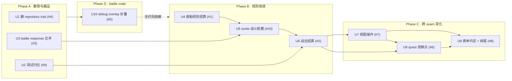

# Deepen Shallow Modules - Plan

## Goal Capsule

- **Objective:** 把架构评审（2026-09-18）找出的十处浅模块（shallow module）逐个深化：让每条规则只有一个 implementation、每个 seam 只在有两个 adapter 时存在、每个 interface 就是它的测试面。除 U4 修复一处已确认的经验封顶分叉外，不改变任何外部可观察行为。
- **Authority order:** 本计划的 R-ID 与 KTD-ID；`CLAUDE.md` 的分层、审查与 Balance 规则；`docs/solutions/architecture-patterns/gameplay-context.md`；现有 gameplay 测试、battle golden 与协议校验；当前实现。
- **Execution profile:** 四个阶段，风险递增。Phase A 是零行为变化的删除与搬运，任意顺序；Phase B 把三条重复规则各收成一个模块，U4 → U5 → U6 有顺序；Phase C 跨 crate seam 深化，每个单元独立；Phase D 只有一个单元（U10），只触及 `emukc_battle`，与其他单元无代码依赖，排在 Phase A 之后执行，让后续 sortie 单元面对的是最终的 battle crate。
- **Stop conditions:** 任一单元导致 `tests/gameplay_tests/battle_golden.rs` 或生成资产变化（U4 明确允许的 expedition 经验值除外），停止该单元并回到规划；任一单元需要改动 `codex/` 下的 `Default` 数值，停止并按 Balance Defaults Policy 另立计划；U10 的差分测试（KTD8）未在 ≥1000 个 seed 上全等前，不得删除旧 overlay 模块。
- **Tail ownership:** 每个阶段的最后一个单元负责该阶段的知识沉淀（`docs/solutions/`）与 `PROJECT_MEMORY.md` 回写；U9 负责全计划的 `CLAUDE.md` 更新与全套质量门。

## Product Contract

### Summary

评审报告（临时文件，结论已并入本节）用删除测试（deletion test）逐一检验：删掉某模块，复杂度是消失还是在 N 个调用方重新出现。十处候选里六处是「消失」（pass-through 或单实现 trait），三处是规则散落在多个调用方（locality 丢失），一处是二进制持有了 gameplay 不变量。本计划按这三类分别处理：删、收、下沉。

### Problem Frame

按报告编号，证据均已在源码核对：

1. **舰船经验规则写了四遍。** `game/sortie_result.rs:329`、`game/practice.rs:654`、`game/expedition.rs:1098` 各自内联「exp → level → cap → progress」；`sortie_result` 与 `practice` 在到达 cap 时把 `exp_now` 钉在 `cap_exp`、`exp_next` 归零，`expedition` 只封 level，`exp_now` 原样写入。`calculate_battle_admiral_exp`（`sortie_result.rs:93`）与 `calculate_admiral_exp`（`battle/practice/exp.rs:7`）逐字节相同，`build_exp_lvup_vector` 亦然。
2. **`sortie_battle_result` 一个方法编排五个领域。** `game/sortie/mod.rs:489-683` 在一个事务里写 profile、ship ×N、map_record、quest ×(1+击沉数)、drop（ship + slot_item）、map unlock；`SortieBattleResultResponse { … }` 字面量在 `:605` 与 `:653` 各写一遍。
3. **BattlePacket → wire 翻译写了三遍。** `battle/sortie/response.rs`（42 行复制）、`battle/practice/response.rs`（31 行）、`battle/practice/orchestrate.rs:68-128`（25 行内联）；`enemy_slot_ids` 三份；sortie 的 `build_day_response` 返回 `PracticeBattleResponse`；`SortieNightBattleResponse` 与 `PracticeNightBattleResponse` 是同 17 字段两份声明。
4. **`SortieRepository` / `PracticeRepository` 单实现 trait。** `game/sortie_store.rs:147-185` 的 trait impl 逐个转发到同文件的 inherent 方法；全仓 9 处 `&dyn SortieRepository` / `&dyn PracticeRepository` 参数全部以 `&SortieStore` / `&PracticeStore` 调用；两个 trait 还通过 `lib.rs` 导出。与刚完成的 Ctx 迁移（plan 2026-09-18-001）是同一种病。
5. **debug overlay 四模块 ~1650 行背后是两个 HP 钳位开关。** `debug_overlay.rs` 从 HP 差值反推事件日志（自述 lossy）→ `transforms.rs` 过滤 → `reducer.rs` 还原 HP → 覆盖 packet；`event.rs`、`reducer.rs` 带 `#[allow(dead_code, reason = "…not emitted yet")]`。唯一调用者是 `execution.rs`。
6. **任务进度由 12 个手写调用点触发。** `factory.rs:64,140,235`、`ndock.rs:391,456`、`slot_item.rs:432`、`compose/supply.rs:115`、`compose/powerup.rs:398`、`expedition.rs:306`、`practice.rs:163`、`sortie/mod.rs:559,569`；5 处用全路径 `crate::game::quest::update::…`；`QuestActionEvent::SlotItemImproved` 无 producer。
7. **handler 成了编排者。** `api_port/port.rs:28-60` 先 `clear_sortie_state_if_any`（写）、再 `update_materials`（写）、再八次读；`api_get_member/require_info.rs:33` 十次 Ctx 调用；`questlist.rs:47-127` 把 tab 过滤、period → type 映射、`api_state` 派生写在 handler。115 个 `_impl` 中 43 个只有一个文件内调用者。
8. **70 个 `Params` 只有 1 个测过反序列化。** `form_utils.rs` 只有 `deserialize_form_ivec` 一个 helper；`api_req_sortie/battle.rs:20-33` 声明 5 字段随即 `let _ = (…)` 丢弃 4 个。
9. **测试搬离了代码。** `game/sortie_tests.rs`（2223 行）通过 `use super::*` 测 `map_route`、`map_progress`、`sortie_result`、`enemy_ship` 的纯函数，`sortie/mod.rs:31-41` 为此带 5 行 `#[cfg(test)] use`；路由谓词在 `map_route.rs` 与 `sortie_tests.rs` 各测一遍。
10. **`sortie_sp_midnight_battle` 与 `sortie_battle_impl` 共享 55 行前奏、35 行 Snapshot 字面量。** `sortie/mod.rs:762-890` vs `:948-1096`；sp_midnight 缺 `combined_type > 0` 与 `event_kind != 1` 两个守卫；`run_sp_midnight_battle`（`battle/sortie/orchestrate.rs:99-193`）手工构造零填充 `BattlePacket` 作锚点。

### Requirements

#### Phase A: 删除与搬运（零行为变化）

- R1. `SortieStore` / `PracticeStore` 只保留一份 interface；`SortieRepository`、`PracticeRepository` 与其转发 impl 不复存在。
- R2. 每个测试块与其命名的代码同模块；生产模块不再为测试文件携带跨模块的 `#[cfg(test)] use`。
- R3. `BattlePacket` 到 wire packet 的翻译只有一份 implementation；`enemy_slot_ids` 只有一份；sortie 与 practice 的夜战 wire 结构只声明一次。

#### Phase B: 规则收敛（一处 bug 修复）

- R4. 舰船经验结算（exp → level → cap → progress → 持久化）只有一份 implementation，sortie、practice、expedition 只传增量；expedition 路径的封顶行为与 sortie / practice 一致。
- R5. 提督经验与 `exp_lvup` 向量的计算只有一份。
- R6. sortie 战斗的前置解析（active 校验、profile、stage、敌我舰队构造、守卫）只有一份，day-start 与 night-start 只在调用哪个模拟上不同；两个入口的守卫集合一致。
- R7. 战后写集合（profile、ship、map_record、quest、drop、unlock）由一个模块在一个事务内拥有，返回一个 snapshot；`SortieBattleResultResponse` 只构造一次。

#### Phase C: 跨 seam 深化

- R8. port、require_info、questlist 三个视图由 gameplay 的操作一次返回；「先清 stale sortie、再结算 material、再读」的顺序不再存在于 `src/bin/`。
- R9. 「什么推进任务」在 quest 模块内一个文件可回答；领域模块不再各自调用 `update_quest_progress_for_action`；穷尽性约束落在 producer 侧的 `GameplayOutcome` 上，`QuestActionEvent` 中因功能未实现而暂无 producer 的变体保留并注明来源。
- R10. KCSAPI 表单约定（默认值、可选字段、逗号列表）在 `form_utils.rs` 集中并测试一次；handler 不再声明随即丢弃的字段。

#### Phase D: debug overlay 折叠

- R11. `god_mode` / `one_hit_kill` 在 `execution.rs` 内作为尾部 HP 钳位实现；`event.rs`、`reducer.rs`、`transforms.rs` 与 `debug_overlay.rs` 的事件派生路径不复存在；`debug-overlay-bridge.md` 记录的三条学到的规则（Sunk{Friendly} 复活、`can_midnight` 合取、packet 数组重建顺序）在钳位 pass 中保持。

#### 全局

- R12. 除 R4 明确的 expedition 封顶修复外，任何单元不得改变 API 响应结构、战斗数值、随机数抽取顺序、数据库表结构或生成资产。
- R13. 不引入新的第三方依赖，不引入 trait 除非同一提交里出现第二个 adapter。

### Key Decisions

- KD1. **删、收、下沉三种手法分开用。** pass-through 与单实现 trait 直接删（U1、U3）；规则散落的收成一个模块（U4-U6、U8）；二进制持有的不变量下沉到 gameplay（U7）。不用统一的「抽象层」解决三类问题。 Governs R1-R9。
- KD2. **U4 的 expedition 修复是 bug fix，不是 balance 调整。** 它不改 `Default` 实现，只让 expedition 与 sortie / practice 已有的封顶行为一致；提交前缀 `fix(expedition):`，正文写明旧行为。不触发 Balance Defaults Policy。 Governs R4。
- KD3. **quest 用「观察写结果」而非「事件总线」。** 引入 `quest::observe(c, codex, pid, &outcome)`，`outcome` 是 quest 模块内定义的 `GameplayOutcome` 枚举，由拥有事务的 `Ctx` 方法在写入后调用一次；`observe` 对枚举穷尽匹配，新增变体不映射就不编译。不引入订阅者注册、不引入运行时分发。 Governs R9。
- KD4. **视图操作返回领域结构，handler 投影到 wire。** 与 `api_req_map/projection.rs` 已有的做法对齐，不采用 sortie / practice「gameplay 直接产 wire 结构」的做法；后者留待另一计划统一。 Governs R8。
- KD5. **U10 执行，用户裁定。** `debug-overlay-bridge.md` 的 2026-06-24 复评已把 owned-pass 判为 no-go，并写明原则：「没有真实驱动，不为整洁而重构」，重启条件是需要权威的逐阶段事件、或 bridge 在生产中出 bug。U10 的证据（事件由 HP 差值反推、两处 `dead_code` allow、单一调用者）说明事件词汇已无未来消费者，但 U10 本身同样没有真实驱动：没有 bridge 的 bug 记录，也没有第三个 debug 开关的需求。计划初稿按同一原则将 U10 挂起；2026-09-18 用户裁定删除约 1650 行无未来消费者的事件骨架本身就是足够的驱动，U10 转为正常单元。执行时在 `debug-overlay-bridge.md` 追加这条驱动记录，等价性由 KTD8 的差分测试证明。 Governs R11。
- KD6. **不做 `Ctx` 访问器的批量删除。** 43 个单调用 `_impl` 是症状不是病因；U7 落地后再看哪些 `_impl` 只剩视图操作一个调用者，逐个内联，不在本计划内。
- KD7. **测试策略：替换，不叠加。** 每个深化单元在新 interface 上写测试后，删除针对被删 pass-through 的旧测试（例如 `sortie_store.rs:243-330` 的三个 HashMap 往返测试）。不为兼容保留两套。

### Acceptance Examples

- AE1. 删除 `game/battle/repository.rs` 后，`orchestrate.rs` 的参数类型改为 `&SortieStore` / `&PracticeStore`，全部 sortie / practice 测试与 battle golden 逐字节不变。 Covers R1, R12。
- AE2. `git grep -n '#\[cfg(test)\]' crates/emukc_gameplay/src/game/sortie/mod.rs` 无跨模块导入；`map_route.rs` 的谓词测试只剩一份。 Covers R2。
- AE3. `git grep -c 'api_f_nowhps' crates/emukc_gameplay/src/game/battle/` 从 3 个文件降为 1 个；`sortie_battle` 与 `practice_battle` crate 测试全绿；golden 不变。 Covers R3, R12。
- AE4. 一艘未婚 Lv.98、`exp_now == ship_level_required_exp(99) - 1` 的旗舰完成一次远征后，`level == 99`、`exp_now == ship_level_required_exp(99)`、`exp_next == 0`、`exp_progress == 0`，与同舰经出击结算的值一致（修复前 expedition 写入原始经验、`exp_next == required_exp(100)` 与一个非零进度）；`crates/emukc_gameplay/tests/expedition.rs` 新增的用例在 U4 前失败、后通过。已婚 Lv.99 触不到这个分叉，因为已婚上限是 175。 Covers R4。
- AE5. `sortie_sp_midnight_battle` 对 `combined_type > 0` 与非战斗格返回与 `sortie_battle` 相同的错误；`sortie_tests.rs:368` 之外新增两个守卫用例。 Covers R6。
- AE6. 在「海域中途清 gauge」路径与普通路径上，`SortieBattleResultResponse` 由同一个构造点产出；`sortie_tests.rs:1670-2050` 的四个 gauge 用例改从 snapshot 断言。 Covers R7。
- AE7. `api_port` handler 的函数体只剩一次 `state.port_view(pid)` 与投影；`tests/gameplay_tests` 新增一个用例：处于 pending battle 的 profile 调用 `port_view` 后 `SortieStore` 中无 active sortie。 Covers R8。
- AE8. `git grep -n 'update_quest_progress_for_action' crates/emukc_gameplay/src` 只命中 `game/quest/`；`tests/gameplay_tests/quest/progress.rs` 的 33 个用例全绿。 Covers R9。
- AE9. `api_req_sortie/battle.rs` 不再有 `let _ = (…)`；`form_utils.rs` 的每个 helper 有一个 `#[test]`。 Covers R10。

### Success Criteria

- Phase A 完成后，三处 pass-through 不复存在，golden 与生成资产逐字节不变。
- Phase B 完成后，经验、战斗前置、战后写集合各只有一份 implementation，唯一的行为差异是 AE4。
- Phase C 完成后，`src/bin/` 不再持有 gameplay 顺序不变量，quest 触发点在一个文件。
- 全部质量门通过；无 skipped / ignored。

### Scope Boundaries

#### In Scope

- `crates/emukc_gameplay/src/game/{sortie,sortie_result,sortie_store,sortie_tests,practice,expedition,quest,battle,ship,map_route,map_progress}` 及其测试。
- `crates/emukc_gameplay/tests/`、`tests/gameplay_tests/` 中因 interface 变化而必须同步的用例。
- `src/bin/net/router/kcsapi/{api_port,api_get_member,api_req_sortie,api_req_battle_midnight,form_utils.rs}`。
- Phase D：`crates/emukc_battle/src/{execution,debug_overlay,event,reducer,transforms}.rs`。
- 因上述改动而必须同步的 `docs/solutions/architecture-patterns/`、`CLAUDE.md`、`PROJECT_MEMORY.md`。

#### Out of Scope

- 三层模型（db `Model` ↔ `emukc_model::profile` ↔ `KcApi*`）与 `From` 实现（沿用 plan 001 的 KD4、KD5）。
- sortie / practice 直接产 wire 结构与 map 产领域结构两种约定的统一（KD4 只对齐新增的视图操作）。
- 战斗阶段、伤害公式、RNG 算法、`Default` 数值。
- `emukc_internal::prelude` 全量 re-glob 的收紧（报告提到，但没有单元对应；记录为后续候选）。
- `main-decoder/` 与生成资产。

## Planning Contract

### Key Technical Decisions

- KTD1. **舰船经验结算是 `game/ship/exp.rs` 里的一个纯函数。** `settle_ship_exp(exp_now: i64, gain: i64, married: bool) -> ShipExpSettlement { level, exp_now, exp_next, progress }`：先 `level::exp_to_ship_level` 再按 `ship_level_cap(married)` 封顶，到 cap 时 `exp_now = required_exp(cap)`、`exp_next = 0`、`progress = 0`（沿用 sortie / practice 现有语义）。不持久化：三处调用方的持久化载体不同（sortie / practice 经 `KcApiShip` 在同一次 `update_ship_impl` 里连同燃弹一起写，expedition 经 `ship::Model` 走 `recalculate_ship_status_with_model`），结算函数若自己写库会让同一艘舰在一个事务里写两次。`calculate_admiral_exp` 与 `build_exp_lvup_vector` 这两份逐字节相同的函数搬到同文件；`calculate_sortie_ship_exp` 与 practice 的 `calculate_ship_exp` 并不相同（练习多 `practice_exp_boost`，出击多沉没舰不给经验的门，输入类型不同），各自保留。`battle/practice/exp.rs` 删除。 Governs R4, R5。
- KTD2. **sortie 战斗前置收成 `game/sortie/setup.rs`。** `resolve_sortie_battle_setup_impl<C>(c, codex, store, pid) -> Result<SortieBattleSetup>`，返回 active state、profile、stage、我方 `BattleShipInput` 列表、敌方舰队与锁定的 composition；两个守卫在这里。`sortie_battle_impl` 与 `sortie_sp_midnight_battle` 各自缩为「setup → execute_{day,night} → snapshot」。`run_sp_midnight_battle` 的零填充 packet 锚点改为 `execute_night` 直接接收 setup 产出的舰队，`SortieBattleSession.packet` 在 night-start 由 `execute_night` 的结果直接填充；该字段的读者是 `sortie_battle_result`（`api_dests` 取 `enemy_nowhps`，`sortie/mod.rs:615,663`）与 `sortie_midnight_battle`（`formation`，`:705`），因此不能为 `None`。 Governs R6。
- KTD3. **战后写集合收成 `game/sortie_result.rs` 的一个 `_impl`。** `settle_sortie_battle_impl<C>(c, codex, pid, active: &ActiveSortieState, snapshot: SortieBattleResultSnapshot) -> Result<SortieSettlement>`，内部依次调用现有的 `update_sortie_result_stats`、`settle_ship_exp_impl`（U4）、`apply_sortie_map_result`、`quest::observe`（U8 之前先直接调 `update_quest_progress_for_action`）、`add_ship_impl`、`check_and_unlock_dependencies_impl`；`SortieSettlement` 携带响应所需全部字段，`Ctx::sortie_battle_result` 只做 store 锁、`begin/commit`、stage 刷新与一次 `SortieBattleResultResponse::from(settlement)`。 Governs R7。
- KTD4. **wire 构建收成 `game/battle/response.rs`。** `build_battle_response(packet: &BattlePacket, friend: &[BattleShipInput], enemy: &[BattleShipInput]) -> DayBattleResponse` 与 `build_night_response(..) -> NightBattleResponse`；`PracticeBattleResponse` 改名为 `DayBattleResponse` 并删除 `sortie/mod.rs:71` 现有的 `pub type SortieBattleResponse = PracticeBattleResponse;` 别名（该别名是为掩盖误命名而设，`src/bin/` 无任何引用，全部使用点都在 gameplay crate 内；结构名不上 wire），`SortieNightBattleResponse` 与 `PracticeNightBattleResponse` 合并为 `NightBattleResponse`；practice 的 `BattleRuntimeShip` 入口先转 `BattleShipInput` 再进同一 builder，删除 `enemy_slot_ids_from_input` 那种为跨类型造假结构的做法。 Governs R3。
- KTD5. **视图操作命名为 `Ctx::port_view`、`Ctx::require_info_view`、`Ctx::quest_list_view(pid, tab_id)`。** 返回 gameplay 内的 `PortView` / `RequireInfoView` / `QuestListView` 结构（领域类型，不带 `api_` 前缀），handler 在 `src/bin/` 内投影到现有 `Resp`。`port_view` 内部顺序固定为：清 stale sortie → `update_materials_impl` → 一次事务内读齐；`questlist.rs` 的 tab 过滤与 `api_state` 派生搬进 `quest_list_view`。 Governs R8。
- KTD6. **quest 观察点。** `game/quest/observe.rs` 定义 `pub(crate) enum GameplayOutcome { ShipConstructed{..}, SlotItemConstructed{..}, … }`，与 `QuestActionEvent` 一一对应但由领域模块构造；`observe` 把 outcome 映射为 event 并调用现有 `update_quest_progress_for_action`。每个领域的 `Ctx` 方法在写入后调用一次 `observe`；`_impl` 内部不再调用 quest。`SlotItemImproved` 保留：`.data/codex/quest.json` 有 4 个任务（618、619、1166、1167）以 `SlotItemImprovement` 为条件，`matcher.rs` 已有匹配分支与测试；没有 producer 是因为 `api_req_kousyou/remodel_slot*` 尚未实现（`docs/api_coverage.md` 列为 P1）。U8 在 `observe.rs` 的文件头注明这一点，producer 随改修功能一起到来。 Governs R9。
- KTD7. **表单约定。** `form_utils.rs` 增加 `deserialize_form_flag`（"0"/"1" → bool）、`deserialize_form_opt_ivec`；随即丢弃的字段直接从 `Params` 删除（serde 默认忽略未知字段），在结构上方一行注释列出客户端实际发送但未使用的字段名。不引入 derive 宏。 Governs R10。
- KTD8. **U10 的等价性证明。** 先写一次性差分测试，对 `fresh_1_1` 等预设在 ≥1000 个 seed 上比较旧 overlay 与新钳位的 `execute_day` / `execute_night` 输出，全部相等后再删旧模块；golden 必须逐字节不变。差分测试用后删除，不留夹具。 Governs R11。
- KTD9. **交付顺序与 CONTEXT.md。** 仓库尚无 `CONTEXT.md`；U4、U6、U7、U8 各引入一个新领域名词（经验结算、战后结算、视图、观察点）。每个单元落地时在 `CONTEXT.md` 追加该词条（首个单元创建文件），不提前创建。

### Implementation Constraints

- 每个 U-ID 单独提交，Conventional Commits，无 AI attribution；U4 的修复与收敛拆成两个提交：先 `fix(expedition):` 加失败测试并修复，再 `refactor(gameplay):` 收敛。
- 不手工修改 `crates/emukc_bootstrap/assets/*.json`、`main-decoder/out/battle/*.json`、`tests/gameplay_tests/battle_golden.rs`、`Cargo.lock`。
- 不做计划外的顺手重构；发现的额外浅模块记入 `PROJECT_MEMORY.md` 或本计划末尾，不处理。
- `_impl` + `C: ConnectionTrait` 约定不变；新模块的跨域写一律走 `_impl`，不从 inherent 方法互调。
- 每个单元结束时 `cargo fmt --all --check`、`cargo clippy --workspace -- -W warnings`、`cargo test` 三门全过，且 `git diff --stat` 对 golden 与 assets 为空。

### Sequencing

Phase A 三个单元互不依赖。U5 依赖 U3（setup 产出的舰队类型要先统一）；U6 依赖 U2（gauge 用例要先回到 sortie 模块）和 U4、U5；U7、U8 依赖 U6（战后结算是 quest 观察点与 port 视图的最大调用方）；U7 先于 U8：U7 触及 3 个 handler 与 3 个新文件，U8 触及 9 个领域文件，先用小的验证 KD4 的投影模式，两者除 `sortie_result.rs` 外无文件重叠；U9 收尾。U10 只触及 `emukc_battle`，与其他单元无代码依赖；排在 Phase A 之后、Phase B 之前执行。

## Implementation Units

### U1. 删除 SortieRepository / PracticeRepository

- **Goal:** `SortieStore` / `PracticeStore` 的 interface 只声明一次。
- **Requirements:** R1, R12, R13。
- **Dependencies:** None.
- **Files:**
  - `crates/emukc_gameplay/src/game/battle/repository.rs` — 删除。
  - `crates/emukc_gameplay/src/game/sortie_store.rs:147-185`、`practice_store` 对应位置 — 删除 trait impl；被 trait 覆盖而 inherent 层缺失的方法（如 `insert_active`）提升为 inherent `pub(crate)`。
  - `crates/emukc_gameplay/src/game/battle/{sortie,practice}/orchestrate.rs` — 9 处 `&dyn XxxRepository` 改为 `&SortieStore` / `&PracticeStore`。
  - `crates/emukc_gameplay/src/lib.rs:36-37` — 删除导出。
  - `crates/emukc_gameplay/src/game/sortie_store.rs:243-330` — 删除三个通过 trait 测 HashMap 往返的用例（KD7）。
- **Approach:** 先删 trait 定义让编译器列出全部使用点，逐个改类型。
- **Test scenarios:**
  1. `cargo test -p emukc_gameplay sortie` 与 `practice` 全绿。
  2. battle golden 逐字节不变。
- **Verification:** 三门 + golden diff 为空。

### U2. 测试归位

- **Goal:** 每个测试块与其命名的代码同模块，`sortie/mod.rs` 不再为测试携带跨模块导入。
- **Requirements:** R2。
- **Dependencies:** None.
- **Files:**
  - `crates/emukc_gameplay/src/game/sortie_tests.rs` — 按主题拆分：路由谓词块（约 `:1052-1670`）并入 `map_route.rs` 的现有 `mod tests`，去掉与之重复的用例；`assign_stage_id` 块并入 `map_progress.rs`；`eligible_sortie_ship_drops` 块并入 `sortie_result.rs`；选敌块并入 `sortie/enemy_ship.rs`；剩余（`next_sortie`、`sortie_battle`、gauge、sp_midnight）留在 `sortie/tests.rs`。
  - `crates/emukc_gameplay/src/game/sortie/mod.rs:31-41` — 删除 5 行 `#[cfg(test)] use`。
- **Approach:** 只搬运与去重，不改断言；搬运前后 `cargo test -p emukc_gameplay -- --list | wc -l` 的差值等于删除的重复用例数，逐条记录。
- **Execution note:** 若某用例同时依赖两个模块的私有函数，留在 `sortie/tests.rs` 并把那个函数提为 `pub(crate)`，不恢复跨模块 `cfg(test)` 导入。
- **Test scenarios:** 用例总数只减少已确认重复的部分；无用例被静默丢失。
- **Verification:** 三门；`--list` 差值记录在提交正文。

### U3. battle response 合并

- **Goal:** `BattlePacket` → wire 只翻译一次。
- **Requirements:** R3, R12。
- **Dependencies:** None.
- **Files:**
  - `crates/emukc_gameplay/src/game/battle/response.rs` — 新建，承接 KTD4 的两个 builder 与唯一的 `enemy_slot_ids`。
  - `crates/emukc_gameplay/src/game/battle/sortie/response.rs` — 删除。
  - `crates/emukc_gameplay/src/game/battle/practice/response.rs` — 删除；`practice/mod.rs:40` 的 `PracticeBattleResponse` 改名 `DayBattleResponse` 并搬到 `battle/response.rs`。
  - `crates/emukc_gameplay/src/game/battle/practice/orchestrate.rs:68-128` — 内联翻译改为调用 builder。
  - `crates/emukc_gameplay/src/game/sortie/mod.rs:170-189`、`battle/practice/mod.rs:134` — 合并为 `NightBattleResponse`。
  - `src/bin/net/router/kcsapi/api_req_sortie/`、`api_req_practice/`、`api_req_battle_midnight/` — 类型名跟随改动，字段不变。
- **Approach:** 先以 sortie 版为准建立 builder（42 行那份字段最全），让 practice 走它；对比三处原实现的字段清单，任何差异必须在提交正文列出并解释。
- **Test scenarios:**
  1. `crates/emukc_gameplay/tests/{sortie_battle,practice_battle}.rs` 全绿。
  2. 一个新增用例：同一 `BattlePacket` 经 sortie 与 practice 入口产出的 day response 除各自附加字段外相同。
- **Verification:** 三门 + golden。`practice_battle.rs` 有两个已知非确定用例（PROJECT_MEMORY 已记录），失败时单独重跑再判定。

### U4. 舰船经验结算

- **Goal:** 经验封顶规则只有一份，expedition 分叉修复。
- **Requirements:** R4, R5, R12。
- **Dependencies:** None（Phase B 起点）。
- **Files:**
  - `crates/emukc_gameplay/tests/expedition.rs` — 先加 `expedition_exp_pins_unmarried_ship_at_level_99`（AE4，复用该文件的加舰 / 编队 / 拨返航时间 / `complete_expedition` 夹具），确认在当前代码失败。
  - `crates/emukc_gameplay/src/game/ship/exp.rs` — 新建，KTD1。
  - `crates/emukc_gameplay/src/game/sortie_result.rs:93-101,147-165,329-345`、`practice.rs:650-668`、`expedition.rs:1098-1111` — 改为调用结算；`sortie/mod.rs` 与 `battle/practice/orchestrate.rs` 的提督经验调用改指向 `ship/exp.rs`。
  - `crates/emukc_gameplay/src/game/battle/practice/exp.rs` — 删除。
- **Approach:** 两个提交。第一个 `fix(expedition):` 只改 expedition 的封顶分支使其与 sortie 一致并让新用例通过；第二个 `refactor(gameplay):` 把三处收成一个模块，此时无行为变化。
- **Test scenarios:**
  1. AE4。
  2. `tests/gameplay_tests/level_cap_exp.rs` 现有 5 个用例不变。
  3. golden 不变（golden 是出击路径，出击路径行为不变）。
- **Verification:** 三门 + golden。

### U5. sortie 战斗前置

- **Goal:** day-start 与 night-start 共享一份前置解析与守卫。
- **Requirements:** R6, R12。
- **Dependencies:** U3, U4。
- **Files:**
  - `crates/emukc_gameplay/src/game/sortie/setup.rs` — 新建，KTD2。
  - `crates/emukc_gameplay/src/game/sortie/mod.rs:762-890,948-1096` — 各缩为 setup → execute → snapshot。
  - `crates/emukc_gameplay/src/game/battle/sortie/orchestrate.rs:99-193` — 删除零填充锚点。
  - `crates/emukc_gameplay/src/game/sortie/tests.rs` — 新增 AE5 的两个守卫用例。
- **Approach:** 先从 `sortie_battle_impl` 提取 setup 且行为不变（golden 门），再让 sp_midnight 改用它；sp_midnight 因此多出的两个守卫是本单元唯一的行为变化，属于补齐既有规则，在提交正文说明。
- **Execution note:** night-start 的 `SortieBattleSession.packet` 必须携带 `enemy_nowhps` 与 `formation`（读者见 KTD2）；由 `execute_night` 结果填充，不恢复零填充锚点。
- **Test scenarios:** AE5；`sortie_tests.rs:368` 的 sp_midnight 用例不变；golden 不变。
- **Verification:** 三门 + golden。

### U6. 战后结算

- **Goal:** 战后写集合有唯一拥有者，响应只构造一次。
- **Requirements:** R7, R12。
- **Dependencies:** U2, U4, U5。
- **Files:**
  - `crates/emukc_gameplay/src/game/sortie_result.rs` — 新增 `settle_sortie_battle_impl` 与 `SortieSettlement`（KTD3）。
  - `crates/emukc_gameplay/src/game/sortie/mod.rs:489-683` — 缩为锁、事务、stage 刷新、一次响应构造；`:40-67` 的 25 个跨模块导入随之减少。
  - `crates/emukc_gameplay/src/game/sortie/tests.rs:1670-2050`（U2 后的位置） — 四个 gauge 用例改从 `SortieSettlement` 断言。
- **Approach:** 先把 `:605` 与 `:653` 两个字面量合成 `From<SortieSettlement>`（零行为变化，golden 门），再把写集合搬进 `_impl`。
- **Test scenarios:** AE6；`tests/gameplay_tests/map/{multi_gauge,non_boss_pending,unlock}.rs` 全绿；golden 不变。
- **Verification:** 三门 + golden。

### U7. 视图操作

- **Goal:** port / require_info / questlist 的顺序与派生逻辑下沉到 gameplay。
- **Requirements:** R8, R12。
- **Dependencies:** U6。
- **Files:**
  - `crates/emukc_gameplay/src/game/view/{port,require_info,quest_list}.rs` — 新建，KTD5。
  - `src/bin/net/router/kcsapi/api_port/port.rs:28-110`、`api_get_member/require_info.rs:33-70`、`api_get_member/questlist.rs:47-127` — 缩为一次调用 + 投影；`port.rs:112-129` 与 `require_info.rs:72-90` 两套内联夹具删除，用例搬到 `tests/gameplay_tests/view/`。
- **Approach:** 一次一个视图，三个提交；每个提交前后对同一 profile 的 HTTP 响应体做逐字节对比（沿用 plan 001 U1 的方法）。
- **Execution note:** `port.rs:43` 的 `TODO(#0): update quests here` 不在本单元处理，原样搬进 `port_view` 并保留注释。
- **Test scenarios:** AE7；`questlist` 的 tab 过滤与 `api_state` 派生各一个用例。
- **Verification:** 三门 + 响应体对比。

### U8. quest 观察点

- **Goal:** 「什么推进任务」在 `game/quest/observe.rs` 一个文件可回答。
- **Requirements:** R9, R12。
- **Dependencies:** U6, U7。
- **Files:**
  - `crates/emukc_gameplay/src/game/quest/observe.rs` — 新建，KTD6。
  - `factory.rs`、`ndock.rs`、`slot_item.rs`、`compose/{supply,powerup}.rs`、`expedition.rs`、`practice.rs`、`sortie_result.rs`（U6 后战后 quest 调用在此） — 12 处改为 `_impl` 返回 outcome、`Ctx` 方法调用 `observe`。
- **Approach:** 先建 `observe` 让它内部直接转调 `update_quest_progress_for_action`（零行为变化），再逐域把调用点搬到 `Ctx` 方法；每域一个提交。
- **Execution note:** 若某域的 `_impl` 被其他域在事务内复用（如 `add_ship_impl` 被 drop 路径调用），outcome 由最外层拥有事务的方法汇总后一次 `observe`，避免同一事务内重复推进。
- **Test scenarios:** AE8；`quest/progress.rs` 33 个与 `event_matching.rs` 17 个用例不变；`observe` 对 `GameplayOutcome` 穷尽匹配由编译器保证，不另写用例。
- **Verification:** 三门。

### U9. 表单约定与收尾

- **Goal:** KCSAPI 表单约定测一次；本计划的知识沉淀与全量门。
- **Requirements:** R10, R12, 全部。
- **Dependencies:** U7, U8。
- **Files:**
  - `src/bin/net/router/kcsapi/form_utils.rs` — KTD7 的两个 helper 与测试。
  - `src/bin/net/router/kcsapi/**` 中含 `let _ = (` 或 `#[allow(dead_code)]` 字段的 `Params` — 删除丢弃字段，加注释。
  - `docs/solutions/architecture-patterns/` — 新增：舰船经验结算、战后结算、视图操作、quest 观察点四篇；更新 `sortie.md`、`quest.md`、`fleet.md` 中受影响段落。
  - `CLAUDE.md` — 「Adding a New Game API」第 3 步补一句：可推进任务的操作在 `Ctx` 方法内调用 `quest::observe`。
  - `CONTEXT.md` — 各单元累积的词条（KTD9）。
  - `PROJECT_MEMORY.md` — 回写。
- **Test scenarios:** AE9；全量 `cargo test`。
- **Verification:** 三门 + golden + assets diff 为空 + `memory.py check`。

### U10. debug overlay 折叠

- **Goal:** `god_mode` / `one_hit_kill` 在 `execution.rs` 内实现为 HP 钳位。
- **Requirements:** R11, R12。
- **Dependencies:** Phase A 完成（顺序约定，非代码依赖）。
- **Files:**
  - `crates/emukc_battle/src/execution.rs` — 钳位 pass；沿用 `debug-overlay-bridge.md` 记录的三条学到的规则（Sunk{Friendly} 也要复活、`can_midnight` 合取、packet 数组重建顺序）。
  - `crates/emukc_battle/src/{debug_overlay,event,reducer,transforms}.rs` — 差分测试通过后删除；`lib.rs:12-25` 的 `dead_code` allow 随之删除。
  - `docs/solutions/architecture-patterns/debug-overlay-bridge.md` — 追加「2026-09 折叠为钳位」段落，记录用户裁定的驱动与差分证明结果，不删原文。
- **Approach:** KTD8。
- **Test scenarios:** 差分测试 ≥1000 seed 全等；`execution.rs:106-165` 的四个用例改为断言 god_mode 下我方 HP 不减、one_hit_kill 下敌方全沉；golden 不变。
- **Verification:** 三门 + golden。

## Verification Contract

### Targeted behavior

- `cargo test -p emukc_gameplay`（U1-U8）
- `cargo test -p emukc_battle`（U10）
- `cargo test --test gameplay_tests`（U4、U6、U7、U8）
- `cargo test --test gameplay_tests battle_golden`（每个单元）
- HTTP 响应体逐字节对比（U7，方法同 plan 001 U1）
- U10 一次性差分测试（KTD8）

已知非确定用例：`crates/emukc_gameplay/tests/practice_battle.rs` 两个 `api_win_rank` 断言约 1/3 概率失败，不是回归信号，单独重跑判定。

### Workspace gates

- `cargo fmt --all --check`
- `cargo clippy --workspace -- -W warnings`
- `cargo test`

### Artifact invariants

- `crates/emukc_bootstrap/assets/*.json`、`main-decoder/out/battle/*.json` 不变。
- `tests/gameplay_tests/battle_golden.rs` 保持冻结；任何单元使其变化即触发 stop condition。
- `Cargo.lock` 不变（R13）。
- 数据库表结构不变。

## Definition of Done

- R1-R13 各由至少一个完成的 U-ID 与验证证据覆盖。
- 每个 U-ID 独立提交（U4 两个、U7 三个、U8 按域），diff 只含该单元列出的路径。
- AE1-AE9 逐条有可复现证据。
- 唯一的行为变化是 AE4（expedition 封顶）与 AE5（sp_midnight 补齐守卫），均在提交正文写明旧行为。
- `docs/solutions/` 四篇新知识、`CONTEXT.md` 词条、`CLAUDE.md` 一句、`PROJECT_MEMORY.md` 回写完成。
- 三门通过，无 skipped / ignored，golden 与生成资产逐字节不变。

## Resolved Decisions（2026-09-18，依据仓库记录与 Rust 惯例）

- RD1. **U10 执行。** 研究结论是按 `debug-overlay-bridge.md` 的标准它没有真实驱动，应挂起；用户于 2026-09-18 裁定删除无消费者的事件骨架本身即为驱动。记录为用户决策，不是从文档推出的结论。
- RD2. **`SlotItemImproved` 保留。** 依据：4 个真实任务条件、现成 matcher 与测试、`docs/api_coverage.md` 把改修 API 列为 P1 缺失功能。删变体等于删掉尚未实现功能的任务支持。
- RD3. **直接改名，不留别名。** 依据：`pub type` 别名是给下游 crate 保兼容的语义版本工具，本仓库是单一工作区的二进制，`src/bin/` 对该类型零引用；`sortie/mod.rs:71` 现有的 `SortieBattleResponse` 别名正是误命名的遗留，U3 一并删除。
- RD4. **Phase C 先 U7 后 U8。** 依据：改动面（3 个 handler + 3 个新文件 vs 9 个领域文件）、先验证 KD4 投影模式、无文件重叠。

## 评审时记录、未纳入本计划的候选

- `emukc_internal::prelude` 全量 re-glob 使 `src/bin/` 可直达 `sea_orm`、`emukc_bootstrap`、`emukc_cache`，seam 名存实亡；收紧需要逐文件整理导入，独立成计划。
- `BattleShipInput` 内嵌 `KcApiShip` / `KcApiSlotItem`，`emukc_battle` 的输入输出都是 wire 形状；与三层模型问题同源，沿用 plan 001 KD5 不动。
