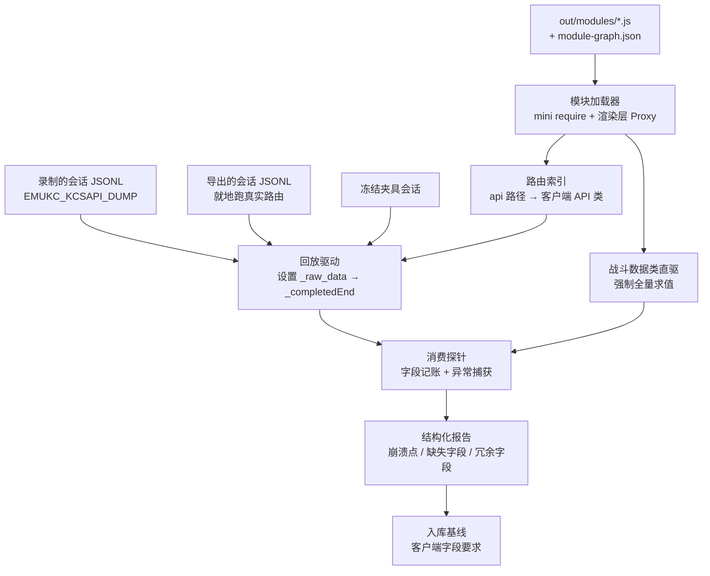
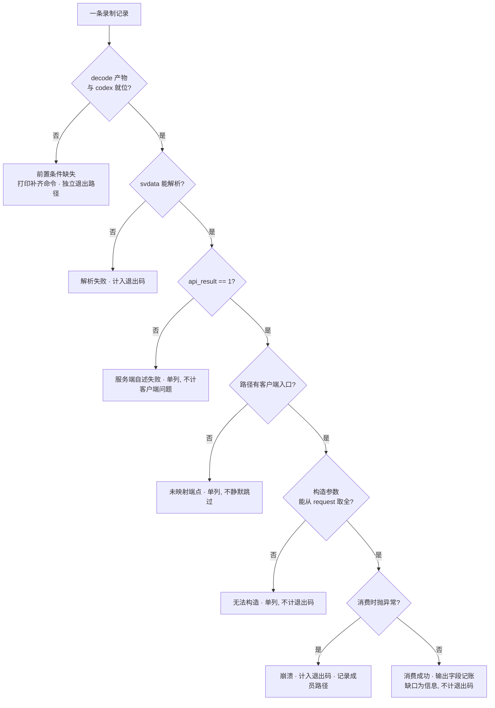

# Client-Executed API Response Verification - Plan

## Goal Capsule

- **Objective:** 开发者改完一个 API 后,能在不打开浏览器、不进游戏的前提下知道这条响应会不会让客户端崩掉、缺了哪些客户端真正要读的字段;游戏在带录制的会话里崩了时,现场可以被原样回放而不是重来一局。
- **Means:** 在 Bun 里直接执行 decode 出来的客户端模块,渲染层用 Proxy 顶掉,让客户端自己的解析代码消费我们的响应(KTD1);响应既可来自既有录制,也可由一条导出命令就地跑真实路由产出(KTD9)。
- **Authority order:** 本计划的 R-ID / KTD-ID / U-ID;`docs/solutions/architecture-patterns/drift-check-*.md` 与 `docs/solutions/best-practices/sim-validation-gate.md` 的既有边界;CLAUDE.md 的分层、禁止文件与质量门约定;客户端 decode 产物本身(它是协议的唯一真源,`docs/apilist.txt` 不是)。
- **Execution profile:** U1–U3 建机制(可用合成模块独立验证),U4–U6 组装成可用工具,U9 提供确定性语料,U7–U8 落回归基线与文档。U9 与 U1–U6 之间无依赖,可并行。
- **Stop conditions:** 若为了覆盖某个 API 需要给 PIXI 写语义 mock、模拟场景/动画生命周期,或需要把 handler 里的响应投影重构到别处,停下来回到规划——这三项都在范围外。导出通道只允许原样调用真实路由,不允许复制投影逻辑(KTD9)。
- **Tail ownership:** U8 负责 CLAUDE.md 与 Makefile 的一致性,以及本次全部质量门的收口(本计划现在改动 Rust,Rust 侧质量门是实质门禁而非形式检查)。

---

## Product Contract

### Summary

把客户端从"最终验收环境"变成"可编程的验证器"。`main-decoder` 已经把 `main.js` 拆成 2199 个可识别的 webpack 模块,其中 API 解析层与 model 层是纯数据代码——给它们一个 mock 掉的渲染层依赖,它们可以在 Bun 里脱离浏览器运行。服务端已有的 `EMUKC_KCSAPI_DUMP` 录制正好产出它们的输入。

本计划在 `main-decoder/` 内新增一条验证链路:加载客户端模块 → 按 URL 找到对应的 API 类 → 喂入我们的响应 → 报告崩溃位置、字段缺口与冗余字段。语料有两个来源:既有录制提供真实会话,新增的导出命令就地跑真实路由产出确定性响应,使改完代码后无需重新进入游戏即可验证。它同时是三样东西:改 API 时的即时检查、崩溃现场的可回放输入、以及一份入库的基线,让客户端版本漂移在 `git diff` 里可见。

### Problem Frame

验证服务端响应目前只有一条路:起服务器、开浏览器、进游戏走到对应画面。这条路的代价不在于慢,而在于不可恢复——KanColle 客户端遇到解析错误直接崩,没有错误边界也没有状态快照,一次崩溃意味着重新登录、重新出击、重新走到那一步。越靠后的 API(战斗、战果、出击结算)复现成本越高,而它们恰恰是响应结构最复杂、最容易出错的。

录制本身也不是随手就有的:`EMUKC_KCSAPI_DUMP` 默认关闭,只有带录制启动的会话才留下现场,普通会话崩了依然什么都没有。

现有的自动化只覆盖了一个切片:`validate_day_battle_response` / `validate_night_battle_response` 用 decode 出来的字段表做静态形状校验,只管战斗,且按设计只看协议形状不看行为(`docs/solutions/architecture-patterns/battle-protocol-validator-boundary.md`)。其余已实现端点没有任何客户端侧的一致性检查,漂移只能靠玩到那里才发现。

### Requirements

**验证能力**

- R1. 给定一条服务端响应与它的 API 路径,客户端的真实解析代码消费它,报告是否抛异常以及异常发生在客户端的哪个位置。
- R2. 报告区分两类字段差异:客户端读取了而响应未提供的,以及响应提供了而客户端从未读取的。
- R3. 战斗响应的数据层被强制全量解析,把只在特定分支才触发的崩溃前移为本次运行的即时错误。
- R4. 一次录制的会话按原顺序回放,客户端 model 的跨请求状态在回放过程中累积,后续请求在前序状态之上被消费。

**运行与接入**

- R5. 验证入口是一条命令,接受录制的 JSONL 或单条响应文件,输出结构化报告,发现错误时以非零状态退出。
- R6. 缺少 decode 产物或 bootstrap 数据时,结果是「前置条件缺失」并给出补齐命令,不是验证失败。
- R7. harness 自身的机制(模块加载、路由索引、探针记账)有不依赖真实 decode 产物的测试。
- R10. 一条导出命令在不启动服务器、不打开浏览器的前提下,按脚本化的请求序列产出当前代码的响应,输出与录制同一种记录格式,可直接作为验证输入。

**漂移与回归**

- R8. 客户端在冻结夹具会话上实际读取到的字段以入库基线文件记录,文件同时携带生成所用的夹具标识与一份已映射但未被夹具覆盖的端点清单;刷新基线是一条显式命令,不作为 decode 或同步的副作用发生。
- R9. 冻结的夹具会话回放必须全绿,并配一条故意损坏的负例,证明这条门禁在验证器退化成空操作时会失败。

### Success Criteria

- 改一个 API handler 后,导出加验证两条命令在 30 秒内给出该端点的字段缺口报告,全程不启动服务器、不打开浏览器;这条时间预算由 Verification Contract 里的计时门禁把关。
- 一份崩溃现场的 JSONL 能定位到具体是哪个 API 的哪个字段引发客户端异常,而不需要复现游戏状态。
- 客户端升版后重跑基线生成,`git diff` 直接显示夹具覆盖路径上哪些 API 的字段读取变了;未被覆盖的端点在同一份文件里列出,空 diff 不会被误读成客户端没变。

### Scope Boundaries

#### In Scope

- 客户端的 API 解析层与 model 层:响应进入 `_completedEnd` 之后对数据的消费。
- 战斗响应的数据类(`BattleRecordDay` / `BattleRecordNight` 及其 raw 包装)。
- Rust 侧的响应导出命令:就地调用真实路由产出确定性语料,不改既有 handler、不重构响应投影(KTD9)。

#### Deferred to Follow-Up Work

- 渲染层的语义 mock,以及由此得到的「客户端会去请求哪些资源 URL」追踪。现有的 `battle_resource_rules.json` 静态路线已覆盖战斗部分;把它做成执行态需要给 PIXI 写有语义的替身,成本与收益不匹配。
- 战斗开始类 API 包装类(`APIBattleStart` 等)的驱动。它们的构造函数要求一个已建好的出击上下文(`deck_f` / `deck_e` / `map_info`),需要先用客户端代码重建出击 model;昼夜战斗的解析逻辑由数据类直驱覆盖(KTD4)。
- `api_req_sortie/battleresult` 与 `api_req_combined_battle/battleresult` 的响应解析同样推迟,且 KTD4 覆盖不到它:解析发生在 `APIBattleResult._completedEnd` 委托的 `BattleResultData.setData` 里,而 `BattleResultData` 的构造同样要求出击上下文。
- 把 harness 的基线接入 `battle drift-check` 的指纹集合。

#### Outside this product's identity

- 数值正确性。本链路只检查客户端能否消费,不断言伤害、命中或掉落是否正确——那是 gameplay 测试与 `tests/gameplay_tests/battle_golden.rs` 的职责,与 `validate_day_battle_response` 同一条边界。
- 把 `docs/apilist.txt` 解析成机器可用的规则。它是过时风险很高的日文笔记,客户端代码才是真源。
- 浏览器端到端测试。

### Sources

- `src/bin/net/router/kcsapi/mod.rs` `dump_middleware` — 既有的 JSONL 录制,`response` 字段就是原始 `svdata=` 正文。
- `main-decoder/out/modules/module-38269-apibase.js` — `APIBase._parse` / `_endTask`,响应进入客户端的入口。
- `main-decoder/out/modules/module-46178-obj-util.js` — `ObjUtil` 的取值面,字段记账的主挂载点。注意 `getBoolean` 自己做 `hasOwnProperty` 后直接下标取值,不经过 `_getProp`。
- `main-decoder/out/modules/module-73509.js` — `HougekiListData` 按并行数组构造,经 `module-58435-raw-day-battle-data.js` 的 `hougeki*` getter 进入;缺 `api_at_eflag` 会在此处抛 `TypeError`,是本方案检测力的实测样本。目录下另有一份同名的 `module-61531.js`,它不在模块图内、harness 不会执行它(KTD5)。
- `docs/solutions/best-practices/sim-validation-gate.md` — 全通过门禁必须配负例的既有约定。
- `docs/solutions/architecture-patterns/drift-check-baseline-refresh-boundary.md` — 基线刷新为何必须是显式动作。
- `crates/emukc_gameplay/tests/sim_validation_gate.rs`、`tests/gameplay_tests.rs` — 前置条件缺失时的既有处理方式。
- `src/bin/net/router/kcsapi/api_port/port.rs` — 线上响应结构 `Resp` 与 `project(view)` 声明在 handler 内,gameplay 的视图操作只给到视图;这是导出必须走真实路由的原因。
- `src/bin/net/router/kcsapi/mod.rs` `test_utils::new_test_context` — 已有的内存态 `State` 构造(内存 DB + Codex + 临时缓存根 + 合成账号会话),导出命令复用它而非另建一套。

---

## Planning Contract

### Key Technical Decisions

- KTD1. **直接执行 decode 出来的模块体,渲染层用 Proxy mock。** `main-decoder/out/modules/*.js` 是原样的 `function(module, exports, require)` webpack 模块体,用一个按 id 查表的最小 require 即可加载;`PIXI` 等渲染依赖用一个对任意属性访问、调用、构造都返回自身的 Proxy 顶掉。实测加载 `PortAPI` 触及 844 个模块,仅 4 个失败,且全部是 UMD 外部注入的第三方库,与数据层无关。(session-settled: user-approved — chosen over 浏览器端到端测试与纯静态 schema 校验:前者无法脱离游戏状态,后者拿不到客户端的真实消费行为。)
- KTD2. **语料复用既有的 `EMUKC_KCSAPI_DUMP` 录制,不新建导出机制。** 该中间件已按 `{ts,method,path,query,request,status,response}` 落 JSONL,`response` 是未压缩的原始 `svdata=` 正文,正是 `APIBase._parse` 的入参;`make serve-dump` 已经是现成入口。录制是凭据级数据——`request` 里带 `api_token`,`response` 是完整存档,默认路径之所以安全只因为 `.data/` 被 gitignore(`docs/solutions/best-practices/kcsapi-dump-middleware.md`)。因此入库夹具必须经过脱敏,且脱敏由生成脚本执行,不靠人工检查。Governs R4, R5, R9。
- KTD3. **驱动方式是构造 API 类、设置 `_raw_data`,再直接调 `_completedEnd`,绕过 TaskBase 与网络层。** 走完整 task 流程会拖进加载动画、事件调度与重试计时器,它们属于渲染层;`_completedEnd` 才是消费响应的那一段。构造不能省:图内 121 个带字面量 `_url` 的 API 类里 99 个构造函数带参数,且相当一部分的 `_completedEnd` 直接读这些构造期字段,无参实例化会产生与响应无关的假崩溃。参数从录制记录的 `request` 表单体按形参名取值——录制里本来就有,无需新增机制。Governs R1。
- KTD4. **战斗走数据类直驱,不构造出击上下文。** 直接 `new BattleRecordDay(payload)` 并沿原型链强制求值全部 getter。实测一条 day battle 载荷触发 196 个成员,并在缺 `api_at_eflag` 时于 `HougekiListData` 构造处抛出真实 `TypeError`——与游戏内崩溃同一行代码。Governs R3。
- KTD5. **`module-graph.json` 是模块身份的唯一权威。** `out/modules/` 里存在不在图中的同名文件(例如两个 `port-api`,其中 `4342` 不在图内且无人引用),按文件名匹配会选错。路由索引只接受图中的模块,重名时取被引用的那个。这也避开了「钉死 webpack 模块 id 会随上游构建失效」的既有坑。
- KTD6. **基线刷新是独立的显式命令,不挂在 decode 或同步流程上。** 与 `battle drift-check --accept` 同一条边界:基线的价值就在于强制人看一眼 `git diff` 再确认客户端的变化是预期的,自动刷新会删掉这个检查点。Governs R8。
- KTD7. **前置条件缺失与验证失败是两种结果。** `out/modules/`(gitignore)与 `.data/codex/start2.json`(4.4 MB,不入库)都只在本地 decode / bootstrap 之后存在。沿用 `drift-check` 的 `VERSION_ABSENT` 与 gameplay 测试的 Codex 加载提示:报告为前置条件并给出补齐命令。Governs R6。
- KTD9. **导出通道就地跑真实路由,不另造投影。** 响应的线上结构声明在各 handler 内部(例如 `api_port/port` 的 `Resp` 与 `project(view)`),gameplay 的视图操作只给到视图,所以任何绕开 handler 的导出都会复制一份会漂移的投影。导出命令改为用 `tower` 的 `oneshot` 把脚本化请求送进真实的 axum router,拿回真正的 `svdata=` 正文。这既保证结构与线上一致,又不需要网络、不需要浏览器。Governs R10。
- KTD10. **导出与录制共用一种记录格式。** 导出按 `{ts,method,path,query,request,status,response}` 落 JSONL,与 `dump_middleware` 的输出同形,于是回放驱动只认一种输入,导出的会话与真实录制可以混用、互换。导出产物是合成账号,不含真实凭据,因此不需要 KTD2 的脱敏步骤。Governs R10, R5。
- KTD8. **两层测试。** 机制层(加载器、路由索引、探针记账)用合成模块测试,与 `main-decoder/test/*.test.ts` 现有写法一致,任何机器都能跑;一致性层跑真实产物与冻结夹具,前置条件不满足时跳过并说明原因。Governs R7, R9。

### High-Level Technical Design

回放驱动是有状态的:同一个进程内客户端的 model 是单例,按录制顺序消费会让状态自然累积,后一条请求在前一条建立的状态之上被解析(R4)。这也是为什么会话回放比单条响应检查更有检测力。

每条记录的归类决定了退出码,也决定了这条链路会不会被使用者静音。字段缺口是信息而不是失败——可选字段本来就允许缺席,把它算作失败会让报告在第一天就被忽略。

### Assumptions

- 录制会话里的 `api_start2/getData` 响应体约 4.4 MB,不适合入库;冻结夹具集合从本地 `.data/codex/start2.json` 取这一条,其余端点取录制里的实际响应。这与 gameplay 集成测试从 `.data/codex` 加载 Codex 的既有做法一致。
- 122 个客户端 API 类里有一部分 URL 是构造期条件赋值(战斗与连合舰队系列),不是字面量。路由索引先覆盖字面量赋值,条件赋值的端点落入「未映射」一类并在报告里列出,不静默跳过。

### Implementation Constraints

- 验证链路本体在 `main-decoder/` 内;Rust 侧只新增导出命令(U9),位于二进制 crate 的 CLI 层,不碰 workspace 分层与既有 handler。录制层已存在,不需改动。
- `main-decoder/out/**` 与 `crates/emukc_bootstrap/assets/*.json` 是生成产物,本计划只读不写。
- 缩进按 `.editorconfig`(4 空格,JSON 2 空格);`main-decoder/test/` 现状用 tab,新增测试沿用邻近文件。

### Risks & Dependencies

- **mock 边界可能把真问题吞掉,这是本链路最严重的失效模式。** 加载器在模块体抛异常时把它换成 mock 并继续;如果被换掉的是一个游戏逻辑模块,后续消费会在一个"假的"依赖上跑完而不报错,报告显示绿色但什么都没验证。缓解要可执行,否则实现者只能凭感觉划线:断言失败清单里的模块在 `module-graph.json` 中 `moduleKind` 全部为 `vendor`,任何 `game` 模块进入失败清单即判失败,同时报告原样列出完整清单供人工复核。一个只会通过的检查必须有办法失败,与 `sim-validation-gate.md` 的负例要求同源。
- **崩溃之后的回放结果可信度下降。** 一条记录消费失败会让客户端 model 停在半更新状态,后续条目是在被污染的状态上跑的。缓解:报告标注首个崩溃之后的条目,不把它们的字段记账当作结论。
- **一致性层依赖本地 decode 与 bootstrap 产物,新克隆的仓库跑不了。** 这是既定取舍而非缺陷(KTD7),但意味着这条门禁无法阻止一次盲目的提交,只能在开发者本地生效。
- **上游客户端结构变化会让路由索引失效。** `_url` 的赋值形态、模块可读名与图结构都来自上游构建。缓解:索引只依赖 `module-graph.json` 的结构与可读名,不钉 webpack id(KTD5)。

---

## Implementation Units

### U1. 客户端模块加载器与渲染层 mock 边界

- **Goal:** 能按模块 id 加载 `out/modules/` 里的客户端模块并拿到它的 exports,渲染层与第三方依赖由 mock 顶替,加载失败的模块被记录而不是中断加载。
- **Requirements:** R1, R6, R7
- **Dependencies:** 无
- **Files:** `main-decoder/src/harness/loader.ts`、`main-decoder/test/harness-loader.test.ts`
- **Approach:**
  1. 读 `out/modules/module-graph.json` 建立 id → 文件路径映射,只收图中的模块(KTD5)。
  2. mini require:惰性求值模块体,先把 exports 放进缓存再执行,以容忍循环依赖。
  3. 渲染层与浏览器全局(`PIXI`、`createjs`、音频、`window`/`document`/`navigator`/`location`)用统一的 Proxy 替身安装到全局。
  4. 模块体抛异常时,把该模块的 exports 换成带来源标记的 mock 并记入失败清单,加载继续。
  5. `out/modules/` 缺失时返回前置条件结果,附 decode 命令(KTD7)。
- **Patterns to follow:** `main-decoder/src/module-graph.ts` 读图的方式;`main-decoder/test/audio-resources.test.ts` 用合成 `ModuleArtifact` 构造被测输入的写法。
- **Test scenarios:**
  - 合成两个互相 require 的模块,加载任一个都拿到双方 exports,不栈溢出。
  - 合成一个引用未定义全局的模块,加载后它出现在失败清单里,而依赖它的模块仍能加载。
  - 合成模块访问 `PIXI.Container` 并 `new` 它,不抛异常。
  - 图中不存在的模块 id 被 require 时返回 mock 并记入失败清单,不抛异常。
  - 指向不存在的目录时返回前置条件结果,且结果里含 decode 命令字样。
- **Verification:** `bun test` 中本文件全绿;在真实产物上加载 `PortAPI` 时失败清单里的模块 `moduleKind` 全部为 `vendor`,无一为 `game`。

### U2. API 路由索引

- **Goal:** 从客户端模块里提取 `api_xxx/yyy` → 模块 id 的映射,使回放能按录制里的请求路径找到对应的客户端 API 类。
- **Requirements:** R1, R5
- **Dependencies:** U1
- **Files:** `main-decoder/src/harness/routes.ts`、`main-decoder/test/harness-routes.test.ts`
- **Approach:**
  1. 扫描图中模块源码里对 `_url` 的字面量赋值,得到路径 → 模块候选集,同时记录该 API 类构造函数的形参名顺序(回放据此从录制的 `request` 取值,见 KTD3)。
  2. 同一路径有多个候选时,按模块图的被引用情况取在用的那个(KTD5)。
  3. 导出未映射路径的清单:条件赋值的端点与我们已实现但客户端侧找不到入口的端点都在其中。
  4. 录制里的请求路径形如 `/api_port/port`——`nest("/kcsapi", …)` 在 dump 中间件看到请求前已剥掉前缀。索引查询前去掉前导斜杠,并兼容带 `/kcsapi/` 前缀的输入。
- **Patterns to follow:** `main-decoder/src/battle-knowledge.ts` 从模块源码提取结构化知识的做法。
- **Test scenarios:**
  - 合成一个含 `self._url = "api_port/port"` 的模块,索引能按该路径命中它。
  - 构造函数带形参的合成模块,索引记录下形参名及其顺序;无参构造记录为空列表。
  - 两个模块声明同一路径、其中一个无人引用时,索引选中被引用的那个。
  - 只做条件赋值(三元表达式)的模块不产生字面量映射,其端点出现在未映射清单里。
  - `/api_port/port`(录制的实际形态)、`api_port/port` 与带 `/kcsapi/` 前缀的路径查询得到同一结果。
- **Verification:** 在真实产物上运行,映射数量与 `apilist.md` 的已实现列表有可解释的交集,未映射清单可枚举且每一条能说明原因;带参构造的 API 类形参名被记录下来。

### U3. 消费探针

- **Goal:** 在客户端消费一条响应的过程中,记录它读了哪些字段、哪些没命中,并把只在特定分支才会触发的解析错误强制前移。
- **Requirements:** R1, R2, R3
- **Dependencies:** U1
- **Files:** `main-decoder/src/harness/probes.ts`、`main-decoder/test/harness-probes.test.ts`
- **Approach:**
  1. 字段记账:包装 `ObjUtil` 的全部公开取值方法(`getNumber` / `getString` / `getObject` / `getObjectArray` / `getNumArray` / `getStrArray` / `getBoolean`)与 `_getProp`,记录每次读取的字段名与是否命中。`getBoolean` 不走 `_getProp`,只包 `_getProp` 会让布尔字段的缺失静默通过;另有少数 API 类直接读 `this._raw_data.api_*`,由第 3 步的递归 Proxy 记账兜住。
  2. `ObjUtil` 对缺字段返回默认值而不抛错,所以「未命中」是主力信号,崩溃只是其中最严重的一种表现——两者都要出现在报告里。
  3. 冗余检测:响应对象用递归 Proxy 包裹,记录被访问过的路径,与响应自身的路径集合求差。整体存档式消费(例如把 `api_basic` 原样存起来)会让其下字段显示为未访问,报告需要把这种情况与真正的冗余区分开。
  4. 强制求值:沿原型链收集无参 getter 与无参方法并逐个求值,每个失败单独捕获并带上成员路径,不因第一个错误中断。
- **Patterns to follow:** 无既有同类代码;保持纯函数式的探针安装/卸载,便于按次重置。
- **Test scenarios:**
  - 合成对象读取存在字段,记为命中;读取缺失字段,记为未命中且仍返回默认值。
  - 经 `getBoolean` 读取缺失字段时同样记为未命中(该路径不经过 `_getProp`)。
  - 不经 `ObjUtil`、直接读 `_raw_data.api_*` 的访问被递归 Proxy 记账。
  - 递归 Proxy 下,嵌套对象的字段访问被记录为完整路径。
  - 强制求值遇到一个抛异常的 getter 时,该成员被记为失败,其余成员继续求值。
  - 探针卸载后 `ObjUtil._getProp` 行为与安装前一致。
- **Verification:** 在真实产物上对一条缺字段的 `api_port/port` 响应,报告列出的未命中字段与手工核对一致。

### U4. 会话回放驱动

- **Goal:** 读取录制的 JSONL,按顺序把每条响应交给对应的客户端 API 类消费,客户端 model 状态跨条累积,逐条产出消费结果。
- **Requirements:** R1, R2, R4
- **Dependencies:** U1, U2, U3
- **Files:** `main-decoder/src/harness/replay.ts`、`main-decoder/test/harness-replay.test.ts`
- **Approach:**
  1. 解析 JSONL 每行,剥掉 `response` 的 `svdata=` 前缀,取 `api_data`;`api_result != 1` 的记录按「服务端自述失败」单列,不当作客户端问题。
  2. 按索引记录的形参名从该条记录的 `request` 表单体取值,构造 API 类,设置 `_raw_data` 后调用 `_completedEnd`(KTD3)。
  3. 必需参数在 `request` 里取不到时归入「无法构造」一类单列,不计入崩溃、不影响退出码——那是语料不足,不是响应有问题。
  4. 整个会话共用一个模块加载器实例,使客户端 model 单例在条目之间保留状态。
  5. 每条记录产出一个结果:命中的端点、是否抛异常及异常位置、字段记账结果;未映射、无法构造与解析失败的记录各自单列。
  6. 一条记录抛异常不终止回放;报告需要说明后续条目是在一个可能已污染的状态上跑的。
- **Patterns to follow:** `main-decoder/src/pipeline.ts` 的阶段化组织与结果聚合方式。
- **Test scenarios:**
  - 带参构造的端点,其构造参数从该条记录的 `request` 表单体取到并填入,消费不因构造期字段为 undefined 而崩溃。
  - 必需参数在 `request` 里缺失时,该条归入「无法构造」,不计入崩溃也不影响退出码。
  - 两条记录的合成会话,第二条依赖第一条建立的 model 状态,回放后第二条消费成功。
  - 某条记录的路径未映射时被单列,后续记录仍被消费。
  - 某条记录消费时抛异常,该条记为崩溃并保留位置信息,回放继续到末尾。
  - `api_result` 非 1 的记录不被计为客户端问题。
  - 畸形 JSON 行被记为解析失败,不中断回放。
- **Verification:** 用一份真实录制回放,结果条目数等于输入行数,分类之和无遗漏。

### U5. 战斗数据层一致性探针

- **Goal:** 对战斗响应直接驱动客户端的战斗数据类并强制全量解析,使结构错误当场暴露。
- **Requirements:** R3
- **Dependencies:** U1, U3
- **Files:** `main-decoder/src/harness/battle.ts`、`main-decoder/test/harness-battle.test.ts`
- **Approach:**
  1. 按可读名从模块图定位 day / night 战斗记录类,不钉 webpack id(KTD5)。
  2. 用响应的 `api_data` 构造记录对象,再用 U3 的强制求值遍历它及其 raw 包装(KTD4)。
  3. 强制求值抓不到并行数组长度不一致:砲击列表以 `api_df_list.length` 为界、其余数组同下标取值,短了只得到 `undefined` 并被原样存进字段。构造数据类之前先对同组并行数组做显式长度一致性检查,不齐的按失败成员与异常同列上报。
  4. 失败按客户端成员路径归类输出,而不是只报一条顶层异常。
  5. 昼战与夜战共用同一条驱动路径,只在类的选择上分叉。
- **Patterns to follow:** `crates/emukc_bootstrap/src/battle_rules.rs` 昼夜共用 helper、只在字段表分叉的组织方式。
- **Test scenarios:**
  - 结构完整的 day battle 载荷,全量求值无失败成员。
  - 从同一载荷移除 `api_at_eflag`,砲击列表构造处报告失败,且失败项带成员路径。
  - 并行数组长度不一致的载荷被报告,而不是静默产出短列表。
  - night 载荷走 night 类,day 专有成员不被当作缺失。
- **Verification:** 现有 `tests/fixtures/battle/incident_slot_102.json` 能被驱动并产出报告;负例载荷必定产生失败成员。

### U6. 验证命令与报告输出

- **Goal:** 一条命令完成「输入录制或单条响应 → 输出结构化报告 → 发现错误时非零退出」。
- **Requirements:** R5, R6
- **Dependencies:** U4, U5
- **Files:** `main-decoder/src/harness/report.ts`、`main-decoder/src/verify-cli.ts`、`main-decoder/package.json`、`Makefile`、`main-decoder/test/harness-report.test.ts`
- **Approach:**
  1. 报告分四块:崩溃、字段缺口、未映射端点、前置条件。人读格式为默认,附结构化 JSON 输出选项。
  2. 退出码只由崩溃与解析失败决定;字段缺口、未映射端点与「无法构造」都是信息而非失败——可选字段的缺失是合法的,后两类是语料或索引的覆盖问题,把它们当失败会让报告立刻被静音。
  3. 前置条件缺失走独立退出路径并打印补齐命令,与验证失败区分(KTD7)。
  4. 加一个 `bun run verify` 脚本与一个 Makefile 目标,后者沿用现有目标的注释式帮助写法。
- **Patterns to follow:** `main-decoder/src/cli.ts` 的参数解析与输出组织;`src/bin/cli/battle.rs` 的 `--json` 双模式输出;`Makefile` 现有目标的 `## 说明` 注释格式。
- **Test scenarios:**
  - 含崩溃的结果集渲染出崩溃块并返回非零退出码。
  - 只有字段缺口的结果集返回零退出码,且缺口出现在报告里。
  - 前置条件缺失的结果走独立退出路径并含补齐命令。
  - 结构化输出是合法 JSON,且与人读格式的结论一致。
- **Verification:** 对一份真实录制执行命令,报告可读;人为损坏一条响应后命令以非零码退出。

### U7. 冻结夹具、客户端要求基线与负例

- **Goal:** 一组入库的夹具会话与一份入库的「客户端字段要求」基线,使回放成为可重复的回归检查,并让客户端漂移在 `git diff` 里可见。
- **Requirements:** R8, R9
- **Dependencies:** U6, U9
- **Files:** `main-decoder/test/fixtures/sessions/`、`main-decoder/baseline/client-api-requirements.json`、`main-decoder/src/harness/baseline.ts`、`main-decoder/test/harness-conformance.test.ts`
- **Approach:**
  1. 夹具优先由 U9 的导出命令产出——确定性、可重跑、账号是合成的。导出覆盖不到的端点才退回录制裁剪。两种来源都不入库 `api_start2/getData`(4.4 MB),回放时从 `.data/codex/start2.json` 取。
  2. 来自录制的夹具入库前由生成脚本脱敏:`request` 中的 `api_token` 与账号标识(`api_port` 等)、`response` 中的 member 标识一律替换为固定占位值。未经该步骤的录制不得进入 `main-decoder/test/fixtures/sessions/`(KTD2)。导出产物无此需要(KTD10)。
  3. 基线记录夹具覆盖到的每个已映射端点的客户端读取字段集与命中情况,并在文件头部写下夹具标识、在文件内列出已映射但未覆盖的端点;由一条显式命令重新生成,不挂在 decode 或同步上(KTD6)。
  4. 一致性测试回放夹具会话并断言无崩溃;前置条件不满足时跳过并打印原因(KTD8)。
  5. 配一条负例:把一份夹具响应按已知会崩的方式损坏,断言检查必定失败。这是全通过门禁的既有要求,防止验证器退化成空操作后门禁长绿。
- **Execution note:** 先写负例并确认它确实失败,再固化夹具与基线——否则无从判断这条门禁是真的在检查,还是从一开始就是空操作。
- **Patterns to follow:** `crates/emukc_gameplay/tests/sim_validation_gate.rs` 的正例 + `gate_bites_on_corrupted_payload` 负例配对;`tests/gameplay_tests.rs` 缺 `.data/codex` 时的提示方式。
- **Test scenarios:**
  - 夹具会话回放无崩溃,结果条目数与夹具行数一致。
  - 损坏后的夹具响应必定产生崩溃,断言门禁会失败。
  - 基线生成两次结果一致(字段集合顺序稳定,可 diff)。
  - 基线文件含夹具标识,且已映射但未覆盖的端点出现在未覆盖清单里而非被静默省略。
  - 入库夹具的任意一行都不含 `api_token` 或真实账号标识。
  - 缺 `out/modules/` 或缺 `.data/codex/start2.json` 时测试跳过且打印补齐命令,不报失败。
- **Verification:** `bun test` 在已 decode 的机器上全绿;删掉 `out/modules/` 后同一命令跳过而非失败;基线文件可提交且二次生成无 diff。

### U8. 文档与工作流收口

- **Goal:** 新链路在 CLAUDE.md 与 Makefile 帮助里可被发现,边界被明确写下,避免后来者把它当成数值正确性检查。
- **Requirements:** R6, R8
- **Dependencies:** U7
- **Files:** `CLAUDE.md`、`main-decoder/README.md`
- **Approach:**
  1. 在 CLAUDE.md 的 *Client-Derived Battle Validation* 一节旁新增一节,说明这条链路解决什么、怎么跑、前置条件是什么。
  2. 明确写下边界:它检查客户端能否消费,不检查数值是否正确——与既有战斗验证器同一条边界。
  3. 明确基线刷新是显式动作,与 `drift-check --accept` 的理由一致。
  4. 写下两种语料的分工与各自前提:导出命令用于验证当前代码的输出;崩溃现场的回放要求那次会话本来就用带录制的方式启动,普通启动不留现场。
  5. 在 `main-decoder/README.md` 补上新命令与它依赖的 decode 产物。
- **Test scenarios:** Test expectation: none — 纯文档,无行为变化。
- **Verification:** 按文档在一台只有仓库的机器上照做,能从零走到一次成功的验证运行,或得到明确的前置条件提示。

### U9. 响应导出命令

- **Goal:** 一条命令按脚本化的请求序列就地跑真实路由,把当前代码产出的响应写成与录制同形的 JSONL,使「改完就验」不依赖重新进入游戏。
- **Requirements:** R10, R5
- **Dependencies:** 无
- **Files:** `src/bin/cli/export.rs`、`src/bin/cli/mod.rs`、`src/bin/net/router/kcsapi/mod.rs`、`Makefile`
- **Approach:**
  1. 建内存态 `State`(内存 DB + 从 `.data/codex` 载入的 Codex + 临时缓存根),注册合成账号与会话。`test_utils::new_test_context` 已经在做这件事,把它从 `#[cfg(test)]` 提升为 CLI 与测试共用,而不是复制一份。
  2. 用 `tower` 的 `oneshot` 把请求送进真实的 axum router,取回带 `svdata=` 前缀的响应正文(KTD9)。
  3. 请求序列以命名场景给出,先覆盖一条母港序列与一条出击序列;场景沿用战斗模拟既有的预设登记表,不新开一套注册机制。
  4. 每次调用写一条 `{ts,method,path,query,request,status,response}` 记录(KTD10),`ts` 取固定基准值并按序递增,使同一场景两次导出逐字节一致。
  5. 需要 RNG 的环节接受种子参数,与战斗模拟同一种确定性约定。
- **Patterns to follow:** `src/bin/cli/battle.rs` 的 `SimContext` 与当前线程 runtime 组织方式;`src/bin/net/router/kcsapi/mod.rs` 的 `test_utils::new_test_context`;`Makefile` 现有目标的 `## 说明` 注释格式。
- **Test scenarios:**
  - 同一场景同一种子导出两次,输出逐字节一致。
  - 导出的每一行都能被解析成记录结构,`response` 带 `svdata=` 前缀。
  - 母港场景的导出中出现 `api_port/port` 且 `api_result` 为 1。
  - 缺 `.data/codex` 时报前置条件缺失并给出 bootstrap 命令,不是 panic。
  - 导出产物不含真实账号的令牌(合成账号,且该断言能在将来接入真实凭据时失败)。
- **Verification:** 导出一条母港序列并直接交给验证命令消费,全链路无崩溃;两次导出的文件内容相同。

---

## Verification Contract

| 门禁 | 适用 | 通过标准 |
|---|---|---|
| `cd main-decoder && bun test` | U1–U7 | 全绿;前置条件缺失时跳过项打印原因,无静默跳过 |
| `cd main-decoder && bun run check` | U1–U8 | `tsc --noEmit` 无错误 |
| 夹具会话回放 | U7 | 无崩溃;损坏负例必定失败 |
| 基线二次生成 | U7 | 两次生成无 diff |
| 导出→验证计时 | U6, U9 | 一次导出加一次验证的总耗时不超过 30 秒 |
| `cargo fmt --all --check` | 全局 | 通过 |
| `cargo clippy --workspace -- -W warnings` | 全局 | 无新增告警 |
| `cargo test` | 全局 | 与计划开始前的基线一致,U9 新增的测试全绿 |

`practice_battle` 的胜利评级断言是已知的非确定性失败,不是本计划引入的回归信号;`emukc_time` 有 2 个既有失败。二者按既有记录处理,不在本计划范围内修复。

---

## Definition of Done

**全局**

- R1–R10 各有对应的实现单元与通过的测试。
- 验证链路能在一台已 decode 的机器上从一条命令跑到一份报告。
- 未映射端点清单可枚举,每一条能说明原因,不存在静默跳过的端点。
- 夹具与基线已入库,负例证明门禁会失败。
- 探索期的临时脚本与试验代码不留在 diff 里。

**按单元**

- U1:真实产物上加载数据层 API 类成功,失败清单中模块的 `moduleKind` 全部为 `vendor`。
- U2:路由索引在真实产物上产出映射与未映射两份清单。
- U3:字段记账与强制求值在合成用例上行为正确,且能卸载。
- U4:一份真实录制完整回放,分类计数无遗漏;带参构造端点走的是取参构造而非无参实例化。
- U5:昼夜战斗载荷各跑通一次,负例产生失败成员。
- U6:命令对损坏输入非零退出,对前置条件缺失走独立路径。
- U7:夹具全绿、负例会咬、基线可重复生成,且覆盖缺口随基线文件一起入库。
- U8:CLAUDE.md 与 README 与实际命令一致,并写明两种语料的分工与前提。
- U9:同场景同种子两次导出逐字节一致,产物能直接被验证命令消费。
