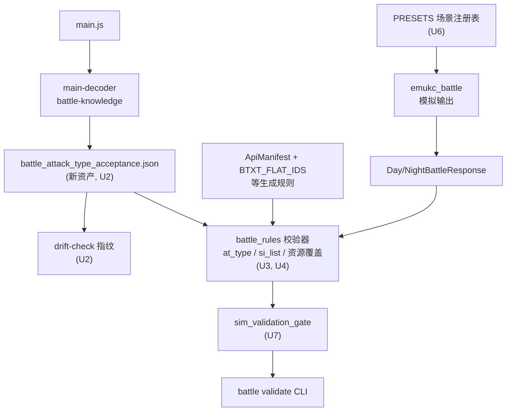
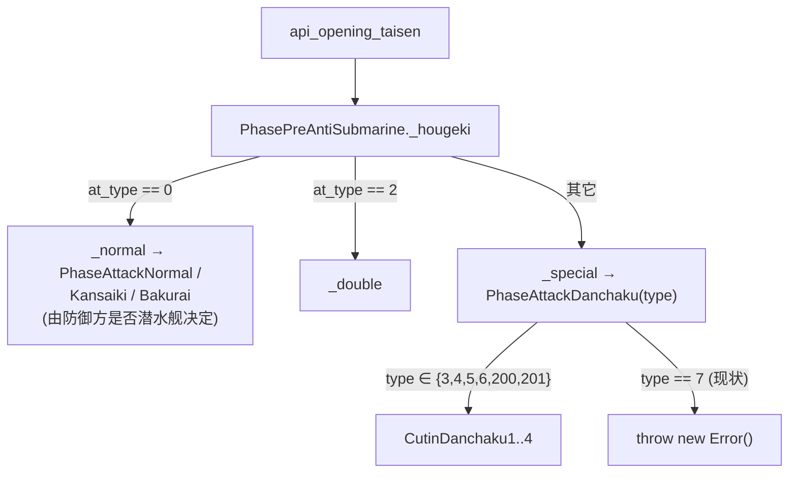

# Battle Protocol Semantics and Resource Coverage Gate - Plan

## Goal Capsule

- **Objective:** 玩家打一场带先制对潜的出击，战斗动画能正常播完；任何一场战斗里客户端要的图都取得到，不会因为服务端给的数据而卡在加载或抛异常。
- **Means:** 把「客户端接受什么」从解码产物里取出来当断言基准，并让既有的 sim→validate 闸门真正跑到装备驱动的路径上 (KTD1, KTD4)。
- **Authority order:** 本计划的 R-ID / KTD-ID / U-ID；`docs/solutions/architecture-patterns/battle-attack-type.md` 与 `battle-protocol-validator-boundary.md` 的既有边界；CLAUDE.md 的分层、禁改文件与质量门；解码出的客户端模块是「客户端接受什么」的唯一真源，`docs/apilist.txt` 是字段**语义**来源但不给每个阶段的接受集。
- **Execution profile:** U1 是独立的缺陷修复，可先落。U2–U4 建断言机制（U3 依赖 U2，U4 与二者无关可并行）。U5–U6 分别收窄产出与扩大覆盖。U7 把攻击种别与资源覆盖两条断言接进闸门（展示装备那条按 KTD6 留在 U5），其红灯由 U8 收敛，两者同 PR 落地。U9 收口。
- **Stop conditions:** 若某条不变量必须执行客户端模块、或要给渲染层写语义 mock 才能判定，停下——那是 `docs/plans/2026-09-19-2016-feat-client-executed-api-verification-plan.md` 的范围。若 U8 发现某资源在所有镜像上都不存在，停下不要造图，回到展示规则收窄。
- **Tail ownership:** U9 负责 `docs/battle/rules.md` 登记、CLAUDE.md 的战斗资产清单、`PROJECT_MEMORY.md` 回写，以及本次全部质量门的收口。

---

## Product Contract

### Summary

服务端现在能产出客户端拒绝解析的战斗数据，而没有任何自动检查会发现。本计划先修掉已定位的一处确定性崩溃，再把「客户端会接受什么」变成三条可断言的判据：攻击种别落在消费模块的接受集内、展示装备落在该攻击类型的合法集内、推导出的资源路径落在 bootstrap 的覆盖内。前者与后者在闸门里断言，中间那条按 KTD6 在战斗 crate 内按构造保证并自测。判据的真源分两处——攻击种别的接受集只有客户端知道，所以从解码产物产出；装备与攻击类型的对应是游戏规则，留在 Rust 规则层并进 `docs/battle/rules.md` 登记表。最后把场景预设扩到能触发装备驱动的路径，让这三条断言在 `cargo test` 里实际跑到。

### Problem Frame

`crates/emukc_gameplay/tests/sim_validation_gate.rs` 是目前唯一会在 CI 里拦住协议漂移的闸门，但它的两个场景预设都是**零装备**驱逐舰（`Scenario::fresh_1_1` / `leveled_for_mid_boss` 全是 mst 951，且 `ShipSpec` 根本没有装备字段）。于是 `api_si_list` 恒为 `[-1]`，`can_opening_asw` 永不成立，昼夜切入、空母切入、特殊攻击、联合舰队路径零覆盖。

闸门本身也只检查形状。`validate_day_battle_response` 会把敌舰 banner、装备资源路径全部推导出来放进 `report.expected_resources`，但全仓库对它的唯一使用是 `assert!(!report.expected_resources.is_empty())`——只断言非空，从不检查这些路径是否真的会被 bootstrap 生成。「客户端会不会请求不存在的资源」这个问题，现有检查把它算出来了，然后丢掉。

两类后果都已经具体化：

- `crates/emukc_battle/src/simulation/asw.rs` 给开幕对潜写死 `api_at_type = 7`。客户端把 `api_opening_taisen` 交给 `PhasePreAntiSubmarine`，其分发只认 0（普通）与 2（連撃），其余全部交给 `PhaseAttackDanchaku`，而该构造函数只接受 `{3,4,5,6,200,201}`，其它值走到 `throw new Error()`。只要任一方有先制对潜舰且对面有潜水舰，战斗场景就抛异常。`docs/apilist.txt:2260` 自己写着 `7=空母カットイン`。
- `crates/emukc_battle/src/simulation/shelling.rs` 的昼战对潜分支同样写 7。这条走 `PhaseHougeki`，7 是合法分支（空母切入），不崩，但驱逐舰投爆雷会播成空母切入动画。正确值是 0：客户端 `_getNormalAttackType` 自己会按防御方是否潜水舰选爆雷或对潜机动画。

这两处都违反仓库自己已经写下的规则——`docs/solutions/architecture-patterns/battle-attack-type.md` 明说「装备只选择展示类型，没有相关装备时 `api_at_type = 0`」。规则写在文档里，但没有任何测试守着它。

资源侧的暴露面比单个事故大。`btxt_flat` 不是切入专属：`module-19362-cutin-attack.js` 的 `CutinAttack` 被**普通炮击** `PhaseAttackNormal` 使用，对 `si_list[0]` 无条件发起 `slot/btxt_flat/<id>.png`。当前 manifest 里 586 件玩家可得装备中有 333 件没有 `btxt_flat`；按仓库现有展示类型白名单筛，仍有 127 件在类型上允许进 `si_list`。已归档的 `102 → btxt_flat` 事故（九八式水上偵察機(夜偵)）正是这条路径。

### Key Decisions

- **用组合枚举的不变量测试，不用随机 fuzz** (session-settled: user-approved — chosen over 随机扰动战斗响应：服务端是输出的生成方而不是不可信输入的解析方，随机扰动只能证明我们自己的序列化器还能工作，证明不了客户端会接受)。Governs R2, R5, R6.
- **先修已定位的缺陷，再建断言机制** (session-settled: user-approved — chosen over 先建测试基础设施再让它去找缺陷：U1 的崩溃已经定位到客户端构造函数的 `throw`，等机制建好再修等于让一个已知崩溃多活几个单元)。Governs R1.

### Requirements

**攻击种别合法性**

- R1. 对潜攻击在 `api_opening_taisen` 与昼战 `api_hougeki*` 中以 `api_at_type = 0` 上报，爆雷/对潜机的动画选择交给客户端。
- R2. 服务端产出的每个 `api_at_type` 与 `api_sp_list` 取值，都落在该字段所属消费阶段的客户端接受集合内；越界是错误级发现。

**展示装备合法性**

- R3. 进入 `api_si_list` 的装备 id，其装备类型属于该攻击类型的合法展示集；`DoubleAttack` 与切入不得回退到宽泛的「昼战水面展示类型」集合。

**资源覆盖**

- R4. 一场战斗响应推导出的每条资源路径，都能被 `make_list` 的生成规则覆盖；未覆盖即错误级发现。比对必须与生成侧同源，包括生成侧对装备 id 做的归一化——路径算法不一致造成的假阳性与真缺口同样会让闸门失效。

**验证覆盖**

- R5. 场景预设能给舰船配置装备与派生属性，使闸门实际走到开幕对潜、昼夜切入、空母切入三条路径。
- R6. R2、R3、R4 各有一个「必须失败」的反向测试，证明对应断言不是恒真。R2 与 R4 的反向测试在闸门里；R3 的在 `emukc_battle` 的单元测试里（理由见 KTD6）。

**知识沉淀**

- R7. 新增的判据资产被 `drift-check` 跟踪，随 `main.js` 漂移可见。
- R8. R1–R4 的规则进入 `docs/battle/rules.md` 登记表，带证据等级与来源。

### Success Criteria

- 在装有声纳的驱逐舰编队里出击含潜水舰的海域，战斗动画播完而不抛异常——这是 Objective 在本仓库里唯一可外部核验的形态，由 U7 的开幕对潜预设在闸门里代理。
- 把一个已知不合法的攻击种别或未覆盖装备 id 注入响应，闸门报错而不是通过。

### Scope Boundaries

**Deferred to Follow-Up Work**

- 特殊攻击的包形状。`crates/emukc_battle/src/simulation/special_attack.rs` 按每个参战舰发一条 `at_type=100` 记录（共 3 条，每条 `df_list` 长度 1），官方是**一条**记录带三个目标（`docs/apilist.txt:2316`「単発カットイン攻撃では [防御艦, -1, -1] になる」）。客户端 `_nelson_touch` 从一条记录里读 `d_indexes[0..2]`，所以当前会把切入动画连播三次、每次只有一个目标；`PhaseNelsonTouch` 还把攻击方写死为 `deck_f.ships[0/2/4]`。这是包**形状**缺陷而非取值合法性缺陷，修它要重做参战舰的索引与伤害分配并重新冻结黄金基线，属另一条变更线。**本计划的 R2 检查抓不到它**（100 是合法取值），不要因为闸门变绿就认为这条已经解决。
- `BTXT_FLAT_IDS` 的全量审计。U8 只收敛闸门实际报出来的条目，不做整表对账。

**Outside this plan**

- 未实现的战斗阶段：支援舰队、基地航空队、友军舰队、噴式強襲、`api_kouku2`、敌连合端点。缺字段客户端有 null 检查（`module-83034` 全走 `ObjUtil.get*` + null 判定），是缺功能而不是会产出非法数据。
- 伤害数值正确性。协议合法性与数值正确性的边界沿用 `docs/solutions/architecture-patterns/battle-protocol-validator-boundary.md`。
- 在 Bun 里执行客户端模块来验证响应。那是 `docs/plans/2026-09-19-2016-feat-client-executed-api-verification-plan.md` 的范围；本计划只静态比对解码出的接受集，两者互补不重叠。
- CDN 上资源的实际存在性。按 `PROJECT_MEMORY.md` 的既有结论，`cache populate` 才是权威探针；本计划只断言「bootstrap 的生成规则覆盖它」。

### Sources

- `docs/solutions/architecture-patterns/battle-attack-type.md` — 参战由舰种与基础属性决定，装备只选展示类型；无相关装备时 `api_at_type = 0`。R1 与 R3 是这条规则的可执行化。
- `docs/solutions/architecture-patterns/battle-protocol-validator-boundary.md` — 校验器只管协议形状不管数值；新增的三条检查都不是数值检查，留在同一层。
- `docs/solutions/best-practices/sim-validation-gate.md` — `PRESETS` 注册表驱动闸门；加 preset 自动扩覆盖；任何恒真闸门必须配反向测试。
- `docs/apilist.txt:2252-2280`（昼战 `api_at_type` 取值表）与 `:2319-2350`（夜战 `api_sp_list` 取值表）— 字段语义来源，但不给每个消费阶段的接受集。
- 解码模块 `module-29177-phase-pre-anti-submarine.js`、`module-1830-phase-hougeki.js`、`module-65622-phase-hougeki.js`、`module-90992-phase-attack-danchaku.js` — 三个阶段的分发与 Danchaku 构造函数的接受集。
- 解码模块 `module-19362-cutin-attack.js`、`module-6439-cutin-double.js`、`module-58441-cutin-resources-preload-task.js`、`module-482-preload-cutin-kubo.js` — 四条 `btxt_flat` 触发路径；只有空母切入那条带 `night` 守卫。
- `main-decoder/src/path-rules.ts:129` — `btxtFlatSlotIds` 由 `parseRustLazyNumberArray` 从 Rust 的 `BTXT_FLAT_IDS` 反向读出，方向是 Rust → 资产，所以该表是手维护的。

---

## Planning Contract

### Key Technical Decisions

KTD1. **攻击种别的接受集由解码器产出为新资产；装备与攻击类型的对应留在 Rust 规则层。** 两者真源不同：「哪个消费模块接受哪些取值」只有客户端知道，`docs/apilist.txt` 给的是每个值的含义而非每个阶段的接受集；而「什么装备能进哪种攻击的展示」是游戏规则，归 `docs/battle/rules.md` 登记。手写一张接受表会重蹈 `DAY_SURFACE_DISPLAY_TYPES` 的覆辙——那张手写表正是 `102 → btxt_flat` 事故的来源。

这条理由不适用于 `BTXT_FLAT_IDS`，两者回答的不是同一个问题。解码结论是「客户端对**任何**非敌方装备都会取 `btxt_flat`」（`cache_rules.json` 的 `slotRules.btxtFlat`，`kind: btxt_flat_non_enemy_runtime_slots`，`excludeEnemyItems: true`），客户端侧没有 id 白名单；`BTXT_FLAT_IDS` 是我们维护的「上游**存在**哪些文件」表，与客户端行为无关，所以它手维护不构成 KTD1 意义上的腐烂。U8 的两条分支正是从这个区分推出来的。Governs R2, R3, R7.

KTD2. **资源覆盖比对生成规则，不构建完整 `CacheList`，不比对本地缓存目录。** `build_cache_list_*` 需要 `Kache`（会打 CDN，仓库已因此给 `make_list` 测试加了 skip-if-offline），而闸门当前无网络、无 `.data/cache` 依赖，必须保持。校验器与 `make_list` 同在 `emukc_bootstrap`，`has_btxt_flat_coverage` 这类逐类谓词已经可用，且 `analyze_day_battle_incident` 已经在用它。Governs R4.

KTD3. **校验器只产出协议嫌疑一种发现；`BootstrapGap` 留给事故分析器。** 既有两分法是以「客户端确实 404 了」为前提的：覆盖谓词为假记 `ProtocolSuspicion`，为真记 `BootstrapGap`（覆盖表说该有、客户端却取不到）。校验器没有事故输入，为真就等于没问题，`BootstrapGap` 那支在校验器里不可达。因此下沉的是覆盖谓词本身而不是分类：校验器对每条推导资源调用谓词，为假即 `ProtocolSuspicion`，`analyze_day_battle_incident` 的两分法原样保留。后续该补覆盖表还是该收窄产出，由 U8 的远端探测结果决定，不由 finding 种别决定。Governs R4.

KTD4. **三条新检查都作为 `BattleValidationReport` 的新 finding 种别，不新建验证层。** `BattleValidationFindingKind` 已经是「客户端解析不了」的承载体。新建一层会让 `battle validate` CLI 与闸门各查一半，并让 `docs/solutions/architecture-patterns/battle-protocol-validator-boundary.md` 的边界说明失效。Governs R2, R3, R4.

KTD5. **场景预设扩展走 `PRESETS` 注册表，靠等级与装备而不是写死属性值来跨过参战门槛。** `update_ship_impl` 与 `set_slot_item_impl` 都以 `recalculate_ship_status_with_model` 收尾，它调用 `cal_ship_status` 按「基础值 + 等级公式 + `api_kyouka` + 装备加成」重算 `api_taisen[0]`——直接写 `api_taisen[0]` 的覆盖会被下一次落盘抹掉。`can_opening_asw` 对 DD 要求对潜值 ≥ 100 且装有声纳，所以预设能动的杠杆只有三个：`api_lv`、`api_kyouka[6]`、以及装上的声纳。`ShipSpec` 因此只需增加按槽位声明装备的能力。Governs R5.

KTD6. **R3 由 `emukc_battle` 按构造保证并在该 crate 内自测，不在校验器里再建一张展示类型表。** `emukc_bootstrap` 不依赖 `emukc_battle`（后者只依赖 `emukc_model`），校验器要判「某装备类型能否进这种攻击的展示」就得复制一份类型表，而复制一张会漂的展示类型表正是 `102 → btxt_flat` 事故的成因；`docs/solutions/architecture-patterns/battle-protocol-validator-boundary.md` 也把该层限定在协议形状而非游戏规则。所以 R3 的正向保证与反向测试都落在 U5，客户端可见的后果（展示了没有 `btxt_flat` 的装备）由 R4 的覆盖检查在闸门里兜住。代价是「取值合法但语义错」这一类——U1 要修的昼战对潜 `at_type = 7` 正属此类——不在闸门覆盖内，只由各自 crate 的单元测试守住。Governs R3, R6.

### High-Level Technical Design

判据与断言的数据流。左半是新增的解码链路（KTD1），右半是既有校验器扩展（KTD2–KTD4）；闸门是唯一把两者与真实模拟输出对上的地方。

客户端对开幕对潜的分发，即 R1 要守住的边界。`PhaseAttackDanchaku` 的构造函数是崩溃点。

### Assumptions

- 昼战 `PhaseHougeki`、夜战 `PhaseHougeki`、开幕对潜 `PhasePreAntiSubmarine` 三处的分发都是嵌套三元表达式，形状足够规整，可以用现有的 Babel AST 遍历提取取值集合。若上游改写成 `switch`，提取器要跟着改——这正是 R7 的 drift-check 要抓的。
- 夜战的消费模块在 `battle_slot_resource_triggers.json` 里没有 protocol source 映射（现有 `protocolSources` 只列昼战 `api_hougeki1/2/3`）。新资产按**消费模块的 `readableName`** 而不是 protocol source 来组织接受集，绕开这个已知缺口。
- 按 `PROJECT_MEMORY.md` 的已知坑，解码器测试不得钉 webpack module id。但 `readableName` 单独也不够：`battle_module_index.json` 里 1830 与 74885 同名 `PhaseHougeki` 且同为 `priority-body`，而两者语义互斥——昼战那份是 `2=連撃 / 7=空母切入`，夜战那份是 `1=連撃 / 6=空母切入`。按 hotspot 深浅二选一会静默产出错误的昼战接受集，让闸门对服务端正常产出的 `api_at_type = 2` 恒红。消歧必须按**消费方**：昼战那份由 `RawDayBattleData` 的 `hougeki1/2/3` 喂入，夜战那份消费 `api_sp_list` 与 `api_n_mother_list`。

---

## Implementation Units

### U1. 对潜攻击的攻击种别归零

- **Goal:** 开幕对潜与昼战对潜不再上报 `api_at_type = 7`，客户端不再在开幕对潜抛异常。
- **Requirements:** R1
- **Dependencies:** 无
- **Files:**
  - `crates/emukc_battle/src/simulation/asw.rs`（含其 `#[cfg(test)] mod tests`）
  - `crates/emukc_battle/src/simulation/shelling.rs`（含其 `#[cfg(test)] mod tests`）
- **Approach:**
  1. 把 `simulate_opening_taisen` 友方与敌方两个循环里写死的攻击种别改为 0，并改掉误导性注释（现注释写「ASW attack type」，而 7 在客户端是空母切入）。
  2. 把 `simulate_shelling_side` 的 `is_asw_attack` 分支同样改为 0。
  3. 修正 `asw.rs` 里把 7 固化成断言的既有测试——它当前锁着错误值。
- **Patterns to follow:** `docs/solutions/architecture-patterns/battle-attack-type.md` 的「无相关装备时 `api_at_type = 0`，动画由客户端选」；si_list 仍按 `day_attack_display_ids(.., true)` 走对潜装备优先，不动。
- **Test scenarios:**
  - 装声纳且对潜值达标的 DD 对上潜水舰，开幕对潜产出的 `api_at_type` 全为 0。
  - 敌方先制对潜命中我方潜水舰时，`api_at_eflag = 1` 的条目 `api_at_type` 同样为 0。
  - 昼战炮击命中潜水舰时 `api_at_type` 为 0，且 `api_si_list` 仍是整数型（非切入）。
  - 昼战炮击命中水面舰不受影响，切入与連撃的取值不变。
- **Verification:** `cargo test -p emukc_battle` 通过；两套黄金基线零 diff——`crates/emukc_battle/tests/golden/day_seed_*.txt` 现有 `api_at_type` 取值集合只有 `{0}` 且 `opening_taisen: None`，`tests/gameplay_tests/battle_golden.rs` 的 1-1 转录里没有对潜攻击，所以本单元不触发重新冻结。若任一基线出现 diff，说明假设不成立，停下来查清原因再决定是否重新冻结。
- **Execution note:** 单独提交，提交信息说明 7 是客户端的空母切入种别。

### U2. 解码器产出攻击种别接受集资产

- **Goal:** 把「每个战斗阶段的消费模块接受哪些攻击种别取值」变成随 `main.js` 再生的资产。
- **Requirements:** R2, R7
- **Dependencies:** 无
- **Files:**
  - `main-decoder/src/battle-knowledge.ts`
  - `main-decoder/src/types.ts`
  - `main-decoder/src/pipeline.ts`
  - `main-decoder/test/battle-knowledge.test.ts`
  - `crates/emukc_bootstrap/assets/battle_attack_type_acceptance.json`（同步产物，经 `--sync-battle-assets`）
  - `src/bin/cli/drift_check.rs`
  - `crates/emukc_bootstrap/src/battle_rules.rs`（路径 helper 与反序列化类型）
- **Approach:**
  1. 新增提取器，按消费模块的 `readableName` 定位三处分发（昼战炮击、夜战炮击、开幕对潜）与 Danchaku 构造函数，收集各自显式比较的取值。`PhaseHougeki` 有昼夜两份同名模块，按 Assumptions 的消费方规则消歧；消歧不成立时**报错中止**，不要静默挑一份。
  2. 对每个消费模块记录：接受集、是否有 fallback 分支、fallback 去向的模块名。fallback 去向本身也有接受集时，合并为该阶段的有效接受集。
  3. 产出资产，沿用既有四份资产的 `scriptVersion` + `summary` + 列表结构；在 `pipeline.ts` 的 `--sync-battle-assets` 分支里同步到 `crates/emukc_bootstrap/assets/`。
  4. 在 Rust 侧加对应的 `repo_battle_attack_type_acceptance_path()` 与 `include_str!` 嵌入，形状对齐既有四份。
  5. 在 `drift_check.rs` 的资产表里登记一条。
- **Patterns to follow:** `toBattleSlotResourceTriggersAsset` 是最接近的产出形状（少量条目 + confidence + notes）；Rust 侧对齐 `BattleSlotResourceTriggersAsset` 的嵌入与加载。
- **Test scenarios:**
  - 给定合成的嵌套三元分发源，提取器产出预期取值集合，且不含比较式里出现的非攻击种别数字。
  - 有 fallback 分支的模块，其有效接受集包含 fallback 目标的接受集。
  - 无 fallback 的模块（Danchaku 构造函数形状）标记为封闭集。
  - `PhaseHougeki` 的昼夜两份被正确区分：昼战接受集含 2，夜战接受集不含 2 而含 1。
  - 消费方规则无法区分同名模块时，提取器报错而不是静默产出其中一份。
  - 昼战接受集与服务端 `DayAttackType` 的常量对账：`DoubleAttack = 2`、`CarrierCI = 7` 都在接受集内。
  - 真实 `main.js` 产出的昼战接受集含 0、2、7、100–103、105、106、200、300–302、400、401；开幕对潜的有效接受集含 0、2、3、4、5、6、200、201 且**不含 7**。
- **Verification:** `cd main-decoder && bun test && bun run check` 通过；`bun run decode -- --sync-battle-assets` 后新资产出现在 `crates/emukc_bootstrap/assets/`；`make drift-check` 报一条 `added_assets`，`make drift-accept` 后归零。

### U3. 校验器判定攻击种别合法性

- **Goal:** 昼战与夜战响应里越界的 `api_at_type` / `api_sp_list` 成为错误级发现。
- **Requirements:** R2
- **Dependencies:** U2
- **Files:**
  - `crates/emukc_bootstrap/src/battle_rules.rs`（含其 `#[cfg(test)] mod tests`）
- **Approach:**
  1. 在 `BattleValidationFindingKind` 增加越界种别，沿用 `push_error` 的构造方式。
  2. `validate_day_battle_response` 对 `api_hougeki1/2/3` 的 `api_at_type` 用昼战接受集判定，对 `api_opening_taisen` 用开幕对潜的有效接受集判定——两者接受集不同，这是本单元的核心区分。
  3. `validate_night_battle_response` 对 `api_hougeki` / `api_n_hougeki*` 的 `api_sp_list` 用夜战接受集判定。
  4. 发现信息带上字段名、越界值、以及该阶段的消费模块名，让实现者不必回去读解码产物。
- **Patterns to follow:** `check_array_flag_payload` / `check_night_hougeki_shape` 的「按字段表驱动、复用 push_* 辅助」；按 KTD4，不新建报告类型。
- **Test scenarios:**
  - 昼战 `api_hougeki1` 里 `api_at_type = 7` 通过（空母切入合法）。
  - 开幕对潜里 `api_at_type = 7` 报错，且信息指向 `PhasePreAntiSubmarine`。
  - 开幕对潜里 `api_at_type = 0` 与 `= 2` 通过。
  - 夜战 `api_sp_list = 2`（主魚切入）通过，`api_sp_list = 99` 报错。
  - `api_at_type` 数组比 `api_df_list` 短时，缺失位不产生越界误报——长度不齐由既有形状检查负责。
- **Verification:** `cargo test -p emukc_bootstrap battle_rules` 通过；把 U1 修复前的一份开幕对潜响应存成 JSON，`cargo run -- battle validate --input <file>` 报错退出。

### U4. 校验器判定资源覆盖

- **Goal:** 推导出的每条资源路径都被检查是否在 bootstrap 的生成覆盖内，不再只统计条数。
- **Requirements:** R4
- **Dependencies:** 无
- **Files:**
  - `crates/emukc_bootstrap/src/battle_rules.rs`（含其 `#[cfg(test)] mod tests`）
  - `crates/emukc_bootstrap/src/make_list/source/kcs2/resources/slot.rs`
  - `crates/emukc_bootstrap/src/make_list/source/kcs2/resources/ship.rs`
- **Approach:**
  1. 把覆盖谓词从 `analyze_day_battle_incident` 里抽成共享函数（按 KTD3 抽的是谓词，不是两分法），事故分析器改为调用它，行为不变。
  2. **把 `btxt_flat` 从 candidate 移到 expected。** `collect_slotitem_target_types` 现在只把 `item_up` 放进 expected，`item_on` 与 `btxt_flat` 都在 candidate，而 candidate 只报 warning——不动这一行，本计划的动机事故那条路径在新闸门里依然恒绿。`item_on` 留在 candidate。
  3. **`item_up` 的路径推导必须先归一化。** `cache_rules.json` 的 `slotRules.itemUp`（`kind: item_up_normalization`）带 `replaceMap` 与 `enemySlotBorder`，生成侧会把敌方 id 映射掉（1550→3、1563→162、1570→15…），而 `build_slotitem_resource_path` 用的是原始 id。不补这一层，敌舰装备会条条对不上——`fresh_1_1` 的駆逐ロ級装备 1501 就会命中。归一化加进 `build_slotitem_resource_path` 的 `item_up` 分支，保持单一入口。
  4. 为校验器产出的每个 `target_type` 补齐覆盖谓词。装备侧扩展 `has_btxt_flat_coverage` 的同类形状。舰船 banner / full 侧目前没有全局访问器——`ShipPathHoles` 只在 `resources/ship.rs` 内经 `select_holes(rules, &EVENT_SHIP_HOLES)` 取用，需要按 `has_btxt_flat_coverage` 的形状加一个同样带 OnceLock 覆盖 + Rust 常量兜底的访问器。两者都在 `emukc_bootstrap` 内，不跨 crate。
  5. 两个校验器在推导完 `expected_resources` 后对每条调用谓词，未覆盖的 push 成错误级 `ProtocolSuspicion`（按 KTD3，校验器不产出 `BootstrapGap`）。`candidate_resources` 仍只报 warning。
- **Patterns to follow:** `analyze_day_battle_incident` 现有的 `ProtocolSuspicion` / `BootstrapGap` 分支；`build_slotitem_resource_path` / `build_ship_resource_path` 已是路径推导的单一入口，不要另写一套。
- **Test scenarios:**
  - 全部装备都在覆盖集内的响应，零发现。
  - `api_si_list` 含一个存在于 manifest 但不在 `btxt_flat` 覆盖内的装备 id，产出**错误级**发现而不是 warning。
  - `api_eSlot` 含敌方装备 id 1501 时不报覆盖缺口——归一化后它落在生成侧实际会产出的路径上。
  - `replaceMap` 里有映射的敌方 id（如 1570）推导出映射后的路径，不是原始 id 的路径。
  - 敌舰 mst id 在 `ShipPathHoles` 的跳过表里时，不对其 banner 路径报缺口——跳过是有意的。
  - `api_si_list` 的 `-1` 哨兵不产生任何资源路径，也不报发现。
  - 事故分析器对同一份输入的输出与改造前逐字段一致，含 `BootstrapGap` 那支。
- **Verification:** `cargo test -p emukc_bootstrap battle_rules` 通过；`cargo run -- battle validate` 对既有样例的输出与改造前相比，只多出覆盖类发现。

### U5. 收窄展示装备到攻击相关集合

- **Goal:** `DoubleAttack` 与切入的 `api_si_list` 不再回退到宽泛的昼战水面展示类型集合。
- **Requirements:** R3, R6
- **Dependencies:** 无
- **Files:**
  - `crates/emukc_battle/src/targeting.rs`
  - `crates/emukc_battle/src/simulation/night.rs`（含其 `#[cfg(test)] mod tests`）
  - `crates/emukc_battle/src/simulation/shelling.rs`（含其 `#[cfg(test)] mod tests`）
- **Approach:**
  1. 夜战 `night_attack_display_ids` 的 `DoubleAttack` 分支改用主炮再副炮，而不是 `surface_ids`——連撃的成立条件本就是主炮×2 或主炮+副炮，用水面展示类型集合会把水上爆撃機、艦上攻撃機排进去。
  2. 昼战 `day_attack_display_ids` 在解析為 `DoubleAttack` 与炮击类切入时同样走炮械集合；普通攻击维持现状（客户端 `_getNormalAttackType` 会按装备类型自行分流到艦載機 / 爆雷 / 雷击动画，那是正确行为）。
  3. 空母切入路径不动——`carrier_ci_display_ids` 本来就按舰载机子类型选，且昼战空母切入不请求 `btxt_flat`（`module-482` 的守卫只在 `night == 1` 时才加）。
- **Patterns to follow:** `night_attack_display_ids` 里各驱逐切入分支已经是「按攻击类型取对应装备桶」的形状，本单元是把 `DoubleAttack` 拉回同一形状。
- **Test scenarios:**
  - 航空戦艦第 0 槽装瑞雲、后续槽装主炮，夜战 `DoubleAttack` 的 `api_si_list` 只含主炮 id，不含瑞雲。
  - 同一条船昼战 `DoubleAttack` 同样不含瑞雲。
  - 同一条船普通攻击时 `api_si_list` 仍可为瑞雲——客户端会据此播水上爆撃機动画，这是有意保留的。
  - 只有单门主炮的驱逐舰做連撃时，`api_si_list` 长度按可用装备收敛而不是补 `-1` 之外的占位。
  - 主炮+副炮組合的連撃按主炮在前、副炮在后的顺序输出。
  - R6 的 R3 反向测试：把展示集合临时放宽回「昼战水面展示类型」后，瑞雲会重新进入連撃的 `api_si_list`，断言该用例失败——证明收窄不是恒真。
- **Verification:** `cargo test -p emukc_battle` 通过；两套黄金基线若出现 diff，按 `EMUKC_BLESS_GOLDEN=1` 重新冻结并在提交信息里逐条说明差异来源（当前 `fresh_1_1` 编队无装备，预期零 diff）。

### U6. 场景预设支持装备

- **Goal:** 场景预设能造出会触发开幕对潜、昼夜切入、空母切入的编队。
- **Requirements:** R5
- **Dependencies:** 无
- **Files:**
  - `crates/emukc_gameplay/src/scenario/mod.rs`
  - `tests/gameplay_tests/scenario.rs`
- **Approach:**
  1. `ShipSpec` 增加按槽位声明装备 mst id 的能力，并按 KTD5 保留 `api_kyouka[6]` 为可声明项——kyouka 是 `cal_ship_status` 的**输入**（`api_taisen[0] += api_kyouka[6]`），不会被重算抹掉；被抹掉的是 `api_taisen[0]`、`api_maxhp` 这类派生值，所以不加它们的覆盖字段。
  2. `apply_scenario` 对每艘船先 `update_ship` 落等级，再 `add_slot_item` + `set_slot_item` 逐槽装上；重算在两处都会跑，装备之后的那次拿到的是最终等级与装备，得出的对潜值才是预期值。
  3. 现有的 `with_hp` 之类覆盖要复核落点：`cal_ship_status` 会重算 `api_maxhp`，所以需要中破/大破入场的预设必须在最后一次写入时落 `api_nowhp`。顺带核对 `apply_ship_spec` 上那句「Stats are not re-scaled to level」的注释——两条落盘路径都以重算收尾，该注释与实现不符。
  4. 新增三条 preset 注册进 `PRESETS`：装大型声纳且等级足以让对潜值过 100 的驱逐编队；带主炮+副炮+电探、能触发昼夜切入的编队；带艦戦/艦爆/艦攻的空母编队。每条沿用既有 preset 的 `maparea`/`mapinfo` 字段指定出击目标。
  5. 对潜预设的出击目标判据是「`start_sortie` 解析出的**首个战斗 cell** 本身就是潜水舰编成」，不是「该海域某处有潜水舰」——闸门只打一次战斗，不推进 cell，所以 1-5 这类潜水舰节点在后段的海域会让开幕对潜恒不发动。实现时按此判据在 `map_catalog.json` 里挑一张并在预设的 `clear_maps` 补齐解锁链；评审查到 4-3 的首批 cell 满足该条件，可作为首选候选核实后采用。
- **Patterns to follow:** `docs/solutions/best-practices/sim-validation-gate.md` 的「加 preset 而不是写 per-preset 测试」；`Scenario::leveled_for_mid_boss` 的 `clear_maps` 链式解锁是现成的前置解锁写法。
- **Test scenarios:**
  - 应用带装备的 preset 后，取回的舰船 `api_slot` 指向真实装备实例，且 `api_slotitem_id` 与声明一致。
  - 对潜预设应用后 `api_taisen[0]` ≥ 100，证明等级与装备两条杠杆合起来跨过了门槛。
  - 空槽位声明保持 `-1`，不落库成 0。
  - 装备数量超过该舰 `api_slot_num` 时，超出部分被拒绝或忽略，行为明确且有断言。
  - 带 `with_hp` 的预设应用后 `api_nowhp` 等于声明值，不被重算覆盖。
  - 对潜 preset 出击后能产出非空的 `api_opening_taisen`。
- **Verification:** `cargo test --test gameplay_tests scenario` 通过；`cargo run -- battle sim --scenario <新 preset 名> --seed 1` 的转录里出现开幕对潜段与切入标记。

### U7. 闸门接线与反向测试

- **Goal:** 三条新断言在 `cargo test` 里对每个 preset、每个种子实际跑到，且能证明会失败。
- **Requirements:** R2, R4, R6
- **Dependencies:** U3, U4, U6
- **Files:**
  - `crates/emukc_gameplay/tests/sim_validation_gate.rs`
  - `crates/emukc_gameplay/tests/sortie_battle.rs`
- **Approach:**
  1. 把 `assert!(!report.expected_resources.is_empty())` 换成对 `report.has_errors()` 的断言——新发现已经是错误级，既有断言自然覆盖；保留一条「推导出的资源非空」的断言防止推导整体退化成空。
  2. 为两类发现各加一个反向测试：注入越界攻击种别、注入未覆盖装备 id，各自断言闸门报错。沿用 `gate_bites_on_corrupted_payload` 直接改 `serde_json::Value` 的手法。R3 的反向测试按 KTD6 在 U5 里，不在这里重复。
  3. 新 preset 会把闸门运行时间按 preset 数线性拉长（每条 preset × 6 种子 × 昼夜两轮）。若耗时成为问题，优先收窄新 preset 的种子集而不是删断言，并在文件注释里写明为什么。
- **Patterns to follow:** `gate_bites_on_corrupted_payload` 已是反向测试的范本；`sortie_battle_validation_reports_invalid_enemy_ids` 是手工路径的同形检查。
- **Test scenarios:**
  - 每条 preset × 每个种子，昼战响应零错误级发现。
  - 每条 preset × 每个种子，夜战响应零错误级发现。
  - 注入 `api_opening_taisen.api_at_type = 7` 后闸门失败。
  - 注入一个 manifest 内但无 `btxt_flat` 覆盖的装备 id 后闸门失败。
  - 两个反向测试各自断言失败原因是预期的 finding kind，而不是碰巧被别的检查拦下。
  - 未注入的正常响应上，`report.has_errors()` 为假且推导出的资源集非空——防止推导整体退化成空而让断言恒真。
- **Verification:** `cargo test -p emukc_gameplay --test sim_validation_gate` 全绿，两个反向测试各自失败于预期种别。首次运行预期会红——红灯清单交给 U8 收敛，不要通过放宽断言来变绿。
- **Execution note:** U7 与 U8 合并为同一个 PR 落地。允许 U7 的中间提交处于红灯，但 PR 在 U8 收敛后才请求 review——CLAUDE.md 的本地硬门是按 PR 而不是按提交把关的。

### U8. 收敛闸门报出的覆盖缺口

- **Goal:** U7 首次运行报出的每条覆盖缺口都有定论，不留「先放着」的例外。
- **Requirements:** R4
- **Dependencies:** U7
- **Files:**
  - `crates/emukc_bootstrap/src/make_list/source/kcs2/resources/slot.rs`
  - `crates/emukc_bootstrap/assets/cache_rules.json`（经 `make decode-main` 再生，不手改）
  - `crates/emukc_battle/src/targeting.rs`（仅当结论是收窄产出时）
- **Approach:**
  1. 逐条取 U7 报出的缺口，先按资源类别分流——校验器只产出一种 finding kind（KTD3），所以分流靠 `target_type` 而不是种别。
  2. `item_up` 类的缺口一律按归一化缺陷处理：说明 U4 第 3 步的 `replaceMap` / `enemySlotBorder` 还没对齐生成侧，修推导，**不要**走补表流程。
  3. `btxt_flat` 类的缺口：先探测该资源在上游是否真的存在。探测在闸门之外手工跑（`make cache-populate` 或等价的单路径探测），KTD2 要求闸门本身保持无网络，这一步不进闸门；探测结论连同命令与日期记进 U9 的回写。确认存在才把 id 补进 `BTXT_FLAT_IDS`，然后 `make decode-main` 让 `cache_rules.json` 随之再生——方向是 Rust → 资产，不要反着改。
  4. 探测后确认上游根本没有该资源的：回到展示规则收窄，理由并入 U5 建立的规则。
  5. 每条结论落进 `docs/battle/rules.md` 的登记表或 U9 的记忆回写，不要只留在提交信息里。
- **Patterns to follow:** `PROJECT_MEMORY.md` 的「hole 表流向是 Rust → 资产」与「`cache populate` 才是权威 CDN 存在性探针」；探测到空 body 的情形参照 `kcs/sound/.../158288.mp3` 那条既有结论的处理方式。
- **Test scenarios:**
  - `has_btxt_flat_coverage` 对新补入的每个 id 返回真。
  - 补入后 `make decode-main` 产出的 `cache_rules.json` 里 `btxtFlatSlotIds` 含这些 id，且条数与 Rust 常量一致。
  - U7 的闸门在本单元后全绿，且三个反向测试仍然失败于预期种别。
- **Verification:** `cargo test -p emukc_bootstrap`、`cargo test -p emukc_battle` 与 `cargo test -p emukc_gameplay --test sim_validation_gate` 全绿；`make drift-check` 对 `cache_rules.json` 的变化有记录并经 `make drift-accept` 收口。若第 4 步的收窄改动了 `targeting.rs` 并导致黄金基线 diff，按 `EMUKC_BLESS_GOLDEN=1` 重新冻结并逐条说明差异来源，与 U5 同一做法。
- **Execution note:** 本单元的具体条目在 U7 跑完前不可知，按报告逐条处理；每条的结论写清楚是「补覆盖」还是「收窄产出」及其证据。

### U9. 规则登记与收口

- **Goal:** 本次确立的四条规则进入登记表，新资产进入文档清单，会话状态可续。
- **Requirements:** R7, R8
- **Dependencies:** U1, U2, U3, U4, U5, U6, U7, U8
- **Files:**
  - `docs/battle/rules.md`
  - `CLAUDE.md`
  - `PROJECT_MEMORY.md`
  - `docs/solutions/architecture-patterns/battle-protocol-validator-boundary.md`
- **Approach:**
  1. 在 `docs/battle/rules.md` 的 Implemented 表里加 R1–R4 对应的四条，各带阶段、证据等级与来源；R1 的来源是解码模块而非 wiki，等级按「能被解码产物复现」给。
  2. 在 CLAUDE.md 的 *Client-Derived Battle Validation* 小节的资产清单里加上新资产，并在 *Do-Not-Modify Files* 里一并覆盖。
  3. 更新 `battle-protocol-validator-boundary.md`：校验器现在除形状外还查攻击种别与资源覆盖，但仍不查数值——边界说明必须跟上，否则下一个读它的人会以为这层没变。
  4. 按 CLAUDE.md 的回写约定改写 `PROJECT_MEMORY.md` 的「上次会话 / 下次会话」两节，把 U8 的逐条结论并进「已验证的事实」，把 Scope Boundaries 里推迟的特殊攻击包形状缺陷留一行指针。
- **Patterns to follow:** `docs/battle/rules.md` 现有表格的列与证据等级约定；`PROJECT_MEMORY.md` 的「回写是提炼不是记录」与大小闸门。
- **Test scenarios:** Test expectation: none -- 纯文档与记忆回写，无行为变化。
- **Verification:** `python3 ~/.claude/skills/bootstrap-claude/scripts/memory.py check PROJECT_MEMORY.md` 通过；`docs/battle/rules.md` 的四条新规则各自能指回本计划的 R-ID 与对应代码位置。

---

## Verification Contract

| 门 | 命令 | 适用单元 |
| --- | --- | --- |
| 战斗核心 | `cargo test -p emukc_battle` | U1, U5, U8 |
| 协议校验器 | `cargo test -p emukc_bootstrap battle_rules` | U3, U4 |
| bootstrap 全量 | `cargo test -p emukc_bootstrap` | U4, U8 |
| sim→validate 闸门 | `cargo test -p emukc_gameplay --test sim_validation_gate` | U7, U8 |
| 集成玩法 | `cargo test --test gameplay_tests` | U6 |
| 解码器 | `cd main-decoder && bun test && bun run check` | U2 |
| 资产同步 | `cd main-decoder && bun run decode -- --sync-battle-assets` | U2, U8 |
| 漂移基线 | `make drift-check` / `make drift-accept` | U2, U8 |
| 手工回归 | `cargo run -- battle validate --input <battle.json>` | U3, U4 |
| 格式 | `cargo fmt --all --check` | 全部 |
| Lint | `cargo clippy --workspace -- -W warnings` | 全部 |
| 全量 | `cargo test` | U9 |

改动文件另按 `cargo clippy --all-targets -D warnings` 自查——仓库门是 `-W warnings`，但 `-D` 会被 `emukc_network/src/download.rs` 与 `src/bin/net/auth.rs` 的既有 `result_large_err` 挡住，所以只对本次触碰的文件用 `-D`。

**已知既有失败，不是本次回归信号：** `crates/emukc_gameplay/tests/practice_battle.rs` 有 2/11 个测试断言未播种战斗的胜利评级，约 1/3 概率失败；`emukc_time` 的两个 `test_jst_next_*_day_of_the_month` 与运行日期相关；`net::router::version::test::test_font` 需要 `target/tmp` 存在，缺失时 `mkdir -p target/tmp`。

**验证前置：** 全部战斗相关测试从 `.data/codex` 加载真实 Codex，需要先完成 bootstrap。

## Definition of Done

**全局**

- 本计划 R1–R8 各有对应单元落地或明确归入 Scope Boundaries。
- Verification Contract 的每一行在其适用单元上有实际结果，通过 / 失败 / 未运行三者区分清楚。
- 无为了让闸门变绿而放宽的断言；无被注释掉或 `#[ignore]` 的测试；若有跳过必须在交付说明里点名。
- U8 探索过程中产生的临时探测脚本与一次性夹具不留在改动里。
- 提交遵循 Conventional Commits，不含 AI attribution；U1 与 U5 因为改变战斗产出各自独立成提交。

**按单元**

| 单元 | 完成信号 |
| --- | --- |
| U1 | 开幕对潜与昼战对潜的攻击种别为 0；两套黄金基线零 diff |
| U2 | 新资产随 `--sync-battle-assets` 再生并被 drift-check 跟踪；昼夜同名模块按消费方消歧，消歧不成立时报错 |
| U3 | 越界攻击种别在昼战、开幕对潜、夜战三处各自被拦下，信息指向消费模块 |
| U4 | `btxt_flat` 缺口产出错误级发现；`item_up` 推导与生成侧同源；事故分析器行为不变 |
| U5 | 連撃与切入的展示装备只含攻击相关装备；普通攻击的分流行为保持；R3 的反向测试会失败 |
| U6 | 三条新 preset 注册进 `PRESETS`，能造出开幕对潜、切入、空母切入三种编队 |
| U7 | 两条闸门断言在每个 preset × 每个种子上跑到，两个反向测试各自失败于预期种别 |
| U8 | 闸门报出的每条缺口都有结论与证据，无遗留例外 |
| U9 | 四条规则进登记表；资产进 CLAUDE.md 清单；记忆检查脚本通过 |

## Open Questions

- U2 的新资产是否同时补上夜战消费模块的 protocol source 映射（`battle_slot_resource_triggers.json` 现有 `protocolSources` 只覆盖昼战 `api_hougeki1/2/3`）。按 Assumptions，新资产用消费模块组织接受集即可绕开，不补也能满足 R2；补上会让夜战的资源触发分析同样可用。留给 U2 实现时按提取难度决定，任一选择都在计划范围内——不补的话要在资产 notes 里写明这个缺口仍在。
- 敌方装备要不要完全排出资源推导。客户端两侧都有：`PreloadCutinKubo` 用 `isEnemyItem` 守住了 `btxt_flat`，`cache_rules.json` 的 `slotRules.btxtFlat` 也带 `excludeEnemyItems: true`；但普通炮击走的 `CutinAttack` 没有这道守卫，所以敌方装备仍可能触发 `btxt_flat`。U4 先按「不排除、靠归一化对齐」实现；若 U7 首跑显示敌方装备仍贡献大量缺口，再在 U8 里决定是否按 `isEnemyItem` 排除 `api_eSlot` 一侧的推导。
