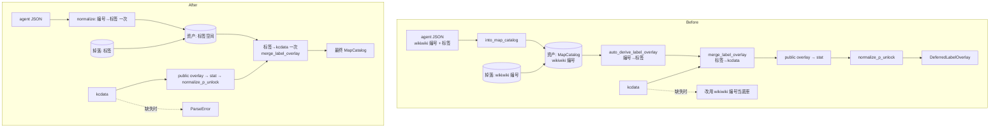
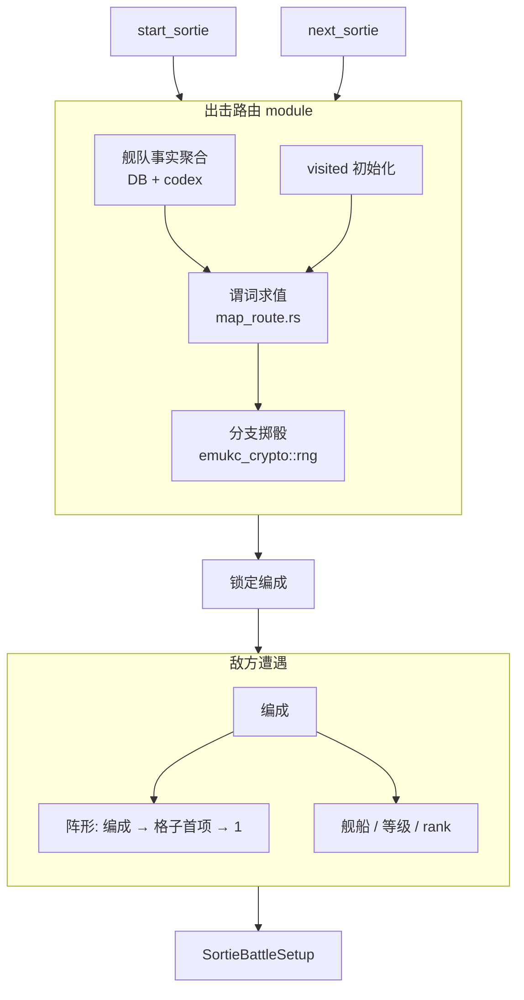
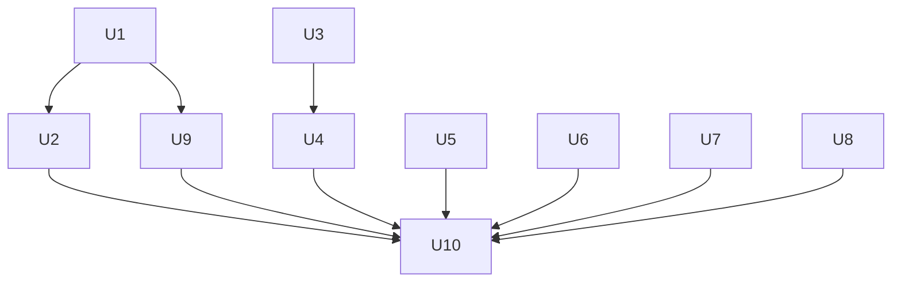

# Deepen Map, Sortie and Battle Modules - Plan

## Goal Capsule

- **Objective:** 维护者改动地图数据、出击路由、敌方遭遇、昼战显示、联合舰队夜战或装备归属时，每条规则只在一个 module 里实现，并能从该 module 的 interface 测试；过去三类静默错误（格子编号空间错位、攻击种类与显示装备不一致、同一件装备被两处占用）从结构上不再可能发生。玩家只会看到两处有意的变化：敌方阵形跟随所选编成，已占用的装备不能再被装备、废弃或消耗。
- **Means:** 按架构评审（2026-09-23）的 8 个候选逐个深化，分五个阶段，每个阶段可独立合并（KTD1）。
- **Authority order:** 本计划的 R-ID 与 KTD-ID；`CLAUDE.md` 的分层、禁改文件、审查与 Balance 规则；`docs/solutions/architecture-patterns/` 下 map-data-authority、combined-fleet-index-spaces、rng-facade、bootstrap-validator-dependency-direction、battle-protocol-validator-boundary、gameplay-context、drift-check-baseline-refresh-boundary；现有 gameplay 测试、battle golden 与协议校验；当前实现。
- **Execution profile:** 五个阶段。Phase A（地图，U1 → U2）必须最先做完 U1，因为 Phase E 依赖它改过的资产形状；Phase B（出击，U3 → U4，U5 独立）、Phase C（战斗，U6、U7 互相独立）、Phase D（装备，U8）之间没有代码依赖，可以任意顺序；Phase E（U9）在 U1 之后；U10 最后。
- **Stop conditions:**
  - U1 或 U2 让最终地图目录与迁移前不一致（KTD4 的比对），停下查原因，不得调整比对口径去适配。
  - 除 U5、U8 外的任一单元改变 `tests/gameplay_tests/battle_golden.rs` 的转录、`sim_validation_gate` 结果或 battle 资产，停下回到规划。
  - U5 改变 battle golden 时，只有在差异完全来自敌方阵形、且能解释为 R10 的后果时，才可按 golden 流程有意重新冻结，并在 PR 中说明。
  - 任一单元需要改 `crates/emukc_model/src/codex/` 下的 `Default` 数值，停下，按 Balance Defaults Policy 另立计划。
  - U8 实施时如果真实服务器的某个装备列表行为与 KTD14 的默认假设相反，并且无法用抓包确认，停下询问用户。
- **Tail ownership:** 每个单元自带它改动的文档；U10 负责 `CONTEXT.md` 术语、`PROJECT_MEMORY.md` 回写与全套质量门。

---

## Product Contract

### Summary

把评审报告里 8 个 deepening 候选落成 10 个实施单元。地图数据管线收成「资产存标签、组装时解析一次、组装只有一个入口」。出击路由、敌方遭遇、昼战攻击记录、联合舰队夜战布局、装备占用、bootstrap 资产清单各自收进一个 module。其中两个单元有意修正行为，一个单元扩展路由输入但不改判定结果。

### Problem Frame

每一处都在源码中核对过：

1. **地图目录在三种编号空间之间来回转换，但全程只有一个类型。** agent 输出用 wikiwiki 自己的 BFS 编号。`WikiwikiMapCatalog::into_map_catalog`（`crates/emukc_bootstrap/src/parser/wikiwiki_map/mod.rs`）把它写成 checked-in 的 `MapCatalog` 资产。组装时 `auto_derive_label_overlay`（`map_pipeline/label_overlay.rs`）把编号退回标签，再由 `merge_label_overlay` 落到 kcdata 的 route 编号。谓词树遍历有四份（`rewrite_route_predicate_labels`、`lift_predicate_to_labels`、`resolve_predicate_labels`、`emukc_model` 的 `remap_predicate`），label 索引有三种。
   - eac30feb：「经由某格」谓词原样透传，导致 5 条规则查错了格子。
   - 8d0376a8：合并后的目录被写回了 wikiwiki 源槽位。
   - 导出的 `merge_routing_overlay` / `build_cell_no_map`（`crates/emukc_model/src/codex/map/merge.rs`）只有测试在调用，并且仍带着 eac30feb 同样的透传。
   - `map_ship_drops.json` 以 wikiwiki 编号为键，而这些编号由 agent 按节点分配。
   - `.data/temp/kc_data` 缺失时，`assemble.rs` 会静默改用 wikiwiki 编号的目录当底座。
2. **组装顺序靠旁路维持。** label overlay 在 p_unlock 变体生成之前合并，所以 15ff2142 加了 `DeferredLabelOverlay` 来补救。变体键 `""` 表示「扇出到全部命名变体」，这条规则在 `merge.rs` 和 `assemble.rs` 各写了一遍。构建期的警告字符串 `missing_start_routes`、`inferred_multi_root_start:*` 在 `merge.rs` 和运行时的 `crates/emukc_gameplay/src/game/map_route.rs` 被当作开关读取。`map_pipeline/mod.rs` 有 5 个公开 builder，其中 `build_final_map_catalog_with_overlay` 没有调用方。
3. **路由测试打在纯函数上，bug 却落在调用它的构建器里。** 87127aa5 的错误出在 `sortie/route_context.rs` 的 DB 聚合。`map_route.rs` 约 1900 行测试都手写 `FleetRouteContext`，从来没有跑过聚合。`start_sortie` 和 `next_sortie`（`sortie/mod.rs`）各自初始化 visited。`DRUM_CANISTER_MST_ID = 75` 在 `route_context.rs` 和 `expedition.rs` 各定义一次。路由上下文只从 `active.deck_id` 构建。
4. **编成按 pattern 选，阵形却取格子列表的第一项。** `sortie/setup.rs` 用 `enemy_fleet.formations.first()` 取阵形，`EnemyComposition.formation` 在运行时没人读。资产里 1180 组编成中有 110 组自带的阵形不等于所在格子的首项，`docs/map/data-dependencies.md` §2 描述的「随机选 pattern 等于随机选阵形」在代码里并不成立。
5. **昼战攻击记录在约 8 处手工拼装。** `api_at_type`、`api_si_list` 和 si_list 的文本/整数格式必须一致。这三者由 `simulation/shelling.rs` 的三个分支、`asw.rs` 两处、`special_attack.rs`、`debug_overlay.rs` 两处分别决定，`push_attack` 要 14 个参数。夜战已经收成 `night_si_entry`（`simulation/night.rs`）。12b0fb1d 和 c888a92f 都出在昼战这一侧。
6. **gameplay 直接改 session 的联合舰队向量。** `battle/sortie/orchestrate.rs` 在 `escort_start` 处截断再拼接 `session.friendly` 和 `friendly_nowhps`，`run_sp_midnight_battle` 又重建一遍同样的布局。`sortie_midnight_battle`（`sortie/mod.rs`）三次读 store，两次计算 `escort_deck_start`，还把「无护卫」的 0 转成 `Option`。`sp_midnight_battle_impl` 重复了响应尾部。
7. **装备占用只检查了一个方向。** 基地航空队配置装备时会检查 `equip_on`（`airbase/mod.rs`），反过来却没人检查 `plane_info`：
   - 舰船装备（`ship/mod.rs`）、改修（`remodel_slot.rs`）、改装消耗（`compose/remodel.rs`）、未装备列表（`get_unset_slot_items_impl`）都只看 `equip_on`。
   - `destroy_items_impl`（`slot_item.rs`）什么都不查。
   - `get_airbases` 与 `load_airbase` 是两份相同的代码。
   - 基地的行为测试只能经由 axum handler 运行。
8. **资产清单写在三处。** `battle_rules.rs` 的 `EMBEDDED_*` 常量、各 `repo_*_path`、`src/bin/cli/drift_check.rs` 的 `synced_asset_paths` 各有一份名单；drift-check 不覆盖最不可再生的 `map_ship_drops.json`。wikiwiki 资产优先读磁盘，public overlay 和掉落表只读嵌入内容。

### Requirements

**地图数据**

- R1. checked-in 的路由/敌方编成资产和掉落资产只用节点标签标识格子；仓库里不再存在以 wikiwiki 编号表示的 `MapCatalog` 中间产物。
- R2. 标签到 kcdata 编号的解析只在组装时发生一次，由一个 module 负责。路由谓词树只保留两次遍历：接入时把 agent 编号提升为标签一次，组装时把标签解析为 kcdata 编号一次。
- R3. 输入相同（仓库资产加 `.data/temp` 下的 kcdata、`stat.json` 和 manifest）时，迁移前后组装出的最终地图目录完全一致。
- R4. 缺少 kcdata 时，地图目录构建明确失败并说明原因。
- R5. 地图目录组装只有一个公开入口，合并顺序固定在入口内部，不需要旁路补偿列表。
- R6. 「起点路由是推断出来的」这类构建期警告字符串不再驱动组装或运行时行为。它们唯一的产生者是 wikiwiki 编号目录，会随 R1 一起消失，读取它们的分支也随之删除。

**出击**

- R7. 出击路由对调用方只呈现一个 interface：给定出击与当前格，返回下一格。舰队事实聚合、谓词求值和分支掷骰都在它背后。
- R8. 路由的舰队事实聚合可以从 in-memory DB 编队出发测试；带桶舰判定所用的装备常量只有一个 owner，远征与出击共用。
- R9. 联合舰队出击时，护卫舰队的舰船事实进入路由 module 的输入；所有现有谓词的判定结果不变。
- R10. 敌方遭遇的编成、阵形、等级一次选定。阵形取所选编成自带的阵形；编成没有阵形时取该格阵形列表的首项；两者都没有时取単縦陣。

**战斗**

- R11. 昼战每次攻击的 `api_at_type`、`api_si_list` 及其文本/整数格式，由一个 module 根据攻击种类推出；炮击、先制对潜、特殊攻击和 debug overlay 只报告「谁用什么打了谁、打了多少」。
- R12. 联合舰队夜战和 sp_midnight 的舰队布局不变量由出击战斗 session 维护：向量连续、夜战只有护卫舰队参战、单舰队时没有护卫段。gameplay 的编排代码不再直接截断或重建它的向量。

**装备**

- R13. 一件装备装在舰船上，或配置在基地航空队时，都算已占用。装上舰船、废弃、改修工厂消耗、舰船改装消耗和未装备列表都经过同一个占用判定。配置转换中的中队按现有的读时结算规则处理：判定时先结算，已结算的转换不再占用装备。
- R14. 基地航空队的行为可以在 gameplay 层用 in-memory DB 测试。

**资产**

- R15. bootstrap 的每份 checked-in 资产只登记一次；嵌入内容、仓库路径和 drift-check 覆盖范围都从这份登记派生；`map_ship_drops.json` 纳入 drift-check。

**全局**

- R16. 除 R10、R13 外，外部可观察的行为都不变：battle golden、battle 生成资产、战斗协议校验和 `sim_validation_gate` 均保持原样。
- R17. 不改动 `crates/emukc_model/src/codex/` 下任何影响数值的 `Default`。

### Key Decisions

- **行为修正只出现在独立单元里，每个单元单独提交并带回归测试。** 其余单元零行为变化。(session-settled: user-approved — chosen over 在重构单元里顺手修正: 行为变化保持可单独审查、可单独回滚) Governs R9, R10, R13, R16.
- **护卫舰参与路由只做到 module 的输入。** 各海域联合舰队分歧规则的数据需要单独调研，不在本计划内。(session-settled: user-approved — chosen over 同时补联合舰队分歧规则数据: 数据来源未调研) Governs R9.
  - **Conflict call-out：** 调研没有找到任何消费者。37 张常规图的 `sally_flag` 都是 `[x, 0, 0]`（不允许联合舰队），资产 2144 条规则里没有一条提到「連合」，也没有谓词读取护卫舰。U4 因此只产生一个暂时没人用的输入。按 settled 决策照做，但它是删掉也不影响任何行为的单元，用户可以随时撤回。另外，`start_sortie` 不检查 `sally_flag`，联合舰队能进常规图，这是另一个问题，列入 Deferred。
- **地图资产机械转换，以最终目录一致作为验收；不重跑 agent 抓取。** (session-settled: user-approved — chosen over 重新运行 emukc-scrape-wikiwiki-mapdata: 本地历史 agent JSON 重生会大幅倒退，掉落无法再生) Governs R1, R3.
- **评审报告的候选 7（组装单入口，对应本计划 Problem Frame 第 2 条）并入地图阶段；候选 8（资产清单，对应第 8 条）保留为一个小单元。** 评审报告的编号与 Problem Frame 的编号顺序不同。 (session-settled: user-approved — chosen over 单独立项或删除候选 8: 前者与候选 1 改的是同一处代码) Governs R5, R15.

### Acceptance Examples

- AE1. **Covers R3.** Given 迁移前用 `.data/temp` 构建出的最终地图目录，When 做完 U1 和 U2 后用同一份 `.data/temp` 重新构建，Then 两份目录规范化 JSON 后逐字节相等。
- AE2. **Covers R10.** Given 5-6 某战斗格有三个编成，自带阵形分别为 1、3、4，When 路由锁定第二个编成，Then 战斗包的敌方阵形是 3。
- AE3. **Covers R10.** Given 某编成的 `formation` 为空、所在格的阵形列表是 `[2, 5]`，When 选中它，Then 敌方阵形是 2；如果列表也是空的，Then 阵形是 1。
- AE4. **Covers R13.** Given 一件舰战配置在某基地中队（已配置），When 把它装上舰船、废弃、作为改修消耗或舰船改装消耗，Then 操作被拒绝，并且它不出现在未装备列表里。Given 这个中队已经解除、正处于配置转换中，When 做上述任一操作，Then 占用判定先结算转换，操作照常进行，装备也出现在未装备列表里。
- AE5. **Covers R9, R16.** Given 一支联合舰队在常规图出击，When 路由求值，Then 结果与只用第 1 艦隊事实求值完全相同。

### Success Criteria

- 评审报告列出的各类「一条规则多处实现」都只剩一处（逐条对照 Problem Frame）。
- U1、U2 之后，仓库里既没有 wikiwiki 编号空间的目录类型，也没有 `DeferredLabelOverlay`。
- `cargo test`、严格 Clippy 和 fmt 全部通过；battle golden 保持不变，唯一例外是 Stop conditions 允许 U5 做的重新冻结。

### Scope Boundaries

- 合并顺序的权威规则（map-data-authority.md：元数据按「最后一个非零值生效」，路由字段只补缺失，stat.json 权威最高）保持不变，只改变发生的物理位置。
- 联合舰队的两套索引空间（combined-fleet-index-spaces.md）保持不变：只在 `finalize_day` / `finalize_night` 转换，不存储舰队分界，`friendly_nowhps` 不转换。
- 基地航空队的读时结算（79908732 标注的占位）保持不变。
- battle 协议校验器仍只校验结构，不校验数值；bootstrap 不依赖 gameplay。
- 不改 agent skill 的输出格式；agent JSON 仍使用它自己的编号。

#### Deferred to Follow-Up Work

- 联合舰队出击应受 `sally_flag` 限制：目前 `start_sortie` 不检查。
- 交战形态 `engagement_for_cell` 用 `(map_id + cell_id) % 4` 固定决定，真实游戏里是随机的。
- 敌方等级公式 `level * 5 + cell_no` 依赖 kcdata 编号。U5 会把它收进敌方遭遇 module，但不改公式。
- `[slot_1..slot_ex]` 数组在约 11 处重复拼写。
- `RoutePredicate` 因为含有 `f64` 无法 derive `Hash`，`route_predicate_key` 手工序列化了约 215 行。
- `make_list` 的 `PATH_RULES` / `BTXT_FLAT_COVERAGE` 这两个全局 `OnceLock` 按先写者生效。
- `build-overlays` 从已经包含 public overlay 的目录生成 public overlay。
- 真实掉落数据源（data-dependencies.md §4 的未决项）。

---

## Planning Contract

### Key Technical Decisions

- KTD1. **一份总计划，分五个阶段，每个阶段可独立合并。** 阶段之间唯一的依赖是 Phase E（U9）依赖 Phase A 的 U1，与 U2 无关；其余阶段的代码互不相交，可以并行或任意排序。(session-settled: user-approved — chosen over 每个候选各写一份计划: 共享质量门、禁改文件规则和收尾回写)
- KTD2. **标签空间资产沿用已有的 `WikiwikiMapOverlayCatalog` / `WikiwikiLabelOverlay`。** 这两个类型已经按标签组织路由规则（`RouteRuleDraft`）、敌方节点（`EnemyNodeRows`）和掉落（`ShipDropDraft`），`merge_label_overlay` 直接消费它们。资产文件名 `wikiwiki_map_catalog.json` 不变，这样 drift-check 条目、skill 文档和测试引用只需要改内容、不用改名。资产里原有的地图级元数据（name、level、sally_flag 等）和格子元数据在 kcdata 路径下本来就被丢弃，迁移时不再保留。Governs R1.
- KTD3. **转换用现有代码路径一次性生成，不手改 JSON。** 现有资产经 `auto_derive_label_overlay` 的同一语义转成标签空间；这条路径正是今天运行时走的路径，所以 R3 在构造上就成立。`wikiwiki-map normalize` 改为从 agent JSON 直接输出标签空间：agent 的编号在接入时一次性提升为标签，包括 `VisitedNode` 谓词。转换完成后删除 `auto_derive_label_overlay` 以及失去调用方的遍历器和索引。`assets/*.json` 属于禁改文件，本次只通过工具重新生成，并在 PR 中说明原因。
- KTD4. **R3 用现有产物比对验收，不新增 golden 设施。** U1 开始前，用 `build_final_map_catalog_from_repo_assets` 对 `.data/temp` 构建一份最终目录，规范化后留作基线（放在 `.data/` 或 scratch 目录，不提交）。U1、U2 完成后用同样的输入再构建一次，逐字节比较。临时的导出代码不提交。
- KTD5. **缺少 kcdata 时返回 `ParseError`。** `parser/mod.rs` 里两个依赖无 kcdata 回退路径的测试，所覆盖的行为（p_unlock 规范化、`master_cell_id`）改由带 kcdata 夹具的组装测试承担；如果 `assemble.rs` 的 7-3 测试已经覆盖，就直接删除这两个测试。Governs R4.
- KTD6. **组装顺序固定为 kcdata → public overlay → stat.json → p_unlock 规范化 → wikiwiki 标签 overlay。** `merge_label_overlay` 只写 `routing_rules`、`enemy_fleets`、`ship_drops`，不碰元数据，所以放到最后不影响元数据的权威规则；变体此时已经确定，`DeferredLabelOverlay` 可以删除。其中路由规则和掉落是追加写入，并非补缺失；输出之所以能保持一致，靠的是一条已核对的数据事实：public overlay 和 stat.json 不带路由规则、编成和掉落，public overlay 的格子也没有标签。唯一可能让输出变化的路径，是 public overlay 的 `merge_cells` 给原本没有 `next_cells` 的 kcdata 格子补上连线，使某条原先被丢弃的标签规则在重排后能解析出来；KTD4 比对失败时先查这一处。变体键 `""` 的扇出规则只留一份 helper，模型合并和标签 overlay 都调用它。公开入口只保留一个：用仓库资产构建，另开一个可传入标签空间资产的参数，供测试覆盖资产，同时返回构建报告。其余 builder 删除，调用方（`parser/mod.rs`、`src/bin/cli/wikiwiki_map.rs`、`crates/emukc_gameplay/tests/sortie_battle.rs`、`crates/emukc_gameplay/src/game/sortie/tests.rs`）随之改用新入口。Governs R5.
- KTD7. **推断起点的警告字符串随其唯一产生者一起在 U1 删除。** 只有 `WikiwikiMapCatalog::into_map_catalog` 会写 `missing_start_routes` / `inferred_multi_root_start:*`；kcdata、public overlay 和 `merge_label_overlay` 都不写，当前 `.data/codex/map_catalog.json` 中这类警告为 0 条。U1 去掉 wikiwiki 编号目录后，`merge.rs` 的 `had_inferred_start` 分支和 `map_route.rs` 的起点拒绝分支都成了死代码，在 U1 中一并删除，连同只为它们构造的测试用例。序列化字段 `parse_warnings` 保留，旧 codex 照常加载。Governs R6.
- KTD8. **出击路由是 `game/sortie/` 下的一个 module，`map_route.rs` 作为它的内部 seam 保留。** 对外只暴露一个 async 操作：接收事务连接、codex、出击身份（profile、舰队、hq 等级、已访问格）、当前格、stage 和玩家选择的格，返回下一格。`route_context.rs` 的聚合并入其中；visited 的初始化规则（起点格记为已访问）移进 module。`map_route.rs` 的求值测试原地保留，这是 bootstrap-validator-dependency-direction.md 规定的归属；新的 interface 测试从 DB 编队出发。掷骰继续走 `emukc_crypto::rng`（rng-facade.md）。Governs R7, R8.
- KTD9. **带桶常量放在 `game/slot_item.rs`，作为 crate 内常量。** 远征和路由都引用它，DB 查询不合并。两者统计的对象不同（远征按装备，路由按舰），各自的计数方式不变。Governs R8.
- KTD10. **护卫舰作为独立的事实集合进入路由输入，不并入现有字段。** `FleetRouteContext` 现有字段（舰数、舰种计数、索敌、带桶舰数等）仍然只从第 1 艦隊计算；护卫舰只填新增的独立字段。这样现有谓词的结果在构造上就不变，也就是 R9 和 AE5。(session-settled: user-approved — chosen over 同时补联合舰队分歧规则: 见 Key Decisions 的 conflict call-out) Governs R9.
- KTD11. **敌方遭遇是 `sortie/enemy_ship.rs` 里一次构建的值。** 编成仍在路由锁定时选定（`select_locked_enemy_composition`）。遭遇在 `SortieBattleSetup` 构建时由锁定的编成推出阵形、舰船、等级、rank 和舰队名；阵形规则见 R10。`setup.rs` 只消费这个值，不再单独查格子的阵形列表。Governs R10.
- KTD12. **昼战攻击记录仿照夜战：一个攻击种类到 si 条目的函数，加一个持有七个平行向量的记录器。** 攻击种类是一个包装枚举：炮击分支直接携带 `simulation/day_cutin.rs` 已有的 `DayAttackType`（它的取值已被 pin 测试固定），另外只新增对潜、特殊攻击（带编号）和 debug 注入三种；函数由它推出 `at_type`、显示装备和文本/整数格式；记录器取代 `push_attack` 的 14 个参数，以及 `asw.rs`、`special_attack.rs`、`debug_overlay.rs` 里的手工 push。bootstrap 校验器里 `CARRIER_CUTIN_ATTACK_TYPE` 的副本和 pin 测试保持原样（battle-protocol-validator-boundary.md）。Governs R11.
- KTD13. **联合舰队布局由 `SortieBattleSession`（`game/battle/sortie/mod.rs`）的方法维护。** session 提供「取夜战参战舰」和「吸收夜战结果」两个操作，sp_midnight 用同一对操作建立 session。舰队分界仍从舰船标签现算，不存字段；session 内部用 `Option` 表达「没有护卫段」，0 这个哨兵只留在旧的 `escort_deck_start` 调用点，直到它们全部迁走后删除。`friendly_nowhps` 不转换。Governs R12.
- KTD14. **装备占用由一个 `_impl` 判定（`C: ConnectionTrait`），返回占用方：舰船 id 或基地中队。** 装上舰船、废弃、改修消耗、改装消耗在写之前调用它；未装备列表的查询同时排除 `plane_info` 中出现的 `slot_id`。改修的目标装备沿用现有 `allow_equipped` 语义：装在舰上的装备允许改修，配置在基地的装备按占用处理，默认假设与舰上一致，也允许改修。废弃的判定放在公开入口 `Ctx::destroy_items` 里、调用 `destroy_items_impl` 之前，不放进 `_impl`：舰船解体（`factory.rs` 的 `destroy_ship`）会通过同一个 `_impl` 有意销毁该舰自己的装备。废弃目前完全不检查，加上检查后，装在舰上的装备也会被拒绝；这是 R13 的一部分，客户端本来就不会发这种请求。判定开始前先运行 `settle_relocations_impl`，与 79908732 定下的「下一次读取基地时完成转换」保持一致，否则刚解除配置的装备会一直被锁住，直到玩家打开出击菜单。`get_airbases` 改为复用 `load_airbase`。Governs R13, R14.
- KTD15. **资产登记是 `emukc_bootstrap` 里的一张静态表。** 每行包含名字、相对路径和「是否纳入 drift-check」；目前已经嵌入的资产（battle knowledge、wikiwiki 目录、public overlay、掉落、`cache_rules`）另外带嵌入内容，并统一为「仓库文件优先，嵌入内容兜底」，与 wikiwiki 资产和 battle knowledge 现有的策略一致。其余 cache-list 输入没有嵌入副本，`make_list/manifest/loader.rs` 仍按调用方给的目录就近查找并允许缺失，本单元不改变这一点。drift-check 的名单从表中派生；把 `map_ship_drops.json` 纳入后按 drift-check-baseline-refresh-boundary.md 的流程有意刷新 `.sync-fingerprint.json`。Governs R15.

### High-Level Technical Design

**地图数据流（U1、U2）**

**出击路由与敌方遭遇（U3、U4、U5）**

**阶段依赖**

### Implementation Constraints

- `crates/emukc_bootstrap/assets/*.json` 只能通过工具重新生成（KTD3、KTD15）；`Cargo.lock` 与 battle golden 不手改。
- 严格保持 crate 单向分层：bootstrap 不依赖 gameplay，battle crate 不依赖 gameplay。
- 跨领域写操作走 `Ctx` 上的方法；新增的事务内复用函数采用 `_impl` 加 `C: ConnectionTrait`。
- 改动保持 surgical：每一行都能追溯到某个 R；邻近的既有死代码只在本单元删除其调用方时才删。

### Sequencing

U1 → Phase E（U9）；U2 与 U9 之间没有依赖。Phase B（U3 → U4；U5 独立）、Phase C（U6、U7）、Phase D（U8）可以在 Phase A 之前、之中或之后进行。U10 最后。建议的执行顺序是 U1、U2、U6、U3、U5、U7、U8、U4、U9、U10：先做风险最高、热点最集中的地图阶段，再做可以借鉴夜战现成写法的 U6。

---

## Implementation Units

### U1. 地图资产改存标签空间

- **Goal:** checked-in 的路由/编成资产和掉落资产改用标签空间，组装只做一次「标签 → kcdata」解析，缺少 kcdata 时报错。
- **Requirements:** R1, R2, R3, R4, R6；Key Decisions 中关于地图资产转换的决定。
- **Dependencies:** 无。
- **Files:**
  - `crates/emukc_bootstrap/src/parser/wikiwiki_map/mod.rs`, `crates/emukc_bootstrap/src/parser/wikiwiki_map/types.rs`
  - `crates/emukc_bootstrap/src/map_pipeline/sources.rs`, `crates/emukc_bootstrap/src/map_pipeline/assemble.rs`, `crates/emukc_bootstrap/src/map_pipeline/label_overlay.rs`
  - `crates/emukc_bootstrap/src/wikiwiki_map_asset.rs`, `crates/emukc_bootstrap/src/source_crosscheck.rs`（删除）, `crates/emukc_bootstrap/src/parser/mod.rs`, `crates/emukc_bootstrap/src/lib.rs`
  - `crates/emukc_gameplay/src/game/map_route.rs`（删除推断起点分支）
  - `docs/solutions/architecture-patterns/bootstrap-validator-dependency-direction.md`（记录 source_crosscheck 的移除）
  - `crates/emukc_model/src/codex/map.rs`, `crates/emukc_model/src/codex/map/merge.rs`
  - `src/bin/cli/wikiwiki_map.rs`
  - `crates/emukc_bootstrap/assets/wikiwiki_map_catalog.json`, `crates/emukc_bootstrap/assets/map_ship_drops.json`, `crates/emukc_bootstrap/assets/.sync-fingerprint.json`
  - `crates/emukc_gameplay/tests/sortie_battle.rs`
  - `.claude/skills/emukc-scrape-wikiwiki-mapdata/SKILL.md`, `.agents/skills/emukc-scrape-wikiwiki-mapdata/SKILL.md`, `docs/map/data-dependencies.md`
  - 测试：`crates/emukc_bootstrap/src/map_pipeline/label_overlay.rs`, `crates/emukc_bootstrap/src/map_pipeline/assemble.rs`, `crates/emukc_bootstrap/src/parser/wikiwiki_map/mod.rs`
- **Approach:**
  1. 按 KTD4 先留下最终目录的基线。
  2. 按 KTD3 实现 agent JSON → 标签空间的接入转换，并用同一语义把现有资产和掉落表一次性转换过去（KTD2）。
  3. `sources.rs` 直接读取标签空间资产和掉落；`assemble.rs` 删掉 `auto_derive` 分支和无 kcdata 回退，缺少 kcdata 时返回 `ParseError`（KTD5）。
  4. 模型合并（`merge.rs` 的 `remap_variant_to_definition_identity`）不再处理路由规则。已核对：34 个 public overlay 变体都不带路由规则，stat.json 解析产出的也是空表，所以路由规则只从标签 overlay 进入目录。
  5. 删除失去调用方的代码：`auto_derive_label_overlay`、`rewrite_route_predicate_labels`、`merge_routing_overlay`、`build_cell_no_map`、`remap_predicate`，以及只服务它们的 label 索引变体；按 KTD7 删除推断起点警告的产生与两个读取分支；删除 `source_crosscheck.rs`，它比对的 wikiwiki 格子编号和 boss 格已不存在，最终目录与真实抓包的比对由 `map_pipeline/verify.rs` 承担。`lib.rs` 的 prelude 导出同步调整。
  6. 更新 skill 文档中 normalize 的输出说明、`data-dependencies.md` 里的「断链影响」表和 §2 的编号空间段落，以及 bootstrap-validator-dependency-direction.md 中关于 source_crosscheck 的段落。
  7. 用 drift-check 的 `--accept` 有意刷新基线，并在 PR 中说明。
- **Execution note:** 先留基线再动代码；每完成一步都重新构建目录并与基线比较，出现差异立即停下（见 Stop conditions）。
- **Patterns to follow:** `merge_label_overlay` 现有的标签解析与扇出；`lift_predicate_to_labels` / `resolve_predicate_labels` 是保留下来的那对遍历器。
- **Test scenarios:**
  - 接入转换：agent JSON 里的 `VisitedNode { cell_nos: [BFS 编号] }` 转成对应标签的 `VisitedNodeLabel`；引用不存在编号的规则被丢弃并记录警告。
  - 接入转换：同一标签对应多个 BFS 编号时，编成和掉落在标签层合并，不丢条目。
  - 组装：标签空间资产 + kcdata 夹具，4-5 的「Dマスを経由」落到 kcdata 里 D 的编号（沿用 eac30feb 的回归用例）。
  - 组装：没有 kcdata 时返回错误，错误信息指出 kcdata 路径。
  - 运行时：起点有多个后继且没有起点规则的 stage 照常随机选择起点后继；`map_route.rs` 中只为推断起点标记构造的用例随标记一并删除。
  - 掉落：按标签建键的掉落扇出到重复标签的所有格子（保留 `ship_drops_fan_out_to_duplicate_labels` 的语义）。
  - Covers AE1：迁移前后最终目录一致（KTD4 的比对，是验证步骤，不写成常驻测试）。
- **Verification:** 最终目录与基线逐字节一致；`cargo test -p emukc_bootstrap`、`cargo test -p emukc_gameplay` 以及 `--test gameplay_tests` 中的地图测试全部通过；仓库里查不到 wikiwiki 编号空间的目录类型或 `auto_derive_label_overlay`。

### U2. 地图目录组装只留一个入口

- **Goal:** 组装只有一个公开入口，内部顺序固定，`DeferredLabelOverlay` 删除。
- **Requirements:** R5, R3。
- **Dependencies:** U1。
- **Files:**
  - `crates/emukc_bootstrap/src/map_pipeline/mod.rs`, `crates/emukc_bootstrap/src/map_pipeline/assemble.rs`, `crates/emukc_bootstrap/src/map_pipeline/label_overlay.rs`, `crates/emukc_bootstrap/src/lib.rs`, `crates/emukc_bootstrap/src/parser/mod.rs`
  - `crates/emukc_model/src/codex/map.rs`, `crates/emukc_model/src/codex/map/merge.rs`
  - `src/bin/cli/wikiwiki_map.rs`, `crates/emukc_gameplay/tests/sortie_battle.rs`, `crates/emukc_gameplay/src/game/sortie/tests.rs`
  - `docs/solutions/architecture-patterns/map-data-authority.md`
  - 测试：`crates/emukc_bootstrap/src/map_pipeline/assemble.rs`, `crates/emukc_model/src/codex/map/merge.rs`
- **Approach:**
  1. 按 KTD6 重排组装顺序，删除 `DeferredLabelOverlay`，把 `""` 扇出收成一个 helper。
  2. 按 KTD6 收拢公开 builder，迁移调用方。
  3. 在 map-data-authority.md 中补一段：物理顺序变了，权威规则没变。
- **Patterns to follow:** 现有的 `MapStageDefinition::cell_has_routing_outgoing`，它就是「规则定义在模型、由 gameplay 调用」的先例。
- **Test scenarios:**
  - 7-3：kcdata 给出无名变体，public overlay 给出 `pre_p_unlock` / `post_p_unlock` 骨架，wikiwiki 按这两个变体键给出规则；组装后两个变体都拿到自己的路由（改写现有的 `assemble.rs` 7-3 测试，去掉 deferred 这一前提）。
  - 标签 overlay 的变体键为 `""`、目标地图有命名变体时，规则扇出到每个命名变体；没有命名变体时只写进 `""`。
  - Covers AE1：U2 完成后最终目录与 U1 前的基线仍然一致。
- **Verification:** 基线比对一致；`map_pipeline/mod.rs` 只剩一个公开构建入口；全仓搜不到 `DeferredLabelOverlay`，也搜不到在模型方法之外直接比较这两个警告字符串的代码。

### U3. 出击路由收成一个 module

- **Goal:** 调用方只经过一个操作拿到下一格；聚合、求值、掷骰都在它背后，并且可以从 DB 编队测试。
- **Requirements:** R7, R8, R16。
- **Dependencies:** 无。
- **Files:**
  - `crates/emukc_gameplay/src/game/sortie/route_context.rs`（并入新 module 或改名为它）, `crates/emukc_gameplay/src/game/sortie/mod.rs`
  - `crates/emukc_gameplay/src/game/map_route.rs`, `crates/emukc_gameplay/src/game/expedition.rs`, `crates/emukc_gameplay/src/game/slot_item.rs`
  - 测试：`crates/emukc_gameplay/src/game/sortie/tests.rs`
- **Approach:**
  1. 按 KTD8 建立路由操作，吸收 `build_fleet_route_context`、visited 初始化，以及 `evaluate_route_destination` 的调用。
  2. `start_sortie` 和 `next_sortie` 改为调用它。
  3. 按 KTD9 统一带桶常量。
  4. `route_context.rs` 里的 `build_sortie_friend_ships` 和 `engagement_for_cell` 属于战斗准备，原位保留或移回 setup，不进入路由 module。
- **Patterns to follow:** `sortie/tests.rs` 现有的 `build_fleet_route_context` DB 测试（桶数用例）是新 interface 测试的起点。
- **Test scenarios:**
  - 两艘舰各带一个桶、一艘带两个桶：走 DrumCanisterCount ≥ 2 的规则时按 2 艘计，不按 3 个计（87127aa5 回归，改为经由路由 interface）。
  - 起点格：出击第一步求值时，起点格已记为已访问（`VisitedNodeLabel` 查起点的规则能命中）。
  - 第二步：路由使用出击状态里累计的已访问格，前一格经过 D 时「Dマスを経由」命中。
  - 舰队含未装备的舰和空槽位：聚合不报错，舰种计数只计有 manifest 的舰。
  - 远征：带桶判定仍然按装备计数，结果与改动前一致（沿用 `expedition.rs` 现有用例）。
- **Verification:** `start_sortie` / `next_sortie` 里不再出现 `build_fleet_route_context` 或 visited 的直接操作；`cargo test -p emukc_gameplay` 以及 `--test gameplay_tests` 中的出击测试通过；battle golden 不变。

### U4. 护卫舰事实进入路由输入

- **Goal:** 联合舰队出击时，路由 module 能拿到护卫舰的舰船事实，所有现有谓词的结果不变。
- **Requirements:** R9, R16；KTD10。
- **Dependencies:** U3。
- **Files:**
  - `crates/emukc_gameplay/src/game/sortie/`（U3 建立的路由 module）, `crates/emukc_gameplay/src/game/map_route.rs`
  - 测试：`crates/emukc_gameplay/src/game/sortie/tests.rs`, `tests/gameplay_tests/combined_sortie.rs`
- **Approach:** 路由 module 在 `combined_type` 有值时额外读取第 2 艦隊，按 KTD10 只填独立的护卫字段。空的第 2 艦隊按 setup 现有语义处理（未解锁与空等价）。
- **Test scenarios:**
  - Covers AE5：同一条路由规则集，联合舰队与只有第 1 艦隊的单舰队得到相同的下一格（用固定 seed 或只有确定分支的格子）。
  - 联合舰队出击时，路由上下文的护卫事实包含第 2 艦隊的舰船；单舰队时护卫事实为空。
  - `combined_type` 有值但第 2 艦隊未解锁：路由正常求值，护卫事实为空，不报错。
- **Verification:** `combined_sortie.rs` 全部通过；battle golden 不变。

### U5. 敌方遭遇一次选定（行为修正）

- **Goal:** 敌方阵形跟随所选编成；编成、阵形、等级在一处构建。
- **Requirements:** R10；Key Decisions 中关于行为修正独立成单元的决定；KTD11。
- **Dependencies:** 无。
- **Files:**
  - `crates/emukc_gameplay/src/game/sortie/enemy_ship.rs`, `crates/emukc_gameplay/src/game/sortie/setup.rs`, `crates/emukc_gameplay/src/game/sortie/mod.rs`
  - `docs/map/data-dependencies.md`（§2 的「随机选 pattern」一句改为与代码一致）
  - 测试：`crates/emukc_gameplay/src/game/sortie/enemy_ship.rs`, `tests/gameplay_tests/map/`（新增敌方阵形用例，在 `tests/gameplay_tests/map/mod.rs` 注册）
- **Approach:** 按 KTD11 构建遭遇值，`setup.rs` 删除 `formations.first()`；锁定编成与回退编成（`fallback_enemy_composition`）都经过同一个构建。
- **Execution note:** 先写 AE2 的失败测试，再改实现。
- **Test scenarios:**
  - Covers AE2：5-6 真实资产中，自带阵形与格子首项不同的编成被锁定后，战斗包的敌方阵形等于编成自带的阵形。
  - Covers AE3：编成的 `formation` 为空时取格子首项；格子列表也为空时取 1。
  - 回退编成（格子没有任何编成数据）：阵形为 1，舰船为回退的深海驱逐。
  - sp_midnight 格：夜战直接开始时，敌方阵形同样取所选编成的阵形。
- **Verification:** 新测试通过；battle golden 保持不变（golden 用 1-1，该图所有编成的阵形都是 1），如有变化按 Stop conditions 处理；`sim_validation_gate` 通过。

### U6. 昼战攻击记录收进一个 module

- **Goal:** 昼战每次攻击的 `at_type`、显示装备和格式只由一个 module 推出。
- **Requirements:** R11, R16；KTD12。
- **Dependencies:** 无。
- **Files:**
  - `crates/emukc_battle/src/simulation/shelling.rs`, `crates/emukc_battle/src/simulation/asw.rs`, `crates/emukc_battle/src/simulation/special_attack.rs`, `crates/emukc_battle/src/simulation/mod.rs`
  - `crates/emukc_battle/src/debug_overlay.rs`, `crates/emukc_battle/src/targeting.rs`, `crates/emukc_battle/src/simulation/day_cutin.rs`（复用 `DayAttackType`）
  - 测试：`crates/emukc_battle/src/simulation/shelling.rs`, `crates/emukc_battle/src/simulation/asw.rs`, `crates/emukc_battle/src/simulation/special_attack.rs`
- **Approach:** 按 KTD12 新增昼战 si 条目函数和记录器，逐个调用点替换。`day_attack_display_ids`、`day_gunnery_display_ids`、`carrier_ci_display_ids` 成为这个 module 的内部实现。
- **Patterns to follow:** `simulation/night.rs` 的 `night_si_entry` 与 `night_attack_display_ids`。
- **Test scenarios:**
  - 普通炮击：si_list 为整数，`at_type` 为 0。
  - 连击：si_list 为文本，只列主砲、副砲（沿用 4558b4e6 的用例）。
  - 弹着观测三类：主砲/電探带上电探，徹甲弾两类带上徹甲弾，均为文本。
  - 空母 CI：`at_type` 为 7，si_list 为文本，FBA/BBA/BA 分别列出 3/3/2 件装备（沿用 `day_cutin.rs` 用例）。
  - 先制对潜与炮击轮中的对潜：`at_type` 为 0，si_list 为整数，列出对潜装备（12b0fb1d 回归）。
  - 特殊攻击：`at_type` 为该特殊攻击的编号，si_list 为文本。
  - debug overlay 注入的攻击：`at_type` 为 0，si_list 为 `[-1]` 整数。
- **Verification:** 全仓 `at_type.push` 只剩记录器内部和 `transcript.rs`（后者是解析方向）；battle golden 不变；`sim_validation_gate` 通过；`cargo test -p emukc_battle` 通过。

### U7. 联合舰队布局归 battle session 维护

- **Goal:** 夜战与 sp_midnight 的舰队布局不变量只在 `SortieBattleSession` 中维护。
- **Requirements:** R12, R16；KTD13。
- **Dependencies:** 无。
- **Files:**
  - `crates/emukc_gameplay/src/game/battle/sortie/mod.rs`, `crates/emukc_gameplay/src/game/battle/sortie/orchestrate.rs`
  - `crates/emukc_gameplay/src/game/sortie/mod.rs`, `crates/emukc_gameplay/src/game/sortie_result.rs`
  - `docs/solutions/architecture-patterns/combined-fleet-index-spaces.md`（「deck 边界不必另存」一节补上 session 方法的位置）
  - 测试：`tests/gameplay_tests/combined_sortie.rs`, `crates/emukc_gameplay/src/game/battle/sortie/orchestrate.rs`
- **Approach:**
  1. 在 session 上加 KTD13 的两个操作。
  2. `run_night_battle` 与 `run_sp_midnight_battle` 改用这两个操作。
  3. `sortie_midnight_battle` 合并重复的 store 读取与边界计算，奖励重算直接接收 session 给出的 `Option`。
  4. `sp_midnight_battle_impl` 与普通夜战共用响应尾部。
- **Test scenarios:**
  - 联合舰队昼战后进入夜战：第 1 艦隊的 HP 与状态保持昼战结束时的值，第 2 艦隊的 HP 来自夜战结果；`friendly_nowhps` 按舰位对齐。
  - 单舰队夜战：整支舰队参战，session 中不存在护卫段。
  - sp_midnight 联合舰队：session 中第 1 艦隊排在前面、第 2 艦隊接在后面，战后结算两支都拿到经验。
  - 第 1 艦隊不足 6 艘（例如 2 艘）的联合舰队夜战：第 2 艦隊的攻击仍然记在第 2 艦隊的舰上（沿用 `escort_deck_attacks_reach_the_packet_in_client_index_space`）。
- **Verification:** `orchestrate.rs` 和 `sortie/mod.rs` 里不再有对 session 向量的 `truncate` / `extend`；`combined_sortie.rs` 与 battle golden 通过且不变。

### U8. 装备占用规则集中（行为修正）

- **Goal:** 一个占用判定覆盖舰船和基地航空队，所有消耗或挪用装备的写路径和未装备列表都经过它。
- **Requirements:** R13, R14；Key Decisions 中关于行为修正独立成单元的决定；KTD14。
- **Dependencies:** 无。
- **Files:**
  - `crates/emukc_gameplay/src/game/slot_item.rs`, `crates/emukc_gameplay/src/game/airbase/mod.rs`, `crates/emukc_gameplay/src/game/ship/mod.rs`
  - `crates/emukc_gameplay/src/game/remodel_slot.rs`, `crates/emukc_gameplay/src/game/compose/remodel.rs`
  - `crates/emukc_gameplay/src/game/factory.rs`（只核对解体调用点，不改）
  - 测试：`tests/gameplay_tests/airbase.rs`（新增，在 `tests/gameplay_tests.rs` 用 `#[path]` 注册）, `tests/gameplay_tests/destroy_items_persist.rs`
- **Approach:**
  1. 按 KTD14 实现占用判定。
  2. 逐条接入写路径与未装备列表查询。
  3. `get_airbases` 复用 `load_airbase`。
  4. 基地的配置、转换、解除行为补 gameplay 层测试；axum handler 里的测试保留，负责协议形状。
- **Execution note:** 先写 AE4 的失败测试，再接入判定。
- **Test scenarios:**
  - Covers AE4：舰战配置在基地（已配置）后，装上舰船被拒绝，错误信息指出所在基地。
  - Covers AE4：中队解除后处于配置转换中，不经过任何基地读取就直接请求废弃，占用判定先结算，废弃成功。
  - Covers AE4：改修工厂把它当作消耗材料时被拒绝；舰船改装需要的消耗装备不会从基地中挑选。
  - Covers AE4：未装备列表不包含它；解除配置并结算后重新出现。
  - 装在舰上的装备被请求废弃时被拒绝（废弃新增的检查）；未占用的装备照常废弃，资源返还不变（沿用 `destroy_items_persist.rs`）。
  - 解体一艘不保留装备的舰船：它身上的装备照常销毁并返还资源，解体不因占用判定失败。
  - 基地内移动：同一基地内换中队仍然允许（现有语义不变）。
- **Verification:** 新测试通过；`src/bin/net/router/kcsapi/api_req_air_corps/` 下已有的测试不变并通过；`cargo test -p emukc_gameplay` 通过。

### U9. bootstrap 资产只登记一次

- **Goal:** 一张资产表同时驱动嵌入内容、仓库路径和 drift-check 名单。
- **Requirements:** R15；KTD15。
- **Dependencies:** U1（资产形状已定）。
- **Files:**
  - `crates/emukc_bootstrap/src/`（新增资产表，放在 `lib.rs` 邻近）, `crates/emukc_bootstrap/src/battle_rules.rs`, `crates/emukc_bootstrap/src/wikiwiki_map_asset.rs`
  - `crates/emukc_bootstrap/src/map_pipeline/sources.rs`, `crates/emukc_bootstrap/src/make_list/manifest/mod.rs`
  - `src/bin/cli/drift_check.rs`, `crates/emukc_bootstrap/assets/.sync-fingerprint.json`
  - `crates/emukc_bootstrap/src/make_list/manifest/loader.rs`（只核对，就近查找逻辑不改）
  - `docs/solutions/architecture-patterns/drift-check-sync-loop.md`（文中「13 个资产」已过时，现为 14 个；改为说明名单从表派生）
  - 测试：`src/bin/cli/drift_check.rs`, `crates/emukc_bootstrap/src/wikiwiki_map_asset.rs`
- **Approach:**
  1. 建立 KTD15 的资产表。
  2. 各加载点改为查表。
  3. drift-check 名单从表派生。
  4. 纳入 `map_ship_drops.json` 后按基线刷新流程更新指纹。
  5. `real_map_start_data/` 和 `map_overlay.rs` 按文件名直接嵌入的真实抓包不在表内（它们是测试/构建输入，不属于同步资产），保持原样。
- **Test scenarios:**
  - 资产表里的每一行在仓库中都有对应文件，嵌入内容与文件内容相同（新增一个遍历表的测试，取代现有按资产逐个写的等价检查）。
  - 仓库文件存在时优先读文件，被删除时回退到嵌入内容（沿用 `wikiwiki_map_asset.rs` 现有用例，改为走表）。
  - drift-check 的名单包含 `map_ship_drops` 与原有 14 项，一共 15 项。
- **Verification:** `battle_rules.rs` 不再有 `EMBEDDED_*` 常量；`drift_check.rs` 不再手写资产名单；`cargo run -- battle drift-check` 在刷新基线后报告 no drift。

### U10. 收尾：术语、记忆与全套质量门

- **Goal:** 领域术语与项目记忆反映新结构，全套质量门通过。
- **Requirements:** R16, R17；Success Criteria。
- **Dependencies:** U1–U9。
- **Files:** `CONTEXT.md`, `PROJECT_MEMORY.md`
- **Approach:**
  1. `CONTEXT.md` 新增三个术语：**Map catalog（地图目录）** 与 **标签空间**（资产按节点标签组织、组装时才落到 kcdata 编号）、**Enemy encounter（敌方遭遇）**、**Equipment occupancy（装备占用）**。
  2. `PROJECT_MEMORY.md` 按回写约定改写「上次会话」块，只追加 30 秒内无法从代码推出的事实，例如「常规图没有联合舰队分歧规则、`sally_flag` 全为 `[x, 0, 0]`」。当前文件 23.4 KB，接近 24 KB 上限，先压缩改写节。
  3. 运行 `memory.py check`。
- **Test expectation:** none -- 只改文档与记忆；质量门在 Verification Contract 中统一运行。
- **Verification:** `python3 ~/.claude/skills/bootstrap-claude/scripts/memory.py check PROJECT_MEMORY.md` 通过；Verification Contract 的全部命令通过。

---

## Verification Contract

| 检查 | 命令或做法 | 适用单元 |
| --- | --- | --- |
| 格式 | `cargo fmt --all --check` | 全部 |
| 严格 Clippy | `cargo clippy --workspace -- -W warnings` | 全部 |
| 全量测试 | `cargo test` | 全部 |
| 集成玩法测试（含 battle golden、联合舰队、地图） | `cargo test --test gameplay_tests` | U1, U3–U8 |
| crate 测试 | `cargo test -p emukc_bootstrap`、`cargo test -p emukc_gameplay`、`cargo test -p emukc_battle`、`cargo test -p emukc_model` | 按改动的 crate |
| 战斗协议闸门 | `cargo test -p emukc_gameplay --test sim_validation_gate` | U5、U6、U7 |
| 地图目录一致性 | KTD4 的基线比对 | U1、U2 |
| 同步资产漂移 | `cargo run -- battle drift-check`（刷新基线用 `--accept`，需在 PR 说明） | U1、U9 |
| 项目记忆 | `python3 ~/.claude/skills/bootstrap-claude/scripts/memory.py check PROJECT_MEMORY.md` | U10 |

依赖 `.data/` 的测试在数据缺失时会跳过；报告时要写明哪些测试被跳过。数据齐全的机器上，它们必须实际运行过。

---

## Definition of Done

- 每个单元的 Verification 都满足，Verification Contract 中适用的命令都有实际通过的结果。
- R16 成立：battle golden、battle 生成资产、`sim_validation_gate` 均不变，唯一例外是 Stop conditions 允许的 U5 重新冻结（需附说明）。
- R10、R13 的行为变化各自位于独立提交中，并带回归测试；提交信息使用 `fix:` 前缀。
- 重新生成的 `assets/*.json` 与刷新的 `.sync-fingerprint.json`，都在 PR 中说明来源和必要性。
- KTD4 的临时导出代码，以及任何走不通的尝试性代码，都不留在 diff 中。
- `CONTEXT.md`、`PROJECT_MEMORY.md` 与本计划点名的 `docs/` 文件已更新，`memory.py check` 通过。
