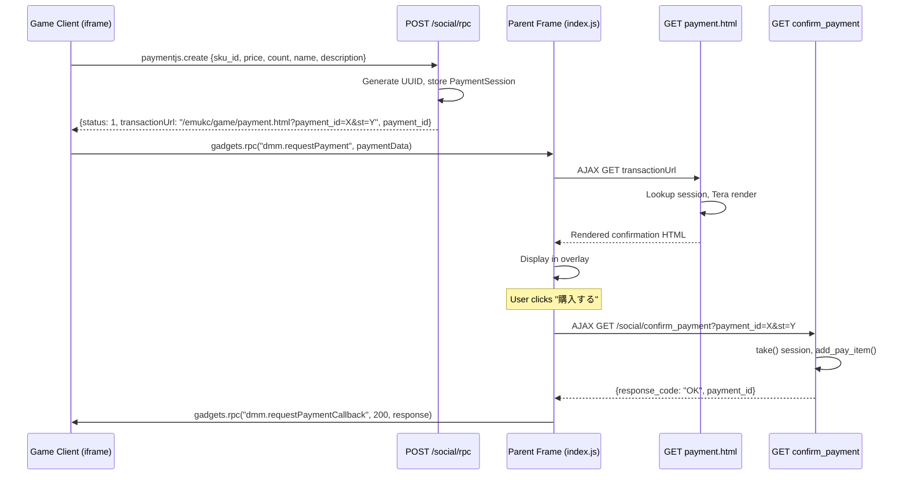

# Complete Payment System (payment.html + RPC + Endpoints)

## Summary

Complete the DMM opensocial Payment protocol emulation by implementing the four missing server-side components: in-memory payment session store, `paymentjs.create` RPC handler, `confirm_payment`/`cancel_payment` GET endpoints, and Tera rendering for `payment.html`. The existing `PayItemOps` trait handles inventory; this plan wires the HTTP layer so the full purchase flow works end-to-end: client initiates payment → server creates session → renders confirmation page → user confirms/cancels → items added to inventory or session discarded.

---

## Problem Frame

EmuKC simulates DMM's opensocial Payment protocol. The payment HTML template exists but is served raw (no Tera variable substitution). The `/social/rpc` endpoint handles `inspection.create` and `people.get` but not `paymentjs.create`. The `/social/confirm_payment` and `/social/cancel_payment` endpoints referenced by `payment.html` don't exist. The `/netgame/social/application/purchase` handler returns a placeholder string. Without these components, the purchase flow is completely non-functional.

---

## Requirements

- R1. `POST /social/rpc` with method `paymentjs.create` must create a payment session and return `{ status: 1, transactionUrl, payment_id }`
- R2. GET `/emukc/game/payment.html?payment_id=X&st=Y` must render the payment confirmation template with item details from the session
- R3. GET `/social/confirm_payment?payment_id=X&st=Y` must consume the session and add the pay item to the user's inventory, returning `{ response_code: "OK", payment_id }`
- R4. GET `/social/cancel_payment?payment_id=X&st=Y` must discard the session, returning `{ response_code: "CANCEL" }`
- R5. Each payment session is single-use — confirm or cancel removes it
- R6. No real monetary transaction; all purchases are free (unlimited points)

---

## Scope Boundaries

- No `api_dmm_payment` module (commented-out route in `src/bin/net/router/kcsapi/mod.rs`)
- No persistent transaction logging
- No frontend JavaScript modifications
- No TTL/auto-cleanup for orphaned payment sessions (acceptable for emulator context)
- No modification to existing `PayItemOps` or `UseItemOps` traits

### Deferred to Follow-Up Work

- `/netgame/social/application/purchase` endpoint upgrade (currently returns "hello world!") — separate from this payment flow
- Session TTL/cleanup mechanism — only needed if server runs for extended periods without restart

---

## Context & Research

### Relevant Code and Patterns

- **State + store pattern**: `src/bin/state/mod.rs` — State holds `Arc<SortieStore>` and `Arc<PracticeStore>`; both use `parking_lot::Mutex<HashMap<...>>`
- **RPC dispatch**: `src/bin/net/router/social/mod.rs` — match on method string, dispatch to sub-handler, each handler takes `(&State, &GameSession, RpcParams) -> serde_json::Value`
- **Tera rendering**: `src/bin/net/router/game.rs` — `GameSiteAssets::get()` retrieves embedded asset bytes, `Tera::render_str()` substitutes variables
- **Auth middleware**: `src/bin/net/auth.rs` — extracts tokens from query params (`st`, `token`, `api_token`), already applied to game and social routes
- **PayItemOps**: `crates/emukc_gameplay/src/game/pay_item.rs` — `add_pay_item(profile_id, mst_id, amount)` inserts/updates pay_item DB row
- **ApiMstPayitem**: `crates/emukc_model/src/kc2/start2.rs` — has `api_id`, `api_name`, `api_description`, `api_price`; lookup via `codex.manifest.find_payitem(id)`

### Institutional Learnings

- No relevant entries in `docs/solutions/`

---

## Key Technical Decisions

- **PaymentStore in binary crate** (`src/bin/net/router/social/payment_store.rs`), not `emukc_gameplay`: HTTP session state, not game logic. SortieStore/PracticeStore live in gameplay because battle simulation reads them directly; payment sessions are only consumed by HTTP handlers.
- **PaymentStore not on HasContext trait**: Handlers access it via `State` directly. No gameplay code needs it.
- **confirm_payment calls `add_pay_item`**, not `consume_pay_item`: Buying adds the item to inventory. Using the item (via existing `/kcsapi/api_req_member/payitemuse`) grants rewards. This matches the two-step game mechanic.
- **Session lookup is non-consuming for rendering, consuming for action**: `get()` for `payment.html` render, `take()` for confirm/cancel. Ensures session survives the render step.
- **uuid v4 for payment_id**: Already available as workspace dependency (`uuid = "1.23.0"` with `fast-rng` and `v4` features).
- **Independent route for payment.html** instead of modifying generic `game()` handler: Add a dedicated `GET /game/payment.html` route in `game.rs` router that takes `AppState` + `Extension<GameSession>`. Axum matches specific routes before wildcards (`/{*path}`), so this coexists cleanly. Avoids touching the catch-all game handler and keeps payment logic isolated.
- **confirm_payment validates profile_id only, not token string**: Auth middleware already validates the token. Checking `PaymentSession.profile_id == GameSession.profile.id` prevents cross-user session use. Token string comparison is unnecessary and could break if the 30-minute security token refresh (`index.js` `updateSecurityToken`) fires during the payment flow.

---

## Open Questions

### Resolved During Planning

- Where to put PaymentStore: Binary crate, alongside handlers that use it
- Whether to render payment.html in game.rs or new route: Dedicated route in game.rs (`/game/payment.html`), not modifying the catch-all `game()` handler. Axum matches specific routes before wildcards, keeping payment logic isolated.
- Whether to validate token string in confirm_payment: No — auth middleware already validates the token. Only profile_id comparison needed. Token string comparison could break if security token refresh fires mid-flow.

### Deferred to Implementation

- Exact error response format when payment_id is not found (404 JSON vs error page) — implementation detail
- Whether to validate sku_id against codex during session creation or defer to confirm — either works

---

## High-Level Technical Design

> *This illustrates the intended approach and is directional guidance for review, not implementation specification.*

---

## Implementation Units

### U1. PaymentStore + State Integration

**Goal:** Create the in-memory payment session store and wire it into the application State.

**Requirements:** R5, R6

**Dependencies:** None

**Files:**
- Create: `src/bin/net/router/social/payment_store.rs`
- Modify: `src/bin/state/mod.rs`
- Modify: `Cargo.toml` (add `uuid` and `parking_lot` workspace dependencies)

**Approach:**
- New `PaymentSession` struct with fields: `payment_id`, `profile_id`, `token`, `sku_id`, `price`, `count`, `name`, `description`
- New `PaymentStore` struct wrapping `parking_lot::Mutex<HashMap<String, PaymentSession>>`
- Methods: `new()`, `insert(session)`, `get(payment_id)` (non-consuming clone), `take(payment_id)` (consuming remove)
- Add `payment_store: Arc<PaymentStore>` to `State`, initialize in `State::new()`

**Patterns to follow:**
- `crates/emukc_gameplay/src/game/sortie_store.rs` — Mutex + HashMap pattern

**Test scenarios:**
- Happy path: insert then get returns identical session
- Happy path: insert then take returns session and removes it
- Edge case: get after take returns None
- Edge case: take on non-existent key returns None

**Verification:**
- `cargo build` compiles without errors
- Unit tests pass for PaymentStore

---

### U2. paymentjs.create RPC Handler

**Goal:** Handle the `paymentjs.create` RPC method to create payment sessions and return transaction URLs.

**Requirements:** R1

**Dependencies:** U1

**Files:**
- Create: `src/bin/net/router/social/payment_create.rs`
- Modify: `src/bin/net/router/social/mod.rs`

**Approach:**
- Extract first item from `RpcExtraParams.items` (already defined in `social/mod.rs`)
- Parse `sku_id` string to `i64`
- Validate sku_id against codex manifest (`codex.manifest.find_payitem(sku_id)`); return error if not found
- Generate `payment_id` via `uuid::Uuid::new_v4().to_string()`
- Build `transactionUrl`: `/emukc/game/payment.html?payment_id={id}&st={token}`
- Create `PaymentSession` from RPC params + session info, store in PaymentStore
- Return JSON: `{ "id": "key", "data": { "status": 1, "transactionUrl": "...", "payment_id": "..." } }`. Note: the `data` field must be an object, not an array — this differs from `inspection_create`'s array-wrapped response
- Register as `mod payment_create` in `social/mod.rs`, add match arm for `"paymentjs.create"`

**Patterns to follow:**
- `src/bin/net/router/social/inspection_create.rs` — exec function signature and return shape
- `src/bin/net/router/social/mod.rs` — RPC dispatch and method constant pattern

**Test scenarios:**
- Happy path: valid RpcParams with one item returns status=1, transactionUrl, payment_id
- Happy path: returned payment_id exists in PaymentStore with correct profile_id
- Edge case: empty items array — return error or default values
- Edge case: invalid sku_id (non-numeric) — graceful error

**Verification:**
- RPC call with `paymentjs.create` method returns correct JSON structure
- Session is stored in PaymentStore after RPC call

---

### U3. confirm_payment and cancel_payment Endpoints

**Goal:** Implement the two GET endpoints that finalize or discard payment sessions.

**Requirements:** R3, R4, R5

**Dependencies:** U1

**Files:**
- Create: `src/bin/net/router/social/confirm_payment.rs`
- Create: `src/bin/net/router/social/cancel_payment.rs`
- Modify: `src/bin/net/router/social/mod.rs`

**Approach:**

**confirm_payment:**
- Extract `payment_id` and `st` from query params
- `take()` from PaymentStore (consuming — single-use)
- Return error JSON if session not found
- Verify `session.profile_id == authenticated_profile_id`; return error on mismatch
- Call `state.add_pay_item(profile_id, sku_id, count)` to add to inventory
- Return `{ "response_code": "OK", "payment_id": "..." }`

**cancel_payment:**
- Extract `payment_id` from query params
- `take()` from PaymentStore (consuming — single-use)
- Return `{ "response_code": "CANCEL", "payment_id": "..." }` regardless of whether session existed

Register both as GET routes in `social/mod.rs` router, behind `kcs_api_auth_middleware`. Note: the payment.html form declares `method="post"`, but JS intercepts the submit event and sends GET via AJAX. If JS-free fallback is desired, register confirm_payment for both GET and POST.

**Patterns to follow:**
- `src/bin/net/router/kcsapi/api_req_member/payitemuse.rs` — calling PayItemOps from handler
- `src/bin/net/router/social/mod.rs` — route registration pattern

**Test scenarios:**
- Happy path (confirm): valid session → item added to pay_item table → returns `{response_code: "OK", payment_id: "..."}`
- Happy path (cancel): valid session → session removed → returns `{response_code: "CANCEL", payment_id: "..."}`
- Error path (confirm): non-existent payment_id → returns error
- Edge case (confirm): double-confirm same payment_id → second call fails (session already consumed)
- Error path (confirm): profile_id mismatch → returns error
- Integration: confirm flow adds item verifiable via `find_pay_item`

**Verification:**
- Confirm endpoint adds pay item to database
- Cancel endpoint discards session without side effects
- Both endpoints return correct JSON

---

### U4. payment.html Tera Rendering

**Goal:** Serve payment.html with Tera template rendering, populated from the payment session.

**Requirements:** R2

**Dependencies:** U1

**Files:**
- Modify: `src/bin/net/router/game.rs`
- Modify: `assets/www/emukc/game/payment.html`

**Approach:**
- Add a dedicated `GET /game/payment.html` route in the `game.rs` router, before the catch-all `/{*path}` route. Axum matches specific routes before wildcards, so this coexists without conflict.
- The payment handler takes `AppState`, `Extension<GameSession>`, `Query<PaymentHtmlQuery>` (with `payment_id` and `st` fields). This keeps the generic `game()` handler untouched.
- Look up PaymentSession via `state.payment_store.get(payment_id)`
- Build Tera context with: `payment_id`, `token`, `sku_id`, `name`, `description`, `price`, `total_price`. The `token` value comes from `GameSession.token` via the Extension.
- Handle `{{ it.count }}` by inserting `it: { count: N }` as nested context
- Fix template line 55: `{{ price * count }}` → `{{ total_price }}` (Tera doesn't support inline arithmetic)

**Patterns to follow:**
- `src/bin/net/router/game.rs` `home()` handler — takes `Extension<GameSession>`, Tera rendering pattern
- `src/bin/net/router/social/mod.rs` `rpc()` handler — takes `AppState` + `Extension<GameSession>`

**Test scenarios:**
- Happy path: valid session → rendered HTML contains item name, price, count
- Edge case: missing payment_id param → graceful error response
- Edge case: non-existent payment_id → graceful error response
- Template correctness: `{{ total_price }}` shows correct calculated value

**Verification:**
- GET `/emukc/game/payment.html?payment_id=X&st=Y` returns rendered HTML with correct values
- Template arithmetic fix produces correct total

---

## System-Wide Impact

- **Interaction graph:** New endpoints are additive — no existing handlers or callbacks are modified. `PayItemOps::add_pay_item` is called from the new confirm handler but the trait itself is unchanged.
- **Error propagation:** Missing sessions return JSON errors. Failed `add_pay_item` calls propagate via `GameplayError` as 500 responses.
- **State lifecycle risks:** Single-use sessions via `take()` prevent double-confirm. Orphaned sessions (user closes browser without confirm/cancel) accumulate in memory — acceptable for emulator. No persistent state to corrupt.
- **API surface parity:** No other interfaces require this change. The existing `/kcsapi/api_req_member/payitemuse` endpoint continues to work independently.
- **Integration coverage:** Full flow requires browser + JS — automated tests can verify individual endpoints and session lifecycle.
- **Unchanged invariants:** Existing payitem inventory, useitem system, material system, and furniture purchase are unaffected.

---

## Risks & Dependencies

| Risk | Mitigation |
|------|------------|
| Payment template uses Tera syntax not matching JS template expectations | Template already written in Tera-compatible syntax (only `{{ price * count }}` needs fix) |
| Auth middleware rejects AJAX requests for payment.html | Already verified: middleware reads `st` from query params, which parent frame includes in transactionUrl |
| Memory leak from orphaned sessions | Accepted for emulator context; server typically restarted between sessions |
| sku_id string→int parse failure | Graceful error response in payment_create handler |
| Payment item images (`/kcs/images/purchase_items/{sku_id}.jpg`) unavailable | Handled by existing `/kcs/*` cache route (`kcs.rs`). Availability depends on bootstrap data. Broken images are cosmetic — no functional impact. Verify bootstrap includes these assets during implementation. |

---

## Sources & References

- Payment HTML template: `assets/www/emukc/game/payment.html`
- Parent frame JS (requestPayment flow): `assets/www/emukc/js/index.js`
- Game iframe JS (opensocial payment): `assets/www/emukc/game/js/dmm2.js`
- Social RPC handler: `src/bin/net/router/social/mod.rs`
- Game handler: `src/bin/net/router/game.rs`
- State struct: `src/bin/state/mod.rs`
- PayItemOps trait: `crates/emukc_gameplay/src/game/pay_item.rs`
- ApiMstPayitem model: `crates/emukc_model/src/kc2/start2.rs`
